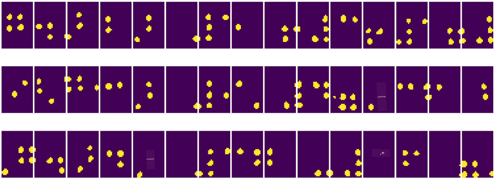
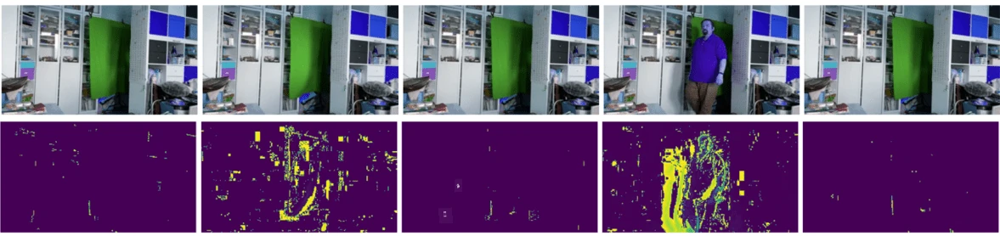

# ကွန်ပျူတာဗီရှင်းအကြောင်းမိတ်ဆက်

[ကွန်ပျူတာဗီရှင်း](https://wikipedia.org/wiki/Computer_vision) ဆိုတာက ကွန်ပျူတာတွေကို ဒစ်ဂျစ်တယ်ပုံရိပ်တွေကို အဆင့်မြင့်နားလည်မှုရရှိစေဖို့ ရည်ရွယ်တဲ့ အပိုင်းတစ်ခုဖြစ်ပါတယ်။ ဒီအဓိပ္ပါယ်က အတော်လေးကျယ်ပြန့်ပါတယ်၊ အကြောင်းမူတည်ပြီး *နားလည်မှု* ဆိုတာ အမျိုးမျိုးဖြစ်နိုင်ပါတယ်။ ဥပမာအားဖြင့် ပုံထဲမှာ အရာဝတ္ထုတစ်ခုကို ရှာဖွေခြင်း (**object detection**), ဖြစ်ပျက်နေတဲ့အရာကို နားလည်ခြင်း (**event detection**), ပုံကို စာသားနဲ့ ဖော်ပြခြင်း, ဒါမှမဟုတ် 3D အနေအထားနဲ့ ရှုခင်းကို ပြန်လည်တည်ဆောက်ခြင်း။ လူနဲ့ဆိုင်တဲ့ ပုံရိပ်တွေကို အထူးလုပ်ငန်းတွေပါရှိပါတယ် - အသက်အရွယ်နဲ့ ခံစားချက်ခန့်မှန်းခြင်း, မျက်နှာရှာဖွေခြင်းနဲ့ မှတ်ပုံတင်ခြင်း, 3D အနေအထားခန့်မှန်းခြင်း စသည်ဖြင့်။

## [Pre-lecture quiz](https://ff-quizzes.netlify.app/en/ai/quiz/11)

ကွန်ပျူတာဗီရှင်းရဲ့ အလွယ်ဆုံးလုပ်ငန်းတစ်ခုက **ပုံရိပ်ခွဲခြားခြင်း** ဖြစ်ပါတယ်။

ကွန်ပျူတာဗီရှင်းကို AI ရဲ့ အပိုင်းတစ်ခုအဖြစ် အများအားဖြင့် သတ်မှတ်ကြပါတယ်။ ယနေ့ခေတ်မှာ ကွန်ပျူတာဗီရှင်းလုပ်ငန်းအများစုကို နယူးရယ်နက်ဝက်များကို အသုံးပြုပြီး ဖြေရှင်းကြပါတယ်။ ကွန်ပျူတာဗီရှင်းအတွက် အသုံးပြုတဲ့ နယူးရယ်နက်ဝက်အမျိုးအစား [convolutional neural networks](../07-ConvNets/README.md) အကြောင်းကို ဒီအပိုင်းမှာ ပိုမိုလေ့လာရမှာဖြစ်ပါတယ်။

သို့သော် ပုံရိပ်ကို နယူးရယ်နက်ဝက်ဆီ ပေးပို့မယ့်အခါမှာ အချို့သော algorithmic နည်းလမ်းတွေကို အသုံးပြုပြီး ပုံရိပ်ကို တိုးတက်အောင်လုပ်ရင် အကျိုးရှိတတ်ပါတယ်။

Python မှာ ပုံရိပ်ကို ကိုင်တွယ်ဖို့အတွက် library အများအပြားရှိပါတယ် -

* **[imageio](https://imageio.readthedocs.io/en/stable/)** ကို ပုံရိပ် format အမျိုးမျိုးကို ဖတ်/ရေးဖို့ အသုံးပြုနိုင်ပါတယ်။ ဒါ့အပြင် ffmpeg ကိုလည်း ပံ့ပိုးပေးပြီး ဗီဒီယို frame တွေကို ပုံရိပ်အဖြစ် ပြောင်းလဲဖို့ အသုံးပြုနိုင်ပါတယ်။
* **[Pillow](https://pillow.readthedocs.io/en/stable/index.html)** (PIL အဖြစ်လည်း သိကြပါတယ်) က ပိုမိုအစွမ်းထက်ပြီး ပုံရိပ်ကို ပြောင်းလဲခြင်း၊ palette ကို ချိန်ညှိခြင်း စသည်တို့ကို လုပ်နိုင်ပါတယ်။
* **[OpenCV](https://opencv.org/)** က C++ နဲ့ရေးသားထားတဲ့ အင်အားကြီးတဲ့ ပုံရိပ်ကိုင်တွယ်ရေး library ဖြစ်ပြီး ပုံရိပ်ကိုင်တွယ်ရေးအတွက် *de facto* standard ဖြစ်လာပါတယ်။ Python interface လည်း ရှိပါတယ်။
* **[dlib](http://dlib.net/)** က C++ library ဖြစ်ပြီး machine learning algorithm အများအပြားကို အကောင်အထည်ဖော်ထားပါတယ်။ Computer Vision algorithm အချို့ကိုလည်း ပါဝင်ပါတယ်။ Python interface ရှိပြီး မျက်နှာနဲ့ မျက်နှာ landmark detection စတဲ့ အခက်အခဲရှိတဲ့လုပ်ငန်းတွေကို လုပ်နိုင်ပါတယ်။

## OpenCV

[OpenCV](https://opencv.org/) ကို ပုံရိပ်ကိုင်တွယ်ရေးအတွက် *de facto* standard အဖြစ် သတ်မှတ်ကြပါတယ်။ C++ နဲ့ရေးသားထားတဲ့ အသုံးဝင်တဲ့ algorithm အများအပြား ပါဝင်ပါတယ်။ Python ကနေ OpenCV ကို ခေါ်သုံးနိုင်ပါတယ်။

OpenCV ကို သင်ယူဖို့ အကောင်းဆုံးနေရာက [ဒီ Learn OpenCV course](https://learnopencv.com/getting-started-with-opencv/) ဖြစ်ပါတယ်။ ကျွန်တော်တို့ရဲ့ သင်ခန်းစာမှာ OpenCV ကို သင်ယူဖို့မဟုတ်ဘဲ OpenCV ကို ဘယ်လိုအသုံးပြုနိုင်မလဲ၊ ဘယ်အချိန်မှာ အသုံးဝင်မလဲဆိုတာကို ဥပမာနဲ့ ပြသဖို့ ရည်ရွယ်ပါတယ်။

### ပုံရိပ်များကို Load လုပ်ခြင်း

Python မှာ ပုံရိပ်တွေကို NumPy array အနေနဲ့ အဆင်ပြေစွာ ကိုယ်စားပြုနိုင်ပါတယ်။ ဥပမာအားဖြင့် 320x200 pixel အရွယ်ရှိ grayscale ပုံရိပ်တွေကို 200x320 array အနေနဲ့ သိမ်းဆည်းနိုင်ပြီး အရောင်ပုံရိပ်တွေက 200x320x3 (အရောင် channel 3 ခု) အနေနဲ့ ရှိပါတယ်။ ပုံရိပ်ကို load လုပ်ဖို့အတွက် အောက်ပါ code ကို အသုံးပြုနိုင်ပါတယ် -

```python
import cv2
import matplotlib.pyplot as plt

im = cv2.imread('image.jpeg')
plt.imshow(im)
```


ရိုးရာအားဖြင့် OpenCV က အရောင်ပုံရိပ်အတွက် BGR (Blue-Green-Red) encoding ကို အသုံးပြုပြီး Python tools အများစုက RGB (Red-Green-Blue) encoding ကို အသုံးပြုပါတယ်။ ပုံရိပ်ကို မှန်ကန်စွာ ပြသဖို့ RGB color space ကို ပြောင်းလဲဖို့လိုပါတယ်။ NumPy array မှာ dimension တွေကို ပြောင်းလဲခြင်း ဒါမှမဟုတ် OpenCV function ကို ခေါ်သုံးခြင်းဖြင့် ပြောင်းလဲနိုင်ပါတယ် -

```python
im = cv2.cvtColor(im,cv2.COLOR_BGR2RGB)
```


တူညီတဲ့ `cvtColor` function ကို အခြား color space transformation တွေ (ဥပမာ - ပုံရိပ်ကို grayscale ဒါမှမဟုတ် HSV (Hue-Saturation-Value) color space) ပြောင်းလဲဖို့ အသုံးပြုနိုင်ပါတယ်။

OpenCV ကို အသုံးပြုပြီး ဗီဒီယို frame-by-frame ကို load လုပ်နိုင်ပါတယ် - ဥပမာကို [OpenCV Notebook](OpenCV.ipynb) မှာ ပေးထားပါတယ်။

### ပုံရိပ်ကို ကိုင်တွယ်ခြင်း

ပုံရိပ်ကို neural network ဆီ ပေးပို့မယ့်အခါမှာ အချို့ pre-processing လုပ်ငန်းတွေကို လုပ်ဖို့လိုတတ်ပါတယ်။ OpenCV က အောက်ပါအရာတွေကို လုပ်နိုင်ပါတယ် -

* **ပုံရိပ်ကို အရွယ်အစားပြောင်းခြင်း** `im = cv2.resize(im, (320,200),interpolation=cv2.INTER_LANCZOS)` ကို အသုံးပြုခြင်း
* **ပုံရိပ်ကို Blur လုပ်ခြင်း** `im = cv2.medianBlur(im,3)` ဒါမှမဟုတ် `im = cv2.GaussianBlur(im, (3,3), 0)` ကို အသုံးပြုခြင်း
* ပုံရိပ်ရဲ့ **တောက်ပမှုနဲ့ contrast** ကို NumPy array ကို ကိုင်တွယ်ခြင်းဖြင့် ပြောင်းလဲနိုင်ပါတယ်၊ [ဒီ Stackoverflow note](https://stackoverflow.com/questions/39308030/how-do-i-increase-the-contrast-of-an-image-in-python-opencv) မှာ ဖော်ပြထားပါတယ်။
* [thresholding](https://docs.opencv.org/4.x/d7/d4d/tutorial_py_thresholding.html) ကို `cv2.threshold`/`cv2.adaptiveThreshold` function တွေကို ခေါ်သုံးခြင်းဖြင့် ပြုလုပ်နိုင်ပါတယ်၊ brightness ဒါမှမဟုတ် contrast ကို ချိန်ညှိခြင်းထက် ပိုမိုကောင်းမွန်တတ်ပါတယ်။
* ပုံရိပ်ကို [transformations](https://docs.opencv.org/4.5.5/da/d6e/tutorial_py_geometric_transformations.html) အမျိုးမျိုး အသုံးပြုခြင်း -
    - **[Affine transformations](https://docs.opencv.org/4.5.5/d4/d61/tutorial_warp_affine.html)** က ပုံရိပ်ကို လှည့်ခြင်း၊ အရွယ်အစားပြောင်းခြင်းနဲ့ skewing ကို ပေါင်းစပ်ဖို့ အသုံးဝင်ပါတယ်။ ပုံရိပ်ထဲမှာ အချက် 3 ခုရဲ့ ရင်းမြစ်နဲ့ destination ကို သိထားရပါမယ်။ Affine transformations က အပြိုင်လိုင်းတွေကို အပြိုင်အနေအထားမှာ ထားပါတယ်။
    - **[Perspective transformations](https://medium.com/analytics-vidhya/opencv-perspective-transformation-9edffefb2143)** က ပုံရိပ်ထဲမှာ အချက် 4 ခုရဲ့ ရင်းမြစ်နဲ့ destination ကို သိထားရပါမယ်။ ဥပမာအားဖြင့် smartphone ကင်မရာနဲ့ angle တစ်ခုကနေ စတုရန်းစာရွက်ကို ရိုက်ပြီး စာရွက်ကို စတုရန်းပုံရိပ်အဖြစ် ပြောင်းလဲချင်တဲ့အခါမှာ အသုံးဝင်ပါတယ်။
* ပုံရိပ်ထဲမှာ လှုပ်ရှားမှုကို နားလည်ဖို့ **[optical flow](https://docs.opencv.org/4.5.5/d4/dee/tutorial_optical_flow.html)** ကို အသုံးပြုခြင်း။

## ကွန်ပျူတာဗီရှင်းကို အသုံးပြုတဲ့ ဥပမာများ

ကျွန်တော်တို့ရဲ့ [OpenCV Notebook](OpenCV.ipynb) မှာ ကွန်ပျူတာဗီရှင်းကို အသုံးပြုပြီး အထူးလုပ်ငန်းတွေကို ပြုလုပ်တဲ့ ဥပမာတွေကို ပေးထားပါတယ် -

* **Braille စာအုပ်ရဲ့ ဓာတ်ပုံကို Pre-processing လုပ်ခြင်း**။ thresholding, feature detection, perspective transformation နဲ့ NumPy ကို ကိုင်တွယ်ခြင်းတို့ကို အသုံးပြုပြီး Braille အက္ခရာတစ်ခုချင်းစီကို neural network နဲ့ classification လုပ်ဖို့ ခွဲထုတ်ပေးနိုင်ပါတယ်။

 |  | 
----|-----|-----

> [OpenCV.ipynb](OpenCV.ipynb) မှ ပုံရိပ်

* **Frame difference ကို အသုံးပြုပြီး ဗီဒီယိုထဲမှာ လှုပ်ရှားမှုကို ရှာဖွေခြင်း**။ ကင်မရာက တည်နေရာမှာရှိရင် ကင်မရာ feed ရဲ့ frame တွေဟာ တူညီနေတတ်ပါတယ်။ Frame တွေကို array အနေနဲ့ ကိုယ်စားပြုထားတဲ့အတွက် frame 2 ခုကို လျော့ချက်လုပ်လိုက်ရင် pixel difference ကို ရရှိမှာဖြစ်ပြီး static frame တွေမှာ pixel difference နည်းနည်းရှိပြီး ပုံရိပ်ထဲမှာ လှုပ်ရှားမှုများလာတဲ့အခါ pixel difference ပိုများလာတတ်ပါတယ်။



> [OpenCV.ipynb](OpenCV.ipynb) မှ ပုံရိပ်

* **Optical Flow ကို အသုံးပြုပြီး လှုပ်ရှားမှုကို ရှာဖွေခြင်း**။ [Optical flow](https://docs.opencv.org/3.4/d4/dee/tutorial_optical_flow.html) က ဗီဒီယို frame တွေထဲမှာ pixel တစ်ခုချင်းစီ ဘယ်လိုရွေ့လျားနေတယ်ဆိုတာကို နားလည်စေပါတယ်။ Optical flow ရဲ့ အမျိုးအစား 2 ခုရှိပါတယ် -

   - **Dense Optical Flow** က pixel တစ်ခုချင်းစီ ဘယ်နေရာကိုရွေ့လျားနေတယ်ဆိုတာကို ပြသတဲ့ vector field ကို တွက်ချက်ပေးပါတယ်။
   - **Sparse Optical Flow** က ပုံရိပ်ထဲမှာ အထူးသတ်မှတ်ချက်တွေ (ဥပမာ - အနားသတ်) ကို ရွေးပြီး frame-to-frame trajectory ကို တည်ဆောက်ပေးပါတယ်။


> [OpenCV.ipynb](OpenCV.ipynb) မှ ပုံရိပ်

## ✍️ ဥပမာ Notebook: OpenCV [OpenCV in Action ကို စမ်းကြည့်ပါ](OpenCV.ipynb)

[OpenCV Notebook](OpenCV.ipynb) ကို လေ့လာပြီး OpenCV နဲ့ စမ်းသပ်မှုတွေ လုပ်ကြည့်ပါ။

## နိဂုံး

တစ်ခါတစ်ရံမှာ လှုပ်ရှားမှုရှာဖွေခြင်း ဒါမှမဟုတ် လက်ချောင်းဖျားရှာဖွေခြင်းလို အတော်လေးရှုပ်ထွေးတဲ့လုပ်ငန်းတွေကို ကွန်ပျူတာဗီရှင်းနဲ့ပဲ ဖြေရှင်းနိုင်ပါတယ်။ ဒါကြောင့် ကွန်ပျူတာဗီရှင်းရဲ့ အခြေခံနည်းလမ်းတွေကို သိထားရင် အတော်အသုံးဝင်ပါတယ်၊ OpenCV လို library တွေ ဘာလုပ်နိုင်လဲဆိုတာကို သိထားရင် ပိုမိုကောင်းမွန်ပါတယ်။

## 🚀 စိန်ခေါ်မှု

AI show ရဲ့ [ဒီဗီဒီယို](https://docs.microsoft.com/shows/ai-show/ai-show--2021-opencv-ai-competition--grand-prize-winners--cortic-tigers--episode-32?WT.mc_id=academic-77998-cacaste) ကို ကြည့်ပြီး Cortic Tigers project အကြောင်းနဲ့ သူတို့ဘယ်လို robot ကို အသုံးပြုပြီး ကွန်ပျူတာဗီရှင်းလုပ်ငန်းတွေကို democratize လုပ်ဖို့ block-based solution တစ်ခု တည်ဆောက်ခဲ့တယ်ဆိုတာကို လေ့လာပါ။ ဒီလို project အခြားတွေကို ရှာဖွေပြီး ကွန်ပျူတာဗီရှင်းနယ်ပယ်ကို သင်ယူသူအသစ်တွေ onboard လုပ်ဖို့ ဘယ်လိုကူညီနိုင်တယ်ဆိုတာကို လေ့လာပါ။

## [Post-lecture quiz](https://ff-quizzes.netlify.app/en/ai/quiz/12)

## ပြန်လည်သုံးသပ်ခြင်းနှင့် ကိုယ်တိုင်လေ့လာခြင်း

Optical flow အကြောင်းကို [ဒီအလွန်ကောင်းမွန်တဲ့ tutorial](https://learnopencv.com/optical-flow-in-opencv/) မှာ ပိုမိုဖတ်ရှုပါ။

## [Assignment](lab/README.md)

ဒီ lab မှာ လက်သွားလက်လာရဲ့ ဗီဒီယိုကို ရိုက်ကူးပြီး optical flow ကို အသုံးပြုပြီး အပေါ်/အောက်/ဘယ်/ညာ လှုပ်ရှားမှုတွေကို ရှာဖွေဖို့ ရည်ရွယ်ပါတယ်။


---

