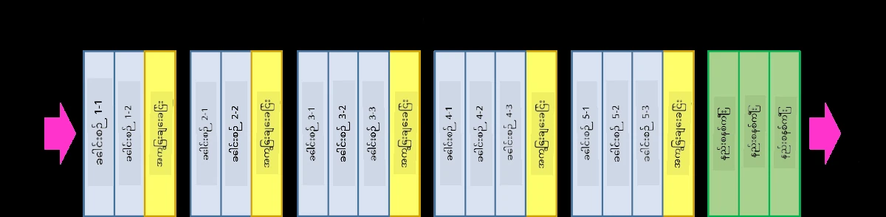
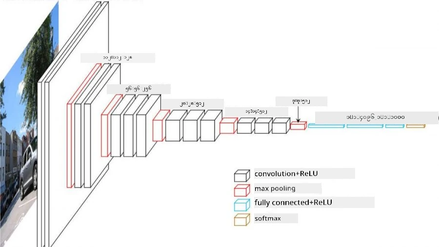
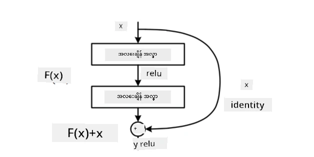
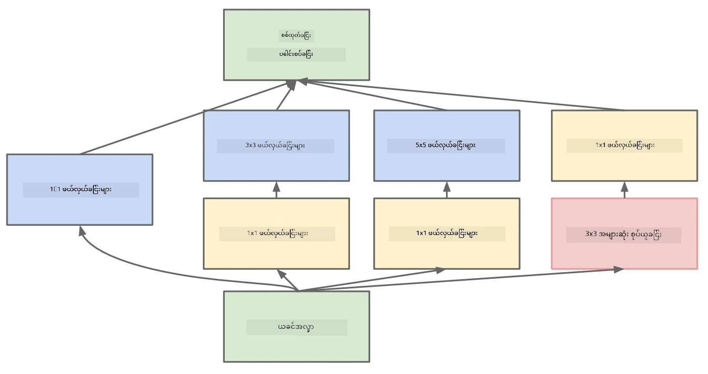

# လူသိများသော CNN အဆောက်အအုံများ

### VGG-16

VGG-16 သည် 2014 ခုနှစ်တွင် ImageNet top-5 classification တွင် 92.7% တိကျမှုရရှိခဲ့သော network တစ်ခုဖြစ်သည်။ ၎င်းတွင် အောက်ပါ layer အဆောက်အအုံပါရှိသည်-

VGG သည် convolution-pooling layers များ၏ အစဉ်အတိုင်း pyramid architecture ကို လိုက်နာသည်ကို သင်တွေ့နိုင်ပါသည်။

> [Researchgate](https://www.researchgate.net/figure/Vgg16-model-structure-To-get-the-VGG-NIN-model-we-replace-the-2-nd-4-th-6-th-7-th_fig2_335194493) မှရရှိသော ပုံ

### ResNet

ResNet သည် Microsoft Research မှ 2015 ခုနှစ်တွင် တင်ပြခဲ့သော model များ၏ မိသားစုဖြစ်သည်။ ResNet ၏ အဓိကအကြောင်းအရာမှာ **residual blocks** ကို အသုံးပြုခြင်းဖြစ်သည်-

> [ဒီစာတမ်း](https://arxiv.org/pdf/1512.03385.pdf) မှရရှိသော ပုံ

Identity pass-through ကို အသုံးပြုရသည့် အကြောင်းရင်းမှာ layer ၏ အနောက်ဆုံးရလဒ်နှင့် residual block ၏ output အကြား **ကွာဟချက်** ကို predict လုပ်ရန်ဖြစ်သည် - ထို့ကြောင့် *residual* ဟုအမည်ပေးထားသည်။ ၎င်း block များကို လွယ်ကူစွာ train လုပ်နိုင်ပြီး block များရာနှင့်ချီသော network များကို တည်ဆောက်နိုင်သည် (အများဆုံးအသုံးပြုသော variant များမှာ ResNet-52, ResNet-101 နှင့် ResNet-152 ဖြစ်သည်)။

ဤ network ကို dataset အပေါ်မူတည်၍ ၎င်း၏ complexity ကို ချိန်ညှိနိုင်သော network အဖြစ်လည်း တွေးဆနိုင်သည်။ အစပိုင်းတွင် network ကို train လုပ်နေစဉ်တွင် weight များသည် သေးငယ်ပြီး signal အများစုသည် passthrough identity layers များမှတဆင့်သွားသည်။ Training တိုးတက်လာပြီး weight များကြီးလာသည်နှင့် network parameters ၏ အရေးပါမှုများလာပြီး network သည် training images များကို မှန်ကန်စွာခွဲခြားနိုင်ရန်လိုအပ်သော expressive power ကို accommodate လုပ်ရန် ချိန်ညှိသည်။

### Google Inception

Google Inception architecture သည် ဤအကြောင်းအရာကို တစ်ဆင့်ပိုမိုတိုးတက်စေပြီး network layer တစ်ခုစီကို path များစွာ၏ ပေါင်းစပ်အဖြစ် တည်ဆောက်သည်-

> [Researchgate](https://www.researchgate.net/figure/Inception-module-with-dimension-reductions-left-and-schema-for-Inception-ResNet-v1_fig2_355547454) မှရရှိသော ပုံ

ဤနေရာတွင် 1x1 convolution များ၏ အရေးပါမှုကို အထူးအလေးပေးရမည်ဖြစ်သည်၊ အစပိုင်းတွင် ၎င်းတို့သည် အဓိပ္ပာယ်မရှိသလိုပင် ထင်ရနိုင်သည်။ 1x1 filter ဖြင့် image ကို run လုပ်ရန် ဘာကြောင့်လိုအပ်သနည်း? သို့သော် convolution filter များသည် depth channel များစွာနှင့်အတူ (မူလမှာ - RGB အရောင်များ၊ နောက်ထပ် layer များတွင် - filter များအတွက် channel များ) အလုပ်လုပ်သည်ကို သတိပြုရမည်။ 1x1 convolution သည် trainable weight များကို အသုံးပြု၍ input channel များကို ပေါင်းစပ်ရန်အသုံးပြုသည်။ ၎င်းကို channel dimension အပေါ်တွင် downsampling (pooling) အဖြစ်လည်း တွေးဆနိုင်သည်။

ဤအကြောင်းအရာနှင့်ပတ်သက်၍ [ကောင်းမွန်သော blog post](https://medium.com/analytics-vidhya/talented-mr-1x1-comprehensive-look-at-1x1-convolution-in-deep-learning-f6b355825578) တစ်ခုနှင့် [မူရင်းစာတမ်း](https://arxiv.org/pdf/1312.4400.pdf) ကို ကြည့်ပါ။

### MobileNet

MobileNet သည် mobile device များအတွက် သင့်လျော်သော အရွယ်အစားလျှော့ချထားသော model များ၏ မိသားစုဖြစ်သည်။ အရင်းအမြစ်များနည်းပါးပြီး တိကျမှုအနည်းငယ်ကို လျှော့ချနိုင်ပါက ၎င်းတို့ကို အသုံးပြုပါ။ ၎င်းတို့၏ အဓိကအကြောင်းအရာမှာ **depthwise separable convolution** ဖြစ်ပြီး spatial convolution များနှင့် depth channel များအပေါ် 1x1 convolution ၏ composition ဖြင့် convolution filter များကို ကိုယ်စားပြုနိုင်သည်။ ၎င်းသည် parameter များ၏ အရေအတွက်ကို အလွန်လျှော့ချပြီး network ကို အရွယ်အစားသေးငယ်စေသည်၊ data နည်းပါးစွာဖြင့် train လုပ်ရန်လည်း လွယ်ကူစေသည်။

MobileNet နှင့်ပတ်သက်၍ [ကောင်းမွန်သော blog post](https://medium.com/analytics-vidhya/image-classification-with-mobilenet-cc6fbb2cd470) တစ်ခုကို ကြည့်ပါ။

## နိဂုံး

ဤ unit တွင် သင်သည် computer vision neural networks ၏ အဓိကအကြောင်းအရာ - convolutional networks ကို သင်ယူခဲ့ပါသည်။ အမှန်တကယ် image classification, object detection နှင့် image generation network များကို အားပေးသော architecture များသည် CNN များအပေါ်အခြေခံထားပြီး layer များပိုမိုများပြားခြင်းနှင့် training tricks အချို့ကို ထည့်သွင်းထားသည်။

## 🚀 စိန်ခေါ်မှု

ထည့်သွင်းထားသော notebooks တွင် တိကျမှုပိုမိုမြင့်မားစေရန်အကြောင်းအရာများကို အောက်ဆုံးတွင် မှတ်ချက်ထားရှိထားသည်။ တိကျမှုပိုမိုမြင့်မားစေရန် စမ်းသပ်မှုများပြုလုပ်ပါ။

## [Post-lecture quiz](https://ff-quizzes.netlify.app/en/ai/quiz/14)

## ပြန်လည်သုံးသပ်ခြင်းနှင့် ကိုယ်တိုင်လေ့လာခြင်း

CNN များကို Computer Vision task များအတွက် အများဆုံးအသုံးပြုသော်လည်း၊ fixed-sized pattern များကို ထုတ်ယူရန်အတွက်လည်း အထူးကောင်းမွန်သည်။ ဥပမာအားဖြင့် အသံများနှင့်ဆက်နွယ်နေပါက audio signal တွင် pattern အချို့ကို ရှာဖွေရန် CNN များကို အသုံးပြုလိုနိုင်သည် - ဤအခါ filter များသည် 1-dimensional ဖြစ်ပြီး (ဤ CNN ကို 1D-CNN ဟုခေါ်သည်)။ ထို့အပြင် 3D-CNN ကို multi-dimensional space တွင် feature များကို ထုတ်ယူရန် အသုံးပြုသည် - ဥပမာအားဖြင့် video တွင် ဖြစ်ပျက်နေသော အဖြစ်အပျက်အချို့ကို feature များပြောင်းလဲမှု pattern များကို CNN မှတဆင့် ဖမ်းယူနိုင်သည်။ CNN များဖြင့် ပြုလုပ်နိုင်သော အခြားသော task များကို ပြန်လည်သုံးသပ်ပြီး ကိုယ်တိုင်လေ့လာပါ။

## [Assignment](lab/README.md)

ဤ lab တွင် သင်သည် ကြောင်နှင့် ခွေးမျိုးစုံကို ခွဲခြားရန် တာဝန်ပေးထားသည်။ ဤ image များသည် MNIST dataset ထက် ပိုမိုရှုပ်ထွေးပြီး အရွယ်အစားပိုမိုကြီးမားသည်၊ class များလည်း 10 ထက်ပိုမိုရှိသည်။

---

