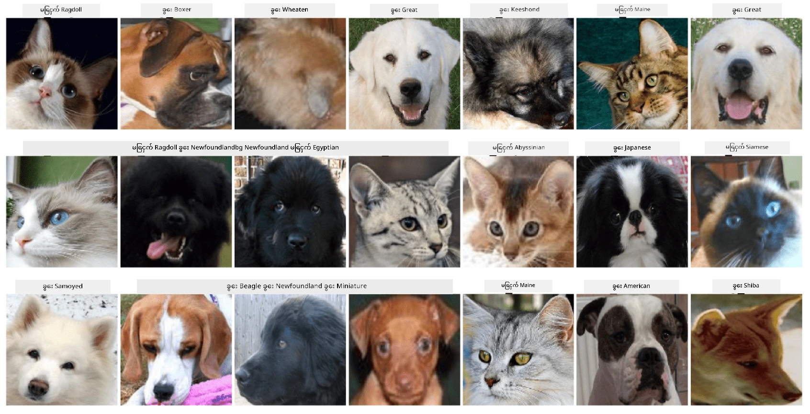

# အိမ်မွေးတိရစ္ဆာန်မျက်နှာများ အမျိုးအစားခွဲခြားခြင်း

[AI for Beginners Curriculum](https://github.com/microsoft/ai-for-beginners) မှ Lab Assignment။

## တာဝန်

သင်သည် အိမ်မွေးတိရစ္ဆာန်များကို စုစည်းရန်အတွက် application တစ်ခု ဖန်တီးရန်လိုအပ်သည်ဟု စဉ်းစားပါ။ ထို application ၏ အထူးအင်္ဂါရပ်တစ်ခုမှာ ဓာတ်ပုံမှ အမျိုးအစားကို အလိုအလျောက် ရှာဖွေခြင်းဖြစ်နိုင်ပါသည်။ ဤအရာကို နယူးရယ်နက်ဝက်များကို အသုံးပြု၍ အောင်မြင်စွာ ပြုလုပ်နိုင်ပါသည်။

သင်သည် **Pet Faces** dataset ကို အသုံးပြု၍ ကြောင်များနှင့် ခွေးများ၏ အမျိုးအစားများကို ခွဲခြားရန် convolutional neural network တစ်ခုကို လေ့ကျင့်ရန်လိုအပ်ပါသည်။

## Dataset

ကျွန်ုပ်တို့သည် [Oxford-IIIT Pet Dataset](https://www.robots.ox.ac.uk/~vgg/data/pets/) ကို အသုံးပြုမည်ဖြစ်ပြီး၊ ၎င်းတွင် ခွေးနှင့် ကြောင်အမျိုးအစား ၃၇ မျိုး၏ ဓာတ်ပုံများ ပါဝင်ပါသည်။



Dataset ကို download လုပ်ရန် အောက်ပါ code snippet ကို အသုံးပြုပါ:

```python
!wget https://thor.robots.ox.ac.uk/~vgg/data/pets/images.tar.gz
!tar xfz images.tar.gz
!rm images.tar.gz
```

**မှတ်ချက်:** Oxford-IIIT Pet Dataset ၏ ဓာတ်ပုံများကို filename (ဥပမာ - `Abyssinian_1.jpg`, `Bengal_2.jpg`) အလိုက် စီစဉ်ထားပါသည်။ Notebook တွင် ဤဓာတ်ပုံများကို classification လုပ်ရန် အလွယ်ကူဆုံးဖြစ်စေရန် အမျိုးအစား-specific subdirectories များသို့ စီစဉ်ရန် code ပါဝင်သည်။

## Notebook စတင်ခြင်း

Lab ကို [PetFaces.ipynb](PetFaces.ipynb) ဖွင့်၍ စတင်ပါ။

## အဓိကအချက်

သင်သည် image classification အတွက် အခြေခံမှ စ၍ တော်တော်လေး ရှုပ်ထွေးသော ပြဿနာကို ဖြေရှင်းနိုင်ခဲ့ပါသည်! အမျိုးအစားများ အတော်များစွာ ရှိခဲ့ပြီး၊ သင်သည် သင့်လျော်သော တိကျမှုကို ရရှိနိုင်ခဲ့ပါသည်! ထို့အပြင် top-k accuracy ကို တိုင်းတာခြင်းသည်လည်း make sense ဖြစ်ပါသည်၊ အကြောင်းမှာ လူသားများအတွက်ပင် အလွန်တူညီသော အမျိုးအစားများကို ရှုပ်ထွေးနိုင်သောကြောင့် ဖြစ်ပါသည်။

---

**အကြောင်းကြားချက်**:  
ဤစာရွက်စာတမ်းကို AI ဘာသာပြန်ဝန်ဆောင်မှု [Co-op Translator](https://github.com/Azure/co-op-translator) ကို အသုံးပြု၍ ဘာသာပြန်ထားပါသည်။ ကျွန်ုပ်တို့သည် တိကျမှုအတွက် ကြိုးစားနေသော်လည်း အလိုအလျောက် ဘာသာပြန်မှုများတွင် အမှားများ သို့မဟုတ် မမှန်ကန်မှုများ ပါဝင်နိုင်သည်ကို သတိပြုပါ။ မူရင်းဘာသာစကားဖြင့် ရေးသားထားသော စာရွက်စာတမ်းကို အာဏာတရ အရင်းအမြစ်အဖြစ် သတ်မှတ်သင့်ပါသည်။ အရေးကြီးသော အချက်အလက်များအတွက် လူက ဘာသာပြန်မှုကို အကြံပြုပါသည်။ ဤဘာသာပြန်မှုကို အသုံးပြုခြင်းမှ ဖြစ်ပေါ်လာသော အလွဲအမှားများ သို့မဟုတ် အနားလွဲမှုများအတွက် ကျွန်ုပ်တို့သည် တာဝန်မယူပါ။