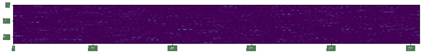
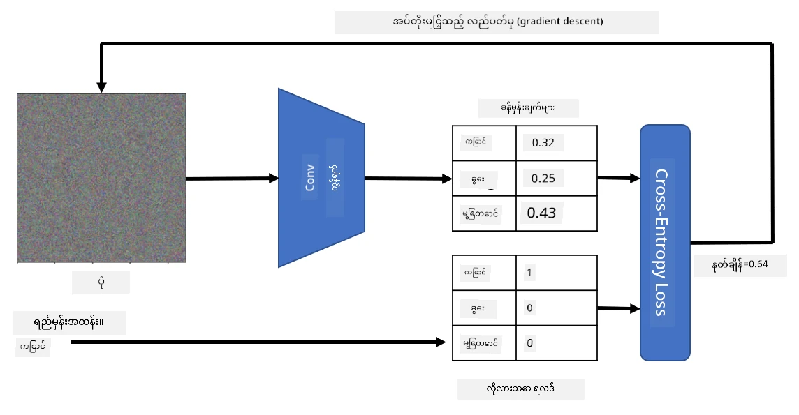

# Pre-trained Networks and Transfer Learning

CNN များကို သင်ကြားရန် အချိန်များစွာ လိုအပ်ပြီး အချက်အလက်များစွာ လိုအပ်ပါသည်။ သို့သော် အချိန်အများစုမှာ ပုံများမှ pattern များကို ထုတ်ယူရန် အသုံးပြုနိုင်သော အနိမ့်အဆင့် filter များကို သင်ယူရန် အသုံးပြုသည်။ သဘာဝအတိုင်း မေးခွန်းတစ်ခု ထွက်ပေါ်လာသည် - တစ်ခုသော dataset တွင် သင်ကြားထားသော neural network ကို အသုံးပြု၍ အခြားပုံများကို အပြည့်အဝ သင်ကြားမှုမလိုအပ်ဘဲ ခွဲခြားနိုင်မည်လား?

## [Pre-lecture quiz](https://ff-quizzes.netlify.app/en/ai/quiz/15)

ဒီနည်းလမ်းကို **transfer learning** ဟုခေါ်သည်၊ အကြောင်းမှာ တစ်ခုသော neural network model မှ knowledge တစ်စိတ်တစ်ပိုင်းကို အခြား model သို့ ပြောင်းလဲပေးခြင်းဖြစ်သည်။ Transfer learning တွင် ကျွန်ုပ်တို့သည် ImageNet ကဲ့သို့သော ပုံများ dataset အကြီးအကျယ်တွင် သင်ကြားထားသော pre-trained model ကို စတင်အသုံးပြုလေ့ရှိသည်။ ဒီ model များသည် ပုံများမှ အမျိုးမျိုးသော feature များကို ထုတ်ယူနိုင်ပြီး၊ အများစုမှာ ထုတ်ယူထားသော feature များပေါ်တွင် classifier တစ်ခုတည်ဆောက်ခြင်းဖြင့် အကောင်းဆုံးရလဒ်ရနိုင်သည်။

> ✅ Transfer Learning ဆိုသည်မှာ ပညာရေးကဲ့သို့သော အခြားပညာရပ်များတွင် တွေ့ရသော term တစ်ခုဖြစ်သည်။ ၎င်းသည် တစ်ခုသော domain မှ knowledge ကို အခြား domain သို့ အသုံးပြုခြင်းဖြစ်သည်။

## Pre-Trained Models as Feature Extractors

ယခင်အပိုင်းတွင် ပြောခဲ့သော convolutional networks တွင် layer အများအပြားပါဝင်ပြီး၊ ၎င်းတို့သည် ပုံမှ feature များကို ထုတ်ယူရန် ရည်ရွယ်ထားသည်။ အနိမ့်အဆင့် pixel combination (horizontal/vertical line သို့မဟုတ် stroke) မှစ၍ feature များ၏ အဆင့်မြင့် combination များ (flame ၏ မျက်လုံးကဲ့သို့သော) အထိ feature များကို ထုတ်ယူရန် ရည်ရွယ်ထားသည်။ Generic နှင့် အမျိုးမျိုးသော ပုံများ dataset အကြီးအကျယ်တွင် CNN ကို သင်ကြားပါက၊ network သည် အများစုသော feature များကို ထုတ်ယူရန် သင်ယူနိုင်သည်။

Keras နှင့် PyTorch တို့တွင် ImageNet ပုံများတွင် သင်ကြားထားသော common architectures များအတွက် pre-trained neural network weight များကို လွယ်ကူစွာ load လုပ်နိုင်သော function များပါဝင်သည်။ အများဆုံးအသုံးပြုသော model များကို ယခင်သင်ခန်းစာမှ [CNN Architectures](../07-ConvNets/CNN_Architectures.md) စာမျက်နှာတွင် ဖော်ပြထားသည်။ အထူးသဖြင့် အောက်ပါ model များကို အသုံးပြုရန် စဉ်းစားနိုင်သည်-

* **VGG-16/VGG-19** သည် ရိုးရှင်းသော model များဖြစ်ပြီး၊ accuracy ကောင်းစွာရရှိစေသည်။ Transfer learning အလုပ်လုပ်ပုံကို စမ်းသပ်ရန် VGG ကို စတင်အသုံးပြုခြင်းကောင်းသောရွေးချယ်မှုဖြစ်သည်။
* **ResNet** သည် Microsoft Research မှ 2015 ခုနှစ်တွင် တင်ပြခဲ့သော model များ၏ မိသားစုဖြစ်သည်။ ၎င်းတွင် layer များပိုများပြီး၊ resource များပိုလိုအပ်သည်။
* **MobileNet** သည် mobile device များအတွက် သင့်လျော်သော အရွယ်အစားလျော့ချထားသော model များ၏ မိသားစုဖြစ်သည်။ Resource များနည်းပြီး accuracy အနည်းငယ်လျော့ချနိုင်ပါက ၎င်းတို့ကို အသုံးပြုပါ။

VGG-16 network မှ ကြောင်ပုံတစ်ပုံမှ ထုတ်ယူထားသော sample feature များကို အောက်တွင် ဖော်ပြထားသည်-

## Cats vs. Dogs Dataset

ဤဥပမာတွင် [Cats and Dogs](https://www.microsoft.com/download/details.aspx?id=54765&WT.mc_id=academic-77998-cacaste) dataset ကို အသုံးပြုမည်ဖြစ်ပြီး၊ ၎င်းသည် အမှန်တကယ် image classification scenario နှင့် အလွန်နီးစပ်သည်။

## ✍️ Exercise: Transfer Learning

Transfer learning အလုပ်လုပ်ပုံကို အောက်ပါ notebook များတွင် ကြည့်ရှုပါ-

* [Transfer Learning - PyTorch](TransferLearningPyTorch.ipynb)
* [Transfer Learning - TensorFlow](TransferLearningTF.ipynb)

## Visualizing Adversarial Cat

Pre-trained neural network တွင် ၎င်း၏ *brain* အတွင်း pattern များအမျိုးမျိုးပါဝင်ပြီး၊ **ideal cat** (ideal dog, ideal zebra စသည်တို့) ၏ အယူအဆများပါဝင်သည်။ ဤပုံကို **visualize** လုပ်ရန် စိတ်ဝင်စားဖွယ်ကောင်းသည်။ သို့သော် ၎င်းသည် ရိုးရှင်းသောအရာမဟုတ်ပါ၊ အကြောင်းမှာ pattern များသည် network weight များတွင် ပျံ့နှံ့နေပြီး၊ hierarchical structure အဖြစ် စီစဉ်ထားသည်။

တစ်ခုသော နည်းလမ်းကို အသုံးပြုနိုင်သည်မှာ random image တစ်ပုံကို စတင်ပြီး၊ **gradient descent optimization** နည်းလမ်းကို အသုံးပြု၍ ၎င်းပုံကို network သည် ၎င်းကို ကြောင်ဟု ထင်ရအောင် ပြောင်းလဲရန် ကြိုးစားခြင်းဖြစ်သည်။

သို့သော် ဤနည်းလမ်းကို အသုံးပြုပါက random noise ကဲ့သို့သော အရာတစ်ခုကို ရရှိမည်ဖြစ်သည်။ အကြောင်းမှာ *network ကို input image ကို ကြောင်ဟု ထင်ရအောင် ပြုလုပ်ရန် နည်းလမ်းများစွာရှိသည်*၊ ၎င်းတို့အနက် visual sense မရှိသော အရာများပါဝင်သည်။ ဤပုံများတွင် ကြောင်အတွက် အထူးသက်သက် pattern များစွာပါဝင်သော်လည်း၊ visually distinctive ဖြစ်ရန် အကန့်အသတ်မရှိပါ။

ရလဒ်ကို တိုးတက်စေရန် loss function တွင် **variation loss** ဟုခေါ်သော term တစ်ခုကို ထည့်သွင်းနိုင်သည်။ ၎င်းသည် ပုံ၏ အနီးအနား pixel များ၏ တူညီမှုကို ပြသသော metric ဖြစ်သည်။ Variation loss ကို လျှော့ချခြင်းဖြင့် ပုံကို ပိုမိုချောမွေ့စေပြီး၊ noise ကို ဖယ်ရှားနိုင်သည် - visual pattern များကို ပိုမိုရှင်းလင်းစွာ ဖော်ပြနိုင်သည်။ အောက်တွင် ကြောင်နှင့် zebra အဖြစ် classified ဖြစ်သော "ideal" ပုံများကို ဖော်ပြထားသည်-

 | 
-----|-----
 *Ideal Cat* | *Ideal Zebra*

အလားတူနည်းလမ်းကို neural network တွင် **adversarial attacks** ပြုလုပ်ရန် အသုံးပြုနိုင်သည်။ ကြောင်ကဲ့သို့သော ပုံကို ဖန်တီးရန် ကြိုးစားပါက၊ ကြောင်ဟု network မှ ခွဲခြားထားသော ကြောင်ပုံကို gradient descent optimization အသုံးပြု၍ network သည် ၎င်းကို ကြောင်ဟု ထင်ရအောင် ပြောင်းလဲနိုင်သည်-

 | 
-----|-----
*Original picture of a dog* | *Picture of a dog classified as a cat*

အထက်ပါရလဒ်များကို ပြန်လည်ဖန်တီးရန် code ကို အောက်ပါ notebook တွင် ကြည့်ရှုပါ-

* [Ideal and Adversarial Cat - TensorFlow](AdversarialCat_TF.ipynb)

## Conclusion

Transfer learning ကို အသုံးပြု၍ သင်သည် custom object classification task အတွက် classifier တစ်ခုကို အလျင်အမြန်တည်ဆောက်နိုင်ပြီး၊ accuracy မြင့်မားစွာရရှိနိုင်သည်။ ကျွန်ုပ်တို့သည် ယခုအခါ ဖြေရှင်းနေသော ပိုမိုရှုပ်ထွေးသော task များသည် အမြင့်ဆုံး computational power လိုအပ်ပြီး၊ CPU တွင် လွယ်ကူစွာ ဖြေရှင်းနိုင်မည်မဟုတ်ပါ။ နောက်ထပ် unit တွင် compute resource နည်းသော implementation ကို အသုံးပြု၍ အနည်းငယ် accuracy လျော့နည်းသည့် model ကို သင်ကြားမည်ဖြစ်သည်။

## 🚀 Challenge

အတူတကွ notebook များတွင် training data နှင့် အနည်းငယ်ဆင်တူသော data (သစ်တစ်မျိုးသော တိရစ္ဆာန်) တွင် transfer knowledge အကောင်းဆုံးအလုပ်လုပ်ပုံကို ဖော်ပြထားသည်။ အလုံးစုံအသစ်သော ပုံများကို အသုံးပြု၍ transfer knowledge model များ၏ အလုပ်လုပ်ပုံကို စမ်းသပ်ပါ။

## [Post-lecture quiz](https://ff-quizzes.netlify.app/en/ai/quiz/16)

## Review & Self Study

[TrainingTricks.md](TrainingTricks.md) ကို ဖတ်ရှု၍ သင်၏ model များကို သင်ကြားရန် အခြားနည်းလမ်းများကို နက်နက်ရှိုင်းရှိုင်း သိရှိပါ။

## [Assignment](lab/README.md)

ဤ lab တွင် [Oxford-IIIT](https://www.robots.ox.ac.uk/~vgg/data/pets/) pets dataset ကို အသုံးပြု၍ ကြောင်နှင့် ခွေးအမျိုးအစား 35 မျိုးပါဝင်သော transfer learning classifier တစ်ခုကို တည်ဆောက်မည်ဖြစ်သည်။

---

