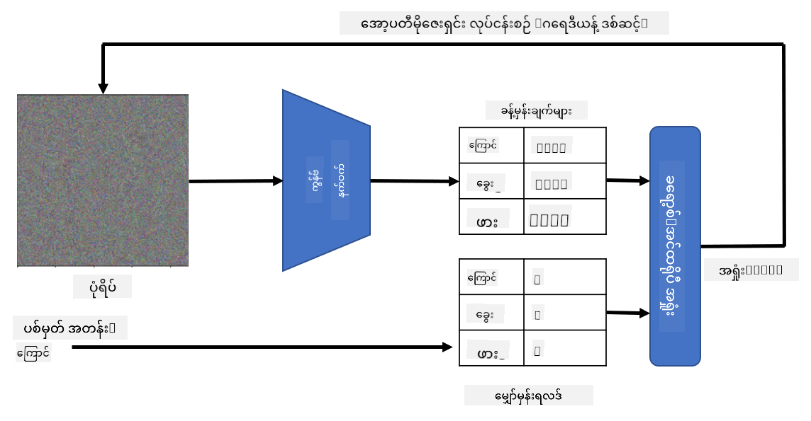

<!--
CO_OP_TRANSLATOR_METADATA:
{
  "original_hash": "717775c4050ccbffbe0c961ad8bf7bf7",
  "translation_date": "2025-08-25T23:10:20+00:00",
  "source_file": "lessons/4-ComputerVision/08-TransferLearning/README.md",
  "language_code": "my"
}
-->
# ကြိုတင်သင်ကြားထားသော Networks နှင့် Transfer Learning

CNN များကို သင်ကြားရန်အချိန်များစွာလိုအပ်ပြီး၊ အချက်အလက်များစွာလည်း လိုအပ်ပါသည်။ သို့သော် အချိန်အများစုမှာ ပုံများမှ pattern များကို ထုတ်ယူရန် အသုံးပြုနိုင်သော အနိမ့်အဆင့် filter များကို သင်ယူရန်အတွက် အသုံးပြုသည်။ ထို့ကြောင့် သဘာဝကျသောမေးခွန်းတစ်ခုဖြစ်သည်မှာ - တစ်ခုသော dataset တွင် သင်ကြားထားသော neural network ကို အသုံးပြုပြီး အခြားပုံများကို အပြည့်အဝ သင်ကြားစရာမလိုဘဲ ခွဲခြားနိုင်မည်လား?

## [Pre-lecture quiz](https://ff-quizzes.netlify.app/en/ai/quiz/15)

ဒီနည်းလမ်းကို **transfer learning** ဟုခေါ်သည်၊ အကြောင်းမှာ တစ်ခုသော neural network model မှ knowledge တစ်စိတ်တစ်ပိုင်းကို အခြား model သို့ လွှဲပြောင်းသုံးစွဲခြင်းဖြစ်သည်။ Transfer learning တွင် ကျွန်ုပ်တို့သည် ပုံမှန်အားဖြင့် **ImageNet** ကဲ့သို့သော အကြီးစား image dataset တစ်ခုတွင် သင်ကြားထားသော pre-trained model တစ်ခုဖြင့် စတင်ပါသည်။ ဒီ model များသည် ပုံမှန်ပုံများမှ အမျိုးမျိုးသော feature များကို ထုတ်ယူနိုင်ပြီး၊ အများစုတွင် ထို feature များပေါ်တွင် classifier တစ်ခုတည်ဆောက်ခြင်းဖြင့် အကောင်းဆုံးရလဒ်ရနိုင်သည်။

> ✅ Transfer Learning ဆိုသည်မှာ ပညာရေးကဲ့သို့သော အခြားသိပ္ပံနယ်ပယ်များတွင်လည်း တွေ့ရနိုင်သော စကားလုံးတစ်ခုဖြစ်သည်။ ၎င်းသည် တစ်ခုသောနယ်ပယ်မှ သိမြင်မှုကို အခြားနယ်ပယ်သို့ လွှဲပြောင်းအသုံးပြုခြင်းကို ဆိုလိုသည်။

## Pre-Trained Models ကို Feature Extractors အဖြစ် အသုံးပြုခြင်း

ယခင်ပိုင်းတွင် ဆွေးနွေးခဲ့သော convolutional networks တွင် layer အတော်များများပါဝင်ပြီး၊ ၎င်းတို့သည် ပုံမှန်အားဖြင့် ပုံမှန်ပုံများမှ feature များကို ထုတ်ယူရန်အတွက် ရည်ရွယ်ထားသည်။ အနိမ့်အဆင့် pixel ပေါင်းစပ်မှုများ (ဥပမာ - အလျားလိုင်း/ဒေါင်လိုင်း) မှစ၍ အဆင့်မြင့် feature များ (ဥပမာ - မီးတောက်၏ မျက်လုံး) အထိ ထုတ်ယူနိုင်သည်။ Generic နှင့် အမျိုးမျိုးသောပုံများပါဝင်သော dataset တစ်ခုတွင် CNN ကို သင်ကြားပါက၊ network သည် ထို feature များကို သင်ယူနိုင်မည်ဖြစ်သည်။

Keras နှင့် PyTorch နှစ်ခုစလုံးတွင် ImageNet ပုံများပေါ်တွင် သင်ကြားထားသော pre-trained neural network weights များကို လွယ်ကူစွာ load လုပ်နိုင်သော function များပါဝင်သည်။ အများဆုံးအသုံးပြုသော model များကို ယခင်သင်ခန်းစာမှ [CNN Architectures](../07-ConvNets/CNN_Architectures.md) စာမျက်နှာတွင် ဖော်ပြထားသည်။ အထူးသဖြင့် အောက်ပါ model များကို စဉ်းစားနိုင်ပါသည် -

* **VGG-16/VGG-19** - ရိုးရှင်းသော model များဖြစ်ပြီး၊ accuracy ကောင်းမွန်စွာရရှိစေသည်။ Transfer learning အလုပ်လုပ်ပုံကို စမ်းသပ်ရန် VGG ကို စတင်အသုံးပြုခြင်းသည် ကောင်းမွန်သောရွေးချယ်မှုဖြစ်သည်။
* **ResNet** - Microsoft Research မှ 2015 ခုနှစ်တွင် တင်ပြခဲ့သော model များဖြစ်သည်။ Layer များပိုများပြီး၊ resource ပိုမိုလိုအပ်သည်။
* **MobileNet** - အရွယ်အစားသေးငယ်ပြီး၊ mobile device များအတွက် သင့်တော်သော model များဖြစ်သည်။ Resource အနည်းငယ်သာရှိပြီး accuracy အနည်းငယ်လျော့နည်းနိုင်သည်။

ဤသည်မှာ VGG-16 network မှ ကြောင်ပုံတစ်ပုံမှ ထုတ်ယူထားသော sample feature များဖြစ်သည် -

## ကြောင်များနှင့် ခွေးများ Dataset

ဤဥပမာတွင် [Cats and Dogs](https://www.microsoft.com/download/details.aspx?id=54765&WT.mc_id=academic-77998-cacaste) dataset ကို အသုံးပြုမည်ဖြစ်ပြီး၊ ၎င်းသည် အမှန်တကယ်သော image classification အခြေအနေနှင့် နီးစပ်သည်။

## ✍️ လေ့ကျင့်မှု: Transfer Learning

Transfer learning ကို အောက်ပါ notebook များတွင် လက်တွေ့ကြည့်ရှုပါ -

* [Transfer Learning - PyTorch](../../../../../lessons/4-ComputerVision/08-TransferLearning/TransferLearningPyTorch.ipynb)
* [Transfer Learning - TensorFlow](../../../../../lessons/4-ComputerVision/08-TransferLearning/TransferLearningTF.ipynb)

## Adversarial Cat ကို မြင်နိုင်ခြင်း

Pre-trained neural network တွင် **ideal cat** (အကောင်းဆုံးကြောင်) အပါအဝင် အမျိုးမျိုးသော pattern များပါဝင်သည်။ ၎င်းကို **မြင်နိုင်ရန်** စမ်းသပ်ခြင်းစိတ်ဝင်စားဖွယ်ကောင်းသည်။ သို့သော် ၎င်းသည် ရိုးရှင်းသောအရာမဟုတ်ပါ၊ အကြောင်းမှာ pattern များသည် network weight များတွင် ဖြန့်ကျက်နေပြီး၊ hierarchical structure အဖြစ် စီစဉ်ထားသည်။

တစ်နည်းလမ်းမှာ random image တစ်ပုံကို စတင်ပြီး၊ **gradient descent optimization** နည်းလမ်းကို အသုံးပြုကာ network သည် ၎င်းကို ကြောင်ဟု ထင်ရအောင် ပုံပြင်ဆင်ခြင်းဖြစ်သည်။

သို့သော် ဤနည်းလမ်းဖြင့် random noise ကဲ့သို့သောအရာကိုသာ ရရှိမည်ဖြစ်သည်။ အကြောင်းမှာ *network သည် input image ကို ကြောင်ဟု ထင်ရစေသော နည်းလမ်းများစွာရှိနိုင်ပြီး၊ ၎င်းတို့သည် မျက်မြင်အရ make sense မဖြစ်နိုင်သောအရာများပါဝင်နိုင်သည်*။ 

ရလဒ်ကို တိုးတက်စေရန် **variation loss** ဟုခေါ်သော loss function တစ်ခုကို ထည့်သွင်းနိုင်သည်။ Variation loss သည် ပုံ၏ အနီးကပ် pixel များ၏ ဆင်တူမှုကို ဖော်ပြသော metric တစ်ခုဖြစ်သည်။ Variation loss ကို လျှော့ချခြင်းဖြင့် ပုံကို ပိုမိုချောမွေ့စေပြီး၊ noise ကို ဖယ်ရှားနိုင်သည် - ထို့ကြောင့် ပိုမိုမျက်မြင်ဆန်းသစ်သော pattern များကို ဖော်ထုတ်နိုင်သည်။ အောက်တွင် ကြောင်နှင့် zebra အဖြစ် classified ဖြစ်သော "ideal" ပုံများကို ဖော်ပြထားသည် -

 | 
-----|-----
 *Ideal Cat* | *Ideal Zebra*

ဒီနည်းလမ်းကို neural network တွင် **adversarial attacks** ပြုလုပ်ရန်လည်း အသုံးပြုနိုင်သည်။ ဥပမာ - ခွေးပုံတစ်ပုံကို ကြောင်ဟု ထင်ရစေလိုပါက၊ network သည် ၎င်းကို ခွေးဟု ခွဲခြားထားသောပုံကို gradient descent optimization ဖြင့် အနည်းငယ်ပြင်ဆင်ကာ၊ network သည် ၎င်းကို ကြောင်ဟု ထင်ရအောင် ပြုလုပ်နိုင်သည် -

 | 
-----|-----
*Original picture of a dog* | *Picture of a dog classified as a cat*

အထက်ပါရလဒ်များကို ထုတ်လုပ်ရန် code ကို အောက်ပါ notebook တွင် ကြည့်ရှုနိုင်သည် -

* [Ideal and Adversarial Cat - TensorFlow](../../../../../lessons/4-ComputerVision/08-TransferLearning/AdversarialCat_TF.ipynb)

## နိဂုံးချုပ်

Transfer learning ကို အသုံးပြုခြင်းဖြင့် သင့်အတွက် သီးသန့် object classification task တစ်ခုအတွက် classifier တစ်ခုကို အလျင်အမြန်တည်ဆောက်နိုင်ပြီး၊ အတိအကျမှုမြင့်မားသောရလဒ်ရရှိနိုင်သည်။ သင်ကြားနေသော အခက်အခဲများသည် ပိုမိုမြင့်မားလာပြီး၊ CPU ပေါ်တွင် လွယ်ကူစွာ ဖြေရှင်းနိုင်မည်မဟုတ်ကြောင်း တွေ့ရသည်။ နောက်ထပ် unit တွင်၊ compute resource နည်းနည်းဖြင့် model တစ်ခုကို သင်ကြားရန် lightweight implementation တစ်ခုကို အသုံးပြုမည်ဖြစ်ပြီး၊ accuracy အနည်းငယ်သာ လျော့နည်းမည်ဖြစ်သည်။

## 🚀 စိန်ခေါ်မှု

အတူတကွပါဝင်သော notebook များတွင်၊ training data နှင့် ဆင်တူသော data များတွင် transfer knowledge အလုပ်လုပ်ပုံကို ဖော်ပြထားသည်။ အလုံးစုံမတူညီသော image များဖြင့် စမ်းသပ်ပြီး၊ transfer knowledge model များ၏ အလုပ်လုပ်ပုံကို ကြည့်ရှုပါ။

## [Post-lecture quiz](https://ff-quizzes.netlify.app/en/ai/quiz/16)

## ပြန်လည်သုံးသပ်ခြင်းနှင့် ကိုယ်တိုင်လေ့လာခြင်း

[TrainingTricks.md](TrainingTricks.md) ကို ဖတ်ရှုပြီး၊ သင်၏ model များကို သင်ကြားရန် အခြားနည်းလမ်းများကို နက်နက်ရှိုင်းရှိုင်း သိရှိပါ။

## [Assignment](lab/README.md)

ဤ lab တွင် [Oxford-IIIT](https://www.robots.ox.ac.uk/~vgg/data/pets/) pets dataset ကို အသုံးပြုကာ၊ ကြောင်နှင့် ခွေး ၃၅ မျိုးအတွက် transfer learning classifier တစ်ခုကို တည်ဆောက်မည်ဖြစ်သည်။

**အကြောင်းကြားချက်**:  
ဤစာရွက်စာတမ်းကို AI ဘာသာပြန်ဝန်ဆောင်မှု [Co-op Translator](https://github.com/Azure/co-op-translator) ကို အသုံးပြု၍ ဘာသာပြန်ထားပါသည်။ ကျွန်ုပ်တို့သည် တိကျမှုအတွက် ကြိုးစားနေပါသော်လည်း၊ အလိုအလျောက် ဘာသာပြန်မှုများတွင် အမှားများ သို့မဟုတ် မမှန်ကန်မှုများ ပါဝင်နိုင်သည်ကို သတိပြုပါ။ မူရင်းစာရွက်စာတမ်းကို ၎င်း၏ မူရင်းဘာသာစကားဖြင့် အာဏာတရ အရင်းအမြစ်အဖြစ် သတ်မှတ်သင့်ပါသည်။ အရေးကြီးသော အချက်အလက်များအတွက် လူ့ဘာသာပြန်ပညာရှင်များမှ ပရော်ဖက်ရှင်နယ် ဘာသာပြန်မှုကို အကြံပြုပါသည်။ ဤဘာသာပြန်မှုကို အသုံးပြုခြင်းမှ ဖြစ်ပေါ်လာသော အလွဲအလွတ်များ သို့မဟုတ် အနားလွဲမှုများအတွက် ကျွန်ုပ်တို့သည် တာဝန်မယူပါ။