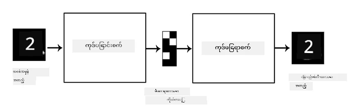
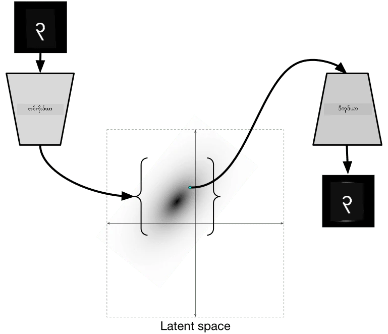

# အော်တိုအင်ကိုဒါများ

CNN များကို လေ့ကျင့်ရာတွင် တစ်ခုသော ပြဿနာမှာ အမှတ်အသားပြုထားသော ဒေတာများ များစွာ လိုအပ်သည်။ ပုံရိပ်များကို အမျိုးအစားအလိုက် ခွဲခြားရန် လိုအပ်သောအခါ၊ ၎င်းသည် လက်ဖြင့်လုပ်ဆောင်ရသော အလုပ်ဖြစ်သည်။

## [Pre-lecture quiz](https://ff-quizzes.netlify.app/en/ai/quiz/17)

သို့သော်၊ CNN feature extractors များကို လေ့ကျင့်ရန် အမှတ်အသားမပြုထားသော (raw) ဒေတာများကို အသုံးပြုလိုနိုင်သည်။ ၎င်းကို **self-supervised learning** ဟုခေါ်သည်။ အမှတ်အသားများအစား၊ လေ့ကျင့်ပုံရိပ်များကို ကွန်ယက်၏ input နှင့် output အဖြစ် အသုံးပြုမည်ဖြစ်သည်။ **Autoencoder** ၏ အဓိကအကြံဉာဏ်မှာ **encoder network** တစ်ခုဖြင့် input ပုံရိပ်ကို **latent space** (အများအားဖြင့် သေးငယ်သော အရွယ်အစားရှိသော ဗက်တာတစ်ခု) သို့ ပြောင်းလဲပြီး၊ ၎င်းကို ပြန်လည်ဖန်တီးရန် **decoder network** ကို အသုံးပြုမည်ဖြစ်သည်။

> ✅ [autoencoder](https://wikipedia.org/wiki/Autoencoder) သည် "အမှတ်အသားမပြုထားသော ဒေတာများ၏ ထိရောက်သော coding များကို သင်ယူရန် အသုံးပြုသော အတုနယူးရယ်ကွန်ယက်တစ်မျိုး" ဖြစ်သည်။

Autoencoder ကို မူရင်းပုံရိပ်မှ အချက်အလက်များကို အများဆုံး ဖမ်းယူရန် လေ့ကျင့်နေသောကြောင့်၊ ကွန်ယက်သည် input ပုံရိပ်များ၏ အဓိပ္ပါယ်ကို ဖမ်းယူရန် အကောင်းဆုံး **embedding** ကို ရှာဖွေသည်။

> ပုံရိပ် - [Keras blog](https://blog.keras.io/building-autoencoders-in-keras.html)

## Autoencoders အသုံးပြုနိုင်သည့် အခွင့်အရေးများ

မူရင်းပုံရိပ်များကို ပြန်လည်ဖန်တီးခြင်းသည် ကိုယ်တိုင် အသုံးဝင်သည်မဟုတ်သော်လည်း၊ အောက်ပါအခြေအနေများတွင် autoencoders များသည် အထူးအသုံးဝင်သည် -

* **ပုံရိပ်များ၏ dimension ကို လျှော့ချခြင်း** သို့မဟုတ် **image embeddings များကို လေ့ကျင့်ခြင်း**။ Autoencoders များသည် PCA ထက် ပိုမိုကောင်းမွန်သော ရလဒ်များပေးနိုင်သည်၊ အကြောင်းမှာ ၎င်းသည် ပုံရိပ်များ၏ နေရာကျမှုနှင့် အဆင့်ဆင့် features များကို ထည့်သွင်းစဉ်းစားသောကြောင့်ဖြစ်သည်။
* **ဆူညံသံဖယ်ရှားခြင်း**၊ ပုံရိပ်မှ ဆူညံသံကို ဖယ်ရှားခြင်း။ ဆူညံသံသည် အသုံးမဝင်သော အချက်အလက်များစွာ ပါရှိသောကြောင့် autoencoder သည် ၎င်းအား သေးငယ်သော latent space တွင် အားလုံးကို ထည့်မရနိုင်ပါ၊ ထို့ကြောင့် ပုံရိပ်၏ အရေးကြီးသော အပိုင်းကိုသာ ဖမ်းယူသည်။ Denoisers များကို လေ့ကျင့်ရာတွင် မူရင်းပုံရိပ်များကို စတင်ပြီး၊ ဆူညံသံကို အတုထည့်သွင်းထားသော ပုံရိပ်များကို autoencoder input အဖြစ် အသုံးပြုသည်။
* **Super-resolution**၊ ပုံရိပ်၏ resolution ကို မြှင့်တင်ခြင်း။ မြင့်မားသော resolution ပုံရိပ်များကို စတင်ပြီး၊ resolution နိမ့်သော ပုံရိပ်ကို autoencoder input အဖြစ် အသုံးပြုသည်။
* **Generative models**။ Autoencoder ကို လေ့ကျင့်ပြီးနောက်၊ decoder အပိုင်းကို အသုံးပြု၍ random latent vectors များမှ စတင်ကာ အသစ်သော objects များကို ဖန်တီးနိုင်သည်။

## Variational Autoencoders (VAE)

ရိုးရိုး autoencoders များသည် input ဒေတာ၏ dimension ကို တစ်နည်းနည်းဖြင့် လျှော့ချပြီး၊ input ပုံရိပ်များ၏ အရေးကြီးသော features များကို ရှာဖွေသည်။ သို့သော် latent vectors များသည် အဓိပ္ပါယ်မရှိသော အခါများစွာ ရှိသည်။ ဥပမာအားဖြင့် MNIST dataset ကို ယူပါက၊ latent vectors များနှင့် digit များကို ခွဲခြားရန် မလွယ်ကူပါ၊ အနီးကပ်သော latent vectors များသည် တူညီသော digit များကို မဖြစ်မနေ ကိုယ်စားပြုမည်မဟုတ်ပါ။

တစ်ဖက်တွင်၊ *generative* models များကို လေ့ကျင့်ရန် latent space ကို နားလည်ရန် ပိုမိုကောင်းမွန်သည်။ ၎င်းအကြံဉာဏ်သည် **variational auto-encoder** (VAE) သို့ ဦးတည်စေသည်။

VAE သည် latent parameters များ၏ *statistical distribution* ကို ခန့်မှန်းရန် သင်ယူသော autoencoder ဖြစ်သည်။ ဥပမာအားဖြင့် latent vectors များကို zmean နှင့် zsigma (mean နှင့် standard deviation တို့သည် dimensionality d ရှိသော ဗက်တာများဖြစ်သည်) ဖြင့် သာမန်အားဖြင့် ဖြန့်ဖြူးထားရန် လိုအပ်သည်။ VAE ၏ encoder သည် ၎င်း parameters များကို ခန့်မှန်းရန် သင်ယူပြီး၊ decoder သည် ၎င်း distribution မှ random vector တစ်ခုကို ယူ၍ object ကို ပြန်လည်ဖန်တီးသည်။

အကျဉ်းချုပ် -

 * Input vector မှ z_mean နှင့် z_log_sigma ကို ခန့်မှန်းသည် (standard deviation ကို မဟုတ်ဘဲ၊ ၎င်း၏ logarithm ကို ခန့်မှန်းသည်)
 * Distribution N(zmean,exp(zlog\_sigma)) မှ sample vector ကို ယူသည်
 * Decoder သည် sample ကို input vector အဖြစ် အသုံးပြု၍ မူရင်းပုံရိပ်ကို ပြန်လည်ဖန်တီးရန် ကြိုးစားသည်

 

> ပုံရိပ် - [Isaak Dykeman ၏ ဘလော့](https://ijdykeman.github.io/ml/2016/12/21/cvae.html)

Variational auto-encoders တွင် loss function အစိတ်အပိုင်းနှစ်ခုပါဝင်သော ရှုပ်ထွေးသော loss function ကို အသုံးပြုသည် -

* **Reconstruction loss** သည် ပြန်လည်ဖန်တီးထားသော ပုံရိပ်နှင့် ရည်မှန်းထားသော ပုံရိပ်အကြား ဘယ်လောက်နီးကပ်သည်ကို ပြသသော loss function ဖြစ်သည် (Mean Squared Error, MSE ဖြစ်နိုင်သည်)။ ၎င်းသည် ရိုးရိုး autoencoders များတွင် အသုံးပြုသော loss function နှင့် တူသည်။
* **KL loss** သည် latent variable distributions ကို သာမန် distribution နှင့် နီးကပ်နေစေရန် သေချာစေသည်။ ၎င်းသည် [Kullback-Leibler divergence](https://www.countbayesie.com/blog/2017/5/9/kullback-leibler-divergence-explained) အပေါ် အခြေခံသည် - နှစ်ခုသော statistical distributions များ ဘယ်လောက်တူညီသည်ကို ခန့်မှန်းရန် metric တစ်ခုဖြစ်သည်။

VAE များ၏ အရေးကြီးသော အားသာချက်တစ်ခုမှာ latent vectors များကို sample လုပ်ရန် distribution ကို သိရှိထားသောကြောင့် အသစ်သော ပုံရိပ်များကို အလွယ်တကူ ဖန်တီးနိုင်ခြင်းဖြစ်သည်။ ဥပမာအားဖြင့် MNIST dataset ကို 2D latent vector ဖြင့် VAE ကို လေ့ကျင့်ပါက၊ latent vector ၏ components များကို အပြောင်းအလဲလုပ်၍ အမျိုးမျိုးသော digit များကို ရနိုင်သည် -

> ပုံရိပ် - [Dmitry Soshnikov](http://soshnikov.com)

latent parameter space ၏ အခြားသော အပိုင်းများမှ latent vectors များကို ရယူသည့်အခါ၊ ပုံရိပ်များသည် အချင်းချင်း ပေါင်းစည်းနေသည်ကို တွေ့နိုင်သည်။ ၎င်း space ကို 2D တွင်လည်း မြင်နိုင်သည် -

 

> ပုံရိပ် - [Dmitry Soshnikov](http://soshnikov.com)

## ✍️ လေ့ကျင့်မှုများ: Autoencoders

Autoencoders များအကြောင်း ပိုမိုလေ့လာရန် အောက်ပါ notebooks များကို ကြည့်ပါ -

* [TensorFlow တွင် Autoencoders](AutoencodersTF.ipynb)
* [PyTorch တွင် Autoencoders](AutoEncodersPyTorch.ipynb)

## Autoencoders ၏ အင်္ဂါရပ်များ

* **Data Specific** - ၎င်းတို့သည် လေ့ကျင့်ထားသော ပုံရိပ်အမျိုးအစားများတွင်သာ ကောင်းစွာ အလုပ်လုပ်သည်။ ဥပမာအားဖြင့် ပန်းပုံရိပ်များအတွက် super-resolution network ကို လေ့ကျင့်ပါက၊ ၎င်းသည် ပုံရိပ်များတွင် ကောင်းစွာ အလုပ်မလုပ်နိုင်ပါ။
* **Lossy** - ပြန်လည်ဖန်တီးထားသော ပုံရိပ်သည် မူရင်းပုံရိပ်နှင့် တူညီမှုမရှိပါ။ Loss ၏ အမျိုးအစားသည် လေ့ကျင့်စဉ်တွင် အသုံးပြုသော *loss function* အပေါ် မူတည်သည်။
* **Unlabeled data** တွင် အလုပ်လုပ်သည်။

## [Post-lecture quiz](https://ff-quizzes.netlify.app/en/ai/quiz/18)

## အကျဉ်းချုပ်

ဒီသင်ခန်းစာတွင် AI သိပ္ပံပညာရှင်များအတွက် ရရှိနိုင်သော autoencoders များအကြောင်း သင်လေ့လာခဲ့သည်။ ၎င်းတို့ကို ဘယ်လိုတည်ဆောက်ရမည်၊ ပုံရိပ်များကို ပြန်လည်ဖန်တီးရန် ဘယ်လိုအသုံးပြုရမည်ကို သင်လေ့လာခဲ့သည်။ သင်သည် VAE နှင့် ၎င်းကို အသစ်သော ပုံရိပ်များ ဖန်တီးရန် ဘယ်လိုအသုံးပြုရမည်ကိုလည်း သင်ယူခဲ့သည်။

## 🚀 စိန်ခေါ်မှု

ဒီသင်ခန်းစာတွင် သင်သည် ပုံရိပ်များအတွက် autoencoders အသုံးပြုခြင်းအကြောင်း သင်ယူခဲ့သည်။ သို့သော် ၎င်းတို့ကို တေးဂီတအတွက်လည်း အသုံးပြုနိုင်သည်! Magenta project ၏ [MusicVAE](https://magenta.tensorflow.org/music-vae) ကို ကြည့်ပါ၊ ၎င်းသည် autoencoders များကို အသုံးပြု၍ တေးဂီတကို ပြန်လည်ဖန်တီးရန် သင်ယူသည်။ [ဒီ library](https://colab.research.google.com/github/magenta/magenta-demos/blob/master/colab-notebooks/Multitrack_MusicV

---

