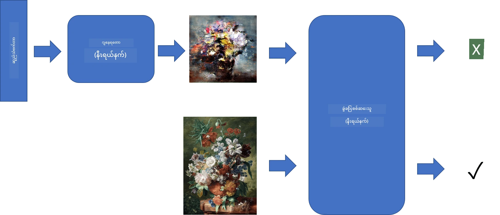
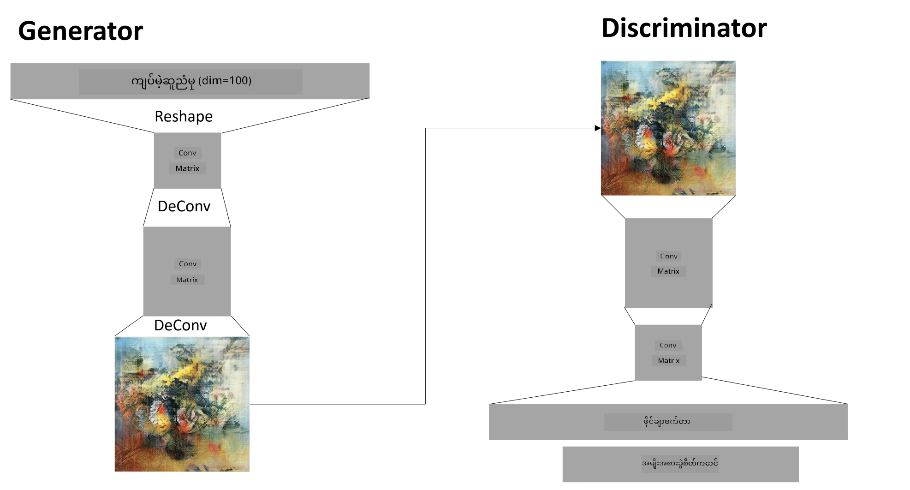

# Generative Adversarial Networks

ယခင်အပိုင်းတွင် **generative models** အကြောင်းကို လေ့လာခဲ့ပါသည်။ Generative models ဆိုသည်မှာ သင်ကြားမှု dataset ထဲရှိပုံများနှင့် ဆင်တူသော ပုံအသစ်များကို ဖန်တီးနိုင်သော မော်ဒယ်များဖြစ်သည်။ VAE သည် generative model တစ်ခုအနေဖြင့် ကောင်းမွန်သော ဥပမာတစ်ခုဖြစ်သည်။

## [Pre-lecture quiz](https://ff-quizzes.netlify.app/en/ai/quiz/19)

သို့သော် အဓိပ္ပါယ်ရှိပြီး resolution ကောင်းမွန်သော ပန်းချီပုံများကို VAE အသုံးပြု၍ ဖန်တီးရန် ကြိုးစားပါက သင်ကြားမှုကောင်းစွာ မရောက်ရှိနိုင်ပါ။ ဒီလိုအခြေအနေတွင် generative models အတွက် အထူးသီးသန့်ဖန်တီးထားသော architecture တစ်ခုဖြစ်သည့် **Generative Adversarial Networks** (GANs) ကို လေ့လာသင့်ပါသည်။

GANs ၏ အဓိကအကြောင်းအရာမှာ နေရာတစ်ခုတွင် neural networks နှစ်ခုကို တစ်ခုနှင့်တစ်ခု ယှဉ်ပြိုင်၍ သင်ကြားခြင်းဖြစ်သည်။

> ပုံကို [Dmitry Soshnikov](http://soshnikov.com) မှ ဖန်တီးထားသည်။

> ✅ အသုံးအနှုန်းအနည်းငယ်:
> * **Generator** ဆိုသည်မှာ random vector တစ်ခုကို ယူပြီး ပုံတစ်ပုံကို ရလဒ်အဖြစ် ဖန်တီးပေးသော network ဖြစ်သည်။
> * **Discriminator** ဆိုသည်မှာ ပုံတစ်ပုံကို ယူပြီး အဆိုပါပုံသည် training dataset မှရရှိသော အမှန်ပုံဖြစ်သည်၊ ဒါမှမဟုတ် generator မှ ဖန်တီးထားသော ပုံဖြစ်သည်ဟု သတ်မှတ်ပေးရမည့် network ဖြစ်သည်။ အဓိကအားဖြင့် image classifier တစ်ခုဖြစ်သည်။

### Discriminator

Discriminator ၏ architecture သည် အခြား image classification network များနှင့် မတူကွဲပြားပါ။ အလွယ်ဆုံးအနေဖြင့် fully-connected classifier ဖြစ်နိုင်သော်လည်း [convolutional network](../07-ConvNets/README.md) ဖြစ်နိုင်သည်။

> ✅ Convolutional networks အပေါ်အခြေခံထားသော GAN ကို [DCGAN](https://arxiv.org/pdf/1511.06434.pdf) ဟုခေါ်သည်။

CNN discriminator တွင် အောက်ပါ layer များပါဝင်သည် - convolution+pooling အတန်းများ (spatial size လျော့နည်းလာသည်) နှင့် "feature vector" ရရှိရန် fully-connected layer တစ်ခု သို့မဟုတ် အများအပြား၊ နောက်ဆုံး binary classifier တစ်ခု။

> ✅ "Pooling" ဆိုသည်မှာ ပုံ၏အရွယ်အစားကို လျော့နည်းစေသောနည်းလမ်းတစ်ခုဖြစ်သည်။ "Pooling layers သည် data ၏ dimension များကို လျော့နည်းစေပြီး layer တစ်ခုတွင် neuron cluster များ၏ output များကို နောက်တစ်ခု layer တွင် neuron တစ်ခုအဖြစ် ပေါင်းစည်းပေးသည်။" - [source](https://wikipedia.org/wiki/Convolutional_neural_network#Pooling_layers)

### Generator

Generator သည် အနည်းငယ်ပိုမိုရှုပ်ထွေးသည်။ Discriminator ကို ပြန်လှည့်ထားသည့်အနေဖြင့် သတ်မှတ်နိုင်သည်။ Latent vector (feature vector ၏နေရာတွင်) မှစတင်ပြီး လိုအပ်သော size/shape သို့ ပြောင်းလဲပေးသော fully-connected layer တစ်ခုနှင့် deconvolutions+upscaling ပါဝင်သည်။ ၎င်းသည် [autoencoder](../09-Autoencoders/README.md) ၏ *decoder* အပိုင်းနှင့် ဆင်တူသည်။

> ✅ Convolution layer ကို linear filter အဖြစ် ပုံကို ဖြတ်သန်း၍ အကောင်အထည်ဖော်သည့်အတွက် deconvolution သည် convolution နှင့် ဆင်တူပြီး အတူတူသော layer logic ကို အသုံးပြု၍ အကောင်အထည်ဖော်နိုင်သည်။

> ပုံကို [Dmitry Soshnikov](http://soshnikov.com) မှ ဖန်တီးထားသည်။

### GAN ကို သင်ကြားခြင်း

GANs ကို **adversarial** ဟုခေါ်သည်မှာ generator နှင့် discriminator အမြဲတမ်း ယှဉ်ပြိုင်နေသောကြောင့်ဖြစ်သည်။ ယှဉ်ပြိုင်မှုအတွင်း generator နှင့် discriminator နှစ်ခုစလုံး တိုးတက်လာပြီး network သည် ပိုမိုကောင်းမွန်သော ပုံများကို ဖန်တီးနိုင်ရန် သင်ကြားသည်။

သင်ကြားမှုသည် အဆင့်နှစ်ခုဖြင့် ဖြစ်ပေါ်သည် -

* **Discriminator ကို သင်ကြားခြင်း**။ ဒီအလုပ်ကို လွယ်ကူစွာလုပ်ဆောင်နိုင်သည် - generator မှ ပုံများ batch တစ်ခုကို ဖန်တီးပြီး 0 ဟု label လုပ်သည် (fake image ကိုဆိုလိုသည်)၊ input dataset မှ ပုံများ batch တစ်ခုကို ယူပြီး label 1 (real image) ဟု သတ်မှတ်သည်။ *discriminator loss* တစ်ခုရရှိပြီး backprop လုပ်ဆောင်သည်။
* **Generator ကို သင်ကြားခြင်း**။ ဒီအလုပ်သည် အနည်းငယ်ပိုမိုရှုပ်ထွေးသည်၊ generator အတွက် ရလဒ်ကို တိုက်ရိုက်မသိနိုင်သောကြောင့်ဖြစ်သည်။ GAN network တစ်ခုလုံးကို generator နှင့် discriminator ပေါင်းစပ်ထားသောအနေဖြင့် random vectors များဖြင့် input ပေးပြီး ရလဒ်ကို 1 (real images ကိုဆိုလိုသည်) ဟု မျှော်လင့်သည်။ Discriminator ၏ parameters များကို freeze လုပ်ပြီး (ဒီအဆင့်တွင် သင်ကြားလိုမထားပါ) backprop လုပ်ဆောင်သည်။

ဒီလုပ်ငန်းစဉ်အတွင်း generator နှင့် discriminator loss များသည် အနည်းငယ်သာ လျော့နည်းသည်။ အကောင်းဆုံးအခြေအနေတွင် loss များသည် တက်ကျဆဲဖြစ်ပြီး network နှစ်ခုစလုံး ၎င်းတို့၏ performance ကို တိုးတက်စေသည်။

## ✍️ Exercises: GANs

* [GAN Notebook in TensorFlow/Keras](GANTF.ipynb)
* [GAN Notebook in PyTorch](GANPyTorch.ipynb)

### GAN သင်ကြားမှု၏ ပြဿနာများ

GANs သည် သင်ကြားရန် အထူးခက်ခဲသော network များအဖြစ် သိရှိထားသည်။ အောက်ပါပြဿနာများရှိသည် -

* **Mode Collapse**။ Generator သည် discriminator ကို လှည့်စားနိုင်သော ပုံတစ်ပုံကိုသာ ဖန်တီးပြီး အမျိုးမျိုးသော ပုံများကို မဖန်တီးနိုင်သောအခြေအနေကို ဆိုလိုသည်။
* **Hyperparameters အပေါ် အထူးထိခိုက်မှု**။ GAN သည် မတည်ငြိမ်နိုင်သောအခြေအနေများကို တွေ့ရနိုင်ပြီး learning rate ကို လျော့နည်းစေခြင်းဖြင့် တစ်ချိန်တွင် တည်ငြိမ်လာနိုင်သည်။
* Generator နှင့် discriminator အကြား **balance** ကို ထိန်းသိမ်းခြင်း။ Discriminator loss သည် အလွန်မြန်စွာ လျော့နည်းသွားနိုင်ပြီး generator သည် နောက်ထပ် သင်ကြားရန် မဖြစ်နိုင်တော့သောအခြေအနေကို ဖြစ်စေသည်။ ဒီပြဿနာကို ဖြေရှင်းရန် generator နှင့် discriminator အတွက် learning rate မတူကွဲပြားစွာ သတ်မှတ်ခြင်း၊ သို့မဟုတ် discriminator loss အလွန်နည်းနေပါက discriminator သင်ကြားမှုကို ချန်ထားခြင်းတို့ကို ကြိုးစားနိုင်သည်။
* **High resolution** အတွက် သင်ကြားခြင်း။ Autoencoders တွင်ရှိသောပြဿနာနှင့်တူသည်။ Convolutional network ၏ layer များကို အလွန်များစွာ ပြန်လည်ဖန်တီးခြင်းကြောင့် artifacts ဖြစ်ပေါ်စေသည်။ ဒီပြဿနာကို **progressive growing** ဟုခေါ်သောနည်းလမ်းဖြင့် ဖြေရှင်းနိုင်သည် - layer အနည်းငယ်ကို low-res images တွင် သင်ကြားပြီး layer များကို "unblock" သို့မဟုတ် ထပ်မံထည့်သွင်းသည်။ အခြားနည်းလမ်းမှာ layer များအကြား extra connections ထည့်သွင်းပြီး resolution များစွာကို တစ်ချိန်တည်းတွင် သင်ကြားခြင်းဖြစ်သည်။ [Multi-Scale Gradient GANs paper](https://arxiv.org/abs/1903.06048) ကို အသေးစိတ်ကြည့်ပါ။

## Style Transfer

GANs သည် အနုပညာပုံများကို ဖန်တီးရန် ကောင်းမွန်သောနည်းလမ်းဖြစ်သည်။ အခြားစိတ်ဝင်စားဖွယ်နည်းလမ်းတစ်ခုမှာ **style transfer** ဖြစ်သည်။ ၎င်းသည် **content image** တစ်ခုကို ယူပြီး **style image** မှ filter များကို အသုံးပြု၍ အခြားစတိုင်ဖြင့် ပြန်လည်ရေးဆွဲပေးသည်။

၎င်း၏လုပ်ဆောင်ပုံမှာ -

* Random noise image (content image ကိုစတင်အသုံးပြုနိုင်သော်လည်း random noise မှစတင်ခြင်းသည် နားလည်ရန် ပိုမိုလွယ်ကူသည်) မှစတင်သည်။
* Content image နှင့် style image နှစ်ခုနှင့် နီးစပ်သော image တစ်ခုကို ဖန်တီးရန် ရည်ရွယ်သည်။ ၎င်းကို loss functions နှစ်ခုဖြင့် သတ်မှတ်သည် -
   - **Content loss** ကို current image နှင့် content image မှ CNN ၏ layer များမှ extract လုပ်ထားသော features အပေါ်အခြေခံ၍ တွက်ချက်သည်။
   - **Style loss** ကို current image နှင့် style image အကြား Gram matrices ကို အသုံးပြု၍ (အသေးစိတ်ကို [example notebook](StyleTransfer.ipynb) တွင် ကြည့်ပါ) တွက်ချက်သည်။
* ပုံကို ပိုမိုချောမွေ့စေပြီး noise ကို ဖယ်ရှားရန် **Variation loss** ကို ထည့်သွင်းသည်။ Neighboring pixels အကြားအကွာအဝေးကို တွက်ချက်သည်။
* Main optimization loop သည် gradient descent (သို့မဟုတ် အခြား optimization algorithm) ကို အသုံးပြု၍ loss များ၏ weighted sum ကို လျော့နည်းစေရန် current image ကို ပြင်ဆင်သည်။

## ✍️ Example: [Style Transfer](StyleTransfer.ipynb)

## [Post-lecture quiz](https://ff-quizzes.netlify.app/en/ai/quiz/20)

## နိဂုံး

ဒီသင်ခန်းစာတွင် GANs နှင့် ၎င်းတို့ကို သင်ကြားပုံကို လေ့လာခဲ့ပါသည်။ GANs ၏ အထူးပြဿနာများနှင့် ၎င်းတို့ကို ဖြေရှင်းရန် နည်းလမ်းများကိုလည်း လေ့လာခဲ့ပါသည်။

## 🚀 Challenge

သင်၏ပုံများကို အသုံးပြု၍ [Style Transfer notebook](StyleTransfer.ipynb) ကို လုပ်ဆောင်ပါ။

## Review & Self Study

GANs အကြောင်းကို အောက်ပါရင်းမြစ်များတွင် ပိုမိုလေ့လာပါ -

* Marco Pasini, [10 Lessons I Learned Training GANs for one Year](https://towardsdatascience.com/10-lessons-i-learned-training-generative-adversarial-networks-gans-for-a-year-c9071159628)
* [StyleGAN](https://en.wikipedia.org/wiki/StyleGAN), GAN architecture အတွက် *de facto* အနေဖြင့် သတ်မှတ်ထားသည်။
* [Creating Generative Art using GANs on Azure ML](https://soshnikov.com/scienceart/creating-generative-art-using-gan-on-azureml/)

## Assignment

ဒီသင်ခန်းစာနှင့်ဆက်စပ်ထားသော notebook နှစ်ခုမှ တစ်ခုကို ပြန်လည်လေ့လာပြီး သင်၏ပုံများကို GAN သင်ကြားပါ။ သင်ဘာများဖန်တီးနိုင်မလဲ?

---

