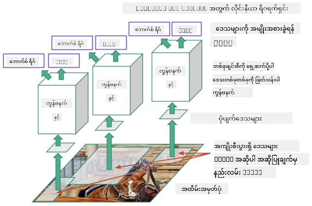
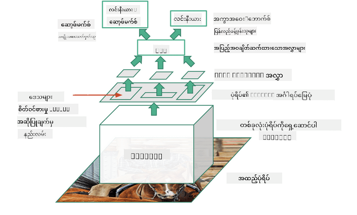
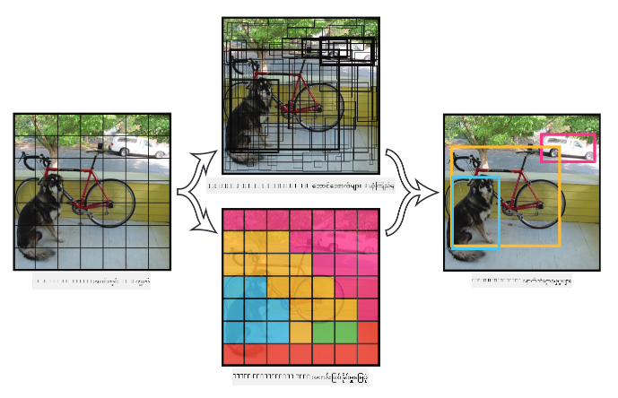

<!--
CO_OP_TRANSLATOR_METADATA:
{
  "original_hash": "d76a7eda28de5210c8b1ba50a6216c69",
  "translation_date": "2025-09-23T15:16:34+00:00",
  "source_file": "lessons/4-ComputerVision/11-ObjectDetection/README.md",
  "language_code": "my"
}
-->
# Object Detection

ယခင်က ကျွန်တော်တို့ handling လုပ်ခဲ့တဲ့ image classification models တွေဟာ ပုံတစ်ပုံကိုယူပြီး categorical ရလဒ်တစ်ခုထုတ်ပေးခဲ့ပါတယ်၊ ဥပမာ MNIST ပြဿနာမှာ 'number' class တစ်ခုလိုပါပဲ။ သို့သော် အများဆုံးအခြေအနေတွေမှာ ပုံတစ်ပုံမှာ object တွေရှိတယ်ဆိုတာကိုသိရုံမကဘဲ၊ အဲ့ဒီ object တွေရှိတဲ့တိကျတဲ့နေရာကိုသိချင်ပါတယ်။ ဒါဟာ **object detection** ရဲ့အဓိကရည်ရွယ်ချက်ပဲဖြစ်ပါတယ်။

## [Pre-lecture quiz](https://ff-quizzes.netlify.app/en/ai/quiz/21)

> ပုံကို [YOLO v2 web site](https://pjreddie.com/darknet/yolov2/) မှရယူထားသည်။

## Object Detection အတွက် Naive Approach

ပုံတစ်ပုံမှာ ကြောင်တစ်ကောင်ကိုရှာဖွေချင်တယ်လို့ယူဆရင်၊ object detection အတွက် naive approach တစ်ခုက အောက်ပါအတိုင်းဖြစ်နိုင်ပါတယ်-

1. ပုံကို tiles အများကြီးအဖြစ်ခွဲခြားပါ။
2. တစ်ခုချင်းစီ tile တွေမှာ image classification ကို run လုပ်ပါ။
3. activation အဆင့်မြင့်တဲ့ tiles တွေကို object ရှိတယ်လို့ယူဆနိုင်ပါတယ်။

> *ပုံကို [Exercise Notebook](ObjectDetection-TF.ipynb) မှရယူထားသည်*

သို့သော် ဒီနည်းလမ်းက အလွန်မကျွမ်းကျင်တဲ့နည်းလမ်းဖြစ်ပြီး၊ object's bounding box ကိုတိကျစွာသတ်မှတ်နိုင်ခြင်းမရှိပါဘူး။ ပိုမိုတိကျတဲ့နေရာကိုသတ်မှတ်ဖို့ **regression** တစ်ခု run လုပ်ဖို့လိုအပ်ပြီး၊ bounding box တွေရဲ့ coordinates ကို predict လုပ်ဖို့အတွက် dataset အထူးလိုအပ်ပါတယ်။

## Regression for Object Detection

[ဒီ blog post](https://towardsdatascience.com/object-detection-with-neural-networks-a4e2c46b4491) မှာ shapes တွေကို detect လုပ်တဲ့အကြောင်းအရာကို gentle introduction အနေနဲ့ဖော်ပြထားပါတယ်။

## Object Detection အတွက် Datasets

ဒီ task အတွက် dataset အမျိုးမျိုးတွေကိုတွေ့နိုင်ပါတယ်-

* [PASCAL VOC](http://host.robots.ox.ac.uk/pascal/VOC/) - 20 classes
* [COCO](http://cocodataset.org/#home) - Common Objects in Context. 80 classes, bounding boxes နှင့် segmentation masks

## Object Detection Metrics

### Intersection over Union

Image classification အတွက် algorithm ရဲ့ performance ကိုတိုင်းတာရလွယ်ကူသလို၊ object detection အတွက် class ရဲ့တိကျမှုနှင့် bounding box ရဲ့တိကျမှုကိုတိုင်းတာဖို့လိုအပ်ပါတယ်။ Bounding box ရဲ့တိကျမှုကိုတိုင်းတာဖို့ **Intersection over Union** (IoU) ကိုသုံးပါတယ်၊ ဒါဟာ box နှစ်ခု (သို့မဟုတ် arbitrary areas နှစ်ခု) overlap ဖြစ်ပုံကိုတိုင်းတာပေးပါတယ်။

> *ပုံကို [IoU အကြောင်း blog post](https://pyimagesearch.com/2016/11/07/intersection-over-union-iou-for-object-detection/) မှရယူထားသည်*

အကြောင်းအရာကရိုးရှင်းပါတယ် - figures နှစ်ခုရဲ့ intersection area ကို union area နဲ့စားခွဲပါတယ်။ identical areas နှစ်ခုအတွက် IoU က 1 ဖြစ်ပြီး၊ completely disjointed areas အတွက် 0 ဖြစ်ပါတယ်။ အခြားအခြေအနေတွေမှာ 0 မှ 1 အတွင်း variation ဖြစ်ပါတယ်။ IoU တန်ဖိုးတစ်ခုထက်ကြီးတဲ့ bounding boxes တွေကိုသာ typically consider လုပ်ပါတယ်။

### Average Precision

Class $C$ တစ်ခုကိုဘယ်လောက်ကောင်းကောင်း detect လုပ်နိုင်တယ်ဆိုတာတိုင်းတာချင်တယ်ဆိုရင် **Average Precision** metrics ကိုသုံးပါတယ်၊ calculation နည်းလမ်းကအောက်ပါအတိုင်းဖြစ်ပါတယ်-

1. Precision-Recall curve ကို threshold value (0 မှ 1) အပေါ်မူတည်ပြီး accuracy ကိုပြသပါ။
2. Threshold အပေါ်မူတည်ပြီး ပုံထဲမှာ detect လုပ်နိုင်တဲ့ object အရေအတွက်ကွဲပြားမှု၊ precision နှင့် recall values ကွဲပြားမှုရှိပါမယ်။
3. Curve ကအောက်ပါအတိုင်းဖြစ်ပါမယ်-

> *ပုံကို [NeuroWorkshop](http://github.com/shwars/NeuroWorkshop) မှရယူထားသည်*

Class $C$ အတွက် Average Precision က curve ရဲ့ area ဖြစ်ပါတယ်။ Recall axis ကို typically 10 parts ခွဲပြီး Precision ကိုအဲ့ဒီ points တွေမှာ average လုပ်ပါတယ်-

$$
AP = {1\over11}\sum_{i=0}^{10}\mbox{Precision}(\mbox{Recall}={i\over10})
$$

### AP နှင့် IoU

IoU တန်ဖိုးတစ်ခုထက်ကြီးတဲ့ detections တွေကိုသာ consider လုပ်ပါမယ်။ ဥပမာ PASCAL VOC dataset မှာ typically $\mbox{IoU Threshold} = 0.5$ ကိုယူဆပြီး၊ COCO မှာ $\mbox{IoU Threshold}$ values များစွာအတွက် AP ကိုတိုင်းတာပါတယ်။

> *ပုံကို [NeuroWorkshop](http://github.com/shwars/NeuroWorkshop) မှရယူထားသည်*

### Mean Average Precision - mAP

Object Detection အတွက်အဓိက metric ကို **Mean Average Precision** (mAP) လို့ခေါ်ပါတယ်။ ဒါဟာ Average Precision ရဲ့တန်ဖိုးဖြစ်ပြီး၊ object classes အားလုံးအတွက် average လုပ်ထားတာဖြစ်ပါတယ်၊ တစ်ခါတစ်ရံ $\mbox{IoU Threshold}$ အပေါ်လည်း average လုပ်ထားပါတယ်။ **mAP** ကိုတွက်ချက်နည်းလမ်းကို [ဒီ blog post](https://medium.com/@timothycarlen/understanding-the-map-evaluation-metric-for-object-detection-a07fe6962cf3) မှာဖော်ပြထားပြီး၊ [code samples](https://gist.github.com/tarlen5/008809c3decf19313de216b9208f3734) နဲ့လည်းဖော်ပြထားပါတယ်။

## Object Detection အတွက် နည်းလမ်းများ

Object detection algorithms တွေကို broad classes နှစ်ခုအဖြစ်ခွဲခြားနိုင်ပါတယ်-

* **Region Proposal Networks** (R-CNN, Fast R-CNN, Faster R-CNN). အဓိကအကြောင်းအရာက **Regions of Interests** (ROI) တွေကို generate လုပ်ပြီး CNN ကို run လုပ်တာဖြစ်ပါတယ်၊ maximum activation ရှာဖွေဖို့။ Naive approach နဲ့တူပေမယ့် ROIs တွေကိုပိုမိုကျွမ်းကျင်စွာ generate လုပ်ပါတယ်။ ဒီနည်းလမ်းရဲ့အဓိက drawback က အလွန်နှေးကွေးတယ်၊ image အပေါ် CNN classifier ကို passes အများကြီး run လုပ်ရလို့။
* **One-pass** (YOLO, SSD, RetinaNet) methods. ဒီ architectures တွေမှာ network ကို classes နှင့် ROIs ကိုတစ်ခါတည်း predict လုပ်ဖို့ design လုပ်ထားပါတယ်။

### R-CNN: Region-Based CNN

[R-CNN](http://islab.ulsan.ac.kr/files/announcement/513/rcnn_pami.pdf) က [Selective Search](http://www.huppelen.nl/publications/selectiveSearchDraft.pdf) ကိုသုံးပြီး ROI regions တွေကို hierarchical structure အဖြစ် generate လုပ်ပါတယ်၊ အဲ့ဒီ regions တွေကို CNN feature extractors နှင့် SVM-classifiers တွေက object class ကိုသတ်မှတ်ဖို့၊ linear regression က *bounding box* coordinates ကိုသတ်မှတ်ဖို့သုံးပါတယ်။ [Official Paper](https://arxiv.org/pdf/1506.01497v1.pdf)

> *ပုံကို van de Sande et al. ICCV’11 မှရယူထားသည်*

> *ပုံကို [ဒီ blog](https://towardsdatascience.com/r-cnn-fast-r-cnn-faster-r-cnn-yolo-object-detection-algorithms-36d53571365e) မှရယူထားသည်*

### F-RCNN - Fast R-CNN

ဒီနည်းလမ်းက R-CNN နဲ့တူပေမယ့် regions တွေကို convolution layers apply လုပ်ပြီးမှသတ်မှတ်ပါတယ်။

> ပုံကို [Official Paper](https://www.cv-foundation.org/openaccess/content_iccv_2015/papers/Girshick_Fast_R-CNN_ICCV_2015_paper.pdf), [arXiv](https://arxiv.org/pdf/1504.08083.pdf), 2015 မှရယူထားသည်။

### Faster R-CNN

ဒီနည်းလမ်းရဲ့အဓိကအကြောင်းအရာက neural network ကိုသုံးပြီး ROIs ကို predict လုပ်တာဖြစ်ပါတယ် - *Region Proposal Network* လို့ခေါ်ပါတယ်။ [Paper](https://arxiv.org/pdf/1506.01497.pdf), 2016

> ပုံကို [Official Paper](https://arxiv.org/pdf/1506.01497.pdf) မှရယူထားသည်။

### R-FCN: Region-Based Fully Convolutional Network

ဒီ algorithm က Faster R-CNN ထက်ပိုမိုမြန်ဆန်ပါတယ်။ အဓိကအကြောင်းအရာက-

1. ResNet-101 ကိုသုံးပြီး features တွေကို extract လုပ်ပါ။
2. Features တွေကို **Position-Sensitive Score Map** မှာ process လုပ်ပါ။ $C$ classes ထဲက object တစ်ခုစီကို $k\times k$ regions တွေခွဲပြီး၊ object parts တွေကို predict လုပ်ဖို့ training လုပ်ပါတယ်။
3. $k\times k$ regions ထဲက part တစ်ခုစီအတွက် networks အားလုံးက object classes အတွက် vote လုပ်ပြီး၊ maximum vote ရတဲ့ object class ကိုရွေးချယ်ပါတယ်။

> ပုံကို [Official Paper](https://arxiv.org/abs/1605.06409) မှရယူထားသည်။

### YOLO - You Only Look Once

YOLO က realtime one-pass algorithm ဖြစ်ပါတယ်။ အဓိကအကြောင်းအရာက-

 * ပုံကို $S\times S$ regions တွေခွဲပါ။
 * Region တစ်ခုစီအတွက် **CNN** က $n$ possible objects, *bounding box* coordinates နှင့် *confidence*=*probability* * IoU ကို predict လုပ်ပါတယ်။

 

> ပုံကို [Official Paper](https://arxiv.org/abs/1506.02640) မှရယူထားသည်။

### အခြားနည်းလမ်းများ

* RetinaNet: [Official Paper](https://arxiv.org/abs/1708.02002)
   - [PyTorch Implementation in Torchvision](https://pytorch.org/vision/stable/_modules/torchvision/models/detection/retinanet.html)
   - [Keras Implementation](https://github.com/fizyr/keras-retinanet)
   - [Object Detection with RetinaNet](https://keras.io/examples/vision/retinanet/) in Keras Samples
* SSD (Single Shot Detector): [Official Paper](https://arxiv.org/abs/1512.02325)

## ✍️ Exercises: Object Detection

အောက်ပါ notebook မှာ သင့်ရဲ့လေ့လာမှုကိုဆက်လက်လုပ်ဆောင်ပါ-

[ObjectDetection.ipynb](ObjectDetection.ipynb)

## Conclusion

ဒီသင်ခန်းစာမှာ object detection ကိုအမျိုးမျိုးသောနည်းလမ်းများဖြင့် accomplish လုပ်နိုင်ပုံကို whirlwind tour အနေနဲ့လေ့လာခဲ့ပါတယ်။

## 🚀 Challenge

YOLO အကြောင်းအရာများနှင့် notebooks တွေကိုဖတ်ရှုပြီး ကိုယ်တိုင်စမ်းသပ်ကြည့်ပါ-

* [YOLO ကိုဖော်ပြထားတဲ့ blog post](https://www.analyticsvidhya.com/blog/2018/12/practical-guide-object-detection-yolo-framewor-python/)
 * [Official Site](https://pjreddie.com/darknet/yolo/)
 * Yolo: [Keras Implementation](https://github.com/experiencor/keras-yolo2), [Step-by-Step Notebook](https://github.com/experiencor/basic-yolo-keras/blob/master/Yolo%20Step-by-Step.ipynb)
 * Yolo v2: [Keras Implementation](https://github.com/experiencor/keras-yolo2), [Step-by-Step Notebook](https://github.com/experiencor/keras-yolo2/blob/master/Yolo%20Step-by-Step.ipynb)

## [Post-lecture quiz](https://ff-quizzes.netlify.app/en/ai/quiz/22)

## Review & Self Study

* [Object Detection](https://tjmachinelearning.com/lectures/1718/obj/) by Nikhil Sardana
* [Object Detection Algorithms တွေကိုနှိုင်းယှဉ်ထားတဲ့ blog post](https://lilianweng.github.io/lil-log/2018/12/27/object-detection-part-4.html)
* [Deep Learning Algorithms for Object Detection ကို Review လုပ်ထားတဲ့ blog post](https://medium.com/comet-app/review-of-deep-learning-algorithms-for-object-detection-c1f3d437b852)
* [Basic Object Detection Algorithms အကြောင်း Step-by-Step Introduction](https://www.analyticsvidhya.com/blog/2018/10/a-step-by-step-introduction-to-the-basic-object-detection-algorithms-part-1/)
* [Python မှာ Faster R-CNN ကို Object Detection အတွက် Implementation လုပ်ပုံ](https://www.analyticsvidhya.com/blog/2018/11/implementation-faster-r-cnn-python-object-detection/)

## [Assignment: Object Detection](lab/README.md)

---

