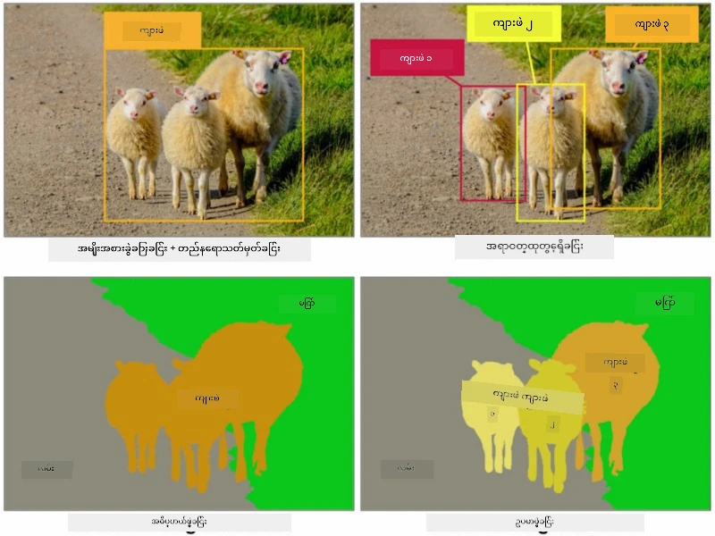
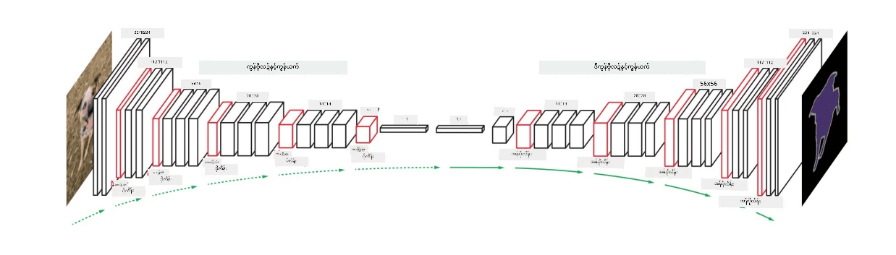
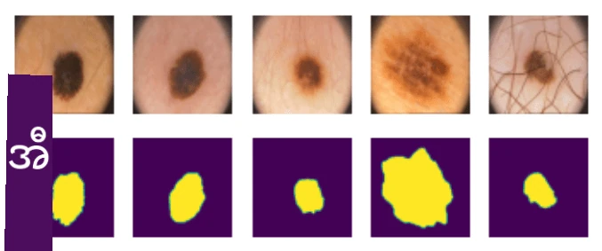

# အပိုင်းခွဲခြားခြင်း

ယခင်က ကျွန်တော်တို့ Object Detection အကြောင်းကို လေ့လာခဲ့ပြီး၊ *bounding boxes* ကိုခန့်မှန်းခြင်းဖြင့် ပုံထဲမှာရှိတဲ့ objects တွေကို ရှာဖွေနိုင်ခဲ့ပါတယ်။ သို့သော် တချို့သောအလုပ်များအတွက် bounding boxes ပဲမဟုတ်ဘဲ၊ ပိုမိုတိကျတဲ့ object localization လည်းလိုအပ်ပါတယ်။ ဒီအလုပ်ကို **segmentation** လို့ခေါ်ပါတယ်။

## [Pre-lecture quiz](https://ff-quizzes.netlify.app/en/ai/quiz/23)

Segmentation ကို **pixel classification** အနေနဲ့ကြည့်နိုင်ပြီး၊ ပုံရဲ့ **တစ်ခုချင်းစီ** pixel အတွက် class ကိုခန့်မှန်းရမယ် (*background* က classes တွေထဲကတစ်ခုဖြစ်ပါတယ်)။ Segmentation algorithm နှစ်မျိုးရှိပါတယ်-

* **Semantic segmentation** က pixel class ကိုသာပြောပြပြီး၊ အတူတူ class ရဲ့ object တွေကို ခွဲခြားမပြုလုပ်ပါဘူး။
* **Instance segmentation** ကတော့ class တွေကို အခြားသော instances တွေအဖြစ် ခွဲခြားပေးပါတယ်။

ဥပမာအားဖြင့် instance segmentation မှာ ဒီသိုးတွေက object အနေနဲ့ ခွဲခြားထားပြီး၊ semantic segmentation မှာတော့ သိုးအားလုံးကို class တစ်ခုအနေနဲ့သာ ဖော်ပြထားပါတယ်။

> ပုံကို [ဒီ blog post](https://nirmalamurali.medium.com/image-classification-vs-semantic-segmentation-vs-instance-segmentation-625c33a08d50) မှရယူထားပါသည်။

Segmentation အတွက် neural architectures မျိုးစုံရှိပေမယ့်၊ အားလုံးမှာ တူညီတဲ့ဖွဲ့စည်းပုံရှိပါတယ်။ တစ်နည်းအားဖြင့်၊ autoencoder ကို သင်ယခင်ကလေ့လာခဲ့သလိုပုံစံတူပေမယ့်၊ original image ကို deconstruct လုပ်တာမဟုတ်ဘဲ **mask** ကို deconstruct လုပ်ဖို့ရည်ရွယ်ပါတယ်။ ထို့ကြောင့် segmentation network မှာ အောက်ပါအစိတ်အပိုင်းတွေပါဝင်ပါတယ်-

* **Encoder** က input image မှ feature တွေကို extract လုပ်ပေးပါတယ်။
* **Decoder** က feature တွေကို **mask image** အဖြစ်ပြောင်းပေးပြီး၊ အရွယ်အစားတူညီပြီး channel အရေအတွက်က class အရေအတွက်နဲ့ကိုက်ညီပါတယ်။

> ပုံကို [ဒီ publication](https://arxiv.org/pdf/2001.05566.pdf) မှရယူထားပါသည်။

Segmentation အတွက် အသုံးပြုတဲ့ loss function ကို အထူးသတိပြုဖို့လိုပါတယ်။ Classical autoencoders အသုံးပြုတဲ့အခါမှာ၊ ပုံနှစ်ပုံကြားမှာ တူညီမှုကိုတိုင်းတာဖို့လိုအပ်ပြီး၊ mean square error (MSE) ကိုအသုံးပြုနိုင်ပါတယ်။ Segmentation မှာတော့၊ target mask image ရဲ့ pixel တစ်ခုချင်းစီက class number ကို (third dimension မှာ one-hot-encoded) ကိုယ်စားပြုထားပြီး၊ classification-specific loss functions - cross-entropy loss ကို pixel အားလုံးအပေါ်မှာ အလယ်ပေါင်းတွက်ပြီးအသုံးပြုရပါတယ်။ Mask က binary ဖြစ်တဲ့အခါမှာ **binary cross-entropy loss** (BCE) ကိုအသုံးပြုပါတယ်။

> ✅ One-hot encoding က class label ကို class အရေအတွက်နဲ့တူညီတဲ့အရှည်ရှိတဲ့ vector အဖြစ် encode လုပ်တဲ့နည်းလမ်းတစ်ခုဖြစ်ပါတယ်။ [ဒီဆောင်းပါး](https://datagy.io/sklearn-one-hot-encode/) ကိုကြည့်ပြီး နည်းလမ်းအကြောင်းပိုမိုလေ့လာပါ။

## ဆေးဘက်ပုံရိပ်များအတွက် Segmentation

ဒီသင်ခန်းစာမှာ၊ လူ့ nevi (moles လို့လည်းခေါ်ပါတယ်) ကို ဆေးဘက်ပုံရိပ်များမှာ အသိအမှတ်ပြုနိုင်ဖို့ network ကို training လုပ်ခြင်းအားဖြင့် segmentation ကို လက်တွေ့ကျကျမြင်တွေ့ပါမယ်။ <a href="https://www.fc.up.pt/addi/ph2%20database.html">PH2 Database</a> မှ dermoscopy images ကို image source အနေနဲ့အသုံးပြုပါမယ်။ ဒီ dataset မှာ typical nevus, atypical nevus, နှင့် melanoma ဆိုတဲ့ class သုံးခုပါဝင်တဲ့ပုံ 200 ပုံပါဝင်ပြီး၊ အပုံတိုင်းမှာ nevus ကို outline လုပ်ထားတဲ့ **mask** ပါဝင်ပါတယ်။

> ✅ ဒီနည်းလမ်းက ဆေးဘက်ပုံရိပ်အမျိုးအစားအတွက် အထူးသင့်လျော်ပါတယ်၊ ဒါပေမယ့် သင်အခြားသော အကွက်များမှာလည်း အသုံးချနိုင်မယ့် နည်းလမ်းတွေကို စဉ်းစားနိုင်ပါသလား?

> ပုံကို PH2 Database မှရယူထားပါသည်။

ကျွန်တော်တို့ model ကို training လုပ်ပြီး၊ background မှ nevus ကို segmentation လုပ်နိုင်အောင်လုပ်ပါမယ်။

## ✍️ လေ့ကျင့်မှုများ: Semantic Segmentation

အောက်ပါ notebooks တွေကိုဖွင့်ပြီး၊ semantic segmentation architectures မျိုးစုံအကြောင်းပိုမိုလေ့လာပါ၊ အလုပ်လုပ်ပုံကိုလေ့ကျင့်ပါ၊ နှင့် လက်တွေ့ကျကျမြင်တွေ့ပါ။

* [Semantic Segmentation Pytorch](SemanticSegmentationPytorch.ipynb)
* [Semantic Segmentation TensorFlow](SemanticSegmentationTF.ipynb)

## [Post-lecture quiz](https://ff-quizzes.netlify.app/en/ai/quiz/24)

## နိဂုံး

Segmentation က image classification အတွက် အလွန်အစွမ်းထက်တဲ့နည်းလမ်းဖြစ်ပြီး၊ bounding boxes ကိုကျော်လွန်ပြီး pixel-level classification ကိုလုပ်ဆောင်ပါတယ်။ ဆေးဘက်ပုံရိပ်များအတွက် အသုံးပြုနိုင်သလို၊ အခြားသော application များအတွက်လည်း အသုံးဝင်ပါတယ်။

## 🚀 စိန်ခေါ်မှု

ကိုယ်ခန္ဓာ segmentation က လူပုံရိပ်များနဲ့လုပ်ဆောင်နိုင်တဲ့ အလုပ်များထဲက တစ်ခုသာဖြစ်ပါတယ်။ အခြားသောအရေးကြီးတဲ့အလုပ်များမှာ **skeleton detection** နှင့် **pose detection** ပါဝင်ပါတယ်။ [OpenPose](https://github.com/CMU-Perceptual-Computing-Lab/openpose) library ကိုစမ်းသပ်ပြီး pose detection ကိုဘယ်လိုအသုံးချနိုင်သလဲကြည့်ပါ။

## ပြန်လည်သုံးသပ်ခြင်းနှင့် ကိုယ်တိုင်လေ့လာခြင်း

ဒီ [wikipedia article](https://wikipedia.org/wiki/Image_segmentation) မှ Segmentation နည်းလမ်းရဲ့ application မျိုးစုံအကြောင်းကို အကျဉ်းချုပ်ဖော်ပြထားပါတယ်။ Instance segmentation နှင့် Panoptic segmentation ရဲ့ subdomains အကြောင်းကို ကိုယ်တိုင်ပိုမိုလေ့လာပါ။

## [Assignment](lab/README.md)

ဒီ lab မှာ [Segmentation Full Body MADS Dataset](https://www.kaggle.com/datasets/tapakah68/segmentation-full-body-mads-dataset) ကို Kaggle မှရယူပြီး **လူ့ကိုယ်ခန္ဓာ segmentation** ကိုစမ်းသပ်ပါ။

---

