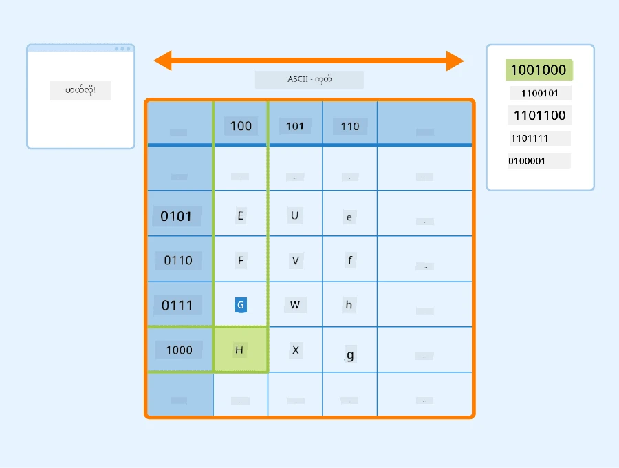
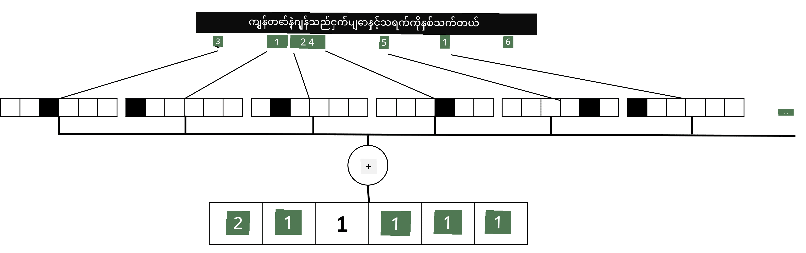

# တိုကင်ဆာများကို Tensor အဖြစ်ဖော်ပြခြင်း

## [Pre-lecture quiz](https://ff-quizzes.netlify.app/en/ai/quiz/25)

## စာသားအမျိုးအစားခွဲခြင်း

ဤအပိုင်း၏ ပထမပိုင်းတွင် **စာသားအမျိုးအစားခွဲခြင်း** အလုပ်ကို အဓိကထားလုပ်ဆောင်မည်ဖြစ်သည်။ [AG News](https://www.kaggle.com/amananandrai/ag-news-classification-dataset) Dataset ကို အသုံးပြုမည်ဖြစ်ပြီး၊ အောက်ပါအတိုင်း သတင်းဆောင်းပါးများပါဝင်သည်-

* အမျိုးအစား: Sci/Tech  
* ခေါင်းစဉ်: Ky. Company Wins Grant to Study Peptides (AP)  
* အကြောင်းအရာ: AP - A company founded by a chemistry researcher at the University of Louisville won a grant to develop...

ကျွန်ုပ်တို့ရဲ့ရည်မှန်းချက်မှာ စာသားအပေါ်အခြေခံပြီး သတင်းအကြောင်းအရာကို အမျိုးအစားတစ်ခုခုအဖြစ် ခွဲခြားဖော်ပြရန်ဖြစ်သည်။

## စာသားကို ဖော်ပြခြင်း

Neural network များဖြင့် သဘာဝဘာသာစကားလုပ်ငန်းများ (NLP) ကို ဖြေရှင်းလိုပါက၊ စာသားကို tensor အဖြစ်ဖော်ပြရန် နည်းလမ်းတစ်ခုလိုအပ်သည်။ ကွန်ပျူတာများသည် ASCII သို့မဟုတ် UTF-8 ကဲ့သို့သော encoding များကို အသုံးပြု၍ စာသားအက္ခရာများကို နံပါတ်များအဖြစ် ဖော်ပြထားပြီး သင့် screen ပေါ်တွင် font များအဖြစ် ပြသထားသည်။

> [ပုံရင်းအရင်းအမြစ်](https://www.seobility.net/en/wiki/ASCII)

လူသားများအနေဖြင့် အက္ခရာတစ်ခုစီ **အဓိပ္ပါယ်** ကို နားလည်နိုင်ပြီး၊ စာကြောင်းတစ်ကြောင်း၏ စကားလုံးများဖွဲ့စည်းရန် အက္ခရာများအားလုံးပေါင်းစည်းပုံကို နားလည်နိုင်သည်။ သို့သော် ကွန်ပျူတာများသည် အလိုအလျောက် ထိုနားလည်မှုမရှိပါ၊ neural network သည် သင်ကြားမှုအတွင်း အဓိပ္ပါယ်ကို သင်ယူရမည်ဖြစ်သည်။

ထို့ကြောင့် စာသားကို ဖော်ပြရာတွင် နည်းလမ်းများကို အသုံးပြုနိုင်သည်-

* **Character-level representation** - စာသားကို အက္ခရာတစ်ခုစီကို နံပါတ်တစ်ခုအဖြစ် သတ်မှတ်ခြင်းဖြင့် ဖော်ပြသည်။ စာသား corpus တွင် *C* အက္ခရာများရှိသည်ဟုယူဆပါက၊ *Hello* စကားလုံးကို 5x*C* tensor အဖြစ် ဖော်ပြနိုင်သည်။ အက္ခရာတစ်ခုစီသည် one-hot encoding တွင် tensor column တစ်ခုကို ကိုယ်စားပြုသည်။
* **Word-level representation** - စာသားတွင်ပါဝင်သော စကားလုံးအားလုံး၏ **vocabulary** တစ်ခုကို ဖန်တီးပြီး၊ စကားလုံးများကို one-hot encoding ဖြင့် ဖော်ပြသည်။ ဤနည်းလမ်းသည် အက္ခရာတစ်ခုစီ၏ အဓိပ္ပါယ်မရှိသည့်အတွက် neural network အတွက် အလုပ်ကို လွယ်ကူစေသော semantic အဆင့်မြင့်သော စကားလုံးများကို အသုံးပြုခြင်းဖြင့် ပိုမိုကောင်းမွန်သည်။ သို့သော် dictionary size ကြီးမားသောကြောင့် high-dimensional sparse tensors ကို ကိုင်တွယ်ရမည်။

ဖော်ပြချက်မည်သည့်နည်းဖြင့်မဆို၊ စာသားကို **tokens** အစီအစဉ်တစ်ခုအဖြစ် ပြောင်းလဲရမည်။ token တစ်ခုသည် character, word သို့မဟုတ် စကားလုံး၏ အစိတ်အပိုင်းတစ်ခုဖြစ်နိုင်သည်။ ထို့နောက် token ကို **vocabulary** အသုံးပြု၍ နံပါတ်တစ်ခုအဖြစ် ပြောင်းလဲပြီး၊ neural network သို့ one-hot encoding ဖြင့် ထည့်သွင်းနိုင်သည်။

## N-Grams

သဘာဝဘာသာစကားတွင် စကားလုံး၏ အတိအကျအဓိပ္ပါယ်ကို context အတွင်းမှသာ သတ်မှတ်နိုင်သည်။ ဥပမာအားဖြင့် *neural network* နှင့် *fishing network* ၏ အဓိပ္ပါယ်များမှာ လုံးဝကွဲပြားသည်။ ဤအရာကို ထည့်သွင်းစဉ်းစားရန် နည်းလမ်းတစ်ခုမှာ စကားလုံးများကို pair အဖြစ် ဖော်ပြပြီး၊ စကားလုံး pair များကို vocabulary token အဖြစ် သတ်မှတ်ခြင်းဖြစ်သည်။ ဤနည်းလမ်းဖြင့် *I like to go fishing* စာကြောင်းကို *I like*, *like to*, *to go*, *go fishing* tokens အဖြစ် ဖော်ပြနိုင်သည်။ 

ဤနည်းလမ်း၏ ပြဿနာမှာ dictionary size ကြီးမားလာခြင်းဖြစ်ပြီး၊ *go fishing* နှင့် *go shopping* ကဲ့သို့သော combination များသည် semantic similarity မျှဝေမှုမရှိသော်လည်း token ကွဲပြားမှုရှိသည်။

တစ်ခါတစ်ရံတွင် tri-grams (စကားလုံး ၃ ခု) ကို အသုံးပြုနိုင်သည်။ ထို့ကြောင့် ဤနည်းလမ်းကို **n-grams** ဟုခေါ်သည်။ character-level representation တွင် n-grams ကို အသုံးပြုခြင်းသည် syllabi များနှင့် ဆင်တူသည်။

## Bag-of-Words နှင့် TF/IDF

စာသားအမျိုးအစားခွဲခြင်းကဲ့သို့သော အလုပ်များကို ဖြေရှင်းရာတွင်၊ စာသားကို fixed-size vector တစ်ခုအဖြစ် ဖော်ပြနိုင်ရမည်။ ဤ vector ကို နောက်ဆုံး dense classifier သို့ input အဖြစ် အသုံးပြုမည်။ အလွယ်ဆုံးနည်းလမ်းတစ်ခုမှာ စကားလုံးတစ်ခုစီ၏ representation များကို ပေါင်းစည်းခြင်းဖြစ်သည်။ စကားလုံးတစ်ခုစီ၏ one-hot encoding များကို ပေါင်းစည်းပါက၊ စကားလုံးတစ်ခုစီသည် စာသားအတွင်း ရှိသောအကြိမ်ရေကို ဖော်ပြသော frequency vector ကို ရရှိမည်။ ဤ representation ကို **bag of words** (BoW) ဟုခေါ်သည်။

> ပုံရေးသားသူ

BoW သည် စကားလုံးများသည် စာသားတွင် ရှိနေမှုနှင့် အကြိမ်ရေကို ဖော်ပြသည်။ ဤနည်းလမ်းသည် စာသား၏ အကြောင်းအရာကို ဖော်ပြရန် ကောင်းမွန်သောအညွှန်းဖြစ်နိုင်သည်။ ဥပမာအားဖြင့် နိုင်ငံရေးသတင်းဆောင်းပါးတွင် *president* နှင့် *country* ကဲ့သို့သော စကားလုံးများပါဝင်နိုင်ပြီး၊ သိပ္ပံဆောင်းပါးတွင် *collider*, *discovered* ကဲ့သို့သော စကားလုံးများပါဝင်နိုင်သည်။ ထို့ကြောင့် စကားလုံး frequency များသည် စာသားအကြောင်းအရာကို ဖော်ပြရန် ကောင်းမွန်သောအညွှန်းဖြစ်နိုင်သည်။

BoW ၏ ပြဿနာမှာ *and*, *is* ကဲ့သို့သော စကားလုံးများသည် စာသားများအများစုတွင် ပါဝင်ပြီး၊ အကြိမ်ရေများဆုံးဖြစ်သည်။ ထို့ကြောင့် အရေးကြီးသော စကားလုံးများကို ဖုံးကွယ်သွားသည်။ စကားလုံးများ၏ အရေးပါမှုကို document collection အတွင်း စကားလုံးများ၏ frequency ကို ထည့်သွင်းစဉ်းစားခြင်းဖြင့် လျော့ချနိုင်သည်။ ဤနည်းလမ်းသည် TF/IDF နည်းလမ်း၏ အဓိကအကြောင်းအရာဖြစ်ပြီး၊ ဤသင်ခန်းစာတွင်ပါဝင်သော notebooks တွင် အသေးစိတ်ဖော်ပြထားသည်။

သို့သော်၊ ဤနည်းလမ်းများသည် စာသား၏ **semantics** ကို အပြည့်အဝ ဖော်ပြနိုင်ခြင်းမရှိပါ။ ဤအပိုင်းတွင် ဆွေးနွေးမည့် neural network မော်ဒယ်များကို အသုံးပြုရန် လိုအပ်သည်။

## ✍️ လေ့ကျင့်ခန်းများ: စာသားကို ဖော်ပြခြင်း

အောက်ပါ notebooks များတွင် သင့်လေ့လာမှုကို ဆက်လက်လုပ်ဆောင်ပါ-

* [Text Representation with PyTorch](TextRepresentationPyTorch.ipynb)  
* [Text Representation with TensorFlow](TextRepresentationTF.ipynb)  

## နိဂုံး

ယခုအချိန်အထိ၊ စကားလုံးများကို frequency weight ဖြည့်စွမ်းနိုင်သော နည်းလမ်းများကို လေ့လာခဲ့ပါပြီ။ သို့သော်၊ အဓိပ္ပါယ်နှင့် အစီအစဉ်ကို ဖော်ပြနိုင်ခြင်းမရှိပါ။ နာမည်ကျော် ဘာသာဗေဒပညာရှင် J. R. Firth သည် 1935 ခုနှစ်တွင် "စကားလုံး၏ အပြည့်အစုံအဓိပ္ပါယ်သည် အမြဲ context အတွင်းရှိပြီး၊ context မပါဘဲ အဓိပ္ပါယ်ကို လေ့လာခြင်းသည် အလေးထားစဉ်းစားရန်မဖြစ်နိုင်ပါ" ဟု ဆိုခဲ့သည်။ စာသားမှ contextual အချက်အလက်ကို ဖမ်းယူရန် language modeling ကို သင်ခန်းစာတွင် နောက်ပိုင်းတွင် လေ့လာမည်။

## 🚀 စိန်ခေါ်မှု

Bag-of-words နှင့် အခြား data models များကို အသုံးပြု၍ အခြားလေ့ကျင့်ခန်းများကို စမ်းသပ်ပါ။ ဤ [Kaggle ပြိုင်ပွဲ](https://www.kaggle.com/competitions/word2vec-nlp-tutorial/overview/part-1-for-beginners-bag-of-words) မှ အကြံဉာဏ်ရနိုင်ပါသည်။

## [Post-lecture quiz](https://ff-quizzes.netlify.app/en/ai/quiz/26)

## ပြန်လည်သုံးသပ်ခြင်းနှင့် ကိုယ်တိုင်လေ့လာခြင်း

[Microsoft Learn](https://docs.microsoft.com/learn/modules/intro-natural-language-processing-pytorch/?WT.mc_id=academic-77998-cacaste) တွင် text embeddings နှင့် bag-of-words နည်းလမ်းများကို လေ့ကျင့်ပါ။

## [Assignment: Notebooks](assignment.md)

---

