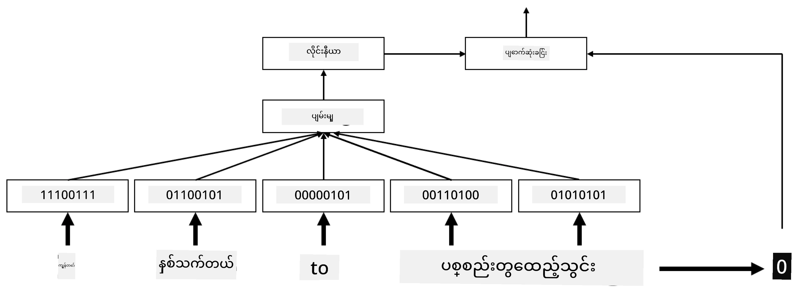
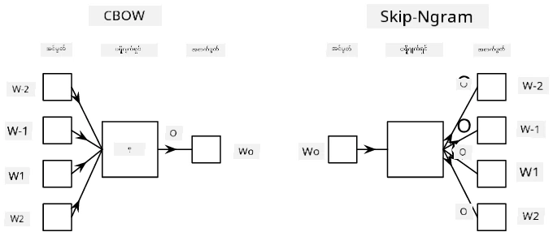

# Embeddings

## [Pre-lecture quiz](https://ff-quizzes.netlify.app/en/ai/quiz/27)

BoW (Bag-of-Words) သို့မဟုတ် TF/IDF ကို အခြေခံပြီး Classifier များကို သင်ကြားသည့်အခါ `vocab_size` အတိုင်းအတာရှိသော အမြင့် dimension bag-of-words vectors များကို အသုံးပြုခဲ့ပြီး၊ အနိမ့် dimension positional representation vectors များကို sparse one-hot representation သို့ ပြောင်းလဲခြင်းကို တိကျစွာ ပြုလုပ်ခဲ့သည်။ သို့သော်၊ one-hot representation သည် memory ကို ထိရောက်စွာ အသုံးမပြုနိုင်ပါ။ ထို့အပြင်၊ စကားလုံးတစ်လုံးချင်းစီကို တစ်ခုချင်းစီ သီးသန့်အနေဖြင့် ဆက်ဆံထားပြီး၊ one-hot encoded vectors များသည် စကားလုံးများအကြား semantic ဆက်စပ်မှုကို မဖော်ပြနိုင်ပါ။

**Embedding** ဆိုတဲ့ အယူအဆက စကားလုံးတွေကို အနိမ့် dimension dense vectors တွေဖြင့် ကိုယ်စားပြုဖို့ ဖြစ်ပြီး၊ စကားလုံးတစ်လုံးရဲ့ semantic အဓိပ္ပါယ်ကို တစ်နည်းနည်းနဲ့ ဖော်ပြနိုင်ဖို့ ဖြစ်ပါတယ်။ စကားလုံး embedding တွေကို အဓိက အဓိပ္ပါယ်ရှိအောင် ဘယ်လို ဖန်တီးရမလဲဆိုတာကို နောက်ပိုင်းမှာ ဆွေးနွေးပါမယ်၊ ဒါပေမယ့် အခုအချိန်မှာတော့ စကားလုံး vector ရဲ့ dimension ကို လျှော့ချဖို့ နည်းလမ်းတစ်ခုအနေနဲ့ embedding တွေကို သက်သက် စဉ်းစားကြည့်ပါ။

Embedding layer က စကားလုံးကို input အနေနဲ့ ယူပြီး၊ သတ်မှတ်ထားတဲ့ `embedding_size` ရဲ့ output vector ကို ထုတ်ပေးပါမယ်။ တစ်နည်းအားဖြင့်၊ ဒါဟာ `Linear` layer နဲ့ အလွန်တူပါတယ်၊ ဒါပေမယ့် one-hot encoded vector ကို ယူမယ့်အစား၊ စကားလုံးနံပါတ်ကို input အနေနဲ့ ယူနိုင်ပြီး၊ အကြီးမားတဲ့ one-hot-encoded vectors တွေ ဖန်တီးဖို့ မလိုအပ်တော့ပါဘူး။

Embedding layer ကို classifier network ရဲ့ ပထမဆုံး layer အနေနဲ့ အသုံးပြုခြင်းအားဖြင့်၊ bag-of-words model ကနေ **embedding bag** model သို့ ပြောင်းလဲနိုင်ပါတယ်။ ဒီမှာ စကားလုံးတစ်လုံးချင်းစီကို သက်ဆိုင်ရာ embedding သို့ ပြောင်းပြီး၊ အဲဒီ embeddings အားလုံးအပေါ်မှာ `sum`, `average` သို့မဟုတ် `max` ကဲ့သို့သော aggregate function တစ်ခုခုကို တွက်ချက်ပါမယ်။

> ပုံကို စာရေးသူမှ ဖန်တီးထားသည်

## ✍️ Exercises: Embeddings

အောက်ပါ notebooks များတွင် သင့်ရဲ့ သင်ကြားမှုကို ဆက်လက် လေ့လာပါ:
* [Embeddings with PyTorch](EmbeddingsPyTorch.ipynb)
* [Embeddings TensorFlow](EmbeddingsTF.ipynb)

## Semantic Embeddings: Word2Vec

Embedding layer က စကားလုံးတွေကို vector representation သို့ mapping လုပ်ဖို့ သင်ယူခဲ့ပေမယ့်၊ ဒီ representation က semantic အဓိပ္ပါယ်နဲ့ မဖြစ်စဉ်းစားထားတာ ဖြစ်နိုင်ပါတယ်။ စကားလုံးတွေဟာ semantic အနေနဲ့ တူညီတဲ့အခါ၊ သို့မဟုတ် synonym တွေဟာ vector distance (ဥပမာ Euclidean distance) အနေနဲ့ နီးစပ်တဲ့ vectors တွေဖြစ်အောင် သင်ယူနိုင်ရင် ကောင်းမယ်။

ဒါကို ပြုလုပ်ဖို့၊ စကားလုံး embedding model ကို အထူးနည်းလမ်းနဲ့ စာသားအကြီးစား collection တစ်ခုမှာ pre-train လုပ်ဖို့ လိုအပ်ပါတယ်။ Semantic embeddings ကို train လုပ်ဖို့ နည်းလမ်းတစ်ခုက [Word2Vec](https://en.wikipedia.org/wiki/Word2vec) လို့ခေါ်ပါတယ်။ ဒါဟာ စကားလုံးတွေကို distributed representation ထုတ်လုပ်ဖို့ အသုံးပြုတဲ့ အဓိက architecture နှစ်ခုအပေါ် အခြေခံထားပါတယ်။

 - **Continuous bag-of-words** (CBoW) — ဒီ architecture မှာ၊ surrounding context ကနေ စကားလုံးကို predict လုပ်ဖို့ model ကို train လုပ်ပါတယ်။ ngram $(W_{-2},W_{-1},W_0,W_1,W_2)$ ကို ပေးထားတဲ့အခါ၊ model ရဲ့ ရည်ရွယ်ချက်က $(W_{-2},W_{-1},W_1,W_2)$ ကနေ $W_0$ ကို predict လုပ်ဖို့ ဖြစ်ပါတယ်။
 - **Continuous skip-gram** က CBoW ရဲ့ ဆန့်ကျင်ဘက်ဖြစ်ပါတယ်။ Surrounding window context စကားလုံးတွေကို အသုံးပြုပြီး လက်ရှိစကားလုံးကို predict လုပ်ပါတယ်။

CBoW က ပိုမြန်ပြီး၊ skip-gram က ပိုနှေးပေမယ့်၊ မကြာခဏ မတွေ့ရတဲ့ စကားလုံးတွေကို ပိုကောင်းစွာ ကိုယ်စားပြုနိုင်ပါတယ်။

> ပုံကို [ဒီစာတမ်း](https://arxiv.org/pdf/1301.3781.pdf) မှာ ရရှိခဲ့သည်

Word2Vec pre-trained embeddings (GloVe ကဲ့သို့သော model များပါ) ကို neural networks တွေမှာ embedding layer အစား အသုံးပြုနိုင်ပါတယ်။ သို့သော်၊ vocabularies တွေကို စီမံခန့်ခွဲဖို့ လိုအပ်ပါတယ်၊ Word2Vec/GloVe ကို pre-train လုပ်ဖို့ အသုံးပြုတဲ့ vocabulary ဟာ ကျွန်တော်တို့ရဲ့ text corpus ရဲ့ vocabulary နဲ့ မတူနိုင်ပါတယ်။ ဒီပြဿနာကို ဘယ်လို ဖြေရှင်းရမလဲဆိုတာကို အထက်ပါ Notebooks တွေမှာ ကြည့်ရှုပါ။

## Contextual Embeddings

Traditional pretrained embedding representations (Word2Vec ကဲ့သို့သော) ရဲ့ အဓိက ကန့်သတ်ချက်တစ်ခုက word sense disambiguation ပြဿနာဖြစ်ပါတယ်။ Pretrained embeddings တွေဟာ စကားလုံးတွေကို context အနေနဲ့ အဓိပ္ပါယ်တစ်ခုခုကို ဖမ်းယူနိုင်ပေမယ့်၊ စကားလုံးတစ်လုံးရဲ့ အဓိပ္ပါယ်အားလုံးကို တစ်ခုတည်းသော embedding မှာ encode လုပ်ထားပါတယ်။ ဒါက downstream models တွေမှာ ပြဿနာဖြစ်စေနိုင်ပါတယ်၊ စကားလုံးများ (ဥပမာ 'play') ဟာ context အပေါ်မူတည်ပြီး အဓိပ္ပါယ်ကွဲပြားမှုရှိပါတယ်။

ဥပမာအားဖြင့် 'play' ဆိုတဲ့ စကားလုံးဟာ အောက်ပါ စာကြောင်းနှစ်ခုမှာ အဓိပ္ပါယ်ကွဲပြားမှုရှိပါတယ်:

- ကျွန်တော် **play** တစ်ခုကို ရုပ်ရှင်ရုံမှာ သွားကြည့်ခဲ့တယ်။
- John က သူ့သူငယ်ချင်းတွေနဲ့ **play** လုပ်ချင်တယ်။

Pretrained embeddings တွေဟာ 'play' ဆိုတဲ့ စကားလုံးရဲ့ အဓိပ္ပါယ်နှစ်ခုလုံးကို တစ်ခုတည်းသော embedding မှာ ကိုယ်စားပြုထားပါတယ်။ ဒီကန့်သတ်ချက်ကို ကျော်လွှားဖို့၊ **language model** ကို အခြေခံပြီး embeddings တွေကို ဖန်တီးဖို့ လိုအပ်ပါတယ်၊ language model ဟာ စာသားအကြီးစား corpus မှာ train လုပ်ထားပြီး၊ စကားလုံးတွေကို context အမျိုးမျိုးမှာ ဘယ်လို သုံးနိုင်တယ်ဆိုတာ *သိ*ပါတယ်။ Contextual embeddings ကို ဆွေးနွေးခြင်းဟာ ဒီ tutorial ရဲ့ အကျိုးကျေးဇူးအတွင်း မပါဝင်ပါဘူး၊ ဒါပေမယ့် language models တွေကို နောက်ပိုင်း သင်ခန်းစာမှာ ပြန်လည်ဆွေးနွေးပါမယ်။

## Conclusion

ဒီသင်ခန်းစာမှာ၊ TensorFlow နဲ့ Pytorch မှာ embedding layers တွေကို ဘယ်လို ဖန်တီးပြီး စကားလုံးရဲ့ semantic အဓိပ္ပါယ်ကို ပိုကောင်းစွာ ဖော်ပြနိုင်မလဲဆိုတာကို သင်တွေ့ရှိခဲ့ပါတယ်။

## 🚀 Challenge

Word2Vec ကို သီချင်းစာသားနဲ့ ကဗျာတွေ ဖန်တီးဖို့ စိတ်ဝင်စားဖွယ် application တွေမှာ အသုံးပြုခဲ့ပါတယ်။ [ဒီဆောင်းပါး](https://www.politetype.com/blog/word2vec-color-poems) ကို ကြည့်ရှုပါ၊ ဒီမှာ အရေးသားသူက Word2Vec ကို အသုံးပြုပြီး ကဗျာတွေ ဖန်တီးပုံကို ရှင်းလင်းထားပါတယ်။ Dan Shiffmann ရဲ့ [ဒီဗီဒီယို](https://www.youtube.com/watch?v=LSS_bos_TPI&ab_channel=TheCodingTrain) ကိုလည်း ကြည့်ရှုပြီး ဒီနည်းလမ်းရဲ့ အခြားသော ရှင်းလင်းချက်ကို ရှာဖွေပါ။ ထို့နောက် Kaggle မှ ရရှိနိုင်သော သင့်ရဲ့ text corpus ကို အသုံးပြုပြီး ဒီနည်းလမ်းတွေကို သင့်ကိုယ်တိုင် လက်တွေ့ကျကျ အသုံးချကြည့်ပါ။

## [Post-lecture quiz](https://ff-quizzes.netlify.app/en/ai/quiz/28)

## Review & Self Study

Word2Vec အကြောင်း [Efficient Estimation of Word Representations in Vector Space](https://arxiv.org/pdf/1301.3781.pdf) ဆိုတဲ့ စာတမ်းကို ဖတ်ရှုပါ။

## [Assignment: Notebooks](assignment.md)

---

