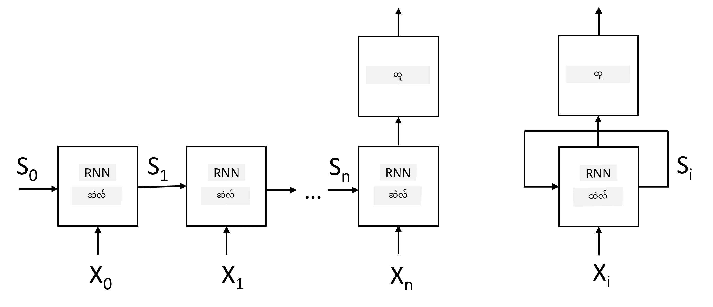
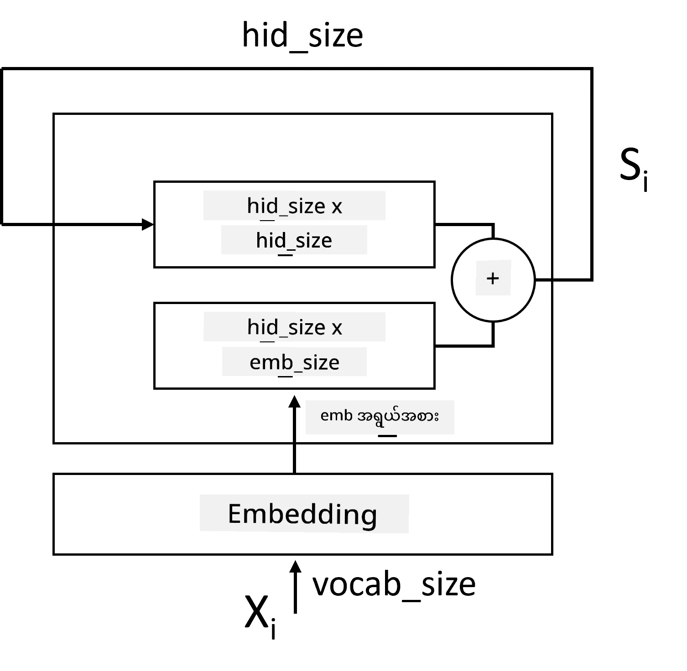
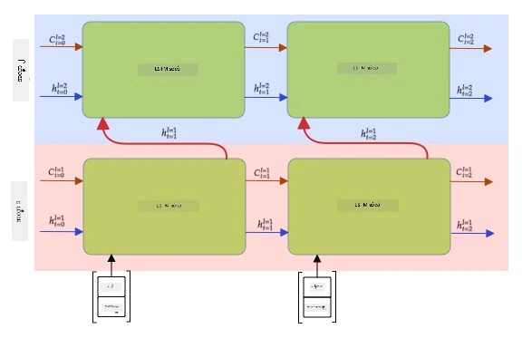

# Recurrent Neural Networks

## [Pre-lecture quiz](https://ff-quizzes.netlify.app/en/ai/quiz/31)

ယခင်အပိုင်းများတွင် ကျွန်ုပ်တို့သည် စာသားများ၏ semantically အဓိပ္ပါယ်များကို အသုံးပြုပြီး embeddings အပေါ်တွင် ရိုးရှင်းသော linear classifier ကို အသုံးပြုခဲ့သည်။ ဤ architecture သည် စာကြောင်းတစ်ကြောင်းအတွင်းရှိ စကားလုံးများ၏ အဓိပ္ပါယ်ကို စုပေါင်းဖမ်းဆီးပေးနိုင်သော်လည်း စကားလုံးများ၏ **အစီအစဉ်** ကို မထည့်သွင်းစဉ်းစားပါ၊ အကြောင်းမှာ embeddings အပေါ် aggregation operation သည် မူရင်းစာသားမှ အချက်အလက်များကို ဖယ်ရှားလိုက်သောကြောင့် ဖြစ်သည်။ ထို့ကြောင့် ဤမော်ဒယ်များသည် စကားလုံးအစီအစဉ်ကို မော်ဒယ်မဖန်တီးနိုင်သဖြင့် စာသားဖန်တီးခြင်း သို့မဟုတ် မေးခွန်းအဖြေများကဲ့သို့ ရှုပ်ထွေးသော အလုပ်များကို မဖြေရှင်းနိုင်ပါ။

စာသားအစီအစဉ်၏ အဓိပ္ပါယ်ကို ဖမ်းဆီးရန် **recurrent neural network** (RNN) ဟုခေါ်သော neural network architecture တစ်ခုကို အသုံးပြုရန် လိုအပ်သည်။ RNN တွင် ကျွန်ုပ်တို့၏ စာကြောင်းကို network အတွင်းသို့ သင်္ကေတတစ်ခုစီဖြင့် ဖြတ်သွားပြီး network သည် **state** တစ်ခုကို ထုတ်လုပ်သည်၊ ထို့နောက် ကျွန်ုပ်တို့သည် နောက်ထပ်သင်္ကေတနှင့်အတူ network သို့ ပြန်လည်ပေးပို့သည်။

> ပုံကို စာရေးသူမှ ဖန်တီးသည်

သင်္ကေတများ၏ input sequence X0,...,Xn ကို ပေးထားသောအခါ RNN သည် neural network blocks များ၏ အစီအစဉ်ကို ဖန်တီးပြီး backpropagation ကို အသုံးပြု၍ အဆုံး-to-အဆုံး training လုပ်သည်။ Network block တစ်ခုစီသည် (Xi,Si) ကို input အဖြစ်ယူပြီး Si+1 ကို ရလဒ်အဖြစ် ထုတ်လုပ်သည်။ နောက်ဆုံး state Sn သို့မဟုတ် (output Yn) ကို linear classifier သို့ ပေးပို့ပြီး ရလဒ်ကို ထုတ်လုပ်သည်။ Network blocks အားလုံးသည် တူညီသော weight များကို share လုပ်ပြီး backpropagation pass တစ်ခုဖြင့် အဆုံး-to-အဆုံး training လုပ်သည်။

State vectors S0,...,Sn များကို network အတွင်းဖြတ်သွားသောကြောင့် စကားလုံးများအကြား sequential dependencies များကို သင်ယူနိုင်သည်။ ဥပမာအားဖြင့် စာကြောင်းတစ်ခုအတွင်း *not* စကားလုံးတစ်ခု ပေါ်လာသောအခါ state vector အတွင်းရှိ အချို့သော elements များကို negate လုပ်ရန် သင်ယူနိုင်ပြီး negation ဖြစ်စေသည်။

> ✅ ပုံအပေါ်ရှိ RNN blocks အားလုံး၏ weight များသည် shared ဖြစ်သောကြောင့် ပုံကို recurrent feedback loop ပါသော block တစ်ခု (ညာဘက်) အဖြစ် ကိုယ်စားပြုနိုင်သည်။

## Anatomy of an RNN Cell

ရိုးရှင်းသော RNN cell တစ်ခု၏ ဖွဲ့စည်းပုံကို ကြည့်ပါ။ ၎င်းသည် ယခင် state Si-1 နှင့် လက်ရှိသင်္ကေတ Xi ကို input အဖြစ် လက်ခံပြီး output state Si ကို ထုတ်လုပ်ရမည် (တစ်ခါတစ်ရံ output Yi ကိုလည်း စိတ်ဝင်စားနိုင်သည်၊ ဥပမာ generative networks တွင်).

ရိုးရှင်းသော RNN cell တစ်ခုတွင် weight matrices နှစ်ခုပါဝင်သည်- input symbol ကို transform လုပ်သော W နှင့် input state ကို transform လုပ်သော H တစ်ခု။ ဤအခြေအနေတွင် network ၏ output ကို &sigma;(W&times;Xi+H&times;Si-1+b) အဖြစ်တွက်ချက်သည်၊ &sigma; သည် activation function ဖြစ်ပြီး b သည် bias ဖြစ်သည်။

> ပုံကို စာရေးသူမှ ဖန်တီးသည်

အများအားဖြင့် input tokens များကို dimensionality ကို လျှော့ချရန် RNN သို့ ဝင်မီ embedding layer မှတဆင့် ဖြတ်သွားသည်။ ဤအခြေအနေတွင် input vectors ၏ dimension ကို *emb_size* ဟုခေါ်ပြီး state vector ကို *hid_size* ဟုခေါ်ပါက W ၏ size သည် *emb_size*&times;*hid_size* ဖြစ်ပြီး H ၏ size သည် *hid_size*&times;*hid_size* ဖြစ်သည်။

## Long Short Term Memory (LSTM)

ရိုးရှင်းသော RNN များ၏ အဓိကပြဿနာတစ်ခုမှာ **vanishing gradients** ပြဿနာဖြစ်သည်။ RNN များကို backpropagation pass တစ်ခုဖြင့် အဆုံး-to-အဆုံး training လုပ်သောကြောင့် network ၏ ပထမဆုံး layers သို့ error ကို propagate လုပ်ရန် အခက်အခဲရှိပြီး အဝေးရှိ tokens များအကြား ဆက်နွယ်မှုများကို သင်ယူနိုင်မည်မဟုတ်ပါ။ ဤပြဿနာကို ရှောင်ရှားရန် နည်းလမ်းတစ်ခုမှာ **explicit state management** ကို **gates** အသုံးပြု၍ ထည့်သွင်းခြင်းဖြစ်သည်။ ဤအမျိုးအစား၏ architecture နှစ်ခုမှာ **Long Short Term Memory** (LSTM) နှင့် **Gated Relay Unit** (GRU) ဖြစ်သည်။

> ပုံရင်းအရင်းအမြစ် TBD

LSTM Network သည် RNN နှင့် ဆင်တူသောပုံစံဖြင့် ဖွဲ့စည်းထားပြီး layer တစ်ခုမှ layer တစ်ခုသို့ state C နှင့် hidden vector H နှစ်ခုကို ပေးပို့သည်။ Unit တစ်ခုစီတွင် hidden vector Hi ကို input Xi နှင့် concatenated လုပ်ပြီး **gates** များမှတဆင့် state C တွင် ဖြစ်ပျက်သောအရာများကို ထိန်းချုပ်သည်။ Gate တစ်ခုစီသည် sigmoid activation (output [0,1] အတွင်း) ပါသော neural network ဖြစ်ပြီး state vector နှင့် multiplication လုပ်သောအခါ bitwise mask အဖြစ် တွေးနိုင်သည်။ ပုံအပေါ်တွင် (ဘယ်မှညာ) gates များမှာ-

* **Forget gate** သည် hidden vector ကိုယူပြီး vector C ၏ ဘယ်အပိုင်းကို မေ့ရန်လိုအပ်သည်၊ ဘယ်အပိုင်းကို ဖြတ်သွားရန်လိုအပ်သည်ကို ဆုံးဖြတ်သည်။
* **Input gate** သည် input နှင့် hidden vectors မှ အချက်အလက်အချို့ကိုယူပြီး state ထဲသို့ ထည့်သွင်းသည်။
* **Output gate** သည် state ကို *tanh* activation ပါသော linear layer ဖြင့် transform လုပ်ပြီး hidden vector Hi ကို အသုံးပြု၍ state Ci+1 ကို ထုတ်လုပ်ရန် ၎င်း၏ အချို့သော components များကို ရွေးချယ်သည်။

State C ၏ components များကို flags အဖြစ် switch on နှင့် off လုပ်နိုင်သည်ဟု တွေးနိုင်သည်။ ဥပမာအားဖြင့် *Alice* ဟုအမည်ကို sequence အတွင်း တွေ့ရှိသောအခါ female character ကို ရည်ညွှန်းသည်ဟု ယူဆပြီး state အတွင်း female noun flag ကို ထူထောင်နိုင်သည်။ *and Tom* ဟု phrase ကို ထပ်မံတွေ့ရှိသောအခါ plural noun flag ကို ထူထောင်နိုင်သည်။ ထို့ကြောင့် state ကို manipulate လုပ်ခြင်းအားဖြင့် စာကြောင်း၏ grammar properties များကို ထိန်းသိမ်းနိုင်သည်။

> ✅ LSTM ၏ internals ကို နားလည်ရန် Christopher Olah ရေးသားသော [Understanding LSTM Networks](https://colah.github.io/posts/2015-08-Understanding-LSTMs/) သည် အလွန်ကောင်းမွန်သော resource ဖြစ်သည်။

## Bidirectional and Multilayer RNNs

ကျွန်ုပ်တို့သည် sequence ၏အစမှ အဆုံးသို့ တစ်ဘက်သို့သာ လုပ်ဆောင်သော recurrent networks များကို ဆွေးနွေးခဲ့သည်။ ၎င်းသည် ကျွန်ုပ်တို့ စာဖတ်ခြင်းနှင့် စကားနားထောင်ခြင်း၏ ပုံစံနှင့် ဆင်တူသောကြောင့် သဘာဝကျသည်။ သို့သော် အများအပြားအကွက်များတွင် input sequence ကို random access ရရှိနိုင်သောကြောင့် recurrent computation ကို direction နှစ်ခုတွင် run လုပ်ရန် make sense ဖြစ်နိုင်သည်။ ဤ networks များကို **bidirectional** RNNs ဟုခေါ်သည်။ Bidirectional network ကို handle လုပ်သောအခါ direction တစ်ခုစီအတွက် hidden state vectors နှစ်ခုလိုအပ်သည်။

Recurrent network တစ်ခုသည် direction တစ်ခုဖြစ်စေ bidirectional ဖြစ်စေ sequence အတွင်း certain patterns များကို ဖမ်းဆီးပြီး state vector သို့မဟုတ် output သို့ ပေးပို့နိုင်သည်။ Convolutional networks များနှင့်တူပင်၊ ပထမ layer မှ low-level patterns များကို extract လုပ်ပြီး အဆင့်မြင့် patterns များကို ဖမ်းဆီးရန် ပထမ layer အပေါ်တွင် recurrent layer တစ်ခုတိုးတက်စေပြီး **multi-layer RNN** ကို ဖန်တီးနိုင်သည်။ Multi-layer RNN သည် recurrent networks နှစ်ခု သို့မဟုတ် အများကြီးပါဝင်ပြီး ယခင် layer ၏ output ကို နောက်တစ်ခု layer ၏ input အဖြစ် ပေးပို့သည်။

*Fernando López ရေးသားသော [this wonderful post](https://towardsdatascience.com/from-a-lstm-cell-to-a-multilayer-lstm-network-with-pytorch-2899eb5696f3) မှ ပုံ*

## ✍️ Exercises: Embeddings

အောက်ပါ notebooks များတွင် သင်ယူမှုကို ဆက်လက်လုပ်ဆောင်ပါ-

* [RNNs with PyTorch](RNNPyTorch.ipynb)
* [RNNs with TensorFlow](RNNTF.ipynb)

## Conclusion

ဤ unit တွင် RNNs ကို sequence classification အတွက် အသုံးပြုနိုင်သည်ဟု မြင်ခဲ့ပြီး အမှန်အားဖြင့် စာသားဖန်တီးခြင်း၊ စက်ဘာသာပြန်ခြင်း၊ အခြားအလုပ်များကို handle လုပ်နိုင်သည်။ ဤအလုပ်များကို နောက် unit တွင် ဆွေးနွေးမည်။

## 🚀 Challenge

LSTMs နှင့် ၎င်းတို့၏ applications အကြောင်း စာတမ်းများကို ဖတ်ရှုပါ-

- [Grid Long Short-Term Memory](https://arxiv.org/pdf/1507.01526v1.pdf)
- [Show, Attend and Tell: Neural Image Caption
Generation with Visual Attention](https://arxiv.org/pdf/1502.03044v2.pdf)

## [Post-lecture quiz](https://ff-quizzes.netlify.app/en/ai/quiz/32)

## Review & Self Study

- Christopher Olah ရေးသားသော [Understanding LSTM Networks](https://colah.github.io/posts/2015-08-Understanding-LSTMs/) ကို ဖတ်ရှုပါ။

## [Assignment: Notebooks](assignment.md)

---

