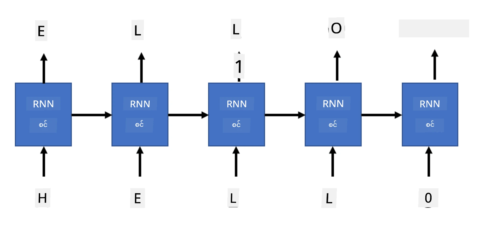

# Generative networks

## [Pre-lecture quiz](https://ff-quizzes.netlify.app/en/ai/quiz/33)

Recurrent Neural Networks (RNNs) နှင့် Long Short Term Memory Cells (LSTMs)၊ Gated Recurrent Units (GRUs) ကဲ့သို့သော gated cell များသည် စကားလုံးများ၏ အစီအစဉ်ကို သင်ယူနိုင်ပြီး အစီအစဉ်တွင် နောက်ဆုံး စကားလုံးကို ခန့်မှန်းပေးနိုင်သော mechanism တစ်ခုကို language modeling အတွက် ပံ့ပိုးပေးခဲ့သည်။ ၎င်းသည် RNNs ကို **generative tasks** များတွင် အသုံးပြုနိုင်စေပြီး၊ ပုံမှန် စာသားထုတ်လုပ်ခြင်း၊ စက်ဖြင့် ဘာသာပြန်ခြင်း၊ ပုံရိပ် captioning စသည်တို့ကို လုပ်ဆောင်နိုင်သည်။

> ✅ သင်ရဲ့ စာသားကို ရိုက်နေစဉ် text completion ကူညီပေးတဲ့ အခါတွေကို သတိရပါ။ သင်နှစ်သက်တဲ့ application တွေမှာ RNNs ကို အသုံးပြုထားမရှိမရှိကို သုတေသနလုပ်ကြည့်ပါ။

ယခင် unit တွင် RNN architecture ကို ဆွေးနွေးခဲ့ပြီး၊ RNN unit တစ်ခုစီသည် နောက် hidden state ကို output အဖြစ် ထုတ်လုပ်ပေးသည်။ သို့သော် RNN unit တစ်ခုစီတွင် output တစ်ခုကို ထပ်မံထည့်သွင်းနိုင်ပြီး၊ ၎င်းသည် **sequence** (မူလ sequence နှင့် အရှည်တူ) ကို output အဖြစ် ထုတ်ပေးနိုင်သည်။ ထို့အပြင်၊ RNN unit များသည် အဆင့်တစ်ခုစီတွင် input ကို လက်ခံမယူဘဲ၊ အစ state vector တစ်ခုကိုသာယူပြီး၊ output sequence ကို ထုတ်ပေးနိုင်သည်။

ဤအရာသည် အောက်ပါပုံတွင် ဖော်ပြထားသော neural architectures များကို ဖန်တီးနိုင်စေသည်-


> ပုံကို [Andrej Karpaty](http://karpathy.github.io/) ရဲ့ [Unreasonable Effectiveness of Recurrent Neural Networks](http://karpathy.github.io/2015/05/21/rnn-effectiveness/) ဆိုတဲ့ blog post မှရယူထားသည်။

* **One-to-one** သည် input တစ်ခုနှင့် output တစ်ခုပါရှိသော traditional neural network ဖြစ်သည်။
* **One-to-many** သည် input value တစ်ခုကို လက်ခံပြီး၊ output values များ၏ sequence ကို ထုတ်ပေးသော generative architecture ဖြစ်သည်။ ဥပမာအားဖြင့် **image captioning** network ကို training လုပ်လိုပါက၊ ပုံတစ်ပုံကို input အဖြစ်ယူပြီး၊ CNN မှ hidden state ကို ရယူကာ၊ recurrent chain မှ caption ကို စကားလုံးတစ်လုံးစီ ထုတ်ပေးနိုင်သည်။
* **Many-to-one** သည် ယခင် unit တွင် ဖော်ပြခဲ့သော RNN architectures (ဥပမာ text classification) ကို ကိုယ်စားပြုသည်။
* **Many-to-many** သို့မဟုတ် **sequence-to-sequence** သည် **machine translation** ကဲ့သို့သော task များကို ကိုယ်စားပြုသည်။ ဤတွင် RNN တစ်ခုသည် input sequence မှ hidden state ကို စုဆောင်းပြီး၊ RNN chain တစ်ခုသည် output sequence ကို unroll လုပ်ပေးသည်။

ဤ unit တွင် စာသားထုတ်လုပ်ရန် simple generative models များကို အဓိကထားမည်ဖြစ်ပြီး၊ character-level tokenization ကို အသုံးပြုမည်။

ဤ RNN ကို စာသားကို အဆင့်ဆင့် ထုတ်လုပ်ရန် training လုပ်မည်။ အဆင့်တစ်ခုစီတွင် `nchars` အရှည်ရှိသော စာလုံးများ၏ sequence ကိုယူပြီး၊ input character တစ်ခုစီအတွက် နောက်ထွက် character ကို network မှ ထုတ်ပေးရန် မေးမြန်းမည်-



စာသားထုတ်လုပ်ခြင်း (inference အတွင်း) တွင် **prompt** တစ်ခုကို RNN cells မှတဆင့် hidden state ကို ရယူပြီး၊ ထို့နောက် generation ကို စတင်မည်။ စာလုံးတစ်လုံးစီကို အဆင့်ဆင့် ထုတ်လုပ်ပြီး၊ state နှင့် ထုတ်လုပ်ထားသော စာလုံးကို နောက် RNN cell သို့ ပေးပို့ကာ နောက် character ကို ထုတ်လုပ်မည်။ ထိုနောက် လိုအပ်သော စာလုံးများကို ထုတ်လုပ်ပြီးမှ ရပ်မည်။


> ပုံကို စာရေးသူမှ ဖန်တီးထားသည်

## ✍️ Exercises: Generative Networks

အောက်ပါ notebooks များတွင် သင့်ရဲ့ သင်ယူမှုကို ဆက်လက်လုပ်ဆောင်ပါ-

* [Generative Networks with PyTorch](GenerativePyTorch.ipynb)
* [Generative Networks with TensorFlow](GenerativeTF.ipynb)

## Soft text generation and temperature

RNN cell တစ်ခုစီ၏ output သည် စာလုံးများ၏ probability distribution ဖြစ်သည်။ generated text တွင် နောက် character အဖြစ် အမြင့်ဆုံး probability ရှိသော စာလုံးကို အမြဲရွေးချယ်ပါက၊ စာသားသည် အတူတူသော စာလုံးအစီအစဉ်များကို ထပ်ခါတလဲလဲ ဖြစ်နိုင်သည်။ ဥပမာအားဖြင့်-

```
today of the second the company and a second the company ...
```

သို့သော် နောက် character အတွက် probability distribution ကို ကြည့်ပါက၊ အမြင့်ဆုံး probability နှင့် အနီးဆုံး probability အကြားကွာဟချက်သည် များစွာမရှိနိုင်ပါ။ ဥပမာအားဖြင့် စာလုံး '*play*' ၏ နောက် character ကို ရှာဖွေပါက၊ space သို့မဟုတ် **e** (ဥပမာ *player* စကားလုံးတွင်) ကို ရွေးချယ်နိုင်သည်။

ဤအခြေအနေသည် အမြင့်ဆုံး probability ရှိသော စာလုံးကို အမြဲရွေးချယ်ခြင်းသည် "တရားမျှတ" မဖြစ်နိုင်ကြောင်း သက်သေပြသည်။ ဒုတိယမြင့်ဆုံး probability ရှိသော စာလုံးကို ရွေးချယ်ခြင်းသည် အဓိပ္ပါယ်ရှိသော စာသားကို ရရှိစေနိုင်သည်။ ထို့ကြောင့် network output မှ probability distribution ကို **sample** လုပ်၍ စာလုံးများကို ရွေးချယ်ခြင်းသည် ပိုမိုဉာဏ်ရှိသည်။ ထို့အပြင် **temperature** parameter ကို အသုံးပြု၍ probability distribution ကို ပိုမို random ဖြစ်စေခြင်း သို့မဟုတ် အမြင့်ဆုံး probability စာလုံးများကို stick ဖြစ်စေခြင်းကို ပြုလုပ်နိုင်သည်။

ဤ soft text generation ကို အထက်ပါ notebooks များတွင် လေ့လာပါ။

## Conclusion

စာသားထုတ်လုပ်ခြင်းသည် ကိုယ်တိုင် အသုံးဝင်နိုင်သော်လည်း၊ RNNs ကို အသုံးပြု၍ initial feature vector မှ စတင်စာသားထုတ်လုပ်နိုင်ခြင်းသည် အဓိကအကျိုးကျေးဇူးများကို ပေးစွမ်းသည်။ ဥပမာအားဖြင့် စက်ဖြင့် ဘာသာပြန်ခြင်း (sequence-to-sequence၊ ဤအခါ *encoder* မှ state vector ကို အသုံးပြု၍ translated message ကို *decode* လုပ်သည်) သို့မဟုတ် ပုံရိပ်၏ textual description ကို ထုတ်လုပ်ခြင်း (ဤအခါ feature vector ကို CNN extractor မှရယူသည်) တွင် အသုံးပြုသည်။

## 🚀 Challenge

Microsoft Learn တွင် ဤအကြောင်းအရာနှင့် ပတ်သက်သော သင်ခန်းစာများကို လေ့လာပါ-

* [PyTorch](https://docs.microsoft.com/learn/modules/intro-natural-language-processing-pytorch/6-generative-networks/?WT.mc_id=academic-77998-cacaste)/[TensorFlow](https://docs.microsoft.com/learn/modules/intro-natural-language-processing-tensorflow/5-generative-networks/?WT.mc_id=academic-77998-cacaste) ဖြင့် Text Generation

## [Post-lecture quiz](https://ff-quizzes.netlify.app/en/ai/quiz/34)

## Review & Self Study

သင့်ရဲ့ အသိပညာကို တိုးချဲ့ရန် အောက်ပါဆောင်းပါးများကို ဖတ်ရှုပါ-

* Markov Chain, LSTM နှင့် GPT-2 ဖြင့် text generation အမျိုးမျိုးကို [blog post](https://towardsdatascience.com/text-generation-gpt-2-lstm-markov-chain-9ea371820e1e) တွင် ဖော်ပြထားသည်။
* [Keras documentation](https://keras.io/examples/generative/lstm_character_level_text_generation/) တွင် Text generation sample ကို ကြည့်ရှုပါ။

## [Assignment](lab/README.md)

စာလုံးတစ်လုံးစီကို အသုံးပြု၍ စာသားထုတ်လုပ်ပုံကို ကြည့်ရှုခဲ့ပါပြီ။ lab တွင် စကားလုံးအဆင့် text generation ကို လေ့လာပါ။

---

