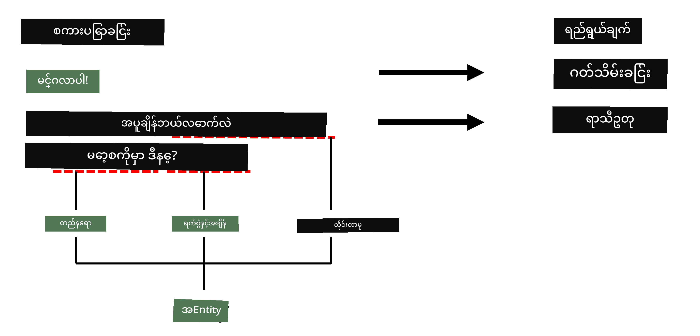
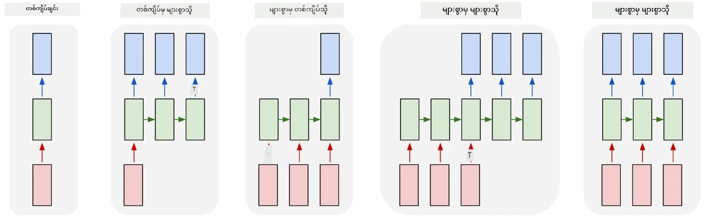

# Named Entity Recognition

အခုအချိန်ထိ ကျွန်တော်တို့အဓိကထားပြီး လေ့လာခဲ့တာက NLP task တစ်ခုဖြစ်တဲ့ - classification ပဲဖြစ်ပါတယ်။ သို့သော် neural networks ကို အသုံးပြု၍ ပြုလုပ်နိုင်သော အခြားသော NLP task များလည်း ရှိပါသည်။ အဲဒီ task များထဲမှ တစ်ခုက **[Named Entity Recognition](https://wikipedia.org/wiki/Named-entity_recognition)** (NER) ဖြစ်ပြီး၊ စာသားထဲမှာ ရှိတဲ့ အထူး entity များကို ရှာဖွေသိရှိရန် အသုံးပြုသည်။ ဥပမာအားဖြင့် နေရာများ၊ လူအမည်များ၊ ရက်စွဲ-အချိန်ကာလများ၊ ဓာတုဖော်မြူလာများ စသည်တို့ဖြစ်ပါသည်။

## [Pre-lecture quiz](https://ff-quizzes.netlify.app/en/ai/quiz/37)

## NER ကို အသုံးပြုခြင်း၏ ဥပမာ

ဥပမာအားဖြင့် Amazon Alexa သို့မဟုတ် Google Assistant ကဲ့သို့သော သဘာဝဘာသာစကား chat bot တစ်ခုကို ဖွံ့ဖြိုးတိုးတက်စေလိုသည်ဟု ဆိုပါစို့။ အတတ်နိုင်ဆုံး chat bot များသည် အသုံးပြုသူ၏လိုအပ်ချက်ကို *နားလည်*ရန် input စာကြောင်းအပေါ် text classification ပြုလုပ်ခြင်းဖြင့် အလုပ်လုပ်သည်။ အဲဒီ classification ရလဒ်ကို **intent** ဟုခေါ်ပြီး၊ chat bot သည် ဘာလုပ်ရမည်ကို သတ်မှတ်ပေးသည်။

> ပုံကိုရေးသားသူမှ

သို့သော် အသုံးပြုသူသည် phrase အတွင်း parameter အချို့ကို ထည့်သွင်းပေးနိုင်ပါသည်။ ဥပမာအားဖြင့် မိုးလေဝသကို မေးမြန်းသောအခါ၊ သူမသည် နေရာ သို့မဟုတ် ရက်စွဲကို သတ်မှတ်နိုင်ပါသည်။ Bot သည် အဲဒီ entity များကို နားလည်နိုင်ရမည်ဖြစ်ပြီး၊ အလုပ်လုပ်မည့်အခါ parameter slot များကို ဖြည့်စွက်ပေးရမည်ဖြစ်သည်။ ဒါဟာ NER ရဲ့ အလုပ်လုပ်ပုံပဲဖြစ်ပါတယ်။

> ✅ အခြားဥပမာတစ်ခုက [သိပ္ပံဆိုင်ရာ ဆေးဘက်ဆိုင်ရာစာတမ်းများကို ခွဲခြမ်းစိတ်ဖြာခြင်း](https://soshnikov.com/science/analyzing-medical-papers-with-azure-and-text-analytics-for-health/) ဖြစ်သည်။ အဓိကအားဖြင့် ရှာဖွေရမည့်အရာများမှာ ရောဂါများနှင့် ဆေးဝါးပစ္စည်းများကဲ့သို့သော အထူးဆေးဘက်ဆိုင်ရာ term များဖြစ်သည်။ ရောဂါအနည်းငယ်ကို substring search ဖြင့် ရှာဖွေနိုင်သော်လည်း၊ ဓာတုပေါင်းများနှင့် ဆေးဝါးအမည်များကဲ့သို့သော ရှုပ်ထွေးသော entity များအတွက် ပိုမိုရှုပ်ထွေးသော နည်းလမ်းတစ်ခုလိုအပ်ပါသည်။

## NER ကို Token Classification အနေနဲ့

NER model များသည် အဓိကအားဖြင့် **token classification model** များဖြစ်သည်၊ အကြောင်းကတော့ input token တစ်ခုစီအတွက် အဲဒီ token သည် entity တစ်ခုဖြစ်မဖြစ်၊ ဖြစ်လျှင် entity class ဘယ်လိုမျိုးဖြစ်မည်ကို ဆုံးဖြတ်ရမည်ဖြစ်သည်။

အောက်ပါစာတမ်းခေါင်းစဉ်ကို စဉ်းစားကြည့်ပါ။

**Tricuspid valve regurgitation** နှင့် **lithium carbonate** **toxicity** in a newborn infant.

ဒီမှာ entity များက:

* Tricuspid valve regurgitation သည် ရောဂါ (`DIS`)
* Lithium carbonate သည် ဓာတုပစ္စည်း (`CHEM`)
* Toxicity သည်လည်း ရောဂါ (`DIS`)

သတိပြုပါ - entity တစ်ခုသည် token အများအပြားကို ဖုံးလွှမ်းနိုင်သည်။ အထူးသဖြင့် ဒီလိုအခြေအနေမှာ consecutive entity နှစ်ခုကို ခွဲခြားနိုင်ဖို့ လိုအပ်ပါသည်။ ထို့ကြောင့် entity တစ်ခုစီအတွက် class နှစ်ခုကို အသုံးပြုရသည် - တစ်ခုက entity ၏ ပထမဆုံး token ကို သတ်မှတ်ရန် (`B-` prefix ကို **b**eginning အနေနဲ့ အသုံးပြုသည်)၊ နောက်တစ်ခုက entity ၏ ဆက်လက် token များကို သတ်မှတ်ရန် (`I-` prefix ကို **i**nner token အနေနဲ့ အသုံးပြုသည်) ဖြစ်သည်။ `O` ကို class အနေနဲ့ **o**ther token များကို ကိုယ်စားပြုရန် အသုံးပြုသည်။ ဒီလို token tagging ကို [BIO tagging](https://en.wikipedia.org/wiki/Inside%E2%80%93outside%E2%80%93beginning_(tagging)) (သို့မဟုတ် IOB) ဟုခေါ်သည်။ Tag လုပ်ပြီးနောက်မှာ title က ဒီလိုပုံစံဖြစ်လာမည်။

Token | Tag
------|-----
Tricuspid | B-DIS
valve | I-DIS
regurgitation | I-DIS
and | O
lithium | B-CHEM
carbonate | I-CHEM
toxicity | B-DIS
in | O
a | O
newborn | O
infant | O
. | O

Token နှင့် class များအကြား တစ်ခုချင်းစီကို တိုက်ရိုက်ဆက်စပ်မှုတစ်ခုတည်ဆောက်ရန် လိုအပ်သဖြင့်၊ ဒီပုံစံမှ **many-to-many** neural network model တစ်ခုကို တည်ဆောက်နိုင်ပါသည်။

> *ပုံကို [ဒီ blog post](http://karpathy.github.io/2015/05/21/rnn-effectiveness/) မှ [Andrej Karpathy](http://karpathy.github.io/) ရေးသားထားသည်။ NER token classification model များသည် ဒီပုံရဲ့ ညာဘက်ဆုံး network architecture ကို ကိုယ်စားပြုသည်။*

## NER model များကို လေ့ကျင့်ခြင်း

NER model သည် အဓိကအားဖြင့် token classification model ဖြစ်သဖြင့်၊ ဒီ task အတွက် ကျွန်တော်တို့ရင်းနှီးပြီးသား RNN များကို အသုံးပြုနိုင်ပါသည်။ ဒီအခါမှာ recurrent network ၏ block တစ်ခုစီသည် token ID ကို ပြန်ပေးမည်ဖြစ်သည်။ အောက်ပါ notebook သည် token classification အတွက် LSTM ကို လေ့ကျင့်ပုံကို ပြသထားသည်။

## ✍️ Example Notebooks: NER

အောက်ပါ notebook တွင် ဆက်လက်လေ့လာပါ:

* [NER with TensorFlow](NER-TF.ipynb)

## နိဂုံး

NER model သည် **token classification model** ဖြစ်ပြီး၊ token classification ပြုလုပ်ရန် အသုံးပြုနိုင်သည်။ ဒါဟာ NLP မှာ အလွန်ရိုးရှင်းတဲ့ task တစ်ခုဖြစ်ပြီး၊ စာသားထဲမှာ နေရာများ၊ အမည်များ၊ ရက်စွဲများ စသည်တို့ကို ရှာဖွေသိရှိရန် အထောက်အကူပြုသည်။

## 🚀 Challenge

အောက်ပါ assignment ကို ပြီးမြောက်စေပြီး၊ medical term များအတွက် named entity recognition model တစ်ခုကို လေ့ကျင့်ပါ၊ ထို့နောက် အခြား dataset တစ်ခုအပေါ် စမ်းသပ်ကြည့်ပါ။

## [Post-lecture quiz](https://ff-quizzes.netlify.app/en/ai/quiz/38)

## Review & Self Study

[The Unreasonable Effectiveness of Recurrent Neural Networks](http://karpathy.github.io/2015/05/21/rnn-effectiveness/) ဆိုသော blog ကို ဖတ်ရှုပြီး၊ အဲဒီ article ရဲ့ Further Reading အပိုင်းကို လိုက်နာဖတ်ရှုပါ၊ သင်၏ အသိပညာကို ပိုမိုနက်ရှိုင်းစေပါ။

## [Assignment](lab/README.md)

ဒီသင်ခန်းစာအတွက် assignment မှာ medical entity recognition model တစ်ခုကို လေ့ကျင့်ရမည်ဖြစ်သည်။ ဒီသင်ခန်းစာမှာ ဖော်ပြထားသည့် LSTM model ကို လေ့ကျင့်ခြင်းဖြင့် စတင်ပြီး၊ BERT transformer model ကို အသုံးပြုရန် ဆက်လက်လုပ်ဆောင်ပါ။ [အညွှန်းများ](lab/README.md) ကို ဖတ်ရှု၍ အသေးစိတ်ကို သိရှိပါ။

---

