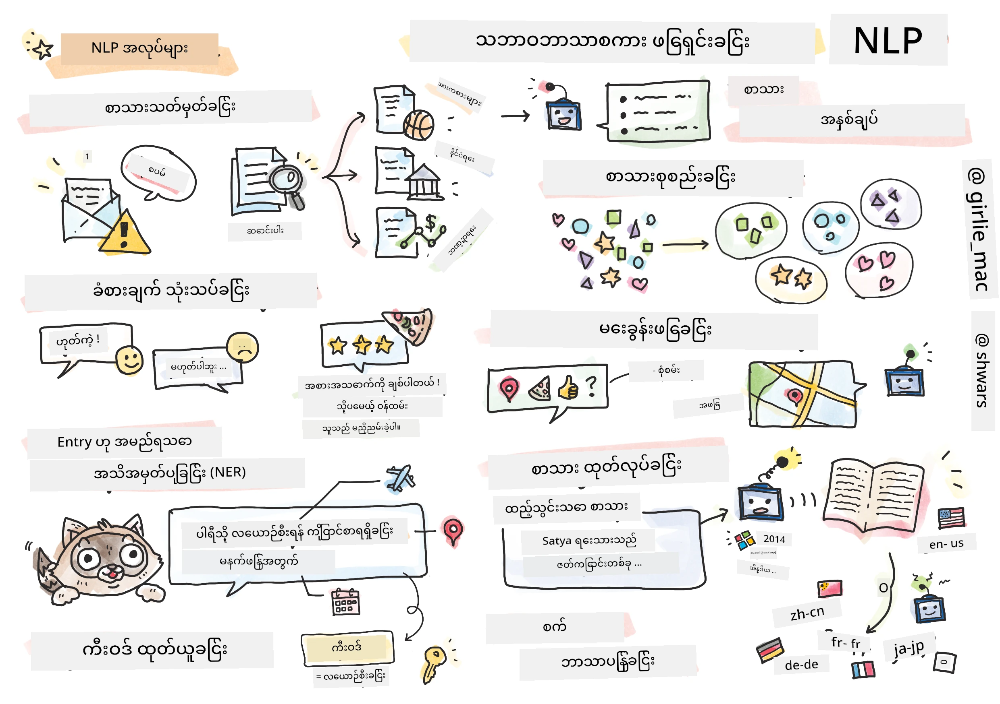

# သဘာဝဘာသာစကား အလုပ်ဆောင်ချက် 



ဒီအပိုင်းမှာ ကျွန်တော်တို့ Neural Networks ကို သဘာဝဘာသာစကား အလုပ်နဲ့ပါတ်သတ်တဲ့လုပ်ငန်းတွေကို ကိုင်တွယ်ဖို့ အထူးပြုစွမ်းဆောင်သွားမှာ ဖြစ်ပါတယ်။ ကွန်ပြူတာတွေကိုဖြေရှင်းနိုင်ဖို့လိုချင်တဲ့ NLP ပြဿနာများက များပြားပါတယ်။

* **စာသားခွဲခြားခြင်း** သည် စာသားလိုက်တာတွေ အပေါ် အထွေထွေခွဲခြားခြင်းပြဿနာ ဖြစ်သည်။ ဥပမာအနေနဲ့ အီးမေးလ်များကို spam နှင့် no-spam အဖြစ်ခွဲခြားခြင်း၊ သို့မဟုတ် ဆောင်းပါးများကို ကစားကွင်း၊ စီးပွားရေး၊ နိုင်ငံရေး စသဖြင့် အမျိုးအစားခွဲခြင်းတို့ ပါဝင်တယ်။ ထို့အပြင်, မေးလ်တုံ့ပြန်သူများ ဖန်တီးရာတွင် အသုံးပြုသူကဘာပြောလိုကြောင်း ဘာယူလိုကြောင်းကို နားမလည်ခဲ့ရင် **ရည်ရွယ်ချက်ခွဲခြားခြင်း** လုပ်ရတယ်။ အများအားဖြင့်, ရည်ရွယ်ချက်ခွဲခြားခြင်းမှာ အမျိုးအစားများစွာကို ကိုင်တွယ်ရတတ်သည်။
* **ခံစားချက်ခွဲခြားခြင်း** သည် အထွေထွေ ရင်းနှီးထက်မြက်မှု ပြဿနာ ဖြစ်သည်၊ ဒီမှာ စာကြောင်းတစ်ကြောင်း၏ အဓိပ္ပါယ်က ဘယ်လောက် အပေါင်/အချိုးမမှန် ဖြစ်သလဲဆိုတာကို နံပါတ်တစ်ခု (ခံစားချက်) ပေးရတယ်။ ခံစားချက်ခွဲခြားနည်း ရှုပ်ထွေးတဲ့ဗားရှင်းတစ်ခုက **အချက်အလက်အခြေခံခံစားချက်ခွဲခြားခြင်း** (ABSA) ဖြစ်ပြီး စာကြောင်းတစ်ရှည်လုံးကိုမဟုတ်ပဲ အပိုင်းအဆင့်အမျိုးမျိုး (အချက်များ) ကို ခံစားချက်ပေးညွှန်းတယ်။ ဥပမာ- *ဒီစားသောက်ဆိုင်မှာ ဟင်းချက်နည်းကဘာသာကောင်းခဲ့ပေမယ့်ပတ်ဝန်းကျင်ကတော့ဆိုးခဲ့တယ်*။
* **အမည်ရှိ အရာဝတ္တု အသိအမှတ်ပြုခြင်း** (NER) ဟာ စာသားထဲက အရာဝတ္တုထူးခြားများကို ဖြုတ်ယူဖော်ထုတ်တဲ့ ပြဿနာ ဖြစ်တယ်။ ဥပမာအားဖြင့် *မနက်ဖြန် ပဲရစ်ကို ပျံသွားလို့ လိုတယ်* ဆိုတဲ့စာကြောင်းထဲမှာ *မနက်ဖြန်* ဟာ အချိန် (DATE) ကိုဆိုလိုတာဖြစ်ပြီး *ပဲရစ်* ဆိုတာ တည်နေရာ (LOCATION) ဖြစ်တယ်။
* **အဓိပ္ပါယ်အဓိပ္ပာယ်ရွိသော စကားလုံး ထုတ်ယူခြင်း** သည် NER နဲ့ ဆင်တူပေမယ့်၊ အထူးအမည်ရှိ အရာဝတ္တုအမျိုးအစားများအတွက် ကြိုတင်လေ့လာခြင်းမရှိဘဲ စာကြောင်း၏ အဓိပ္ပာယ်အတွက် အရေးကြီးသော စကားလုံးများကို အလိုအလျောက် ထုတ်ယူရတယ်။
* **စာသားအုပ်စုခွဲခြင်း** သည် ဆန့်ကျင်သည့်စာကြောင်းများကို အုပ်စုဖွဲ့လိုတဲ့အခါ အသုံးဝင်တတ်၏၊ ဥပမာ တခြားတခြားနည်းပညာဆိုင်ရာ ကူညီမှုဆွေးနွေးပွဲများထဲက တူညီသော တောင်းဆိုချက်များ။
* **မေးခွန်းဖြေဆိုခြင်း** ဆိုသည်မှာ မော်ဒယ်တစ်ခု၏ မေးခွန်းတစ်ခုကို ဖြေဆိုနိုင်စွမ်းကို ဆိုလိုသည်။ မော်ဒယ်သည် စာသားပိုဒ်နှင့် မေးခွန်းကို အင်ပွတ်အနေနှင့် ရရှိသည့်အခါ၊ မေးခွန်း၏ ဖြေကြားချက်ပါတဲ့ စာသားအပိုင်းကို ဖော်ပြပေးရပါမည် (သို့မဟုတ် တခါတရံတွင် ဖြေကြားစာသားကို ထုတ်လုပ်ပေးရတတ်သည်)။
* **စာသားဖန်တီးခြင်း** သည် မော်ဒယ်တစ်ခုက စာသားအသစ်ကို ဖန်တီးနိုင်စွမ်း ဖြစ်သည်။ ဒါကို နောက်အက္ခရာ/စကားလုံးကို ယခင်စာသားအပိုင်းတစ်ခုအပေါ် မူတည်၍ ခန့်မှန်းဆွဲယူသည့် ခွဲခန့်ခြင်းအသုံးအများဖြစ်နိုင်သည်။ GPT-3 ကဲ့သို့ အဆင့်မြင့် စာသားဖန်တီးရေးမော်ဒယ်များသည် [prompt programming](https://towardsdatascience.com/software-3-0-how-prompting-will-change-the-rules-of-the-game-a982fbfe1e0) သို့မဟုတ် [prompt engineering](https://medium.com/swlh/openai-gpt-3-and-prompt-engineering-dcdc2c5fcd29) ဟူသော နည်းဗျူဟာဖြင့် အခြား NLP လုပ်ငန်းများကိုလည်း ဖြေရှင်းနိုင်သည်။
* **စာသားအကျဉ်းချုပ်** ဆိုသည်မှာ ကွန်ပျူတာကို စာတစ်ရှည်စီ “အဖတ်” လုပ်ပြီး အနည္းငယ်သော စာကြောင်းများဖြင့် အကျဉ်းချုပ်ထွက်ရှိစေချင်သော အသုံးအနှုန်းဖြစ်သည်။
* **စက်ဘာသာပြန်ခြင်း** ကို တစ်ဘာသာစကားအတွက် စာသားနားလည်သည့် အလုပ်ကို ပြုလုပ်ပြီး အခြားဘာသာစကားရဲ့ စာသားကို ဖန်တီးခြင်းတို့ ပေါင်းစပ်သည်ဟု ကြည့်နိုင်သည်။

အစပိုင်းမှာ NLP အလုပ်များအချို့ကို ဂရမ်မာများကဲ့သို့ ရိုးရာနည်းလမ်းများဖြင့် ဖြေရှင်းခဲ့ကြသည်။ ဥပမာ၊ စက်ဘာသာပြန်ခြင်းတွင် စာကြောင်းကို စာလုံးပုံစံသစ်သစ်ဖြင့် ပြောင်းရန် ပတ်ဆင်သက်သာမှုများကို လေ့လာဖော်ထုတ်ပြီး စာကြောင်းအဓိပ္ပါယ်အပြည့်အဝ ကိုယ်စားပြုရန် အဆင့်မြင့် တိုင်းတာမှုများ ကို စုဆောင်းသုံးစွဲခဲ့သည်။ ယနေ့မှာတော့ NLP အလုပ်များစွာကို neural networks ဖြင့် ပိုမိုထိရောက်စွာ ဖြေရှင်းကြသည်။

> ကျယ်ပြန့်စွာအသုံးပြုသော ရိုးရာ NLP နည်းလမ်းများကို [Natural Language Processing Toolkit (NLTK)](https://www.nltk.org) Python လိုင်ဘ်ရရီတွင် အကောင်အထည်ဖော်ထားသည်။ NLTK ဖြင့် မည်သည့် NLP လုပ်ငန်းများကို ဖြေရှင်းနိုင်သည်ကို ဖော်ပြသော အွန်လိုင်းတွင် ရနိုင်သော [NLTK စာအုပ်](https://www.nltk.org/book/) တစ်အုပ် ရှိသည်။

ကျွန်တော်တို့ သင်ခန်းစာ၌ အဓိကအားဖြင့် Neural Networks အသုံးပြုပြီး NLP ကိုဆောင်ရွက်တော့မှာ ဖြစ်ပြီး NLTK ကို လိုအပ်သလို သုံးမှာပါ။

ကျွန်တော်တို့ နောက်ဆုံးတွင်တော့ တ(tabular)ဒေတာနဲ့ ပုံရိပ်များအတွက် နယူးရယ်နက်ရွက်အသုံးပြုပြီး အလုပ်လုပ်နည်းများကိုသင်ခဲ့ပြီးသားဖြစ်တယ်။ ဒီထက်ကွာခြားချက်က စာသားမှာ အရွယ်အစား မတူညီသော လိုက်တစ်ခုဖြစ်ပြီး၊ ပုံရိပ်မှာတော့ အရင်ကသိထားတဲ့ input အရွယ်အစားရှိတယ်။ Convolutional network တွေက input data မှတစ်ဆင့် ပုံစံများကို ထုတ်ယူနိုင်ပေမဲ့ စာသားထဲမှာ ပုံစံတွေ ပိုရှုပ်ထွေးတယ်။ ဥပမာ- ငြင်းဆန်မှုအုပ်စုက ဘာသာရပ်ခေါင်းစဉ်ထဲက နေရာကွာခြားမှု ကြီးတဲ့ စကားဝိုင်းတွေဖြစ်နေတာကို ကျွန်တော်တို့တွေ များသောအားဖြင့် တူညီတဲ့ ပုံစံတစ်ခုလို သတ်မှတ်ရတယ် (ဥပမာ- *ကျွန်တော် မုန့်သုတ် oranges မနှစ်သက်ပါ၊* နှင့် *ကျွန်တော် အဲဒီသေးငယ်ရောင်စုံထမင်းသုတ် oranges မနှစ်သက်ပါ*)။ ဒါကြောင့် ဘာသာစကားကို ကိုင်တွယ်ရာမှာ *recurrent networks* နဲ့ *transformers* ကဲ့သို့ နယူးရယ်နက်ရွက်အသစ်များ ထည့်သွင်းရမယ်။

## စာကြည့်တိုက်များ ထည့်သွင်းခြင်း

သင်ခန်းစာကို အိမ်ပြင် Python ထည့်သွင်းထားတဲ့ စနစ်တွင် စတင်သုံးမယ် ဆိုရင် NLP အတွက် လိုအပ်သော စာကြည့်တိုက်များအားလုံးကို အောက်ပါ အမိန့်များဖြင့် ထည့်သွင်းရမှာ ဖြစ်တယ်။

**PyTorch အတွက်**
```bash
pip install -r requirements-pytorch.txt
```
**TensorFlow အတွက်**
```bash
pip install -r requirements-tf.txt
```

> [Microsoft Learn](https://docs.microsoft.com/learn/modules/intro-natural-language-processing-tensorflow/?WT.mc_id=academic-77998-cacaste) တွင် TensorFlow နှင့် အတူ NLP ကို စမ်းသပ်နိုင်ပါသည်။

## GPU အသိပေးချက်

ဒီအပိုင်း၌ အချို့ ဥပမာများတွင် အလွန်ကြီးမားသော မော်ဒယ်များကို လေ့ကျင့်မယ်။
* **GPU ပါရှိသော ကွန်ပျူတာ အသုံးပြုပါ** - ကြီးမားသော မော်ဒယ်များကို အသုံးပြုရာ၌ စောင့်ဆိုင်းမှုအချိန် လျှော့ချရန် GPU ပါရှိသော ကွန်ပျူတာမှာ notebook များ ပုံမှန်ထိန်းသိမ်းသွားခြင်း စနစ်ဖြစ်ပါသည်။
* **GPU မှတ်ဉာဏ် ကန့်သတ်ချက်** - ကြီးမားသော မော်ဒယ်များ လေ့ကျင့်ရာ၌ GPU မှတ်ဉာဏ် ကန့်သတ်မှု ကြုံတွေ့ရနိုင်သည်။
* **GPU မှတ်ဉာဏ် စားသုံးမှု** - လေ့ကျင့်မှုကာလ GPU မှတ်ဉာဏ် အသုံးပြုမှုသည် မတူညီသော အချက်အလက်ပါဝင်မှုများ၊ အထူးသဖြင့် minibatch အရွယ်အစားပေါ် မူတည်သည်။
* **minibatch အရွယ်အစား လျှော့ချရန်** - GPU မှတ်ဉာဏ် ပြဿနာများ ကြုံတွေ့ခဲ့ရင် သင့်ဒေတာ အပိုင်းအရွယ်အစားကို လျှော့ချပြီး သုံးသင့်သည်။
* **TensorFlow GPU မှတ်ဉာဏ် ပြန်လည်လွှတ်ပေးမှု** - TensorFlow ဗားရှင်းဟောင်းများတွင် Python kernel တစ်ခုထဲ အတွင်း မော်ဒယ်များစွာ လေ့ကျင့်လျှင် GPU မှတ်ဉာဏ် မမှန်ကန်စွာ လွှတ်မပေးနိုင်ပါ။ GPU မှတ်ဉာဏ်အသုံးပြုမှု ကို ထိန်းချုပ်ရန် TensorFlow ကို GPU မှတ်ဉာဏ် ယူစရာလိုအပ်ချိန်တွင်သာ ယူမည့် အနေအထား သို့ စီစဉ်နိုင်သည်။
* **ကုတ် ထည့်သွင်းခြင်း** - TensorFlow ကို GPU မှတ်ဉာဏ် မလိုအပ်သေးသောအချိန်တွင်သာ ယူရန် သင့် notebook များတွင် အောက်ပါ ကုတ်ကို ထည့်သွင်း၍ စီမံခန့်ခွဲနိုင်သည်။

```python
physical_devices = tf.config.list_physical_devices('GPU') 
if len(physical_devices)>0:
    tf.config.experimental.set_memory_growth(physical_devices[0], True) 
```

ရိုးရာ စက်သင်ယူမှု အမြင်မှ NLP ကိုလေ့လာလိုပါက [ဤသင်ခန်းစာ စုံတွဲ](https://github.com/microsoft/ML-For-Beginners/tree/main/6-NLP) သို့ သွားရောက်ကြည့်ရှုနိုင်သည်။

## ဒီအပိုင်း၌
ဒီအပိုင်းမှာ ကျွန်တော်တို့ သင်ကြားသွားမယ့် အကြောင်းများမှာ -

* [စာသားကို tensor အဖြစ် ကိုယ်စားပြုခြင်း](13-TextRep/README.md)
* [စကားလုံးထည့်သွင်းခြင်း](14-Embeddings/README.md)
* [ဘာသာစကားပုံစံဖန်တီးခြင်း](15-LanguageModeling/README.md)
* [ကျန်ကြွယ်လာသော နယူးရယ်နက်ရွက်များ](16-RNN/README.md)
* [ဖန်တီးရေးကွန်ယက်များ](17-GenerativeNetworks/README.md)
* [Transformer များ](18-Transformers/README.md)

---

<!-- CO-OP TRANSLATOR DISCLAIMER START -->
**ပြောကြားချက်**
ဤစာတမ်းကို AI ဘာသာပြန်ဝန်ဆောင်မှု [Co-op Translator](https://github.com/Azure/co-op-translator) အသုံးပြု၍ ဘာသာပြန်ထားပါသည်။ ကျွန်ုပ်တို့သည် တိကျမှန်ကန်မှုအတွက် ကြိုးပမ်းနေသော်လည်း၊ စက်ကိရိယာဘာသာပြန်ခြင်းများတွင် အမှားများ သို့မဟုတ် မှားယွင်းချက်များ ပါဝင်နိုင်ကြောင်း သတိပြုပါရန် လိုအပ်ပါသည်။ မူလစာတမ်းကို မူရင်းဘာသာဖြင့်သာ ယုံကြည်စိတ်ချရသော အချက်အလက်အဖြစ် သတ်မှတ်သင့်သည်။ အရေးကြီးသည့် သတင်းအချက်အလက်များအတွက် ပရော်ဖက်ရှင်နယ် လူသားဘာသာပြန်သူဝန်ဆောင်မှုကို အကြံပြုပါသည်။ ဤဘာသာပြန်ချက်ကို အသုံးပြုခြင်းမှ ဖြစ်ပေါ်လာသော နားလည်မှုကွာခြားမှုများ သို့မဟုတ် မမှန်ကန်သော အသုံးပြုမှုများအတွက် ကျွန်ုပ်တို့ တာဝန်မခံပါ။
<!-- CO-OP TRANSLATOR DISCLAIMER END -->