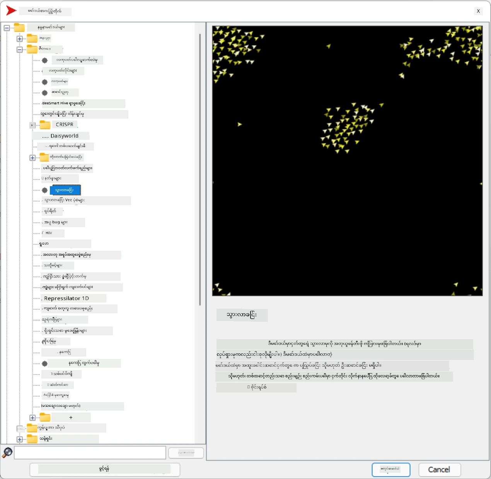
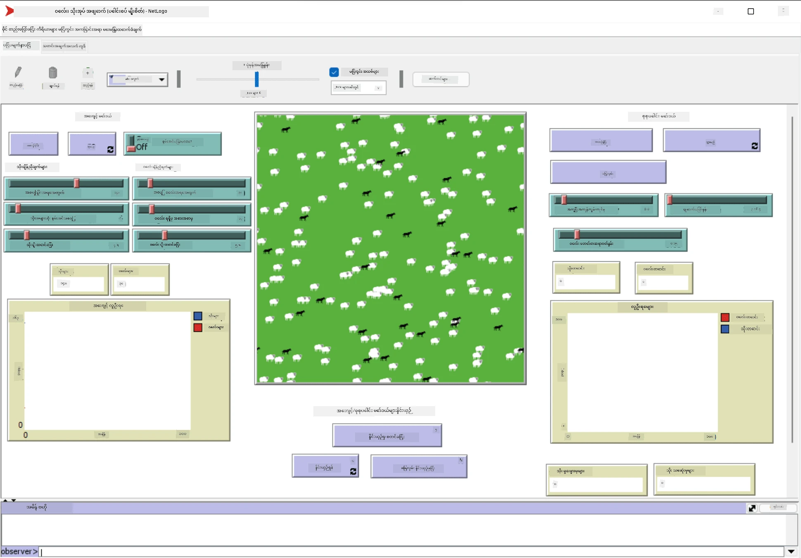

# Multi-Agent Systems

တစ်ခုတည်းသောနည်းလမ်းဖြင့် ဉာဏ်ရည်ရှိမှုကို ရရှိစေခြင်းသည် **ပေါ်ပေါက်မှု** (သို့မဟုတ် **synergetic**) နည်းလမ်းအပေါ် အခြေခံထားသည်။ ၎င်းသည် အလွန်ရိုးရှင်းသော agent များစွာ၏ ပေါင်းစပ်အပြုအမူသည် စနစ်တစ်ခုလုံး၏ ပိုမိုရှုပ်ထွေးသော (သို့မဟုတ် ဉာဏ်ရည်ရှိသော) အပြုအမူကို ဖြစ်ပေါ်စေသည်ဟု ဆိုသည်။ သီအိုရီအရ၊ ၎င်းသည် [Collective Intelligence](https://en.wikipedia.org/wiki/Collective_intelligence), [Emergentism](https://en.wikipedia.org/wiki/Global_brain) နှင့် [Evolutionary Cybernetics](https://en.wikipedia.org/wiki/Global_brain) ၏ မူဝါဒများအပေါ် အခြေခံထားသည်။ ၎င်းတို့က အဆင့်မြင့်စနစ်များသည် အဆင့်နိမ့်စနစ်များမှ သင့်တော်စွာ ပေါင်းစည်းခြင်းဖြင့် တန်ဖိုးတစ်ခုခုကို ထပ်မံရရှိနိုင်သည်ဟု ဆိုသည် (*principle of metasystem transition* ဟုခေါ်သည်)။

## [Pre-lecture quiz](https://ff-quizzes.netlify.app/en/ai/quiz/45)

**Multi-Agent Systems** ၏ လမ်းကြောင်းသည် 1990 ခုနှစ်များတွင် အင်တာနက်နှင့် ဖြန့်ဖြူးထားသော စနစ်များ၏ တိုးတက်မှုအဖြစ် AI တွင် ပေါ်ပေါက်လာခဲ့သည်။ AI စာအုပ်များထဲမှ တစ်ခုဖြစ်သော [Artificial Intelligence: A Modern Approach](https://en.wikipedia.org/wiki/Artificial_Intelligence:_A_Modern_Approach) သည် Multi-agent systems ၏ ရှုထောင့်မှ classical AI ကို အဓိကထား၍ ရေးသားထားသည်။

Multi-agent နည်းလမ်း၏ အဓိကမှာ **Agent** ဆိုသော အယူအဆဖြစ်သည်။ Agent သည် **environment** တစ်ခုတွင် နေထိုင်ပြီး ၎င်းကို သိရှိနိုင်ပြီး လုပ်ဆောင်နိုင်သည်။ ၎င်းသည် အလွန်ကျယ်ပြန့်သော အဓိပ္ပာယ်ဖြစ်ပြီး agent များအမျိုးအစားများစွာ ရှိနိုင်သည်-

* **Reason** လုပ်နိုင်စွမ်းအပေါ် အခြေခံ၍:
   - **Reactive** agents သည် ရိုးရှင်းသော request-response အပြုအမူကိုသာ ရှိသည်။
   - **Deliberative** agents သည် logical reasoning သို့မဟုတ် planning စွမ်းရည်များကို အသုံးပြုသည်။
* Agent code ကို အကောင်အထည်ဖော်ရာနေရာအပေါ် အခြေခံ၍:
   - **Static** agents သည် သီးသန့် network node တွင် လုပ်ဆောင်သည်။
   - **Mobile** agents သည် network node များအကြား code ကို ရွှေ့နိုင်သည်။
* အပြုအမူအပေါ် အခြေခံ၍:
   - **Passive agents** သည် ရည်ရွယ်ချက်မရှိပါ။ ၎င်းတို့သည် အပြင်ပန်းအတုအယောင်များကို တုံ့ပြန်နိုင်သော်လည်း ကိုယ်တိုင် လှုပ်ရှားမှုများကို စတင်မလုပ်ပါ။
   - **Active agents** သည် ရည်ရွယ်ချက်တစ်ခုခုကို လိုက်နာသည်။
   - **Cognitive agents** သည် ရှုပ်ထွေးသော planning နှင့် reasoning ကို ပါဝင်သည်။

Multi-agent systems များကို ယနေ့ခေတ်တွင် အပလီကေးရှင်းများစွာတွင် အသုံးပြုနေသည်-

* ဂိမ်းများတွင် non-player characters များသည် AI တစ်ခုခုကို အသုံးပြုပြီး ဉာဏ်ရည်ရှိသော agent များအဖြစ် သတ်မှတ်နိုင်သည်။
* ဗီဒီယိုထုတ်လုပ်မှုတွင် လူအုပ်များပါဝင်သော ရှုပ်ထွေးသော 3D ရှုခင်းများကို multi-agent simulation အသုံးပြု၍ typically rendering လုပ်သည်။
* စနစ်များကို မော်ဒယ်တူလုပ်ဆောင်ရာတွင် multi-agent နည်းလမ်းကို ရှုပ်ထွေးသော မော်ဒယ်၏ အပြုအမူကို simulation လုပ်ရန် အသုံးပြုသည်။ ဥပမာအားဖြင့် multi-agent နည်းလမ်းကို COVID-19 ရောဂါကူးစက်မှုကို ကမ္ဘာတစ်ဝှမ်းတွင် ခန့်မှန်းရန် အောင်မြင်စွာ အသုံးပြုခဲ့သည်။ ထိုနည်းလမ်းကို မြို့တွင်း traffic ကို မော်ဒယ်တူလုပ်ဆောင်ရန် အသုံးပြုနိုင်ပြီး traffic စည်းကမ်းများပြောင်းလဲမှုအပေါ် ၎င်း၏ တုံ့ပြန်မှုကို ကြည့်နိုင်သည်။
* ရှုပ်ထွေးသော automation စနစ်များတွင် တစ်ခုချင်းစီသော device သည် independent agent အဖြစ် လုပ်ဆောင်နိုင်ပြီး စနစ်တစ်ခုလုံးကို ပိုမိုခိုင်မာစေသည်။

ကျွန်ုပ်တို့သည် multi-agent systems အကြောင်းကို အလွန်နက်ရှိုင်းစွာ မလေ့လာပါ၊ သို့သော် **Multi-Agent Modeling** ၏ ဥပမာတစ်ခုကို စဉ်းစားပါမည်။

## NetLogo

[NetLogo](https://ccl.northwestern.edu/netlogo/) သည် [Logo](https://en.wikipedia.org/wiki/Logo_(programming_language)) programming language ၏ ပြင်ဆင်ထားသော version အပေါ် အခြေခံထားသော multi-agent modeling environment ဖြစ်သည်။ ၎င်းသည် programming concepts များကို ကလေးများကို သင်ကြားရန် ဖန်တီးထားပြီး **turtle** ဟုခေါ်သော agent ကို ထိန်းချုပ်နိုင်သည်။ turtle သည် trace ကို ကျန်ထားပြီး ရွှေ့နိုင်သည်။ ၎င်းသည် agent ၏ အပြုအမူကို နားလည်ရန် ရှုပ်ထွေးသော geometric figures များကို ဖန်တီးရန် visual နည်းလမ်းတစ်ခုဖြစ်သည်။

NetLogo တွင် `create-turtles` command ကို အသုံးပြု၍ turtle များစွာကို ဖန်တီးနိုင်သည်။ ထို့နောက် turtle များအားလုံးကို လုပ်ဆောင်မှုတစ်ခုခုကို လုပ်ဆောင်ရန် command ပေးနိုင်သည် (အောက်ပါဥပမာတွင် - 10 point forward ရွှေ့ရန်):

```
create-turtles 10
ask turtles [
  forward 10
]
```

တစ်ချို့သော turtle များကို `ask` command ဖြင့် အုပ်စုဖွဲ့၍ လုပ်ဆောင်မှုများကို လုပ်ဆောင်နိုင်သည်။ ဥပမာအားဖြင့် တစ်ခုချင်းစီသော point ၏ အနီးအနားရှိ turtle များကို command ပေးနိုင်သည်။ ထို့အပြင် `breed [cats cat]` command ကို အသုံးပြု၍ turtle များကို *breeds* အမျိုးအစားများဖြင့် ဖန်တီးနိုင်သည်။ ဤနေရာတွင် `cat` သည် breed ၏ အမည်ဖြစ်ပြီး singular နှင့် plural စကားလုံးနှစ်ခုစလုံးကို သတ်မှတ်ရန် လိုအပ်သည်။ command များက ပိုမိုရှင်းလင်းစေရန် အမျိုးအစားကွဲပြားမှုကို အသုံးပြုသည်။

> ✅ NetLogo language ကို သင်ယူရန် ကျွန်ုပ်တို့ မသွားပါ။ သို့သော် [Beginner's Interactive NetLogo Dictionary](https://ccl.northwestern.edu/netlogo/bind/) ကို သွားရောက်လေ့လာနိုင်သည်။

NetLogo ကို [download](https://ccl.northwestern.edu/netlogo/download.shtml) လုပ်ပြီး install လုပ်ကာ စမ်းသပ်နိုင်သည်။

### Models Library

NetLogo ၏ အထူးကောင်းမွန်မှုမှာ ၎င်းတွင် စမ်းသပ်နိုင်သော working models များ library ပါဝင်သည်။ **File &rightarrow; Models Library** သို့ သွားပါ၊ ၎င်းတွင် models အမျိုးအစားများစွာ ရွေးချယ်နိုင်သည်။



> Dmitry Soshnikov ၏ models library screenshot

models တစ်ခုကို ဖွင့်နိုင်သည်၊ ဥပမာအားဖြင့် **Biology &rightarrow; Flocking** ကို ဖွင့်ပါ။

### Main Principles

model ကို ဖွင့်ပြီးနောက် NetLogo ၏ အဓိက screen သို့ ရောက်ရှိသည်။ ဤနေရာတွင် finite resources (grass) ရှိသော wolves နှင့် sheep ၏ population ကို ဖော်ပြသော sample model တစ်ခုကို တွေ့နိုင်သည်။



> Dmitry Soshnikov ၏ screenshot

ဤ screen တွင် တွေ့နိုင်သည်-

* **Interface** အပိုင်းတွင်:
  - Agent များနေထိုင်သော main field
  - Buttons, sliders စသည်ဖြင့် controls များ
  - Simulation ၏ parameters များကို ဖော်ပြရန် graphs
* **Code** tab တွင် NetLogo program ကို ရေးသားရန် editor ပါဝင်သည်။

Interface တွင် **Setup** button ပါဝင်ပြီး simulation state ကို initialize လုပ်သည်။ **Go** button သည် execution ကို စတင်သည်။ ၎င်းတို့ကို code တွင် အောက်ပါ handler များဖြင့် ထိန်းချုပ်သည်-

```
to go [
...
]
```

NetLogo ၏ ကမ္ဘာသည် အောက်ပါ objects များဖြင့် ဖွဲ့စည်းထားသည်-

* **Agents** (turtles) သည် field အတွင်း ရွှေ့နိုင်ပြီး တစ်ခုခုလုပ်ဆောင်နိုင်သည်။ `ask turtles [...]` syntax ကို အသုံးပြု၍ agent များအား command ပေးနိုင်သည်။ brackets အတွင်း code ကို *turtle mode* တွင် agent များအားလုံးက လုပ်ဆောင်သည်။
* **Patches** သည် field ၏ square areas ဖြစ်ပြီး agent များနေထိုင်သည်။ patch အပေါ်ရှိ agent များအားလုံးကို ရည်ညွှန်းနိုင်သည်၊ patch color များနှင့် properties များကို ပြောင်းနိုင်သည်။ `ask patches` ကို အသုံးပြု၍ patch များကို တစ်ခုခုလုပ်ဆောင်စေနိုင်သည်။
* **Observer** သည် unique agent ဖြစ်ပြီး ကမ္ဘာကို ထိန်းချုပ်သည်။ Button handler များကို *observer mode* တွင် လုပ်ဆောင်သည်။

> ✅ Multi-agent environment ၏ အလှတရားမှာ turtle mode သို့မဟုတ် patch mode တွင် လုပ်ဆောင်သော code ကို agent များအားလုံးက တစ်ချိန်တည်းတွင် parallel အဖြစ် လုပ်ဆောင်သည်။ ထို့ကြောင့် agent တစ်ခုချင်းစီ၏ အပြုအမူကို programming လုပ်၍ simulation system တစ်ခုလုံး၏ ရှုပ်ထွေးသော အပြုအမူကို ဖန်တီးနိုင်သည်။

### Flocking

Multi-agent အပြုအမူ၏ ဥပမာအနေနှင့် **[Flocking](https://en.wikipedia.org/wiki/Flocking_(behavior))** ကို စဉ်းစားပါ။ Flocking သည် ဂဏန်းပေါင်းများစွာသော ငှက်များ ပျံသန်းပုံနှင့် ဆင်တူသော ရှုပ်ထွေးသော pattern ဖြစ်သည်။ ၎င်းတို့၏ ပျံသန်းပုံကို ကြည့်ရှုသောအခါ ၎င်းတို့သည် collective algorithm တစ်ခုခုကို လိုက်နာသည်ဟု သို့မဟုတ် *collective intelligence* တစ်ခုခုကို ပိုင်ဆိုင်သည်ဟု ထင်ရသည်။ သို့သော် ဤရှုပ်ထွေးသော အပြုအမူသည် agent တစ်ခုချင်းစီ (ဤကိစ္စတွင် *bird*) သည် အနီးအနားရှိ agent များကိုသာ ကြည့်ရှုပြီး အောက်ပါ ရိုးရှင်းသော စည်းမျဉ်း ၃ ခုကို လိုက်နာသောအခါ ဖြစ်ပေါ်သည်-

* **Alignment** - အနီးအနားရှိ agent များ၏ heading ပျမ်းမျှကို လိုက်နာသည်။
* **Cohesion** - အနီးအနားရှိ agent များ၏ position ပျမ်းမျှကို လိုက်နာသည် (*long range attraction*)
* **Separation** - အခြား agent များနှင့် အလွန်နီးကပ်လာသောအခါ ရှောင်ရှားရန် ကြိုးစားသည် (*short range repulsion*)

Flocking ဥပမာကို run လုပ်ပြီး အပြုအမူကို ကြည့်ရှုနိုင်သည်။ *degree of separation* သို့မဟုတ် *viewing range* ကဲ့သို့သော parameters များကို ပြောင်းလဲနိုင်သည်။ Viewing range ကို 0 သို့ လျှော့ချပါက ငှက်များအားလုံးက မျက်ကန်းဖြစ်ပြီး flocking ရပ်တန့်သည်။ Separation ကို 0 သို့ လျှော့ချပါက ငှက်များအားလုံးက တန်းတစ်ခုအဖြစ် စုပုံသည်။

> ✅ **Code** tab သို့ ပြောင်းပြီး flocking ၏ စည်းမျဉ်း ၃ ခု (alignment, cohesion နှင့် separation) ကို code တွင် ဘယ်နေရာတွင် အကောင်အထည်ဖော်ထားသည်ကို ကြည့်ပါ။ *sight* အတွင်းရှိ agent များကိုသာ ရည်ညွှန်းပုံကို သတိပြုပါ။

### Other Models to see

စမ်းသပ်နိုင်သော model များအနက် အခြား model များကို ကြည့်ရှုနိုင်သည်-

* **Art &rightarrow; Fireworks** သည် individual fire streams များ၏ collective behavior ကို ဖော်ပြသည်။
* **Social Science &rightarrow; Traffic Basic** နှင့် **Social Science &rightarrow; Traffic Grid** သည် traffic lights ရှိ/မရှိ 1D နှင့် 2D Grid တွင် မြို့ traffic မော်ဒယ်ကို ဖော်ပြသည်။ Simulation တွင် တစ်စီးချင်းစီသော ကားသည် အောက်ပါ စည်းမျဉ်းများကို လိုက်နာသည်-
   - ရှေ့တွင် အခွင့်အာနရှိပါက အရှိန်မြှင့် (အမြင့်ဆုံးအရှိန်အထိ)
   - ရှေ့တွင် အတားအဆီးကို တွေ့ပါက အရှိန်လျှော့ (driver ၏ မြင်နိုင်မှုကို ပြောင်းလဲနိုင်သည်)
* **Social Science &rightarrow; Party** သည် cocktail party အတွင်း လူများအုပ်စုဖွဲ့ပုံကို ဖော်ပြသည်။ အုပ်စု၏ အမြန်ဆုံး happiness တိုးတက်မှုကို ရရှိစေသော parameters များကို ရှာဖွေနိုင်သည်။

ဤဥပမာများမှ တွေ့ရသည့်အတိုင်း multi-agent simulations များသည် logic တူ/ဆင်တူသော individual များပါဝင်သော ရှုပ်ထွေးသော စနစ်၏ အပြုအမူကို နားလည်ရန် အလွန်အသုံးဝင်သည်။ ၎င်းကို computer games တွင် [NPCs](https://en.wikipedia.org/wiki/NPC) သို့မဟုတ် 3D animated worlds တွင် agent များကို ထိန်းချုပ်ရန် အသုံးပြုနိုင်သည်။

## Deliberative Agents

အထက်ဖော်ပြထားသော agent များသည် environment ၏ ပြောင်းလဲမှုများကို algorithm တစ်ခုခုဖြင့် တုံ့ပြန်သော **reactive agents** ဖြစ်သည်။ သို့သော် agent များသည် sometimes reasoning နှင့် planning လုပ်နိုင်ပြီး **deliberative** ဟုခေါ်သည်။

ဥပမာအားဖြင့် human မှ vacation tour ကို book လုပ်ရန် instruction ရရှိသော personal agent ကို စဉ်းစားပါ။ အင်တာနက်တွင် agent များစွာရှိပြီး ၎င်းကို ကူညီနိုင်သည်။ ၎င်းသည် flight များရရှိနိုင်မှုကို စစ်ဆေးရန်၊ hotel price များကို ရက်စွဲအလိုက် ကြည့်ရန်၊ အကောင်းဆုံးစျေးနှုန်းကို ညှိနှိုင်းရန် အခြား agent များကို ဆက်သွယ်ရမည်။ Vacation plan ကို owner မှ အတည်ပြုပြီးနောက် booking လုပ်နိုင်သည်။

ဤလုပ်ဆောင်မှုအတွက် agent များသည် **communicate** လုပ်ရန် လိုအပ်သည်။ အောင်မြင်သော communication အတွက် ၎င်းတို့သည်-

* [Knowledge Interchange Format](https://en.wikipedia.org/wiki/Knowledge_Interchange_Format) (KIF) နှင့် [Knowledge Query and Manipulation Language](https://en.wikipedia.org/wiki/Knowledge_Query_and_Manipulation_Language) (KQML) ကဲ့သို့သော **knowledge ကို ဖလှယ်ရန် standard languages** တစ်ခုခုလိုအပ်သည်။ ၎င်းတို့ကို [Speech Act theory](https://en.wikipedia.org/wiki/Speech_act) အပေါ် အခြေခံ၍ ဖန်တီးထားသည်။
* **Negotiations protocols** များနှင့် **auction types** များအပေါ် အခြေခံ၍ protocols ပါဝင်ရမည်။
* **Common ontology** တစ်ခုလိုအပ်သည်၊ ထို့ကြောင့် semantics ကို သိရှိပြီး concept များကို ရည်ညွှန်းနိုင်သည်။
* **Discover** လုပ်နိုင်ရန် နည်းလမ်းတစ်ခုလိုအပ်သည်၊ ၎င်းကို ontology အပေါ် အခြေခံထားသည်။

Deliberative agents မ

---

