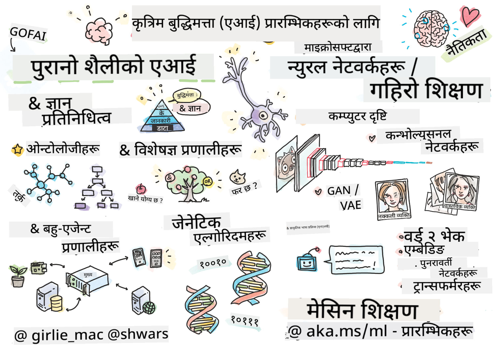

<!--
CO_OP_TRANSLATOR_METADATA:
{
  "original_hash": "14816e97d79b296c87811724f7785923",
  "translation_date": "2026-01-01T11:05:11+00:00",
  "source_file": "README.md",
  "language_code": "ne"
}
-->

# शुरुआतीहरूको लागि कृत्रिम बुद्धिमत्ता - एक पाठ्यक्रम

||
|:---:|
| शुरुआतीहरूको लागि AI - _स्केच नोट द्वारा [@girlie_mac](https://twitter.com/girlie_mac)_ |

हाम्रो 12-साता, 24-पाठ्यक्रमको पाठ्यक्रमसँग **कृत्रिम बुद्धिमत्ता** (AI) को संसार अन्वेषण गर्नुहोस्! यसमा व्यावहारिक पाठहरू, क्विजहरू, र प्रयोगशालाहरू समावेश छन्। यो पाठ्यक्रम शूरुआतीहरूको लागि अनुकूल छ र यसले TensorFlow र PyTorch जस्ता उपकरणहरू र AI मा नीति सम्बन्धी विषयहरूलाई समेट्छ।

### 🌐 बहु-भाषा समर्थन

#### GitHub Action मार्फत समर्थन गरिएको (स्वचालित र सधैं अद्यावधिक)

<!-- CO-OP TRANSLATOR LANGUAGES TABLE START -->
[अरबी](../ar/README.md) | [बंगाली](../bn/README.md) | [बुल्गेरियाली](../bg/README.md) | [बर्मी (म्यान्मार)](../my/README.md) | [चिनियाँ (सरलीकृत)](../zh/README.md) | [चिनियाँ (परम्परागत, हङकङ)](../hk/README.md) | [चिनियाँ (परम्परागत, मकाउ)](../mo/README.md) | [चिनियाँ (परम्परागत, ताइवान)](../tw/README.md) | [क्रोएशियाली](../hr/README.md) | [चेक](../cs/README.md) | [डेनिश](../da/README.md) | [डच](../nl/README.md) | [एस्टोनियन](../et/README.md) | [फिनिश](../fi/README.md) | [फ्रान्सेली](../fr/README.md) | [जर्मन](../de/README.md) | [ग्रीक](../el/README.md) | [हिब्रू](../he/README.md) | [हिन्दी](../hi/README.md) | [हंगेरीयन](../hu/README.md) | [इन्डोनेशियाली](../id/README.md) | [इटालियन](../it/README.md) | [जापानी](../ja/README.md) | [कन्नड़](../kn/README.md) | [कोरियाली](../ko/README.md) | [लिथुआनियाली](../lt/README.md) | [मलय](../ms/README.md) | [मलयालम](../ml/README.md) | [मराठी](../mr/README.md) | [नेपाली](./README.md) | [नाइजेरियन पिजिन](../pcm/README.md) | [नर्वेजियन](../no/README.md) | [फारसी (फार्सी)](../fa/README.md) | [पोलिश](../pl/README.md) | [पोर्चुगाली (ब्राजिल)](../br/README.md) | [पोर्चुगाली (पोर्चुगल)](../pt/README.md) | [पञ्जाबी (गुरमुखी)](../pa/README.md) | [रोमानियन](../ro/README.md) | [रूसी](../ru/README.md) | [सर्बियाली (सिरिलिक)](../sr/README.md) | [स्लोवाक](../sk/README.md) | [स्लोभेनियाली](../sl/README.md) | [स्पेनी](../es/README.md) | [स्वाहिली](../sw/README.md) | [स्वीडिश](../sv/README.md) | [तागालोग (फिलिपिनो)](../tl/README.md) | [तमिल](../ta/README.md) | [तेलुगु](../te/README.md) | [थाई](../th/README.md) | [तुर्की](../tr/README.md) | [युक्रेनी](../uk/README.md) | [उर्दू](../ur/README.md) | [भियतनामी](../vi/README.md)
<!-- CO-OP TRANSLATOR LANGUAGES TABLE END -->

**यदि तपाईं थप अनुवादहरू चाहनुहुन्छ भने समर्थित भाषाहरू [यहाँ](https://github.com/Azure/co-op-translator/blob/main/getting_started/supported-languages.md) सूचीबद्ध छन्**

## समुदायमा सहभागी हुनुहोस्

## तपाईंले के सिक्नुहुनेछ

**[पाठ्यक्रमको माइन्डम्याप](http://soshnikov.com/courses/ai-for-beginners/mindmap.html)**

यस पाठ्यक्रममा, तपाईंले निम्न कुरा सिक्नुहुनेछ:

* कृत्रिम बुद्धिमत्ताका विभिन्न दृष्टिकोणहरू, जसमा "पुरानो" प्रतीकात्मक दृष्टिकोण सहित **ज्ञान प्रतिनिधित्व** र तर्क (reasoning) ([GOFAI](https://en.wikipedia.org/wiki/Symbolic_artificial_intelligence)) समावेश छन्।
* **न्युरल नेटवर्कहरू** र **डीप लर्निङ**, जुन आधुनिक AI को मूलमा छन्। हामी यी महत्वपूर्ण विषयहरूको पछाडि रहेका अवधारणाहरूलाई कोड प्रयोग गरेर दुई लोकप्रिय फ्रेमवर्कहरू - [TensorFlow](http://Tensorflow.org) र [PyTorch](http://pytorch.org) मा प्रदर्शन गर्नेछौं।
* तस्वीर र टेक्स्टसँग काम गर्नका लागि **न्युरल आर्किटेक्चरहरू**। हामी हालका मोडेलहरू समेट्नेछौं तर राज्य-उपलब्धताको हिसाबमा केही कमी हुन सक्छ।
* कम लोकप्रिय AI दृष्टिकोणहरू, जस्तै **जिनेटिक एल्गोरिदमहरू** र **बहु-एजेन्ट प्रणालीहरू**।

यस पाठ्यक्रममा हामीले समावेश नगर्ने विषयहरू:

> [यस कोर्सका लागि सबै अतिरिक्त स्रोतहरू हाम्रो Microsoft Learn संग्रहमा फेला पार्नुहोस्](https://learn.microsoft.com/en-us/collections/7w28iy2xrqzdj0?WT.mc_id=academic-77998-bethanycheum)

* व्यावसायिक प्रयोगका केसहरू जहाँ **व्यवसायमा AI** प्रयोग गरिन्छ। यसका लागि Microsoft Learn मा रहेको [व्यवसाय प्रयोगकर्ताका लागि AI परिचय](https://docs.microsoft.com/learn/paths/introduction-ai-for-business-users/?WT.mc_id=academic-77998-bethanycheum) सिकाइ मार्ग लिन विचार गर्नुहोस्, वा [AI Business School](https://www.microsoft.com/ai/ai-business-school/?WT.mc_id=academic-77998-bethanycheum), जुन [INSEAD](https://www.insead.edu/) सँग सहकार्यमा विकास गरिएको हो।
* **क्लासिक मेशिन लर्निङ**, जुन हाम्रो [Machine Learning for Beginners Curriculum](http://github.com/Microsoft/ML-for-Beginners) मा राम्रोसँग वर्णन गरिएको छ।
* **Cognitive Services** प्रयोग गरी बनेका व्यावहारिक AI अनुप्रयोगहरू। यसका लागि, हामी सिफारिश गर्छौं कि तपाईं Microsoft Learn का [vision](https://docs.microsoft.com/learn/paths/create-computer-vision-solutions-azure-cognitive-services/?WT.mc_id=academic-77998-bethanycheum), [natural language processing](https://docs.microsoft.com/learn/paths/explore-natural-language-processing/?WT.mc_id=academic-77998-bethanycheum), **[Generative AI with Azure OpenAI Service](https://learn.microsoft.com/en-us/training/paths/develop-ai-solutions-azure-openai/?WT.mc_id=academic-77998-bethanycheum)** र अन्य मोड्युलहरूसँग सुरू गर्नुहोस्।
* विशिष्ट ML **क्लाउड फ्रेमवर्कहरू**, जस्तै [Azure Machine Learning](https://azure.microsoft.com/services/machine-learning/?WT.mc_id=academic-77998-bethanycheum), [Microsoft Fabric](https://learn.microsoft.com/en-us/training/paths/get-started-fabric/?WT.mc_id=academic-77998-bethanycheum), वा [Azure Databricks](https://docs.microsoft.com/learn/paths/data-engineer-azure-databricks?WT.mc_id=academic-77998-bethanycheum)। [Build and operate machine learning solutions with Azure Machine Learning](https://docs.microsoft.com/learn/paths/build-ai-solutions-with-azure-ml-service/?WT.mc_id=academic-77998-bethanycheum) र [Build and Operate Machine Learning Solutions with Azure Databricks](https://docs.microsoft.com/learn/paths/build-operate-machine-learning-solutions-azure-databricks/?WT.mc_id=academic-77998-bethanycheum) सिकाइ मार्गहरू प्रयोग गर्ने सोच गर्नुहोस्।
* **संवादी AI** र **च्याट बोटहरू**। यसका लागि अलग [Create conversational AI solutions](https://docs.microsoft.com/learn/paths/create-conversational-ai-solutions/?WT.mc_id=academic-77998-bethanycheum) सिकाइ मार्ग छ, र थप विवरणका लागि तपाईं [यो ब्लगपोस्ट](https://soshnikov.com/azure/hello-bot-conversational-ai-on-microsoft-platform/) लाई पनि हेर्न सक्नुहुन्छ।
* डीप लर्निङको पछाडि रहेको **गहिरो गणित**। यसको लागि, हामी सिफारिश गर्छौं Ian Goodfellow, Yoshua Bengio र Aaron Courville द्वारा लेखिएको [Deep Learning](https://www.amazon.com/Deep-Learning-Adaptive-Computation-Machine/dp/0262035618) पुस्तक, जुन अनलाइनमा पनि उपलब्ध छ [https://www.deeplearningbook.org/](https://www.deeplearningbook.org/) मा।

_एआई इन द क्लाउड_ विषयहरूको सहज परिचयका लागि तपाईं [Get started with artificial intelligence on Azure](https://docs.microsoft.com/learn/paths/get-started-with-artificial-intelligence-on-azure/?WT.mc_id=academic-77998-bethanycheum) Learning Path लिन विचार गर्न सक्नुहुन्छ।

# सामग्री

|     |                                                                 पाठ लिङ्क                                                                  |                                           PyTorch/Keras/TensorFlow                                          | लैब                                                            |
| :-: | :------------------------------------------------------------------------------------------------------------------------------------------: | :---------------------------------------------------------------------------------------------: | ------------------------------------------------------------------------------ |
| 0  |                                 [कोर्स सेटअप](./lessons/0-course-setup/setup.md)                                 |                      [आफ्नो विकास वातावरण सेटअप गर्नुहोस्](./lessons/0-course-setup/how-to-run.md)                       |   |
| I  |               [**कृत्रिम बुद्धिमत्ताको परिचय**](./lessons/1-Intro/README.md)      | | |
| 01  |       [AI को परिचय र इतिहास](./lessons/1-Intro/README.md)       |           -                            | -  |
| II |              **प्रतीकात्मक AI**              |
| 02  |       [ज्ञान प्रतिनिधित्व र विशेषज्ञ प्रणालीहरू](./lessons/2-Symbolic/README.md)       |            [विशेषज्ञ प्रणालीहरू](./lessons/2-Symbolic/Animals.ipynb) /  [Ontology](./lessons/2-Symbolic/FamilyOntology.ipynb) /[अवधारणा ग्राफ](./lessons/2-Symbolic/MSConceptGraph.ipynb)                             |  |
| III |                        [**न्युरल नेटवर्क्सको परिचय**](./lessons/3-NeuralNetworks/README.md) |||
| 03  |                [परसेप्ट्रोन](./lessons/3-NeuralNetworks/03-Perceptron/README.md)                 |                       [नोटबुक](./lessons/3-NeuralNetworks/03-Perceptron/Perceptron.ipynb)                      | [लैब](./lessons/3-NeuralNetworks/03-Perceptron/lab/README.md) |
| 04  |                   [बहु-परत परसेप्ट्रोन र आफ्नै फ्रेमवर्क बनाउने](./lessons/3-NeuralNetworks/04-OwnFramework/README.md)                   |        [नोटबुक](./lessons/3-NeuralNetworks/04-OwnFramework/OwnFramework.ipynb)        | [लैब](./lessons/3-NeuralNetworks/04-OwnFramework/lab/README.md) |
| 05  |            [फ्रेमवर्कहरूमा परिचय (PyTorch/TensorFlow) र ओभरफिटिङ](./lessons/3-NeuralNetworks/05-Frameworks/README.md)             |           [PyTorch](./lessons/3-NeuralNetworks/05-Frameworks/IntroPyTorch.ipynb) / [Keras](./lessons/3-NeuralNetworks/05-Frameworks/IntroKeras.ipynb) / [TensorFlow](./lessons/3-NeuralNetworks/05-Frameworks/IntroKerasTF.ipynb)             | [लैब](./lessons/3-NeuralNetworks/05-Frameworks/lab/README.md) |
| IV  |            [**कम्प्युटर भिजन**](./lessons/4-ComputerVision/README.md)             | [PyTorch](https://docs.microsoft.com/learn/modules/intro-computer-vision-pytorch/?WT.mc_id=academic-77998-cacaste) / [TensorFlow](https://docs.microsoft.com/learn/modules/intro-computer-vision-TensorFlow/?WT.mc_id=academic-77998-cacaste)| [Microsoft Azure मा कम्प्युटर भिजन अन्वेषण गर्नुहोस्](https://learn.microsoft.com/en-us/collections/7w28iy2xrqzdj0?WT.mc_id=academic-77998-bethanycheum) |
| 06  |            [कम्प्युटर भिजनमा परिचय। OpenCV](./lessons/4-ComputerVision/06-IntroCV/README.md)             |           [नोटबुक](./lessons/4-ComputerVision/06-IntroCV/OpenCV.ipynb)         | [लैब](./lessons/4-ComputerVision/06-IntroCV/lab/README.md) |
| 07  |            [कन्भोल्युसनल न्युरल नेटवर्कहरू](./lessons/4-ComputerVision/07-ConvNets/README.md) &  [CNN वास्तुकला](./lessons/4-ComputerVision/07-ConvNets/CNN_Architectures.md)             |           [PyTorch](./lessons/4-ComputerVision/07-ConvNets/ConvNetsPyTorch.ipynb) /[TensorFlow](./lessons/4-ComputerVision/07-ConvNets/ConvNetsTF.ipynb)             | [लैब](./lessons/4-ComputerVision/07-ConvNets/lab/README.md) |
| 08  |            [पूर्व-प्रशिक्षित नेटवर्कहरू र ट्रान्सफर लर्निङ](./lessons/4-ComputerVision/08-TransferLearning/README.md) and [प्रशिक्षण युक्तिहरू](./lessons/4-ComputerVision/08-TransferLearning/TrainingTricks.md)             |           [PyTorch](./lessons/4-ComputerVision/08-TransferLearning/TransferLearningPyTorch.ipynb) / [TensorFlow](./lessons/3-NeuralNetworks/05-Frameworks/IntroKerasTF.ipynb)             | [लैब](./lessons/4-ComputerVision/08-TransferLearning/lab/README.md) |
| 09  |            [आटोएनकोडरहरू र VAEs](./lessons/4-ComputerVision/09-Autoencoders/README.md)             |           [PyTorch](./lessons/4-ComputerVision/09-Autoencoders/AutoEncodersPyTorch.ipynb) / [TensorFlow](./lessons/4-ComputerVision/09-Autoencoders/AutoencodersTF.ipynb)             |  |
| 10  |            [जेनेरेटिभ एड्भर्सेरियल नेटवर्कहरू र कलात्मक शैली ट्रान्सफर](./lessons/4-ComputerVision/10-GANs/README.md)             |           [PyTorch](./lessons/4-ComputerVision/10-GANs/GANPyTorch.ipynb) / [TensorFlow](./lessons/4-ComputerVision/10-GANs/GANTF.ipynb)             |  |
| 11  |            [वस्तु पत्ता लगाउने](./lessons/4-ComputerVision/11-ObjectDetection/README.md)             |         [TensorFlow](./lessons/4-ComputerVision/11-ObjectDetection/ObjectDetection.ipynb)             | [लैब](./lessons/4-ComputerVision/11-ObjectDetection/lab/README.md) |
| 12  |            [सेम्यान्टिक सेगमेन्टेशन। U-Net](./lessons/4-ComputerVision/12-Segmentation/README.md)             |           [PyTorch](./lessons/4-ComputerVision/12-Segmentation/SemanticSegmentationPytorch.ipynb) / [TensorFlow](./lessons/4-ComputerVision/12-Segmentation/SemanticSegmentationTF.ipynb)             |  |
| V  |            [**प्राकृतिक भाषा प्रशोधन**](./lessons/5-NLP/README.md)             | [PyTorch](https://docs.microsoft.com/learn/modules/intro-natural-language-processing-pytorch/?WT.mc_id=academic-77998-cacaste) /[TensorFlow](https://docs.microsoft.com/learn/modules/intro-natural-language-processing-TensorFlow/?WT.mc_id=academic-77998-cacaste) | [Microsoft Azure मा प्राकृतिक भाषा प्रशोधन अन्वेषण गर्नुहोस्](https://learn.microsoft.com/en-us/collections/7w28iy2xrqzdj0?WT.mc_id=academic-77998-bethanycheum)|
| 13  |            [पाठ प्रतिनिधित्व। BoW/TF-IDF](./lessons/5-NLP/13-TextRep/README.md)             |           [PyTorch](https://github.com/microsoft/AI-For-Beginners/blob/main/lessons/5-NLP/13-TextRep/TextRepresentationPyTorch.ipynb) / [TensorFlow](https://github.com/microsoft/AI-For-Beginners/blob/main/lessons/5-NLP/13-TextRep/TextRepresentationTF.ipynb)             | |
| 14  |            [सामान्तिक शब्द एम्बेडिङहरू। Word2Vec र GloVe](./lessons/5-NLP/14-Embeddings/README.md)             |           [PyTorch](https://github.com/microsoft/AI-For-Beginners/blob/main/lessons/5-NLP/14-Embeddings/EmbeddingsPyTorch.ipynb) / [TensorFlow](https://github.com/microsoft/AI-For-Beginners/blob/main/lessons/5-NLP/14-Embeddings/EmbeddingsTF.ipynb)             |  |
| 15  |            [भाषा मोडेलिङ। आफ्नै एम्बेडिङहरू प्रशिक्षण](./lessons/5-NLP/15-LanguageModeling/README.md)             |           [PyTorch](https://github.com/microsoft/AI-For-Beginners/blob/main/lessons/5-NLP/15-LanguageModeling/CBoW-PyTorch.ipynb) / [TensorFlow](https://github.com/microsoft/AI-For-Beginners/blob/main/lessons/5-NLP/15-LanguageModeling/CBoW-TF.ipynb)             | [लैब](./lessons/5-NLP/15-LanguageModeling/lab/README.md) |
| 16  |            [पुनरावर्ती न्युरल नेटवर्कहरू](./lessons/5-NLP/16-RNN/README.md)             |           [PyTorch](https://github.com/microsoft/AI-For-Beginners/blob/main/lessons/5-NLP/16-RNN/RNNPyTorch.ipynb) / [TensorFlow](https://github.com/microsoft/AI-For-Beginners/blob/main/lessons/5-NLP/16-RNN/RNNTF.ipynb)             |  |
| 17  |            [जेनेरेटिभ पुनरावर्ती नेटवर्कहरू](./lessons/5-NLP/17-GenerativeNetworks/README.md)             |           [PyTorch](https://github.com/microsoft/AI-For-Beginners/blob/main/lessons/5-NLP/17-GenerativeNetworks/GenerativePyTorch.ipynb) / [TensorFlow](https://github.com/microsoft/AI-For-Beginners/blob/main/lessons/5-NLP/17-GenerativeNetworks/GenerativeTF.ipynb)             | [लैब](./lessons/5-NLP/17-GenerativeNetworks/lab/README.md) |
| 18  |            [ट्रान्सफर्मर्स। BERT.](./lessons/5-NLP/18-Transformers/README.md)             |           [PyTorch](https://github.com/microsoft/AI-For-Beginners/blob/main/lessons/5-NLP/18-Transformers/TransformersPyTorch.ipynb) /[TensorFlow](https://github.com/microsoft/AI-For-Beginners/blob/main/lessons/5-NLP/18-Transformers/TransformersTF.ipynb)             |  |
| 19  |            [नामित एंटिटी मान्यता](./lessons/5-NLP/19-NER/README.md)             |           [TensorFlow](https://microsoft.github.io/AI-For-Beginners/lessons/5-NLP/19-NER/NER-TF.ipynb)             | [लैब](./lessons/5-NLP/19-NER/lab/README.md) |
| 20  |            [वृहद् भाषा मोडेलहरू, प्रम्प्ट प्रोग्रामिङ र फ्यु-शट कार्यहरू](./lessons/5-NLP/20-LangModels/README.md)             |           [PyTorch](https://microsoft.github.io/AI-For-Beginners/lessons/5-NLP/20-LangModels/GPT-PyTorch.ipynb) | |
| VI |            **अन्य एआई प्रविधिहरू** || |
| 21  |            [आनुवंशिक एल्गोरिदमहरू](./lessons/6-Other/21-GeneticAlgorithms/README.md)             |           [नोटबुक](./lessons/6-Other/21-GeneticAlgorithms/Genetic.ipynb) | |
| 22  |            [गहिरो सुदृढीकरण शिक्षण](./lessons/6-Other/22-DeepRL/README.md)             |           [PyTorch](./lessons/6-Other/22-DeepRL/CartPole-RL-PyTorch.ipynb) /[TensorFlow](./lessons/6-Other/22-DeepRL/CartPole-RL-TF.ipynb)             | [लैब](./lessons/6-Other/22-DeepRL/lab/README.md) |
| 23  |            [बहु-एजेन्ट प्रणालीहरू](./lessons/6-Other/23-MultiagentSystems/README.md)             |  | |
| VII |            **एआई नैतिकता** | | |
| 24  |            [एआई नैतिकता र जिम्मेवार एआई](./lessons/7-Ethics/README.md)             |           [Microsoft Learn: जिम्मेवार एआई सिद्धान्तहरू](https://docs.microsoft.com/learn/paths/responsible-ai-business-principles/?WT.mc_id=academic-77998-cacaste) | |
| IX  |            **अतिरिक्त** | | |
| 25  |            [मल्टि-मोडल नेटवर्कहरू, CLIP र VQGAN](./lessons/X-Extras/X1-MultiModal/README.md)             |           [नोटबुक](./lessons/X-Extras/X1-MultiModal/Clip.ipynb)    | |

## Each lesson contains

* पूर्व-पठन सामग्री
* कार्यशील Jupyter नोटबुकहरू, जुन प्रायः फ्रेमवर्क-विशिष्ट हुन्छन् (**PyTorch** or **TensorFlow**). कार्यान्वयन योग्य नोटबुकमा धेरै सैद्धान्तिक सामग्री पनि हुन्छ, त्यसैले विषयलाई बुझ्नका लागि तपाईंले कम्तीमा एउटा संस्करण नोटबुक हेर्नु आवश्यक छ (PyTorch वा TensorFlow).
* **लैब** केही विषयहरूको लागि उपलब्ध छन्, जसले तपाईंलाई सिकेको सामग्रीलाई विशिष्ट समस्यामा लागू गरेर प्रयास गर्ने अवसर दिन्छ।
* केही भागहरूमा सम्बन्धित विषयहरू समेट्ने [**MS Learn**](https://learn.microsoft.com/en-us/collections/7w28iy2xrqzdj0?WT.mc_id=academic-77998-bethanycheum) मोडुलहरूको लिङ्कहरू समावेश छन्।

## Getting Started

### 🎯 एआईमा नयाँ? यहाँबाट सुरु गर्नुहोस्!

If you're completely new to AI and want quick, hands-on examples, check out our [**शुरुवातीमैत्री उदाहरणहरू**](./examples/README.md)! These include:

- 🌟 **Hello AI World** - Your first AI program (pattern recognition)
- 🧠 **Simple Neural Network** - शून्यबाट एउटा न्युरल नेटवर्क बनाउनुहोस्  
- 🖼️ **Image Classifier** - विस्तृत टिप्पणीहरूसहित तस्वीरहरू वर्गीकरण गर्नुहोस्
- 💬 **पाठ भावना** - सकारात्मक/नकारात्मक पाठ विश्लेषण

यी उदाहरणहरू पूर्ण पाठ्यक्रममा सुरु गर्नु अघि तपाईंलाई AI अवधारणाहरू बुझ्न मद्दत गर्ने उद्देश्यले तयार पारिएका हुन्।

### 📚 पूर्ण पाठ्यक्रम सेटअप

- हामीले तपाईंको विकास वातावरण सेटअप गर्न सहयोग गर्नको लागि [सेटअप पाठ](./lessons/0-course-setup/setup.md) तयार गरेका छौं। - शिक्षकहरूका लागि, हामीले तपाईंहरूको लागि [पाठ्यक्रम सेटअप पाठ](./lessons/0-course-setup/for-teachers.md) पनि तयार गरेका छौं!
- कसरी [VSCode वा Codepace मा कोड चलाउने](./lessons/0-course-setup/how-to-run.md)

Follow these steps:

Fork the Repository: Click on the "Fork" button at the top-right corner of this page.

Clone the Repository: `git clone https://github.com/microsoft/AI-For-Beginners.git`

Don't forget to star (🌟) this repo to find it easier later.

## अन्य शिक्षार्थीहरूलाई भेट्नुहोस्

Join our [आधिकारिक AI Discord सर्भर](https://aka.ms/genai-discord?WT.mc_id=academic-105485-bethanycheum) to meet and network with other learners taking this course and get support.

If you have product feedback or questions whilst building visit our [Azure AI Foundry Developer Forum](https://aka.ms/foundry/forum)

## Quizzes 

> **क्विजहरू सम्बन्धी एउटा नोट**: सबै क्विजहरू Quiz-app फोल्डरमा etc\quiz-app भित्र समावेश छन्, वा [यहाँ अनलाइन](https://ff-quizzes.netlify.app/)। ती पाठ्यक्रमहरू भित्रबाट लिंक गरिएका छन्; क्विज एप स्थानीय रूपमा चलाउन वा Azure मा डिप्लोय गर्न सकिन्छ; `quiz-app` फोल्डरमा भएका निर्देशनहरू पालना गर्नुहोस्। ती क्रमशः स्थानीयकरण भइरहेको छन्।

## सहयोग चाहिन्छ

Do you have suggestions or found spelling or code errors? Raise an issue or create a pull request.

## विशेष धन्यवाद

* **✍️ प्रमुख लेखक:** [Dmitry Soshnikov](http://soshnikov.com), PhD
* **🔥 सम्पादक:** [Jen Looper](https://twitter.com/jenlooper), PhD
* **🎨 स्केचनोट इलस्ट्रेटर:** [Tomomi Imura](https://twitter.com/girlie_mac)
* **✅ क्विज निर्माता:** [Lateefah Bello](https://github.com/CinnamonXI), [MLSA](https://studentambassadors.microsoft.com/)
* **🙏 मूल योगदानकर्ता:** [Evgenii Pishchik](https://github.com/Pe4enIks)

## अन्य पाठ्यक्रमहरू

Our team produces other curricula! Check out:

<!-- CO-OP TRANSLATOR OTHER COURSES START -->
### LangChain

---

### Azure / Edge / MCP / Agents

---
 
### जनरेटिभ AI शृंखला

[-9333EA?style=for-the-badge&labelColor=E5E7EB&color=9333EA)](https://github.com/microsoft/Generative-AI-for-beginners-dotnet?WT.mc_id=academic-105485-koreyst)
[-C084FC?style=for-the-badge&labelColor=E5E7EB&color=C084FC)](https://github.com/microsoft/generative-ai-for-beginners-java?WT.mc_id=academic-105485-koreyst)
[-E879F9?style=for-the-badge&labelColor=E5E7EB&color=E879F9)](https://github.com/microsoft/generative-ai-with-javascript?WT.mc_id=academic-105485-koreyst)

---
 
### मूल शिक्षा

---
 
### Copilot शृंखला

<!-- CO-OP TRANSLATOR OTHER COURSES END -->

## सहायता प्राप्त गर्ने तरिका

If you get stuck or have any questions about building AI apps. Join fellow learners and experienced developers in discussions about MCP. It's a supportive community where questions are welcome and knowledge is shared freely.

If you have product feedback or errors while building visit:

---

<!-- CO-OP TRANSLATOR DISCLAIMER START -->
अस्वीकरण:
यस कागजातलाई AI अनुवाद सेवा [Co-op Translator](https://github.com/Azure/co-op-translator) प्रयोग गरी अनुवाद गरिएको हो। हामी शुद्धताको लागि प्रयास गर्छौं, तर कृपया ध्यान दिनुहोस् कि स्वचालित अनुवादमा त्रुटि वा अशुद्धता हुन सक्छ। मूल भाषामा रहेको दस्तावेजलाई आधिकारिक स्रोत मान्नुपर्छ। महत्वपूर्ण जानकारीका लागि व्यावसायिक मानव अनुवाद सिफारिस गरिन्छ। यस अनुवादको प्रयोगबाट उत्पन्न हुने कुनै पनि गलतफहमी वा गलत व्याख्याका लागि हामी जिम्मेवार छैनौं।
<!-- CO-OP TRANSLATOR DISCLAIMER END -->