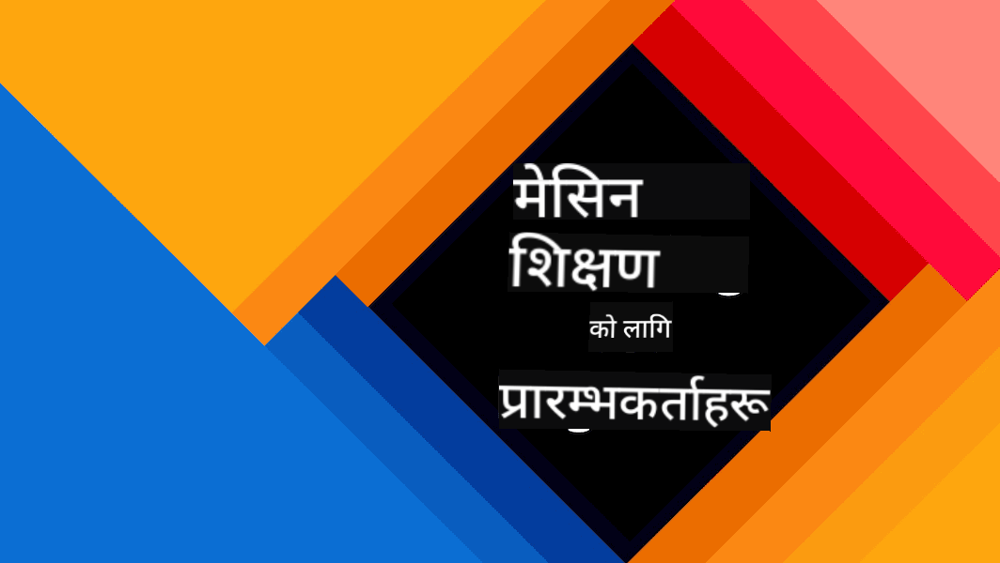
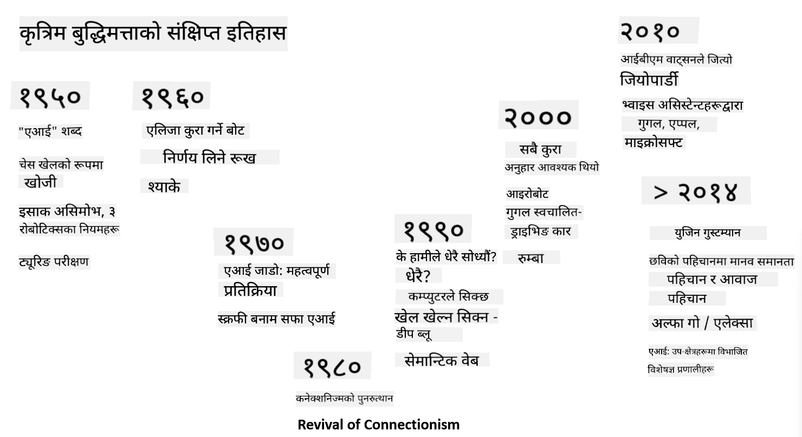

<!--
CO_OP_TRANSLATOR_METADATA:
{
  "original_hash": "06ca1b0138e65b964481ae83275b270e",
  "translation_date": "2025-10-03T07:57:39+00:00",
  "source_file": "lessons/1-Intro/README.md",
  "language_code": "ne"
}
-->
# AI को परिचय

> स्केच नोट [Tomomi Imura](https://twitter.com/girlie_mac) द्वारा

## [पूर्व-व्याख्यान क्विज](https://ff-quizzes.netlify.app/en/ai/quiz/1)

**कृत्रिम बुद्धिमत्ता** एक रोमाञ्चक वैज्ञानिक क्षेत्र हो जसले कम्प्युटरलाई बुद्धिमानी व्यवहार देखाउन, जस्तै मानिसहरूले राम्रोसँग गर्न सक्ने कुराहरू गर्न सिकाउन अध्ययन गर्दछ।

सुरुमा, कम्प्युटर [Charles Babbage](https://en.wikipedia.org/wiki/Charles_Babbage) द्वारा संख्याहरूमा काम गर्न र राम्रोसँग परिभाषित प्रक्रिया - एल्गोरिदम - अनुसरण गर्न आविष्कार गरिएको थियो। आधुनिक कम्प्युटरहरू, यद्यपि १९ औं शताब्दीमा प्रस्तावित मूल मोडेलभन्दा धेरै उन्नत छन्, अझै पनि नियन्त्रित गणनाको उही विचारलाई अनुसरण गर्छन्। त्यसैले यदि हामीलाई लक्ष्य प्राप्त गर्न आवश्यक चरणहरूको ठ्याक्कै क्रम थाहा छ भने कम्प्युटरलाई केही गर्न प्रोग्राम गर्न सम्भव छ।

> फोटो [Vickie Soshnikova](http://twitter.com/vickievalerie) द्वारा

> ✅ एक व्यक्तिको फोटोबाट उसको उमेर परिभाषित गर्नु यस्तो कार्य हो जसलाई स्पष्ट रूपमा प्रोग्राम गर्न सकिँदैन, किनकि हामीले यो गर्दा हाम्रो दिमागमा संख्याको साथ कसरी आउँछौं भन्ने थाहा छैन।

---

तर केही कार्यहरू छन् जसलाई हामीले कसरी समाधान गर्ने भनेर स्पष्ट रूपमा थाहा छैन। एक व्यक्तिको फोटोबाट उमेर निर्धारण गर्ने कुरा विचार गर्नुहोस्। हामीले विभिन्न उमेरका व्यक्तिहरूका धेरै उदाहरणहरू देखेका कारण यसलाई गर्न सिक्छौं, तर हामीले यसलाई कसरी गर्छौं भनेर स्पष्ट रूपमा व्याख्या गर्न सक्दैनौं, न त कम्प्युटरलाई यसलाई गर्न प्रोग्राम गर्न सक्छौं। यस्तै प्रकारका कार्यहरू **कृत्रिम बुद्धिमत्ता** (संक्षेपमा AI) को चासोका विषय हुन्।

✅ कम्प्युटरलाई AI बाट लाभ उठाउन सक्ने केही कार्यहरूको बारेमा सोच्नुहोस्। वित्त, चिकित्सा, र कला क्षेत्रहरू विचार गर्नुहोस् - यी क्षेत्रहरू आज AI बाट कसरी लाभ उठाइरहेका छन्?

## कमजोर AI बनाम बलियो AI

कमजोर AI | बलियो AI
---------------------------------------|-------------------------------------
कमजोर AI ती AI प्रणालीहरूलाई जनाउँछ जुन विशिष्ट कार्य वा सीमित कार्यहरूको लागि डिजाइन र प्रशिक्षित गरिन्छ।|बलियो AI, वा कृत्रिम सामान्य बुद्धिमत्ता (AGI), ती AI प्रणालीहरूलाई जनाउँछ जसमा मानव-स्तरको बुद्धिमत्ता र समझ छ।
यी AI प्रणालीहरू सामान्य रूपमा बुद्धिमान छैनन्; तिनीहरू पूर्वनिर्धारित कार्यमा उत्कृष्ट छन् तर साँचो समझ वा चेतना छैन।|यी AI प्रणालीहरूले मानवले गर्न सक्ने कुनै पनि बौद्धिक कार्य गर्न, विभिन्न क्षेत्रहरूमा अनुकूलन गर्न, र चेतना वा आत्म-जागरूकताको रूप धारण गर्न सक्ने क्षमता राख्छन्।
कमजोर AI का उदाहरणहरूमा Siri वा Alexa जस्ता भर्चुअल सहायकहरू, स्ट्रिमिङ सेवाहरूद्वारा प्रयोग गरिने सिफारिस एल्गोरिदमहरू, र विशिष्ट ग्राहक सेवा कार्यहरूको लागि डिजाइन गरिएका च्याटबटहरू समावेश छन्।|बलियो AI प्राप्त गर्नु AI अनुसन्धानको दीर्घकालीन लक्ष्य हो र यसले AI प्रणालीहरू विकास गर्न आवश्यक पर्दछ जसले तर्क गर्न, सिक्न, बुझ्न, र विभिन्न कार्यहरू र सन्दर्भहरूमा अनुकूलन गर्न सक्दछ।
कमजोर AI अत्यधिक विशेषज्ञ छ र यसको सीमित क्षेत्र बाहिर मानव-जस्तै संज्ञानात्मक क्षमता वा सामान्य समस्या समाधान क्षमताहरू छैन।|बलियो AI हाल एक सैद्धान्तिक अवधारणा हो, र कुनै पनि AI प्रणालीले यो स्तरको सामान्य बुद्धिमत्तामा पुग्न सकेको छैन।

थप जानकारीको लागि **[Artificial General Intelligence](https://en.wikipedia.org/wiki/Artificial_general_intelligence)** (AGI) हेर्नुहोस्।

## बुद्धिमत्ताको परिभाषा र ट्युरिङ परीक्षण

**[बुद्धिमत्ता](https://en.wikipedia.org/wiki/Intelligence)** शब्दसँग व्यवहार गर्दा एक समस्या यो हो कि यस शब्दको कुनै स्पष्ट परिभाषा छैन। कसैले तर्क गर्न सक्छ कि बुद्धिमत्ता **अमूर्त सोच** वा **आत्म-जागरूकता** संग जोडिएको छ, तर हामी यसलाई ठीकसँग परिभाषित गर्न सक्दैनौं।

> [फोटो](https://unsplash.com/photos/75715CVEJhI) [Amber Kipp](https://unsplash.com/@sadmax) द्वारा Unsplash बाट

*बुद्धिमत्ता* शब्दको अस्पष्टता हेर्नको लागि, एउटा प्रश्नको उत्तर दिन प्रयास गर्नुहोस्: "के बिरालो बुद्धिमान छ?" विभिन्न व्यक्तिहरूले यस प्रश्नको लागि विभिन्न उत्तर दिन्छन्, किनकि यो दाबी सत्य हो वा होइन भनेर प्रमाणित गर्नको लागि कुनै सार्वभौमिक रूपमा स्वीकार गरिएको परीक्षण छैन। र यदि तपाईं सोच्नुहुन्छ कि त्यस्तो परीक्षण छ - आफ्नो बिरालोलाई IQ परीक्षणमा चलाउन प्रयास गर्नुहोस्...

✅ एक मिनेटको लागि सोच्नुहोस् कि तपाईं बुद्धिमत्तालाई कसरी परिभाषित गर्नुहुन्छ। के एउटा कागले जो एउटा भूलभुलैया समाधान गर्न र केही खाना प्राप्त गर्न सक्छ बुद्धिमान छ? के बच्चा बुद्धिमान छ?

---

AGI को बारेमा कुरा गर्दा, हामीले कुनै तरिकाले थाहा पाउनुपर्छ कि हामीले साँच्चै बुद्धिमान प्रणाली सिर्जना गरेका छौं। [Alan Turing](https://en.wikipedia.org/wiki/Alan_Turing) ले **[ट्युरिङ परीक्षण](https://en.wikipedia.org/wiki/Turing_test)** नामक एक तरिका प्रस्ताव गरे, जसले बुद्धिमत्ताको परिभाषा जस्तै काम गर्दछ। परीक्षणले दिइएको प्रणालीलाई स्वाभाविक रूपमा बुद्धिमान चीजसँग तुलना गर्दछ - वास्तविक मानव, र किनभने कुनै पनि स्वचालित तुलना कम्प्युटर प्रोग्रामद्वारा बाइपास गर्न सकिन्छ, हामी मानव अन्वेषक प्रयोग गर्छौं। त्यसैले, यदि मानवले पाठ-आधारित संवादमा वास्तविक व्यक्ति र कम्प्युटर प्रणाली बीचको भिन्नता छुट्याउन असमर्थ छ भने - प्रणालीलाई बुद्धिमान मानिन्छ।

> [Eugene Goostman](https://en.wikipedia.org/wiki/Eugene_Goostman) नामक एक च्याटबट, सन् २०१४ मा ट्युरिङ परीक्षण पार गर्न नजिक आयो। यसले एक चतुर व्यक्तित्व चाल प्रयोग गर्‍यो। यसले अगाडि घोषणा गर्‍यो कि यो १३ वर्षको युक्रेनी केटा हो, जसले ज्ञानको कमी र पाठमा केही विसंगतिहरूलाई व्याख्या गर्नेछ। बटले ३०% न्यायाधीशहरूलाई ५ मिनेटको संवाद पछि यो मानव हो भनेर विश्वस्त गरायो, एक मेट्रिक जुन ट्युरिङले विश्वास गरे कि २००० सम्ममा मेसिनले पार गर्न सक्नेछ। तर, यो बुझ्नुपर्छ कि यसले हामीले बुद्धिमान प्रणाली सिर्जना गरेका छौं भन्ने संकेत गर्दैन, वा कम्प्युटर प्रणालीले मानव अन्वेषकलाई मूर्ख बनाएको छ - प्रणालीले मानवलाई मूर्ख बनाएको छैन, बरु बट सिर्जनाकर्ताहरूले गरेका हुन्!

✅ के तपाईं कहिल्यै च्याटबटले तपाईंलाई मानवसँग कुरा गरिरहेको सोच्न मूर्ख बनाएको छ? यसले तपाईंलाई कसरी विश्वस्त गरायो?

## AI का विभिन्न दृष्टिकोणहरू

यदि हामी चाहन्छौं कि कम्प्युटरले मानिसजस्तै व्यवहार गरोस्, हामीले कम्प्युटरभित्र हाम्रो सोच्ने तरिकालाई कुनै प्रकारले मोडेल गर्नुपर्छ। त्यसैले, हामीले बुझ्न प्रयास गर्नुपर्छ कि मानिसलाई बुद्धिमान बनाउने के हो।

> मेसिनमा बुद्धिमत्ता प्रोग्राम गर्न सक्षम हुन, हामीले निर्णयहरू गर्ने हाम्रो आफ्नै प्रक्रियाहरू कसरी काम गर्छन् भन्ने बुझ्न आवश्यक छ। यदि तपाईंले थोरै आत्म-निरीक्षण गर्नुभयो भने, तपाईंले महसुस गर्नुहुनेछ कि केही प्रक्रियाहरू अचेतन रूपमा हुन्छन् - जस्तै हामीले बिरालोलाई कुकुरबाट छुट्याउन सक्छौं बिना सोच्ने - जबकि केही अन्य तर्क समावेश गर्दछ।

यस समस्याको दुई सम्भावित दृष्टिकोणहरू छन्:

शीर्ष-तल दृष्टिकोण (प्रतीकात्मक तर्क) | तल-बाट दृष्टिकोण (न्यूरल नेटवर्क)
---------------------------------------|-------------------------------------
शीर्ष-तल दृष्टिकोणले व्यक्तिले समस्या समाधान गर्न तर्क गर्ने तरिकालाई मोडेल गर्दछ। यसमा मानिसबाट **ज्ञान** निकाल्ने, र यसलाई कम्प्युटर-पढ्न सकिने रूपमा प्रतिनिधित्व गर्ने समावेश छ। हामीले कम्प्युटरभित्र **तर्क** मोडेल गर्ने तरिका पनि विकास गर्न आवश्यक छ। | तल-बाट दृष्टिकोणले मानव मस्तिष्कको संरचनालाई मोडेल गर्दछ, जसमा **न्यूरोनहरू** भनिने धेरै साधारण इकाइहरूको ठूलो संख्या हुन्छ। प्रत्येक न्यूरोनले यसको इनपुटहरूको भारित औसतको रूपमा काम गर्दछ, र हामी प्रशिक्षण डेटा प्रदान गरेर उपयोगी समस्याहरू समाधान गर्न न्यूरोनहरूको नेटवर्कलाई प्रशिक्षण दिन सक्छौं।

बुद्धिमत्ताका लागि अन्य सम्भावित दृष्टिकोणहरू पनि छन्:

* **उत्पन्न**, **सिनर्जेटिक** वा **बहु-एजेन्ट दृष्टिकोण** जटिल बुद्धिमान व्यवहार धेरै साधारण एजेन्टहरूको अन्तर्क्रिया द्वारा प्राप्त गर्न सकिन्छ भन्ने तथ्यमा आधारित छन्। [Evolutionary Cybernetics](https://en.wikipedia.org/wiki/Global_brain#Evolutionary_cybernetics) अनुसार, बुद्धिमत्ता *उत्पन्न* हुन सक्छ अधिक साधारण, प्रतिक्रियात्मक व्यवहारबाट *मेटासिस्टम ट्रान्जिसन* प्रक्रियामा।

* **Evolutionary दृष्टिकोण**, वा **Genetic Algorithm** एक अनुकूलन प्रक्रिया हो जुन विकासको सिद्धान्तहरूमा आधारित छ।

हामी ती दृष्टिकोणहरूलाई पाठ्यक्रममा पछि विचार गर्नेछौं, तर अहिले हामी दुई मुख्य दिशाहरूमा ध्यान केन्द्रित गर्नेछौं: शीर्ष-तल र तल-बाट।

### शीर्ष-तल दृष्टिकोण

**शीर्ष-तल दृष्टिकोण**मा, हामी हाम्रो तर्कलाई मोडेल गर्न प्रयास गर्छौं। किनभने हामी तर्क गर्दा हाम्रो विचारहरूलाई पछ्याउन सक्छौं, हामी यस प्रक्रियालाई औपचारिक बनाउन र कम्प्युटरभित्र प्रोग्राम गर्न प्रयास गर्न सक्छौं। यसलाई **प्रतीकात्मक तर्क** भनिन्छ।

मानिसहरूले आफ्नो निर्णय गर्ने प्रक्रियाहरूलाई मार्गदर्शन गर्ने केही नियमहरू आफ्नो दिमागमा राख्ने झुकाव राख्छन्। उदाहरणका लागि, जब डाक्टरले बिरामीको निदान गरिरहेका हुन्छन्, उनले महसुस गर्न सक्छन् कि व्यक्तिलाई ज्वरो छ, र यसैले शरीरभित्र केही सूजन भइरहेको हुन सक्छ। डाक्टरले विशिष्ट समस्यामा नियमहरूको ठूलो सेट लागू गरेर अन्तिम निदानमा पुग्न सक्छ।

यो दृष्टिकोण **ज्ञान प्रतिनिधित्व** र **तर्क**मा धेरै निर्भर गर्दछ। मानव विशेषज्ञबाट ज्ञान निकाल्नु सबैभन्दा कठिन भाग हुन सक्छ, किनकि धेरै अवस्थामा डाक्टरलाई किन उनी विशेष निदानमा आइपुगेका छन् भन्ने कुरा थाहा हुँदैन। कहिलेकाहीं समाधान स्पष्ट सोच बिना उनको दिमागमा आउँछ। केही कार्यहरू, जस्तै फोटोबाट व्यक्तिको उमेर निर्धारण, ज्ञान हेरफेरमा बिल्कुलै घटाउन सकिँदैन।

### तल-बाट दृष्टिकोण

वैकल्पिक रूपमा, हामी हाम्रो मस्तिष्कभित्रका सबैभन्दा साधारण तत्वहरू - न्यूरोनलाई मोडेल गर्न प्रयास गर्न सक्छौं। हामी कम्प्युटरभित्र **कृत्रिम न्यूरल नेटवर्क** निर्माण गर्न सक्छौं, र त्यसपछि यसलाई उदाहरणहरू दिएर समस्याहरू समाधान गर्न सिकाउन प्रयास गर्न सक्छौं। यो प्रक्रिया नवजात शिशुले आफ्नो वरपरको वातावरणको बारेमा अवलोकन गरेर सिक्ने तरिकासँग मिल्दोजुल्दो छ।

✅ शिशुहरू कसरी सिक्छन् भन्ने बारेमा थोरै अनुसन्धान गर्नुहोस्। शिशुको मस्तिष्कका आधारभूत तत्वहरू के हुन्?

> | ML को बारेमा के?         |      |
> |--------------|-----------|
> | कृत्रिम बुद्धिमत्ताको भाग जसले केही डेटा आधारित समस्याहरू समाधान गर्न कम्प्युटर सिकाइमा आधारित छ, **मेसिन लर्निङ** भनिन्छ। हामी यस पाठ्यक्रममा शास्त्रीय मेसिन लर्निङलाई विचार गर्नेछौं - हामी तपाईंलाई छुट्टै [Machine Learning for Beginners](http://aka.ms/ml-beginners) पाठ्यक्रममा सिफारिस गर्छौं। |       |

## AI को संक्षिप्त इतिहास

कृत्रिम बुद्धिमत्ता २० औं शताब्दीको मध्यमा एक क्षेत्रको रूपमा सुरु भएको थियो। सुरुमा, प्रतीकात्मक तर्क एक प्रचलित दृष्टिकोण थियो, र यसले विशेषज्ञ प्रणालीहरू जस्ता केही सीमित समस्या क्षेत्रहरूमा विशेषज्ञको रूपमा कार्य गर्न सक्षम कम्प्युटर कार्यक्रमहरू जस्ता धेरै महत्त्वपूर्ण सफलताहरू ल्यायो। तर, चाँडै यो स्पष्ट भयो कि यस्तो दृष्टिकोण राम्रोसँग स्केल हुँदैन। विशेषज्ञबाट ज्ञान निकाल्नु, कम्प्युटरमा प्रतिनिधित्व गर्नु, र ज्ञान आधारलाई सटीक राख्नु धेरै जटिल कार्य हो, र धेरै अवस्थामा व्यावहारिक हुन धेरै महँगो छ। यसले १९७० को दशकमा तथाकथित [AI Winter](https://en.wikipedia.org/wiki/AI_winter) ल्यायो।

> छवि [Dmitry Soshnikov](http://soshnikov.com) द्वारा

समय बित्दै जाँदा, कम्प्युटिङ स्रोतहरू सस्ता भए, र थप डेटा उपलब्ध भयो, त्यसैले न्यूरल नेटवर्क दृष्टिकोणहरूले धेरै क्षेत्रहरूमा मानवसँग प्रतिस्पर्धा गर्न उत्कृष्ट प्रदर्शन देखाउन थाले, जस्तै कम्प्युटर दृष्टि वा भाषण बुझाइ। पछिल्लो दशकमा, कृत्रिम बुद्धिमत्ता शब्दलाई प्रायः न्यूरल नेटवर्कहरूको पर्यायवाचीको रूपमा प्रयोग गरिएको छ, किनकि हामीले सुनेका अधिकांश AI सफलताहरू तिनीहरूमा आधारित छन्।

हामी हेर्न सक्छौं कि कसरी दृष्टिकोणहरू परिवर्तन भए, उदाहरणका लागि, चेस खेल्ने कम्प्युटर कार्यक्रम सिर्जना गर्दा:

* प्रारम्भिक चेस कार्यक्रमहरू खोजमा आधारित थिए - एक कार्यक्रमले केही चालहरूमा प्राप्त गर्न सकिने इष्टतम स्थितिको आधारमा प्रतिद्वन्द्वीको सम्भावित चालहरूको अनुमान गर्न स्पष्ट रूपमा प्रयास गर्‍यो। यसले तथाकथित [alpha-beta pruning](https://en.wikipedia.org/wiki/Alpha%E2%80%93beta_pruning) खोज एल्गोरिदमको विकासलाई नेतृत्व गर्‍यो।
* खोज रणनीतिहरू खेलको अन्त्यतिर राम्रोसँग काम गर्छन्, जहाँ खोज स्थान सीमित सम्भावित चालहरूको सानो संख्याले सीमित छ। तर, खेलको सुरुवातमा, खोज स्थान विशाल छ, र एल्गोरिदमलाई मानव खेलाडीहरू बीचको अवस्थित खेलहरूबाट सिकेर सुधार गर्न सकिन्छ। त्यसपछिका प्रयोगहरूले तथाकथित [case-based reasoning](https://en.wikipedia.org/wiki/Case-based_reasoning) प्रयोग गरे, जहाँ कार्यक्रमले खेलमा वर्तमान स्थितिसँग धेरै मिल्दोजुल्दो केसहरूको लागि ज्ञान आधारमा खोज गर्‍यो।
* मानव खेलाडीहरूलाई जित्ने आधुनिक कार्यक्रमहरू न्यूरल नेटवर्क र [reinforcement learning](https://en.wikipedia.org/wiki/Reinforcement_learning) मा आधारित छन्, जहाँ कार्यक्रमहरूले केवल आफैंसँग लामो समयसम्म खेल खेलेर र आफ्नै गल्तीहरूबाट सिकेर खेल्न सिक्छन् - मानिसहरूले चेस खेल्न सिक्दा जस्तै। तर, कम्प्युटर कार्यक्रमले धेरै कम समयमा धेरै खेल खेल्न सक्छ, र यसैले धेरै छिटो सिक्न सक्छ।

✅ AI द्वारा खेलेका अन्य खेलहरूको बारेमा थोरै अनुसन्धान गर्नुहोस्।

त्यस्तै, हामी देख्न सक्छौं कि "बोल्ने कार्यक्रमहरू" (जसले ट्युरिङ परीक्षण पार गर्न सक्छ) सिर्जना गर्ने दृष्टिकोण कसरी परिवर्तन भयो:

* यस प्रकारका प्रारम्भिक कार्यक्रमहरू जस्तै [Eliza](https://en.wikipedia.org/wiki/ELIZA), धेरै साधारण व्याकरण नियमहरू र इनपुट वाक्यलाई प्रश्नमा पुनः-निर्माणमा आधारित थिए।
* आधुनिक सहायकहरू, जस्तै Cortana, Siri वा Google Assistant सबै हाइब्रिड प्रणालीहरू हुन् जसले भाषणलाई पाठमा रूपान्तरण गर्न र हाम्रो उद्देश्यलाई पहिचान गर्न न्यूरल नेटवर्कहरू प्रयोग गर्छन्, र त्यसपछि आवश्यक कार्यहरू प्रदर्शन गर्न केही तर्क वा स्पष्ट एल्गोरिदमहरू प्रयोग गर्छन्।
* भविष्यमा, हामी पूर्ण न्यूरल-आधारित मोडेललाई आफैंले संवादलाई ह्यान्डल गर्न सक्षम हुने अपेक्षा गर्न सक्छौं। हालको GPT र [Turing-NLG](https://www.microsoft.com/research/blog/turing-nlg-a-17-billion-parameter-language-model-by-microsoft) न्यूरल नेटवर्कहरूको परिवारले यसमा ठूलो सफलता देखाउँछ।

> चित्र Dmitry Soshnikov द्वारा, [फोटो](https://unsplash.com/photos/r8LmVbUKgns) Marina Abrosimova द्वारा [यहाँ क्लिक गर्नुहोस्](https://unsplash.com/@abrosimova_marina_foto), Unsplash

## हालको एआई अनुसन्धान

न्यूरल नेटवर्क अनुसन्धानमा हालको ठूलो वृद्धि लगभग २०१० मा सुरु भएको थियो, जब ठूला सार्वजनिक डेटासेटहरू उपलब्ध हुन थाले। [ImageNet](https://en.wikipedia.org/wiki/ImageNet) नामक १४ मिलियन एनोटेटेड छविहरूको ठूलो संग्रहले [ImageNet Large Scale Visual Recognition Challenge](https://image-net.org/challenges/LSVRC/) को जन्म दियो।

> चित्र [Dmitry Soshnikov](http://soshnikov.com) द्वारा

२०१२ मा, [Convolutional Neural Networks](../4-ComputerVision/07-ConvNets/README.md) पहिलो पटक छवि वर्गीकरणमा प्रयोग गरियो, जसले वर्गीकरण त्रुटिहरूमा ठूलो गिरावट ल्यायो (लगभग ३०% बाट १६.४% सम्म)। २०१५ मा, Microsoft Research को ResNet आर्किटेक्चरले [मानव-स्तरको शुद्धता हासिल गर्‍यो](https://doi.org/10.1109/ICCV.2015.123)।

त्यसपछि, न्यूरल नेटवर्कहरूले धेरै कार्यहरूमा अत्यन्त सफल व्यवहार देखाए:

---

वर्ष | मानव समानता हासिल गरियो
-----|--------
२०१५ | [छवि वर्गीकरण](https://doi.org/10.1109/ICCV.2015.123)
२०१६ | [वार्तालापात्मक भाषण मान्यता](https://arxiv.org/abs/1610.05256)
२०१८ | [स्वचालित मेशिन अनुवाद](https://arxiv.org/abs/1803.05567) (चिनियाँ-देखि-अंग्रेजी)
२०२० | [छवि क्याप्शनिङ](https://arxiv.org/abs/2009.13682)

पछिल्ला केही वर्षहरूमा, हामीले ठूला भाषा मोडेलहरू, जस्तै BERT र GPT-3 मा ठूलो सफलता देखेका छौं। यो मुख्यतया धेरै सामान्य पाठ डेटा उपलब्ध भएको कारणले सम्भव भएको हो, जसले मोडेलहरूलाई पाठको संरचना र अर्थ समात्न, सामान्य पाठ संग्रहहरूमा प्रि-ट्रेन गर्न, र त्यसपछि ती मोडेलहरूलाई थप विशिष्ट कार्यहरूको लागि विशेषज्ञ बनाउन अनुमति दिन्छ। हामी यस पाठक्रममा [Natural Language Processing](../5-NLP/README.md) को बारेमा थप सिक्नेछौं।

## 🚀 चुनौती

इन्टरनेटको भ्रमण गरेर तपाईंको विचारमा एआई सबैभन्दा प्रभावकारी रूपमा कहाँ प्रयोग भइरहेको छ भनेर निर्धारण गर्नुहोस्। के यो कुनै म्यापिङ एपमा हो, वा कुनै भाषण-देखि-पाठ सेवा वा भिडियो गेममा? प्रणाली कसरी निर्माण गरिएको थियो भनेर अनुसन्धान गर्नुहोस्।

## [पाठ-पछिको क्विज](https://ff-quizzes.netlify.app/en/ai/quiz/2)

## समीक्षा र आत्म अध्ययन

[यस पाठ](https://github.com/microsoft/ML-For-Beginners/tree/main/1-Introduction/2-history-of-ML) पढेर एआई र एमएलको इतिहासको समीक्षा गर्नुहोस्। उक्त पाठको शीर्षमा रहेको स्केच नोट वा यस पाठबाट कुनै तत्व लिई यसको सांस्कृतिक सन्दर्भलाई बुझ्न थप गहिरो अनुसन्धान गर्नुहोस्।

**असाइनमेन्ट**: [Game Jam](assignment.md)

---

**अस्वीकरण**:  
यो दस्तावेज़ AI अनुवाद सेवा [Co-op Translator](https://github.com/Azure/co-op-translator) प्रयोग गरेर अनुवाद गरिएको छ। हामी यथार्थताको लागि प्रयास गर्छौं, तर कृपया ध्यान दिनुहोस् कि स्वचालित अनुवादमा त्रुटिहरू वा अशुद्धताहरू हुन सक्छ। यसको मूल भाषा मा रहेको मूल दस्तावेज़लाई आधिकारिक स्रोत मानिनुपर्छ। महत्वपूर्ण जानकारीको लागि, व्यावसायिक मानव अनुवाद सिफारिस गरिन्छ। यस अनुवादको प्रयोगबाट उत्पन्न हुने कुनै पनि गलतफहमी वा गलत व्याख्याको लागि हामी जिम्मेवार हुनेछैनौं।