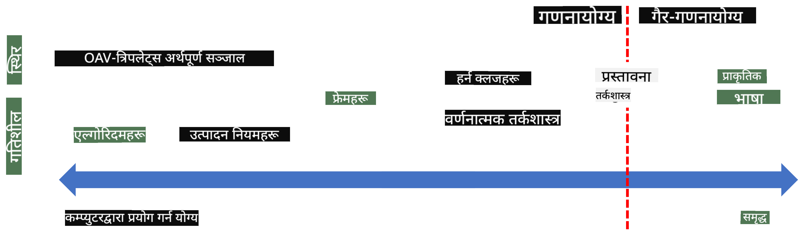
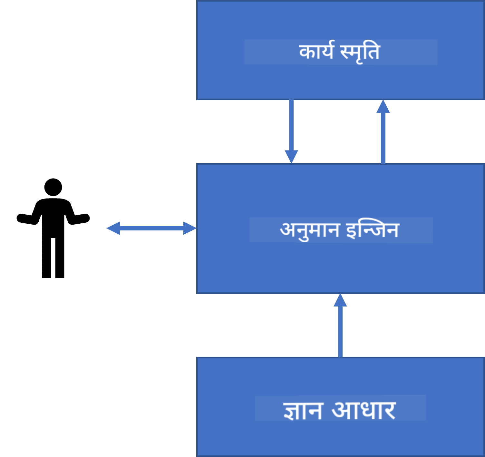
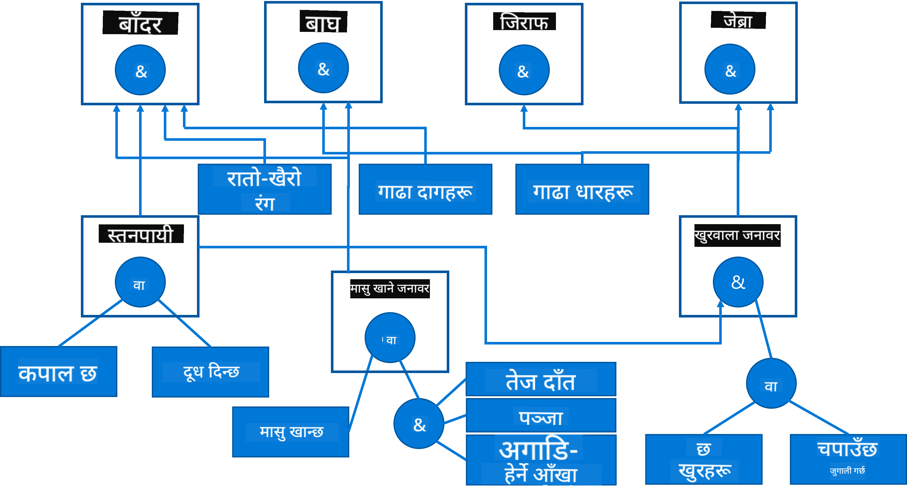

<!--
CO_OP_TRANSLATOR_METADATA:
{
  "original_hash": "7d097f7fda9166ead615e4c34552381b",
  "translation_date": "2025-09-23T07:18:51+00:00",
  "source_file": "lessons/2-Symbolic/README.md",
  "language_code": "ne"
}
-->
# ज्ञान प्रतिनिधित्व र विशेषज्ञ प्रणाली


> स्केच नोट [Tomomi Imura](https://twitter.com/girlie_mac) द्वारा

कृत्रिम बुद्धिमत्ताको खोजी ज्ञानको खोजीमा आधारित छ, जसले मानिसहरूले संसारलाई बुझ्ने तरिकालाई नक्कल गर्न प्रयास गर्दछ। तर, यो कसरी गर्न सकिन्छ?

## [पूर्व-व्याख्यान क्विज](https://ff-quizzes.netlify.app/en/ai/quiz/3)

AI को सुरुवाती दिनहरूमा, बुद्धिमान प्रणालीहरू निर्माण गर्नको लागि शीर्ष-तल दृष्टिकोण (पछिल्लो पाठमा छलफल गरिएको) लोकप्रिय थियो। विचार यो थियो कि मानिसहरूबाट ज्ञान निकालेर यसलाई मेसिन-पढ्न सकिने स्वरूपमा रूपान्तरण गरियोस्, र त्यसपछि यसलाई स्वचालित रूपमा समस्याहरू समाधान गर्न प्रयोग गरियोस्। यो दृष्टिकोण दुई ठूला विचारहरूमा आधारित थियो:

* ज्ञान प्रतिनिधित्व
* तर्क

## ज्ञान प्रतिनिधित्व

सिम्बोलिक AI को महत्त्वपूर्ण अवधारणाहरू मध्ये एक हो **ज्ञान**। *सूचना* वा *डाटा* बाट ज्ञानलाई फरक पार्नु महत्त्वपूर्ण छ। उदाहरणका लागि, किताबहरूले ज्ञान समावेश गर्छन् भन्ने कुरा भन्न सकिन्छ, किनकि किताबहरू अध्ययन गरेर विशेषज्ञ बन्न सकिन्छ। तर, किताबहरूले समावेश गरेको कुरा वास्तवमा *डाटा* हो, र किताबहरू पढेर र यस डाटालाई हाम्रो संसारको मोडेलमा समाहित गरेर हामी यसलाई ज्ञानमा रूपान्तरण गर्छौं।

> ✅ **ज्ञान** हाम्रो मस्तिष्कमा समावेश गरिएको कुरा हो जसले संसारको हाम्रो बुझाइलाई प्रतिनिधित्व गर्छ। यो एक सक्रिय **अध्ययन** प्रक्रियाद्वारा प्राप्त गरिन्छ, जसले हामीले प्राप्त गरेको सूचनाका टुक्राहरूलाई हाम्रो सक्रिय संसारको मोडेलमा समाहित गर्छ।

प्रायः, हामी ज्ञानलाई कडाइका साथ परिभाषित गर्दैनौं, तर यसलाई [DIKW पिरामिड](https://en.wikipedia.org/wiki/DIKW_pyramid) प्रयोग गरेर अन्य सम्बन्धित अवधारणाहरूको साथ मिलाउँछौं। यसमा निम्न अवधारणाहरू समावेश छन्:

* **डाटा** भौतिक माध्यममा प्रतिनिधित्व गरिएको कुरा हो, जस्तै लेखिएको पाठ वा बोलेको शब्द। डाटा मानिसहरूबाट स्वतन्त्र रूपमा अस्तित्वमा रहन्छ र मानिसहरू बीचमा आदानप्रदान गर्न सकिन्छ।
* **सूचना** भनेको हाम्रो मस्तिष्कमा डाटाको व्याख्या हो। उदाहरणका लागि, जब हामी *कम्प्युटर* शब्द सुन्छौं, हामीलाई यसको के हो भन्ने केही बुझाइ हुन्छ।
* **ज्ञान** भनेको हाम्रो संसारको मोडेलमा समाहित गरिएको सूचना हो। उदाहरणका लागि, जब हामी कम्प्युटर के हो भनेर सिक्छौं, हामीलाई यसको काम गर्ने तरिका, मूल्य, र यसको उपयोगका बारेमा केही विचार आउँछ। यी आपसमा सम्बन्धित अवधारणाहरूको जालोले हाम्रो ज्ञान बनाउँछ।
* **बुद्धिमत्ता** भनेको हाम्रो संसारको बुझाइको अर्को स्तर हो, र यसले *मेटा-ज्ञान* प्रतिनिधित्व गर्छ, जस्तै ज्ञान कहिले र कसरी प्रयोग गरिनु पर्छ भन्ने धारणा।


*छवि [विकिपिडियाबाट](https://commons.wikimedia.org/w/index.php?curid=37705247), Longlivetheux द्वारा - आफ्नै काम, CC BY-SA 4.0*

त्यसैले, **ज्ञान प्रतिनिधित्व** को समस्या भनेको कम्प्युटर भित्र ज्ञानलाई डाटाको रूपमा प्रतिनिधित्व गर्ने केही प्रभावकारी तरिका पत्ता लगाउनु हो, ताकि यसलाई स्वचालित रूपमा प्रयोग गर्न सकियोस्। यसलाई एक स्पेक्ट्रमको रूपमा हेर्न सकिन्छ:



> छवि [Dmitry Soshnikov](http://soshnikov.com) द्वारा

* बाँया तर्फ, कम्प्युटरहरूले प्रभावकारी रूपमा प्रयोग गर्न सक्ने धेरै सरल प्रकारका ज्ञान प्रतिनिधित्वहरू छन्। सबैभन्दा सरल प्रकार एल्गोरिदमिक हो, जहाँ ज्ञान कम्प्युटर प्रोग्रामद्वारा प्रतिनिधित्व गरिन्छ। तर, यो ज्ञान प्रतिनिधित्व गर्ने सबैभन्दा राम्रो तरिका होइन, किनकि यो लचिलो छैन। हाम्रो मस्तिष्कभित्रको ज्ञान प्रायः गैर-एल्गोरिदमिक हुन्छ।
* दायाँ तर्फ, प्राकृतिक पाठ जस्ता प्रतिनिधित्वहरू छन्। यो सबैभन्दा शक्तिशाली हो, तर स्वचालित तर्कका लागि प्रयोग गर्न सकिँदैन।

> ✅ एक मिनेट सोच्नुहोस् कि तपाईं आफ्नो मस्तिष्कमा ज्ञान कसरी प्रतिनिधित्व गर्नुहुन्छ र यसलाई नोट्समा रूपान्तरण गर्नुहुन्छ। के कुनै विशेष स्वरूप छ जसले तपाईंलाई सम्झनामा सहयोग पुर्‍याउँछ?

## कम्प्युटर ज्ञान प्रतिनिधित्व वर्गीकरण

हामी कम्प्युटर ज्ञान प्रतिनिधित्वका विभिन्न विधिहरूलाई निम्न वर्गहरूमा वर्गीकृत गर्न सक्छौं:

* **नेटवर्क प्रतिनिधित्वहरू** हाम्रो मस्तिष्कभित्र आपसमा सम्बन्धित अवधारणाहरूको जालोको आधारमा बनाइन्छ। हामी कम्प्युटर भित्र समान जालोहरूलाई ग्राफको रूपमा पुन: उत्पादन गर्न सक्छौं - जसलाई **सामन्तिक नेटवर्क** भनिन्छ।

1. **वस्तु-गुण-मान त्रिपलेटहरू** वा **गुण-मान जोडीहरू**। चूँकि ग्राफलाई कम्प्युटर भित्र नोड र किनारहरूको सूचीको रूपमा प्रतिनिधित्व गर्न सकिन्छ, हामी सामन्तिक नेटवर्कलाई वस्तु, गुण, र मानहरू समावेश गर्ने त्रिपलेटहरूको सूचीद्वारा प्रतिनिधित्व गर्न सक्छौं। उदाहरणका लागि, हामी प्रोग्रामिङ भाषाहरूको बारेमा निम्न त्रिपलेटहरू निर्माण गर्छौं:

वस्तु | गुण | मान
-------|-----------|------
Python | हो | Untyped-Language
Python | आविष्कारक | Guido van Rossum
Python | ब्लक-सिन्ट्याक्स | इनडेन्टेशन
Untyped-Language | छैन | प्रकार परिभाषा

> ✅ सोच्नुहोस् कि त्रिपलेटहरू अन्य प्रकारका ज्ञान प्रतिनिधित्व गर्न कसरी प्रयोग गर्न सकिन्छ।

2. **हाइरार्किकल प्रतिनिधित्वहरू** यस तथ्यलाई जोड दिन्छ कि हामी प्रायः हाम्रो मस्तिष्कभित्र वस्तुहरूको हाइरार्की सिर्जना गर्छौं। उदाहरणका लागि, हामीलाई थाहा छ कि क्यानरी एक चरा हो, र सबै चराहरूको पखेटा हुन्छ। हामीलाई क्यानरीको सामान्य रंग र यसको उडान गति पनि थाहा छ।

   - **फ्रेम प्रतिनिधित्व** प्रत्येक वस्तु वा वस्तुहरूको वर्गलाई **फ्रेम** को रूपमा प्रतिनिधित्व गर्नेमा आधारित छ, जसमा **स्लटहरू** हुन्छन्। स्लटहरूमा सम्भावित डिफल्ट मानहरू, मान प्रतिबन्धहरू, वा मान प्राप्त गर्न सकिने भण्डारण प्रक्रियाहरू हुन्छन्। सबै फ्रेमहरूले वस्तु-उन्मुख प्रोग्रामिङ भाषाहरूमा वस्तु हाइरार्की जस्तै हाइरार्की बनाउँछन्।
   - **परिदृश्यहरू** समयको साथमा खुल्ने जटिल परिस्थितिहरूलाई प्रतिनिधित्व गर्ने विशेष प्रकारका फ्रेमहरू हुन्।

**Python**

स्लट | मान | डिफल्ट मान | अन्तराल |
-----|-------|---------------|----------|
नाम | Python | | |
हो | Untyped-Language | | |
भेरिएबल केस | | CamelCase | |
प्रोग्राम लम्बाइ | | | 5-5000 लाइनहरू |
ब्लक सिन्ट्याक्स | इनडेन्ट | | |

3. **प्रक्रियात्मक प्रतिनिधित्वहरू** ज्ञानलाई कार्यहरूको सूचीद्वारा प्रतिनिधित्व गर्नेमा आधारित छ, जुन निश्चित अवस्थामा कार्यान्वयन गर्न सकिन्छ।
   - उत्पादन नियमहरू यदि-तब कथनहरू हुन् जसले हामीलाई निष्कर्ष निकाल्न अनुमति दिन्छ। उदाहरणका लागि, एक डाक्टरसँग नियम हुन सक्छ जसले भन्छ कि **यदि** बिरामीलाई उच्च ज्वरो छ **वा** रक्त परीक्षणमा उच्च स्तरको C-reactive प्रोटीन छ **तब** उसलाई सूजन छ। एकपटक हामीले कुनै एक अवस्था भेट्टायौं भने, हामी सूजनको बारेमा निष्कर्ष निकाल्न सक्छौं, र त्यसपछि यसलाई थप तर्कमा प्रयोग गर्न सक्छौं।
   - एल्गोरिदमहरू प्रक्रियात्मक प्रतिनिधित्वको अर्को रूप मान्न सकिन्छ, यद्यपि तिनीहरू प्रायः ज्ञान-आधारित प्रणालीहरूमा प्रत्यक्ष रूपमा प्रयोग गरिँदैनन्।

4. **तर्क** मूल रूपमा अरिस्टोटलले सार्वभौमिक मानव ज्ञान प्रतिनिधित्व गर्ने तरिका रूपमा प्रस्ताव गरेका थिए।
   - प्रेडिकेट तर्क एक गणितीय सिद्धान्त हो जुन कम्प्युटेबल हुन धेरै समृद्ध छ, त्यसैले सामान्यतया यसको केही उपसमुच्ची प्रयोग गरिन्छ, जस्तै Prolog मा प्रयोग गरिने Horn क्लजहरू।
   - वर्णनात्मक तर्क वस्तुहरूको हाइरार्की र वितरित ज्ञान प्रतिनिधित्वहरू जस्तै *सामन्तिक वेब* को बारेमा प्रतिनिधित्व र तर्क गर्न प्रयोग गरिने तर्क प्रणालीहरूको परिवार हो।

## विशेषज्ञ प्रणालीहरू

सिम्बोलिक AI को प्रारम्भिक सफलताहरू मध्ये एक **विशेषज्ञ प्रणालीहरू** थिए - कम्प्युटर प्रणालीहरू जसलाई सीमित समस्या क्षेत्रमा विशेषज्ञको रूपमा कार्य गर्न डिजाइन गरिएको थियो। तिनीहरू **ज्ञान आधार** मा आधारित थिए, जुन एक वा बढी मानव विशेषज्ञहरूबाट निकालिएको थियो, र तिनीहरूमा **तर्क इन्जिन** समावेश थियो जसले यसमा केही तर्क प्रदर्शन गर्थ्यो।

 | 
---------------------------------------------|------------------------------------------------
मानव न्युरल प्रणालीको सरलीकृत संरचना | ज्ञान-आधारित प्रणालीको वास्तुकला

विशेषज्ञ प्रणालीहरू मानव तर्क प्रणाली जस्तै निर्माण गरिन्छ, जसमा **छोटो-समय स्मृति** र **लामो-समय स्मृति** हुन्छ। त्यस्तै, ज्ञान-आधारित प्रणालीहरूमा हामी निम्न घटकहरू छुट्याउँछौं:

* **समस्या स्मृति**: हाल समाधान भइरहेको समस्याको बारेमा ज्ञान समावेश गर्दछ, जस्तै बिरामीको तापक्रम वा रक्तचाप, उसलाई सूजन छ कि छैन, आदि। यस ज्ञानलाई **स्थिर ज्ञान** पनि भनिन्छ, किनकि यसले हालको समस्याको बारेमा हामीलाई थाहा भएको कुराको स्न्यापशट समावेश गर्दछ - तथाकथित *समस्या अवस्था*।
* **ज्ञान आधार**: समस्या क्षेत्रको बारेमा लामो-समय ज्ञान प्रतिनिधित्व गर्दछ। यो मानव विशेषज्ञहरूबाट म्यानुअल रूपमा निकालिएको हो, र परामर्शबाट परामर्शमा परिवर्तन हुँदैन। किनकि यसले हामीलाई एक समस्या अवस्थाबाट अर्कोमा नेभिगेट गर्न अनुमति दिन्छ, यसलाई **गतिशील ज्ञान** पनि भनिन्छ।
* **तर्क इन्जिन**: समस्या अवस्था स्थानमा खोजी गर्ने सम्पूर्ण प्रक्रियालाई समन्वय गर्दछ, आवश्यक पर्दा प्रयोगकर्तासँग प्रश्न सोध्छ। यो प्रत्येक अवस्थामा लागू गर्नुपर्ने सही नियमहरू फेला पार्न पनि जिम्मेवार छ।

उदाहरणका लागि, निम्न विशेषज्ञ प्रणालीलाई विचार गरौं जसले शारीरिक विशेषताहरूको आधारमा जनावर निर्धारण गर्दछ:



> छवि [Dmitry Soshnikov](http://soshnikov.com) द्वारा

यो चित्रलाई **AND-OR ट्री** भनिन्छ, र यो उत्पादन नियमहरूको सेटको ग्राफिकल प्रतिनिधित्व हो। विशेषज्ञबाट ज्ञान निकाल्नको सुरुवातमा ट्री बनाउनु उपयोगी हुन्छ। कम्प्युटर भित्र ज्ञान प्रतिनिधित्व गर्न नियमहरू प्रयोग गर्नु अधिक सुविधाजनक हुन्छ:

```
IF the animal eats meat
OR (animal has sharp teeth
    AND animal has claws
    AND animal has forward-looking eyes
) 
THEN the animal is a carnivore
```

तपाईंले देख्न सक्नुहुन्छ कि नियमको बाँया-पक्षमा प्रत्येक अवस्था र कार्य वस्तु-गुण-मान (OAV) त्रिपलेटहरू हुन्। **कार्य स्मृति** OAV त्रिपलेटहरूको सेट समावेश गर्दछ जुन हाल समाधान भइरहेको समस्यासँग मेल खान्छ। **नियम इन्जिन** नियमहरूको खोजी गर्दछ जसको अवस्था पूरा भएको छ र तिनीहरूलाई लागू गर्दछ, कार्य स्मृतिमा अर्को त्रिपलेट थप्दै।

> ✅ तपाईंलाई मन पर्ने विषयमा आफ्नो AND-OR ट्री लेख्नुहोस्!

### अगाडि बनाम पछाडि तर्क

माथि वर्णन गरिएको प्रक्रिया **अगाडि तर्क** भनिन्छ। यो कार्य स्मृतिमा उपलब्ध समस्याको प्रारम्भिक डाटाबाट सुरु हुन्छ, र त्यसपछि निम्न तर्क लूप कार्यान्वयन गर्दछ:

1. यदि लक्ष्य गुण कार्य स्मृतिमा उपस्थित छ भने - रोक्नुहोस् र परिणाम दिनुहोस्
2. सबै नियमहरूको खोजी गर्नुहोस् जसको अवस्था हाल पूरा भएको छ - **संघर्ष सेट** प्राप्त गर्नुहोस्।
3. **संघर्ष समाधान** गर्नुहोस् - यस चरणमा कार्यान्वयन गरिने एक नियम चयन गर्नुहोस्। विभिन्न संघर्ष समाधान रणनीतिहरू हुन सक्छ:
   - ज्ञान आधारमा लागू गर्न सकिने पहिलो नियम चयन गर्नुहोस्
   - कुनै पनि नियम चयन गर्नुहोस्
   - *अधिक विशिष्ट* नियम चयन गर्नुहोस्, अर्थात् "बाँया-पक्ष" (LHS) मा सबैभन्दा धेरै अवस्थाहरू पूरा गर्ने नियम
4. चयन गरिएको नियम लागू गर्नुहोस् र समस्या अवस्थामा नयाँ ज्ञानको टुक्रा समावेश गर्नुहोस्
5. चरण 1 बाट दोहोर्याउनुहोस्।

तर, केही अवस्थामा हामी समस्याको बारेमा खाली ज्ञानबाट सुरु गर्न चाहन्छौं, र प्रश्नहरू सोध्न चाहन्छौं जसले हामीलाई निष्कर्षमा पुग्न मद्दत गर्दछ। उदाहरणका लागि, जब चिकित्सा निदान गरिन्छ, हामी सामान्यतया बिरामीको निदान सुरु गर्नु अघि सबै चिकित्सा विश्लेषणहरू अग्रिम रूपमा कार्यान्वयन गर्दैनौं। हामी निर्णय लिन आवश्यक पर्दा विश्लेषण गर्न चाहन्छौं।

यो प्रक्रिया **पछाडि तर्क** प्रयोग गरेर मोडेल गर्न सकिन्छ। यो **लक्ष्य** द्वारा संचालित हुन्छ - हामी खोज्दै गरेको गुण मान:

1. लक्ष्यको मान दिन सक्ने सबै नियमहरू चयन गर्नुहोस् (अर्थात् लक्ष्य दायाँ-पक्षमा (RHS) भएको) - एक संघर्ष सेट
1. यदि यो गुणको लागि कुनै नियम छैन, वा प्रयोगकर्ताबाट मान सोध्नुपर्ने नियम छ भने - सोध्नुहोस्, अन्यथा:
1. संघर्ष समाधान रणनीति प्रयोग गरेर हामीले *परिकल्पना* को रूपमा प्रयोग गर्ने एक नियम चयन गर्नुहोस् - हामी यसलाई प्रमाणित गर्ने प्रयास गर्नेछौं
1. नियमको बाँया-पक्षमा रहेका सबै गुणहरूको लागि प्रक्रिया पुनः दोहोर्याउनुहोस्, तिनीहरूलाई लक्ष्यको रूपमा प्रमाणित गर्ने प्रयास गर्दै
1. यदि कुनै पनि बिन्दुमा प्रक्रिया असफल हुन्छ भने - चरण 3 मा अर्को नियम प्रयोग गर्नुहोस्।

> ✅ कुन परिस्थितिमा अगाडि तर्क उपयुक्त हुन्छ? पछाडि तर्कको बारेमा के भन्नुहुन्छ?

### विशेषज्ञ प्रणाली कार्यान्वयन

विशेषज्ञ प्रणालीहरू विभिन्न उपकरणहरू प्रयोग गरेर कार्यान्वयन गर्न सकिन्छ:

* तिनीहरूलाई कुनै उच्च-स्तरीय प्रोग्रामिङ भाषामा प्रत्यक्ष रूपमा प्रोग्राम गर्नुहोस्। यो सबैभन्दा राम्रो विचार होइन, किनकि ज्ञान-आधारित प्रणालीको मुख्य फाइदा भनेको ज्ञान तर्कबाट अलग छ, र सम्भावित रूपमा समस्या क्षेत्र विशेषज्ञले तर्क प्रक्रियाको विवरण नबुझी नियमहरू लेख्न सक्षम हुनुपर्छ।
* **विशेषज्ञ प्रणाली खोल** प्रयोग गर्नुहोस्, अर्थात् ज्ञान प्रतिनिधित्व भाषा प्रयोग गरेर ज्ञानले भरिने गरी विशेष रूपमा डिजाइन गरिएको प्रणाली।

## ✍️ अभ्यास: जनावर तर्क

[Animals.ipynb](https://github.com/microsoft/AI-For-Beginners/blob/main/lessons/2-Symbolic/Animals.ipynb) हेर्नुहोस्, जसले अगाडि र पछाडि तर्क विशेषज्ञ प्रणाली कार्यान्वयनको उदाहरण दिन्छ।

> **नोट**: यो उदाहरण धेरै सरल छ, र विशेषज्ञ प्रणाली कस्तो देखिन्छ भन्ने विचार मात्र दिन्छ। एकपटक तपाईंले यस्तो प्रणाली सिर्जना गर्न सुरु गरेपछि, तपाईंले यसबाट *बुद्धिमान* व्यवहार मात्र देख्नुहुनेछ जब तपाईंले लगभग 200+ नियमहरूमा पुग्नुहुन्छ। कुनै बिन्दुमा, नियमहरू धेरै जटिल हुन्छन् जसले तिनीहरूलाई सबैलाई सम्झन असम्भव बनाउँछ, र यस बिन्दुमा तपाईंले प्रणालीले किन निश्चित निर्णयहरू लिन्छ भन्ने बारेमा सोच्न थाल्न सक्नुहुन्छ। तर, ज्ञान-आधारित प्रणालीहरूको महत्त्वपूर्ण विशेषता भनेको तपाईंले कुनै पनि निर्णयहरू कसरी गरिएका छन् भन्ने कुरा सटीक रूपमा *व्याख्या* गर्न सक्नुहुन्छ।

## ओन्टोलोजीहरू र सामन्तिक वेब

20 औं शताब्दीको अन्त्यमा इन्टरनेट स्रोतहरूलाई ज्ञान प्रतिनिधित्व प्रयोग गरेर एनोटेट गर्ने पहल थियो, ताकि धेरै विशिष्ट प्रश्नहरूको जवाफ दिने स्रोतहरू फेला पार्न सकियोस्। यसलाई **सामन्तिक वेब** भनिन्छ, र यसले केही अवधारणाहरूमा भर पर्छ:

- **[वर्णनात्मक तर्क](https://en.wikipedia.org/wiki/Description_logic)** (DL) मा आधारित विशेष ज्ञान प्रतिनिधित्व। यो फ्रेम ज्ञान प्रतिनिधित्वसँग मिल्दोजुल्दो छ, किनकि यो वस्तुहरूको हाइरार्की निर्माण गर्दछ, तर यसमा औपचारिक तर्कात्मक अर्थ र तर्क छ। DL को सम्पूर्ण परिवार छ जसले अभिव्यक्तिलाई सन्तुलन गर्दछ र तर्कको एल्गोरिदमिक जटिलता।
- वितरित ज्ञान प्रतिनिधित्व, जहाँ सबै अवधारणाहरूलाई एक वैश्विक URI पहिचानद्वारा प्रतिनिधित्व गरिन्छ, जसले इन्टरनेटमा फैलिएको ज्ञान हाइरार्की सिर्जना गर्न सम्भव बनाउँछ।
- ज्ञानको वर्णनका लागि XML-आधारित भाषाहरूको परिवार: RDF (Resource Description Framework), RDFS (RDF Schema), OWL (Ontology Web Language)।

सेम्यान्टिक वेबको मुख्य अवधारणामध्ये एक हो **Ontology**। यसले कुनै समस्या क्षेत्रलाई औपचारिक ज्ञान प्रतिनिधित्वको प्रयोग गरेर स्पष्ट रूपमा निर्दिष्ट गर्ने प्रक्रियालाई जनाउँछ। सबैभन्दा साधारण Ontology भनेको समस्या क्षेत्रभित्रका वस्तुहरूको एक पदानुक्रम मात्र हुन सक्छ, तर जटिल Ontologyहरूले तर्क गर्न प्रयोग गर्न सकिने नियमहरू समावेश गर्छन्।

सेम्यान्टिक वेबमा, सबै प्रतिनिधित्वहरू त्रिप्लेटहरूमा आधारित हुन्छन्। प्रत्येक वस्तु र प्रत्येक सम्बन्ध URI द्वारा अद्वितीय रूपमा पहिचान गरिन्छ। उदाहरणका लागि, यदि हामी यो तथ्य व्यक्त गर्न चाहन्छौं कि यो AI पाठ्यक्रम Dmitry Soshnikov द्वारा जनवरी १, २०२२ मा विकास गरिएको हो - यहाँ हामीले प्रयोग गर्न सक्ने त्रिप्लेटहरू छन्:


```
http://github.com/microsoft/ai-for-beginners http://www.example.com/terms/creation-date “Jan 13, 2007”
http://github.com/microsoft/ai-for-beginners http://purl.org/dc/elements/1.1/creator http://soshnikov.com
```

> ✅ यहाँ `http://www.example.com/terms/creation-date` र `http://purl.org/dc/elements/1.1/creator` केही प्रख्यात र विश्वव्यापी रूपमा स्वीकार गरिएका URI हरू हुन्, जसले *creator* र *creation date* का अवधारणाहरू व्यक्त गर्छन्।

अझ जटिल अवस्थामा, यदि हामी सर्जकहरूको सूची परिभाषित गर्न चाहन्छौं भने, हामी RDF मा परिभाषित केही डाटा संरचनाहरू प्रयोग गर्न सक्छौं।


> माथिका आरेखहरू [Dmitry Soshnikov](http://soshnikov.com) द्वारा।

सेम्यान्टिक वेब निर्माणको प्रगति केही हदसम्म खोज इन्जिनहरूको सफलता र प्राकृतिक भाषा प्रशोधन प्रविधिहरूको कारण सुस्त भयो, जसले पाठबाट संरचित डाटा निकाल्न अनुमति दिन्छ। तर, केही क्षेत्रमा Ontology र ज्ञान आधारहरू कायम राख्न अझै महत्त्वपूर्ण प्रयासहरू भइरहेका छन्। केही उल्लेखनीय परियोजनाहरू:

* [WikiData](https://wikidata.org/) Wikipedia सँग सम्बन्धित मेसिन-पढ्न मिल्ने ज्ञान आधारहरूको संग्रह हो। अधिकांश डाटा Wikipedia *InfoBoxes* बाट निकालिएको हो, जुन Wikipedia पृष्ठहरूभित्रका संरचित सामग्रीका टुक्राहरू हुन्। तपाईं [SPARQL](https://query.wikidata.org/) प्रयोग गरेर WikiData मा प्रश्न गर्न सक्नुहुन्छ, जुन सेम्यान्टिक वेबका लागि विशेष प्रश्न भाषा हो। यहाँ एउटा नमूना प्रश्न छ, जसले मानिसहरूमा सबैभन्दा लोकप्रिय आँखा रङहरू देखाउँछ:

```sparql
#defaultView:BubbleChart
SELECT ?eyeColorLabel (COUNT(?human) AS ?count)
WHERE
{
  ?human wdt:P31 wd:Q5.       # human instance-of homo sapiens
  ?human wdt:P1340 ?eyeColor. # human eye-color ?eyeColor
  SERVICE wikibase:label { bd:serviceParam wikibase:language "en". }
}
GROUP BY ?eyeColorLabel
```

* [DBpedia](https://www.dbpedia.org/) WikiData जस्तै अर्को प्रयास हो।

> ✅ यदि तपाईं आफ्नै Ontology निर्माण गर्न, वा विद्यमान Ontology खोल्न प्रयोग गर्न चाहनुहुन्छ भने, [Protégé](https://protege.stanford.edu/) नामक उत्कृष्ट दृश्य Ontology सम्पादक छ। यसलाई डाउनलोड गर्नुहोस्, वा अनलाइन प्रयोग गर्नुहोस्।


*Web Protégé सम्पादक Romanov Family Ontology सँग खुला। Dmitry Soshnikov द्वारा स्क्रिनसट।*

## ✍️ अभ्यास: परिवार Ontology

[FamilyOntology.ipynb](https://github.com/Ezana135/AI-For-Beginners/blob/main/lessons/2-Symbolic/FamilyOntology.ipynb) हेर्नुहोस्, जसले सेम्यान्टिक वेब प्रविधिहरू प्रयोग गरेर परिवार सम्बन्धहरूको बारेमा तर्क गर्न सिकाउँछ। हामी सामान्य GEDCOM ढाँचामा प्रतिनिधित्व गरिएको परिवार वृक्ष र परिवार सम्बन्धहरूको Ontology लिनेछौं र दिइएको व्यक्तिहरूको सेटका लागि सबै परिवार सम्बन्धहरूको ग्राफ निर्माण गर्नेछौं।

## Microsoft Concept Graph

धेरैजसो अवस्थामा, Ontologyहरू सावधानीपूर्वक हातले निर्माण गरिन्छन्। तर, यो पनि सम्भव छ कि **असंरचित डाटा** बाट Ontology निकाल्न सकिन्छ, जस्तै प्राकृतिक भाषा पाठहरूबाट।

Microsoft Research द्वारा गरिएको यस्तो प्रयासले [Microsoft Concept Graph](https://blogs.microsoft.com/ai/microsoft-researchers-release-graph-that-helps-machines-conceptualize/?WT.mc_id=academic-77998-cacaste) निर्माण गर्‍यो।

यो `is-a` उत्तराधिकार सम्बन्ध प्रयोग गरेर समूहबद्ध गरिएका संस्थाहरूको ठूलो संग्रह हो। यसले "Microsoft के हो?" जस्ता प्रश्नहरूको उत्तर दिन अनुमति दिन्छ - उत्तर "कम्पनी (०.८७ सम्भावना) र ब्रान्ड (०.७५ सम्भावना)" जस्ता हुन सक्छ।

Graph REST API को रूपमा उपलब्ध छ, वा सबै संस्थाहरूको जोडी सूचीबद्ध गरिएको ठूलो डाउनलोड गर्न मिल्ने पाठ फाइलको रूपमा।

## ✍️ अभ्यास: Concept Graph

[MSConceptGraph.ipynb](https://github.com/microsoft/AI-For-Beginners/blob/main/lessons/2-Symbolic/MSConceptGraph.ipynb) नोटबुक प्रयास गर्नुहोस्, जसले Microsoft Concept Graph प्रयोग गरेर समाचार लेखहरूलाई विभिन्न श्रेणीहरूमा समूह गर्न सिकाउँछ।

## निष्कर्ष

आजकल, AI लाई प्रायः *Machine Learning* वा *Neural Networks* को पर्यायवाची मानिन्छ। तर, मानिसहरूले स्पष्ट तर्क प्रदर्शन गर्छन्, जुन हाल Neural Networks द्वारा ह्यान्डल गरिएको छैन। वास्तविक संसारका परियोजनाहरूमा, स्पष्ट तर्क अझै पनि व्याख्या आवश्यक पर्ने कार्यहरू गर्न, वा प्रणालीको व्यवहारलाई नियन्त्रण गरिएको तरिकामा परिमार्जन गर्न प्रयोग गरिन्छ।

## 🚀 चुनौती

यस पाठसँग सम्बन्धित Family Ontology नोटबुकमा, अन्य परिवार सम्बन्धहरूसँग प्रयोग गर्ने अवसर छ। परिवार वृक्षमा मानिसहरू बीच नयाँ सम्बन्धहरू पत्ता लगाउने प्रयास गर्नुहोस्।

## [पाठ-पछिको प्रश्नोत्तरी](https://ff-quizzes.netlify.app/en/ai/quiz/4)

## समीक्षा र आत्म-अध्ययन

इन्टरनेटमा अनुसन्धान गरेर मानिसहरूले ज्ञानलाई परिमाणित र कोडिफाइ गर्न प्रयास गरेका क्षेत्रहरू पत्ता लगाउनुहोस्। Bloom's Taxonomy को अध्ययन गर्नुहोस्, र इतिहासमा फर्केर हेर्नुहोस् कि मानिसहरूले आफ्नो संसारलाई बुझ्न कसरी प्रयास गरे। Linnaeus को जीवहरूको वर्गीकरण निर्माण गर्ने काम अन्वेषण गर्नुहोस्, र Dmitri Mendeleev ले रासायनिक तत्वहरूको वर्णन र समूहबद्ध गर्न बनाएको तरिका अवलोकन गर्नुहोस्। तपाईंले अरू के चाखलाग्दा उदाहरणहरू फेला पार्न सक्नुहुन्छ?

**कार्य**: [Ontology निर्माण गर्नुहोस्](assignment.md)

---

