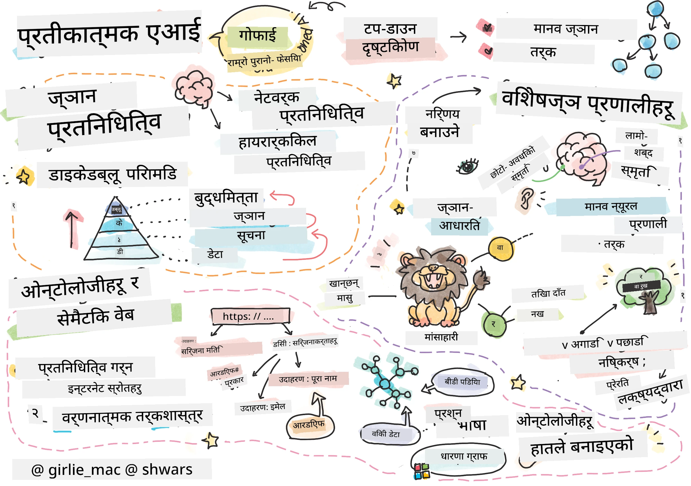
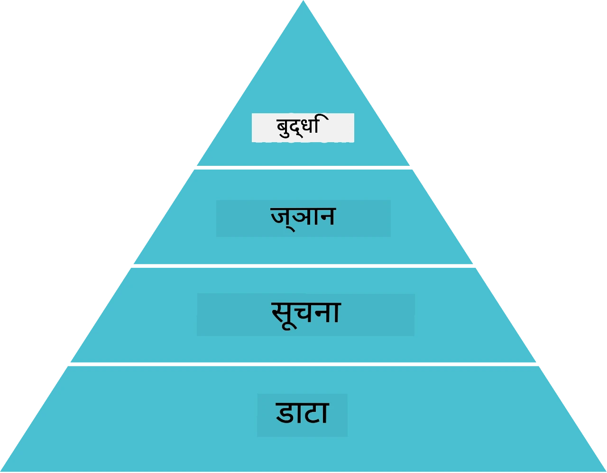
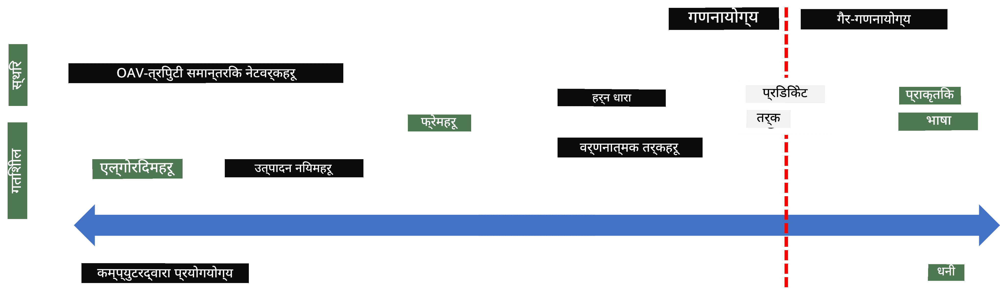
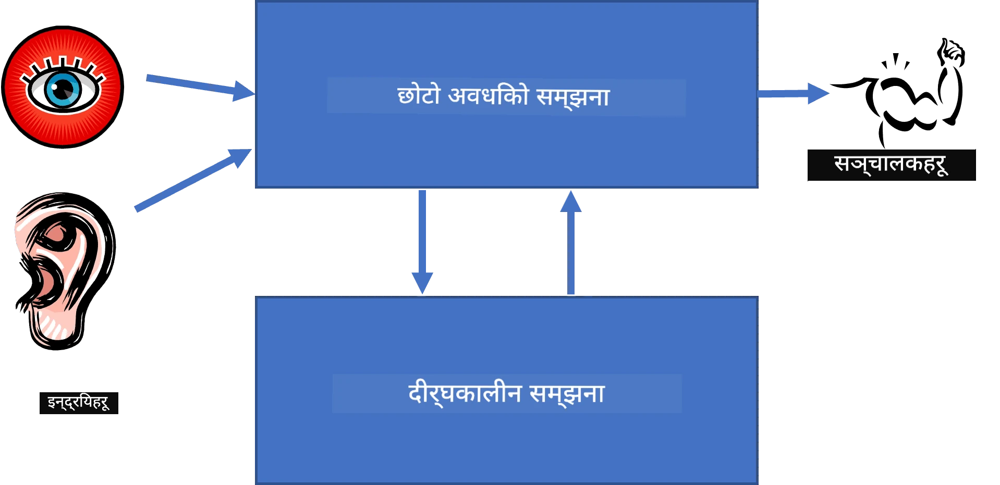
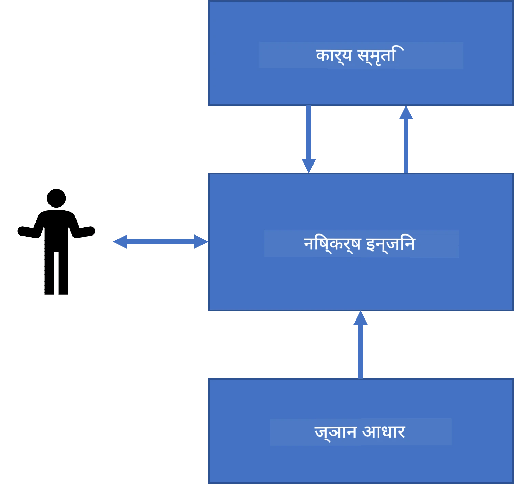
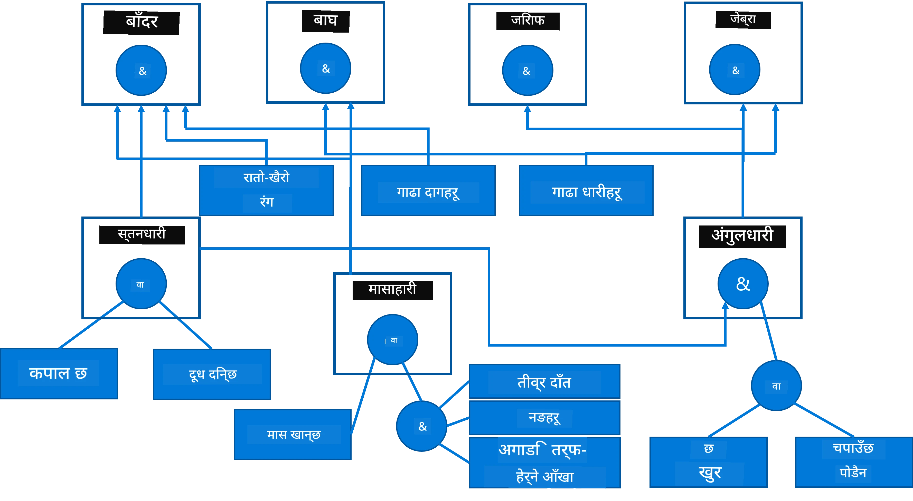
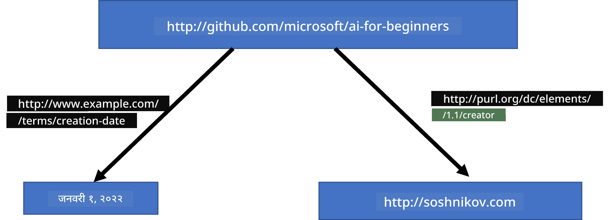
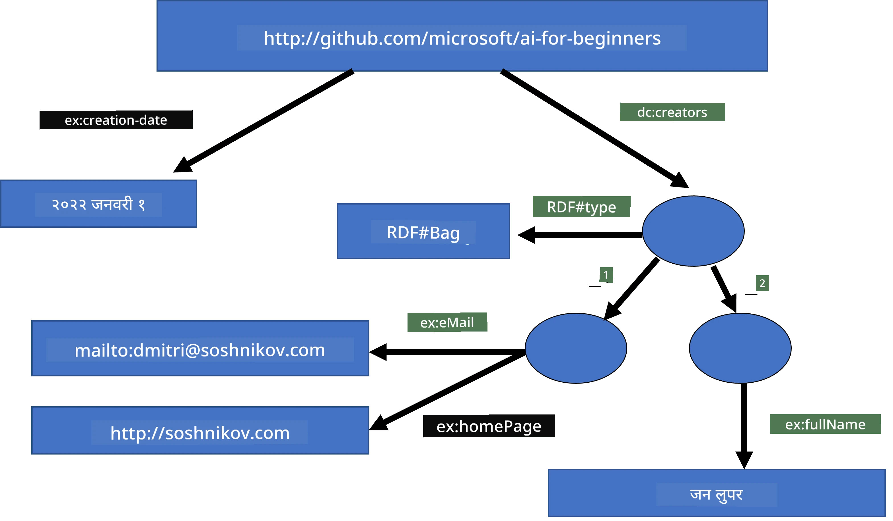
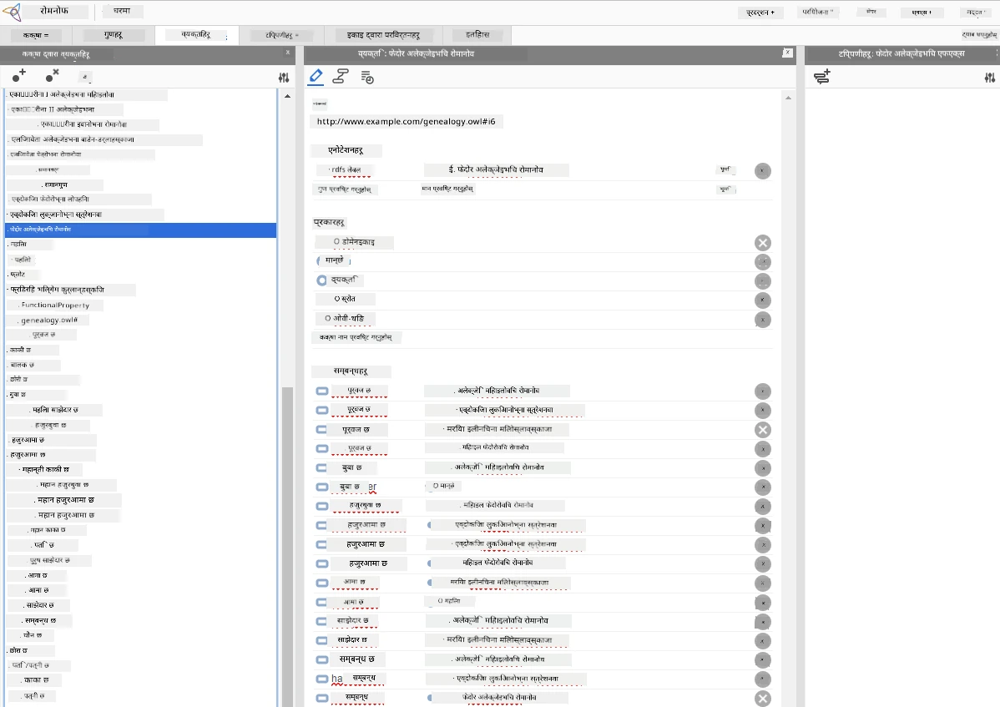

# ज्ञान प्रस्तुतीकरण र विशेषज्ञ प्रणालीहरू



> स्केचनोट द्वारा [टोमोमी इमुरा](https://twitter.com/girlie_mac)

कृत्रिम बुद्धिमत्ताको खोज ज्ञानको खोजमा आधारित छ, जसले संसारलाई मानिसहरूले जस्तै बुझ्न सक्छ। तर तपाईंले यो कसरी गर्ने?

## [पूर्व-लेक्चर क्विज](https://ff-quizzes.netlify.app/en/ai/quiz/3)

AI को प्रारम्भिक दिनहरूमा, बुद्धिमान प्रणालीहरू बनाउन माथिबाट तलको तरिका (अघिल्लो पाठमा छलफल गरिएको) लोकप्रिय थियो। विचार यस्तो थियो कि मानिसहरूबाट ज्ञान निकालेर कम्प्युटरले पढ्न सक्ने रूपान्तरण गर्ने, अनि त्यसलाई समस्या समाधानमा स्वतः प्रयोग गर्ने। यो तरिका दुई ठूलो विचारमा आधारित थियो:

* ज्ञान प्रस्तुतीकरण
* तर्क

## ज्ञान प्रस्तुतीकरण

संकेतिक AI मा एउटा महत्त्वपूर्ण अवधारणा **ज्ञान** हो। ज्ञानलाई *सूचना* वा *डेटा* बाट अलग पार्न महत्त्वपूर्ण छ। उदाहरणका लागि, किताबहरूमा ज्ञान हुन्छ भन्न सकिन्छ किनकि किताब पढेर एक विशेषज्ञ बन्न सकिन्छ। तर किताबहरूले भएको वस्तु वास्तवमा *डेटा* हो, जुन पढेर र विश्व मोडेलमा मिसाएर हामी त्यो डेटालाई ज्ञानमा परिवर्तन गर्छौं।

> ✅ **ज्ञान** हाम्रो टाउकोमा भएको र संसारको हाम्रो बुझाइलाई प्रतिनिधित्व गर्ने कुरा हो। यो सक्रिय **अध्ययन** प्रक्रियाबाट प्राप्त हुन्छ, जसले हामीले प्राप्त गरेको सूचना टुक्रा हाम्रो सक्रिय संसार मोडेलमा समाहित गर्दछ।

अधिकांश अवस्थामा, हामी ज्ञानलाई कडाइले परिभाषित गर्दैनौं, तर यसलाई सम्बन्धित अन्य अवधारणासँग [DIKW पिरामिड](https://en.wikipedia.org/wiki/DIKW_pyramid) को प्रयोग गरेर मिलाउँछौं। यसमा निम्न अवधारणाहरू छन्:

* **डेटा** भनेको भौतिक माध्यममा प्रतिनिधित्व गरिएका कुरा हुन्, जस्तै लेखिएको पाठ वा बोलेका शब्दहरू। डेटा मानिसहरूबाट स्वतन्त्र हुन्छ र मानिसहरूबीच साटासाट गर्न सकिन्छ।
* **सूचना** भनेको हामीले टाउकोमा डाटालाई कसरी व्याख्या गर्छौं भन्ने हो। उदाहरणका लागि, जब हामीले *कम्प्युटर* शब्द सुन्छौं, हामीलाई यसको केही बुझाइ हुन्छ।
* **ज्ञान** भनेको सूचना हाम्रो विश्व मोडेलमा समाहित हुनु हो। उदाहरणका लागि, एक पटक हामी कम्प्युटर के हो भनेर जान्दा, हामीलाई यसको काम गर्ने तरिका, लागत र प्रयोगबारे केही विचार आउँछ। यी अन्तरसम्बन्धित अवधारणाहरूको जालले हाम्रो ज्ञान बनाउँछ।
* **बुुद्धिमत्ता** भनेको हाम्रो बुझाइको एक स्तर हो, र यो *मेटा-ज्ञान* लाई प्रतिनिधित्व गर्छ, जस्तै ज्ञान कहिले र कसरी प्रयोग गर्ने भन्ने केही धारणा।



*चित्र [विकिपीडिया बाट](https://commons.wikimedia.org/w/index.php?curid=37705247), Longlivetheux द्वारा - आफ्नै काम, CC BY-SA 4.0*

त्यसैले, **ज्ञान प्रस्तुतीकरण** को समस्या कम्प्युटर भित्र डेटा को रूपमा ज्ञानलाई प्रभावकारी रूपमा प्रस्तुत गर्ने तरिका खोज्नु हो, जसले स्वतः प्रयोग सक्षम बनाओस्। यसलाई एक स्पेक्ट्रमको रूपमा हेर्न सकिन्छ:



> चित्र द्वारा [डमित्री सोस्नीकोव](http://soshnikov.com)

* बाँया तर्फ, कम्प्युटरहरूले प्रभावकारी रूपमा प्रयोग गर्न सक्ने सरल प्रकारका ज्ञान प्रस्तुतीकरणहरू छन्। सबैभन्दा सरल हो एल्गोरिदमिक, जहाँ ज्ञान कम्प्युटर प्रोग्राममार्फत प्रतिनिधित्व हुन्छ। तर यो ज्ञानलाई प्रतिनिधित्व गर्ने सबैभन्दा राम्रो तरिका होइन, किनकि यो लचिलो हुँदैन। हाम्रो टाउको भित्रको ज्ञान प्रायः गैर-एल्गोरिदमिक हुन्छ।
* दाहिने तर्फ, प्राकृतिक पाठ जस्ता प्रस्तुतीकरणहरू छन्। यो सबैभन्दा शक्तिशाली हो, तर स्वतः तर्कका लागि प्रयोग गर्न सकिँदैन।

> ✅ एउटा मिनेट सोच्नुहोस् कि तपाईंले आफ्नो टाउकोमा ज्ञानलाई कसरी प्रतिनिधित्व गर्नुहुन्छ र नोटहरूमा रूपान्तरण गर्नुहुन्छ। के त्यहाँ कुनै विशेष ढाँचा छ जसले तपाईंलाई सम्झनामा मद्दत गर्छ?

## कम्प्युटर ज्ञान प्रस्तुतीकरणहरू वर्गीकरण

हामी विभिन्न कम्प्युटर ज्ञान प्रस्तुतीकरण विधिहरूलाई निम्न वर्गहरूमा वर्गीकरण गर्न सक्छौं:

* **नेटवर्क प्रस्तुतीकरणहरू** हाम्रो टाउकोमा अन्तरसम्बन्धित अवधारणाहरूको नेटवर्क भएको तथ्यमा आधारित छन्। हामी समान नेटवर्कलाई कम्प्युटर भित्र ग्राफको रूपमा पुन: निर्मित गर्न सक्दछौं - यसलाई भनिन्छ **सामान्तरिक नेटवर्क**।

1. **बस्तु-विशेषता-मूल्य त्रिपल्टहरू** वा **विशेषता-मूल्य जोडीहरू**। ग्राफ कम्प्युटर भित्र नोडहरू र एजहरूको सूचीको रूपमा प्रतिनिधित्व गर्न सकिन्छ, त्यसैले हामी त्रिपल्टहरूको सूची मार्फत सामाजिक नेटवर्क प्रतिनिधित्व गर्न सक्छौं, जसमा वस्तुहरू, विशेषताहरू, र मूल्यहरू हुन्छन्। उदाहरणका लागि, प्रोग्रामिङ भाषाहरूबारे हामीले निम्न त्रिपल्टहरू बनाउँछौं:

Object | Attribute | Value
-------|-----------|------
Python | हो | Untyped-Language
Python | बनाएको-ले | Guido van Rossum
Python | ब्लक-सिन्ट्याक्स | इनडेन्टेसन
Untyped-Language | छैन | प्रकार परिभाषा

> ✅ सोच्नुहोस् कि अरु प्रकारका ज्ञान प्रतिनिधित्व गर्न त्रिपल्टहरू कसरी प्रयोग गर्न सकिन्छ।

2. **श्रृंखलात्मक प्रस्तुतीकरणहरू** यो तथ्यमा जोड दिन्छ कि हामी प्रायः हाम्रो टाउकोमा वस्तुहरूको हाइरार्की निर्माण गर्छौं। उदाहरणका लागि, हामीलाई थाहा छ कि क्यानेरी एक चर हो, र सबै चरहरूलाई पंख हुन्छ। हामीसँग क्यानरी के रंगको हुन्छ र यसको उडान गति कति हुन्छ भन्ने केही विचार पनि हुन्छ।

   - **फ्रेम प्रस्तुतीकरण** प्रत्येक वस्तु वा वस्तु वर्गलाई एक **फ्रेम** को रूपमा प्रतिनिधित्व गर्नेमा आधारित छ, जुन **स्लटहरू** समावेश गर्दछ। स्लटहरूले सम्भावित पूर्वनिर्धारित मूल्यहरू, मूल्य प्रतिबन्धहरू, वा मान प्राप्त गर्न सकिने प्रक्रियाहरू हुन्छन्। सबै फ्रेमहरूले वस्तु-उन्मुख प्रोग्रामिङ भाषाहरूमा वस्तु पदानुक्रम जस्तै हाइरार्की बनाउँछन्।
   - **परिदृश्यहरू** जटिल अवस्थाहरू प्रतिनिधित्व गर्ने विशेष प्रकारका फ्रेमहरू हुन् जसले समयसँग unfolding हुनसक्ने अवस्था देखाउँछन्।

**Python**

Slot | Value | Default value | Interval |
-----|-------|---------------|----------|
Name | Python | | |
Is-A | Untyped-Language | | |
Variable Case | | CamelCase | |
Program Length | | | 5-5000 lines |
Block Syntax | Indent | | |

3. **प्रक्रियागत प्रस्तुतीकरणहरू** ज्ञानलाई क्रियाहरूको सूचीको रूपमा प्रतिनिधित्व गर्नेमा आधारित छन्, जुन कुनै निश्चित सर्त पूर्ति हुँदा चलाउन सकिन्छ।
   - उत्पादन नियमहरू if-then कथनहरू हुन् जसले निष्कर्ष निकाल्न मद्दत गर्छ। उदाहरणका लागि, डाक्टरसँग नियम हुन सक्छ कि **यदि** बिरामीलाई ज्वरो बढी छ **वा** रगत परीक्षणमा C-रिएक्टिव प्रोटीन धेरै छ **भने** उनको सूजन छ। सर्तमा भेटिएपछि हामी सूजनको निष्कर्ष निकाल्न सक्छौं र थप तर्कमा प्रयोग गर्न सक्छौं।
   - एल्गोरिदमहरूलाई अर्को प्रक्रियागत प्रस्तुतीकरणको रूपमा सोच्न सकिन्छ, यद्यपि तिनीहरू ज्ञान-आधारित प्रणालीमा प्रायः प्रत्यक्ष प्रयोग हुँदैनन्।

4. **तर्क** अरिस्टोटलले मानव ज्ञानलाई प्रतिनिधित्व गर्ने तरिकाको रूपमा सुरुमा प्रस्ताव गरेका थिए।
   - Predicate Logic गणितीय सिद्धान्तका रूपमा कम्प्युटेबल हुन अति समृद्ध छ, त्यसैले यसबाट केही उपसमूह मात्र प्रयोग हुन्छ, जस्तै Prolog मा प्रयोग हुने Horn कलेजहरू।
   - Descriptive Logic एउटा तर्क प्रणालीहरूको परिवार हो जसले वस्तुहरूको हाइरार्की र वितरित ज्ञान प्रस्तुतीकरण जस्तै *सामान्तरिक वेब* को तर्क र प्रतिनिधित्व गर्दछ।

## विशेषज्ञ प्रणालीहरू

संकेतिक AI का प्रारम्भिक सफलताहरू मध्ये एक थिए भनिने **विशेषज्ञ प्रणालीहरू** - कम्प्युटर प्रणालीहरू जुन सीमित समस्या क्षेत्रमा एक विशेषज्ञको रूपमा काम गर्न डिजाइन गरिएका थिए। तिनीहरू कसै एक वा बढी मानव विशेषज्ञबाट निकालेको **ज्ञान आधार** मा आधारित थिए, र तिनीहरू सँग **तर्क इञ्जिन** थियो जसले त्यस माथि केही तर्क गर्छ।

 | 
---------------------------------------------|------------------------------------------------
मानव स्नायु प्रणालीको सरल संरचना | ज्ञान-आधारित प्रणालीको वास्तुकला

विशेषज्ञ प्रणालीहरू मानव तर्क प्रणाली जस्तै बनाइन्छन्, जसमा **छोटो अवधिको स्मृति** र **दीर्घकालीन स्मृति** हुन्छ। त्यस्तै, ज्ञान-आधारित प्रणालीहरूमा हामी निम्न घटकहरू छुट्याउँछौं:

* **समस्या स्मृति**: हाल समाधान भइरहेको समस्याको ज्ञान समावेश गर्दछ, उदाहरणका लागि बिरामीको तापक्रम वा रक्तचाप, के उनीमा सूजन छ वा छैन आदि। यसलाई **स्थिर ज्ञान** पनि भनिन्छ किनभने यसले अहिलेको समस्या अवस्थाको स्न्यापशट समेट्छ - तथाकथित *समस्या अवस्था*।
* **ज्ञान आधार**: समस्या क्षेत्रमा दीर्घकालीन ज्ञान प्रतिनिधित्व गर्दछ। यो मानव विशेषज्ञहरूबाट म्यानुअली निकालिन्छ र परामर्शहरूको बीच परिवर्तन हुँदैन। किनभने यसले एउटा समस्या अवस्थाबाट अर्कोमा नेविगेट गर्न अनुमति दिन्छ, यसलाई **गतिशील ज्ञान** पनि भनिन्छ।
* **तर्क इञ्जिन**: समस्या अवस्थाको ठाउँमा खोजी गर्ने सम्पूर्ण प्रक्रियालाई संचालित गर्छ, आवश्यक परे प्रयोगकर्ताबाट प्रश्न सोध्छ। यसले प्रत्येक अवस्थामा लागु गर्नुपर्ने नियमहरू पनि खोज्छ।

उदाहरणका लागि, एउटा जनावरको शारीरिक विशेषताहरूका आधारमा जनावर पहिचान गर्ने विशेषज्ञ प्रणाली लिऔं:



> चित्र द्वारा [डमित्री सोस्नीकोव](http://soshnikov.com)

यो चित्रलाई **AND-OR वृक्ष** भनिन्छ, र यो उत्पादन नियमहरूको सेटको ग्राफिकल प्रतिनिधित्व हो। ज्ञान एक्स्ट्र्याक्ट गर्दा सुरुमा वृक्ष बनाउनु उपयोगी हुन्छ। कम्प्युटर भित्र ज्ञान प्रतिनिधित्व गर्न नियमहरू प्रयोग गर्नु अधिक सुविधाजनक हुन्छ:

```
IF the animal eats meat
OR (animal has sharp teeth
    AND animal has claws
    AND animal has forward-looking eyes
) 
THEN the animal is a carnivore
```

तपाईंले देख्न सक्नुहुन्छ कि नियमको बाँया पट्टि प्रत्येक सर्त र क्रिया वस्तु-विशेषता-मूल्य (OAV) त्रिपल्टहरू हुन्। **कार्य स्मृति** समाधान भइरहेको समस्यासँग मिल्दोजुल्दो OAV त्रिपल्टहरू समेट्छ। **नियम इञ्जिन** सर्त पुरा हुने नियमहरू खोज्छ र तिनीहरूलाई लागू गर्छ, र कार्य स्मृतिमा अर्को त्रिपल्ट थप्छ।

> ✅ आफू मन पर्ने विषयमा आफ्नो AND-OR वृक्ष लेख्नुहोस्!

### अग्रगामी बनाम पछाडि तर्क

माथि वर्णित प्रक्रिया **अग्रगामी तर्क** भनिन्छ। यसले कुनै प्रारम्भिक डेटा काम स्मृतिमा रहेको मान्छ र तलको तर्क लूप चलाउँछ:

1. यदि लक्षित विशेषता काम स्मृतिमा छ भने - रोक्नुहोस् र परिणाम दिनुहोस्
2. सबै नियमहरू जो अहिलेको सर्त पुरा गर्छन् खोज्नुहोस् - **विवाद सेट** प्राप्त गर्नुहोस्।
3. **विवाद समाधान** गर्नुहोस् - एक नियम छनोट गर्नुहोस् जुन यस चरणमा लागू हुन्छ। विभिन्न विवाद समाधान रणनीतिहरू हुन सक्छन्:
   - नियम आधारमा पहिलो लागू हुन सक्ने नियम चयन गर्नुहोस्
   - कुनैपनि नियम बेतरतीब चयन गर्नुहोस्
   - *विशेष* नियम चयन गर्नुहोस्, जस्तै सबैभन्दा धेरै सर्तहरू पूरा गर्ने नियम “बाँया पट्टि” (LHS)
4. छनोट गरिएका नियम लागू गरेर समस्या अवस्थामा नयाँ ज्ञान थप्नुहोस्
5. चरण 1 बाट दोहोर्‍याउनुहोस्।

तर कहिलेकाहीं हामी सुरुमा समस्याबारे खाली ज्ञान राख्न चाहन्छौं र प्रश्न सोधेर निष्कर्षमा पुग्न चाहन्छौं। जस्तै, चिकित्सा निदान गर्दा हामी सबै मेडिकल परीक्षण पहिले नै नगरेका हुन्छौं। जब निर्णय लिनुपर्ने हुन्छ तब मात्र परीक्षण गर्छौं।

यो प्रक्रिया **पछाडि तर्क** प्रयोग गरेर मोडेल गर्न सकिन्छ। यो **लक्ष्य** द्वारा सञ्चालित हुन्छ - खोजिने विशेषता मूल्य:

1. ती सबै नियमहरू छनोट गर्नुहोस् जसले लक्ष्यको मूल्य दिन सक्छन् (अर्थात् लक्ष्य RHS ("दायाँ पट्टि") मा छन्) - विवाद सेट
2. यदि यस विशेषताका लागि नियम छैन, वा कुनै नियमले प्रयोगकर्ताबाट मूल्य सोध्नुपर्ने भन्छ भने - सोध्नुहोस्, अन्यथा:
3. विवाद समाधान नीति प्रयोग गरी एउटा नियम छनोट गर्नुहोस् जुन हामी *परिकल्पना* को रूपमा प्रयोग गर्नेछौं - हामी यसलाई प्रमाणित गर्ने प्रयास गर्नेछौं
4. नियमको LHS का सबै विशेषताहरूका लागि प्रक्रियालाई पुनरावृत्ति गरेर तिनीहरूलाई पनि लक्ष्य प्रमाणित गर्ने प्रयास गर्नुहोस्
5. प्रक्रिया कुनै अवस्थामा असफल भएमा चरण 3 मा अर्को नियम प्रयोग गर्नुहोस्।

> ✅ कुन अवस्थामा अग्रगामी तर्क धेरै उपयुक्त हुन्छ? पछाडि तर्क कस्तो हुन्छ?

### विशेषज्ञ प्रणालीहरु कार्यान्वयन

विशेषज्ञ प्रणालीहरू निम्न उपकरणहरू प्रयोग गरेर कार्यान्वयन गर्न सकिन्छ:

* कुनै उच्च स्तरको प्रोग्रामिङ भाषामा सिधै प्रोग्राम गर्नु। यो राम्रो विचार होइन किनभने ज्ञान-आधारित प्रणालीको मुख्य फाइदा ज्ञान र तर्क अलग हुनु हो, र सम्भावित रूपमा समस्या क्षेत्र विशेषज्ञले तर्क प्रक्रिया नबुझिकन नियमहरू लेख्न सक्नुपर्छ।
* **विशेषज्ञ प्रणाली शेल** प्रयोग गर्नु, अर्थात् ज्ञान प्रस्तुतीकरण भाषाको प्रयोग गरेर ज्ञान प्रविष्टिका लागि विशेष डिजाइन गरिएको प्रणाली।

## ✍️ अभ्यास: जनावर तर्क

अग्रगामी र पछाडि तर्क विशेषज्ञ प्रणाली कार्यान्वयनको उदाहरणका लागि हेर्नुहोस् [Animals.ipynb](https://github.com/microsoft/AI-For-Beginners/blob/main/lessons/2-Symbolic/Animals.ipynb)।

> **नोट**: यो उदाहरण सामान्य छ र मात्र विशेषज्ञ प्रणाली कस्तो हुन्छ भनेर विचार दिन्छ। यस्तो प्रणाली बनाउँदा तपाईंले २००+ नियम पुगेपछि मात्र केही *बुद्धिमान* व्यवहार देख्नुहुनेछ। कुनै बिन्दुमा नियमहरू धेरै जटिल हुन्छन् र सबै याद राख्न गाह्रो हुन्छ, त्यस बेला तपाईंले किन कुनै निर्णय प्रणालीले लिन्छ भनेर सोच्नु पर्ने हुन्छ। तर ज्ञान-आधारित प्रणालीहरूको महत्वपूर्ण विशेषता भनेको तपाईं सधैं स्पष्ट रूपमा *व्याख्या* गर्न सक्नुहुनेछ कि निर्णय कसरी लिइयो।

## ओन्टोलोजीहरू र सामान्तरिक वेब

आधुनिक युगको अन्त्यमा इन्टरनेट स्रोतहरूलाई एनोटेट गर्न ज्ञान प्रस्तुतीकरण प्रयोग गर्ने पहल थियो, जसले विशिष्ट क्वेरीहरूसँग मेल खाने स्रोतहरू खोज्न सम्भव बनायो। यसलाई **सामान्तरिक वेब** भनियो, र यसले निम्न अवधारणाहरूमा आधारित थियो:

- विशेष ज्ञान प्रस्तुतीकरण, विशेषगरी **[वर्णनात्मक तर्क](https://en.wikipedia.org/wiki/Description_logic)** (DL) मा आधारित। यसले फ्रेम ज्ञान प्रस्तुतीकरण जस्तै वस्तुहरूको हाइरार्की बनाउँछ गुणहरू सहित, तर यसमा औपचारिक तर्कीय अर्थ र तर्क समावेश हुन्छ। DL को एउटा परिवार छ जुन अभिव्यक्तिशीलता र तर्कको एल्गोरिदमिक जटिलताको बीच सन्तुलन गर्छ।
- वितरित ज्ञान प्रस्तुतीकरण, जहाँ सबै अवधारणाहरूलाई वैश्विक URI अनुकरणकर्ताले प्रतिनिधित्व गर्छ, जसले इन्टरनेटभर फैलिएको ज्ञान हाइरार्कीहरू सिर्जना गर्न सम्भव बनाउँछ।
- ज्ञान वर्णनाका लागि XML-आधारित भाषाहरूको परिवार: RDF (Resource Description Framework), RDFS (RDF Schema), OWL (Ontology Web Language)।

Semantic Web मा एक मुख्य अवधारणा हो **Ontology** को अवधारणा। यसले केही औपचारिक ज्ञान प्रतिनिधित्व प्रयोग गरी समस्याको डोमेनको स्पष्ट निर्दिष्टता जनाउँछ। सबैभन्दा सरल ontology समस्या डोमेनमा वस्तुहरूको मात्र एक पदानुक्रम हुन सक्छ, तर जटिल ontologies मा नियमहरू समावेश हुनेछन् जुन inference को लागि प्रयोग गर्न सकिन्छ।

Semantic Web मा, सबै प्रतिनिधित्व त्रिपलहरूमा आधारित हुन्छन्। प्रत्येक वस्तु र प्रत्येक सम्बन्धलाई URI द्वारा विशिष्ट रूपमा पहिचान गरिन्छ। उदाहरणका लागि, यदि हामी भन्न चाहन्छौं कि यो AI Curriculum डिमिट्री सोष्निकोभले १ जनवरी २०२२ मा विकास गरेको छ - यहाँ प्रयोग गर्न सकिने त्रिपलहरू छन्:



```
http://github.com/microsoft/ai-for-beginners http://www.example.com/terms/creation-date “Jan 1, 2022”
http://github.com/microsoft/ai-for-beginners http://purl.org/dc/elements/1.1/creator http://soshnikov.com
```

> ✅ यहाँ `http://www.example.com/terms/creation-date` र `http://purl.org/dc/elements/1.1/creator` केही प्रसिद्ध र सार्वभौमिक रूपमा स्वीकार गरिएका URI हरू हुन् जसले *creator* र *creation date* को अवधारणाहरू व्यक्त गर्छन्।

थप जटिल अवस्थामा, यदि हामी निर्माता हरूको सूची परिभाषित गर्न चाहन्छौं भने, हामी RDF मा परिभाषित केही डाटा संरचनाहरू प्रयोग गर्न सक्छौं।



> माथिका डायग्रामहरू [डिमिट्री सोष्निकोभ](http://soshnikov.com) द्वारा

Semantic Web बनाउने प्रगति खोजी इन्जिन र प्राकृतिक भाषा प्रशोधन प्रविधिहरूको सफलताले केहि हदसम्म ढिलो बनायो, जसले पाठबाट संरचित डाटा निकाल्न अनुमति दिन्छ। यद्यपि केही क्षेत्रहरूमा अझै पनि ontologies र ज्ञान आधारहरूलाई कायम राख्न महत्त्वपूर्ण प्रयासहरू भएका छन्। केही ध्यान दिन योग्य परियोजनाहरू:

* [WikiData](https://wikidata.org/) विकिपिडियासँग सम्बन्धित मेसिन पठनीय ज्ञान आधारहरूको संग्रह हो। डाटाको अधिकांश भाग विकिपिडिया *InfoBoxes* बाट निकालिएको हो, विकिपिडिया पृष्ठहरू भित्रको संरचित सामग्रीका टुक्राहरू। तपाईं SPARQL मा wikidata [query](https://query.wikidata.org/) गर्न सक्नुहुन्छ, Semantic Web को लागि विशेष क्वेरी भाषा हो। यहाँ एउटा नमूना क्वेरी छ जुन मानिसहरू बीच सबैभन्दा लोकप्रिय आँखाको रंग देखाउँछ:

```sparql
#defaultView:BubbleChart
SELECT ?eyeColorLabel (COUNT(?human) AS ?count)
WHERE
{
  ?human wdt:P31 wd:Q5.       # human instance-of homo sapiens
  ?human wdt:P1340 ?eyeColor. # human eye-color ?eyeColor
  SERVICE wikibase:label { bd:serviceParam wikibase:language "en". }
}
GROUP BY ?eyeColorLabel
```

* [DBpedia](https://www.dbpedia.org/) अरूको जस्तै WikiData को प्रयास हो।

> ✅ यदि तपाईं आफ्नै ontologies बनाउन अभ्यास गर्न चाहनुहुन्छ वा अवस्थित ontologies खोल्न चाहनुहुन्छ भने, त्यहाँ एउटा उत्कृष्ट भिजुअल ontology सम्पादक छ जसलाई [Protégé](https://protege.stanford.edu/) भनिन्छ। यसलाई डाउनलोड गर्नुहोस्, वा अनलाइन प्रयोग गर्नुहोस्।



*Web Protégé सम्पादक रोमानोव परिवार ontology खोलिएको छ। स्क्रिनसट डिमिट्री सोष्निकोभ द्वारा*

## ✍️ अभ्यास: परिवार Ontology

Semantic Web प्रविधिहरू प्रयोग गरी परिवार सम्बन्धहरूको तर्क गर्नको लागि उदाहरणका लागि [FamilyOntology.ipynb](https://github.com/Ezana135/AI-For-Beginners/blob/main/lessons/2-Symbolic/FamilyOntology.ipynb) हेर्नुहोस्। हामी साझा GEDCOM ढाँचामा परिवारको रुख लिनेछौं र परिवार सम्बन्धहरूको ontology लिनेछौं र दिइएको व्यक्तिहरूको समूहका लागि सबै पारिवारिक सम्बन्धहरूको ग्राफ निर्माण गर्नेछौं।

## Microsoft Concept Graph

अधिकांश अवस्थामा, ontologies सावधानीपूर्वक हातले सिर्जना गरिन्छन्। यद्यपि, यो सम्भव पनि छ कि **खनिज** ungstructured डाटाबाट, उदाहरणका लागि प्राकृतिक भाषा पाठहरूबाट ontologies निकाल्न।

त्यस्तो एउटा प्रयास Microsoft Research द्वारा गरिएको थियो, र परिणामस्वरूप आएको छ [Microsoft Concept Graph](https://blogs.microsoft.com/ai/microsoft-researchers-release-graph-that-helps-machines-conceptualize/?WT.mc_id=academic-77998-cacaste)।

यो धेरै संस्थाहरूको संग्रह हो जुन `is-a` विरासत सम्बन्ध प्रयोग गरी सँगै समूहबद्ध गरिएको छ। यसले यस प्रकारका प्रश्नहरूको उत्तर दिन अनुमति दिन्छ "Microsoft के हो?" - जवाफ केही यस प्रकार हो "एक कम्पनी संभावना 0.87 संग, र एक ब्रान्ड संभावना 0.75 संग"।

यो ग्राफ REST API को रूपमा उपलब्ध छ, वा सबै संस्थाहरूका जोडीहरूको ठूलो डाउनलोडयोग्य पाठ फाइलको रूपमा।

## ✍️ अभ्यास: एक Concept Graph

[MSConceptGraph.ipynb](https://github.com/microsoft/AI-For-Beginners/blob/main/lessons/2-Symbolic/MSConceptGraph.ipynb) नोटबुक प्रयास गर्नुहोस् र हेर्नुहोस् कि कसरी Microsoft Concept Graph संग समाचार सामग्रीहरूलाई केही वर्गहरूमा समूहबद्ध गर्न सकिन्छ।

## निष्कर्ष

आजकल, AI प्रायः *Machine Learning* वा *Neural Networks* को पर्यायको रूपमा लिइन्छ। तर, मानिसहरूले पनि स्पष्ट तर्क प्रदर्शन गर्छन्, जुन अहिले न्युरेल नेटवर्कहरूले सामना गरिरहेका छैनन्। वास्तविक संसारका परियोजनाहरूमा, स्पष्ट तर्क अझै पनि ती कार्यहरू गर्न प्रयोग गरिन्छ जसले व्याख्या गर्न आवश्यक पर्छ, वा प्रणालीको व्यवहार नियन्त्रित तरिकाले परिवर्तन गर्न सकिन्छ।

## 🚀 चुनौती

यस पाठसँग सम्बन्धित परिवार Ontology नोटबुकमा, अन्य पारिवारिक सम्बन्धहरूसँग प्रयोग गर्ने अवसर छ। परिवार रुखमा मानिसहरूबीच नयाँ सम्बन्धहरूको खोजी गर्नुहोस्।

## [पाठपछिको प्रश्नोत्तरी](https://ff-quizzes.netlify.app/en/ai/quiz/4)

## समीक्षा र स्व-अध्ययन

इन्टरनेटमा अनुसन्धान गरी ती क्षेत्रहरू पत्ता लगाउनुहोस् जहाँ मानिसहरूले ज्ञानको मात्रमापन र कोडिफिकेसन प्रयास गरेका छन्। ब्लूमको ट्याक्सोनोमी हेर्नुहोस्, र इतिहासमा फर्केर जानुहोस् कि मानिसहरूले आफ्नो संसार कसरी बुझ्न कोशिस गरेका थिए। लिनायसले जीवहरूको ट्याक्सोनोमी कसरी बनायो अन्वेषण गर्नुहोस्, र डिमिट्री मेंडेलिभले कसरी रासायनिक तत्वहरूको वर्णन र समूह गर्नु भयो अवलोकन गर्नुहोस्। तपाईं अरू कस्ता रोचक उदाहरणहरू फेला पार्न सक्नुहुन्छ?

**असाइन्मेन्ट**: [Build an Ontology](assignment.md)

---

<!-- CO-OP TRANSLATOR DISCLAIMER START -->
**अस्वीकरण**:  
यस दस्तावेज़लाई AI अनुवाद सेवा [Co-op Translator](https://github.com/Azure/co-op-translator) प्रयोग गरी अनुवाद गरिएको हो। हामी सटीकताको प्रयास गर्छौं, तर कृपया जानकारि राख्नुहोस् कि स्वचालित अनुवादमा त्रुटिहरु वा अशुद्धिहरु हुन सक्छन्। मूल दस्तावेज आफ्नो मूल भाषामा आधिकारिक श्रोत मानिनुपर्छ। महत्वपूर्ण जानकारीको लागि, व्यावसायिक मानव अनुवाद सिफारिस गरिन्छ। यस अनुवादको प्रयोगबाट सिर्जित कुनै पनि गलतफहमी वा गलत व्याख्याको लागि हामी जिम्मेवार छैनौं।
<!-- CO-OP TRANSLATOR DISCLAIMER END -->