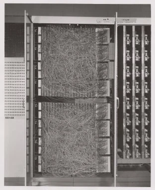
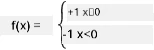

# न्यूरल नेटवर्कको परिचय: परसेप्ट्रोन

## [पूर्व-व्याख्यान क्विज](https://ff-quizzes.netlify.app/en/ai/quiz/5)

आधुनिक न्यूरल नेटवर्कको जस्तै केही बनाउने पहिलो प्रयास फ्र्यांक रोसेनब्लाटले 1957 मा कोर्नेल एरोनटिकल ल्याबोरेटरीमा गरेका थिए। यो "मार्क-1" नामक हार्डवेयर कार्यान्वयन थियो, जसलाई त्रिभुज, वर्ग र वृतजस्ता साधारण ज्यामितीय आकृतिहरू चिन्न डिजाइन गरिएको थियो।

|      |      |
|--------------|-----------|
| | |

> तस्बिरहरू [विकिपीडिया](https://en.wikipedia.org/wiki/Perceptron) बाट

इनपुट तस्बिरलाई 20x20 फोटोसेल एरेले प्रतिनिधित्व गरिन्थ्यो, जसले गर्दा न्यूरल नेटवर्कसँग 400 इनपुट र एउटा बाइनरी आउटपुट हुन्थ्यो। साधारण नेटवर्कमा एउटा न्यूरोन हुन्थ्यो, जसलाई **थ्रेसहोल्ड लजिक युनिट** पनि भनिन्थ्यो। न्यूरल नेटवर्कका वेटहरू पोटेन्सियोमिटरजस्तै काम गर्थे, जसलाई तालिमको क्रममा म्यानुअल रूपमा समायोजन गर्नुपर्ने हुन्थ्यो।

> ✅ पोटेन्सियोमिटर भनेको सर्किटको प्रतिरोध समायोजन गर्न प्रयोग गरिने उपकरण हो।

> त्यतिबेला न्यूयोर्क टाइम्सले परसेप्ट्रोनबारे लेखेको थियो: *[नेभी] ले आशा गरेको छ कि यो इलेक्ट्रोनिक कम्प्युटरको भ्रूणले हिँड्न, बोल्न, देख्न, लेख्न, आफैंलाई पुन: उत्पादन गर्न र आफ्नो अस्तित्वको चेतना राख्न सक्नेछ।*

## परसेप्ट्रोन मोडेल

मानौं हाम्रो मोडेलमा N विशेषताहरू छन्, जसको इनपुट भेक्टर N आकारको भेक्टर हुनेछ। परसेप्ट्रोन एक **बाइनरी वर्गीकरण** मोडेल हो, जसले इनपुट डाटाका दुई वर्गहरू छुट्याउन सक्छ। हामी मान्छौं कि प्रत्येक इनपुट भेक्टर x का लागि हाम्रो परसेप्ट्रोनको आउटपुट +1 वा -1 हुनेछ, वर्गको आधारमा। आउटपुट निम्न सूत्र प्रयोग गरेर गणना गरिन्छ:

y(x) = f(w<sup>T</sup>x)

जहाँ f एक स्टेप सक्रियता (activation) फङ्क्शन हो।

<!-- img src="http://www.sciweavers.org/tex2img.php?eq=f%28x%29%20%3D%20%5Cbegin%7Bcases%7D%0A%20%20%20%20%20%20%20%20%20%2B1%20%26%20x%20%5Cgeq%200%20%5C%5C%0A%20%20%20%20%20%20%20%20%20-1%20%26%20x%20%3C%200%0A%20%20%20%20%20%20%20%5Cend%7Bcases%7D%20%5C%5C%0A&bc=White&fc=Black&im=jpg&fs=12&ff=arev&edit=0" align="center" border="0" alt="f(x) = \begin{cases} +1 & x \geq 0 \\ -1 & x < 0 \end{cases} \\" width="154" height="50" / -->


## परसेप्ट्रोनलाई तालिम दिने

परसेप्ट्रोनलाई तालिम दिन हामीले यस्तो वेट्स भेक्टर w पत्ता लगाउनुपर्छ, जसले अधिकांश मानहरूलाई सही रूपमा वर्गीकृत गर्छ, अर्थात् न्यूनतम **त्रुटि** दिन्छ। यो त्रुटि E लाई **परसेप्ट्रोन मापदण्ड** द्वारा निम्न तरिकाले परिभाषित गरिन्छ:

E(w) = -&sum;w<sup>T</sup>x<sub>i</sub>t<sub>i</sub>

जहाँ:

* योग ती प्रशिक्षण डाटा बिन्दुहरू i मा लिइन्छ, जसले गलत वर्गीकरण दिन्छ।
* x<sub>i</sub> इनपुट डाटा हो, र t<sub>i</sub> नकारात्मक र सकारात्मक उदाहरणहरूको लागि क्रमशः -1 वा +1 हो।

यो मापदण्डलाई वेट्स w को फङ्क्शनको रूपमा लिइन्छ, र हामीले यसलाई न्यूनतम बनाउनुपर्छ। प्रायः, **ग्रेडियन्ट डिसेन्ट** नामक विधि प्रयोग गरिन्छ, जसमा हामी केही सुरुवाती वेट्स w<sup>(0)</sup> बाट सुरु गर्छौं, र प्रत्येक चरणमा वेट्सलाई निम्न सूत्र अनुसार अद्यावधिक गर्छौं:

w<sup>(t+1)</sup> = w<sup>(t)</sup> - &eta;&nabla;E(w)

यहाँ &eta; लाई **लर्निङ दर** भनिन्छ, र &nabla;E(w) ले E को **ग्रेडियन्ट** जनाउँछ। ग्रेडियन्ट गणना गरेपछि, हामीसँग हुन्छ:

w<sup>(t+1)</sup> = w<sup>(t)</sup> + &sum;&eta;x<sub>i</sub>t<sub>i</sub>

Python मा एल्गोरिदम यसरी देखिन्छ:

```python
def train(positive_examples, negative_examples, num_iterations = 100, eta = 1):

    weights = [0,0,0] # Initialize weights (almost randomly :)
        
    for i in range(num_iterations):
        pos = random.choice(positive_examples)
        neg = random.choice(negative_examples)

        z = np.dot(pos, weights) # compute perceptron output
        if z < 0: # positive example classified as negative
            weights = weights + eta*weights.shape

        z  = np.dot(neg, weights)
        if z >= 0: # negative example classified as positive
            weights = weights - eta*weights.shape

    return weights
```


## निष्कर्ष

यस पाठमा, तपाईंले परसेप्ट्रोनबारे सिक्नुभयो, जुन एक बाइनरी वर्गीकरण मोडेल हो, र यसलाई वेट्स भेक्टर प्रयोग गरेर कसरी तालिम दिने भन्ने कुरा पनि सिक्नुभयो।

## 🚀 चुनौती

यदि तपाईं आफ्नो परसेप्ट्रोन बनाउन प्रयास गर्न चाहनुहुन्छ भने, [Microsoft Learn](https://docs.microsoft.com/en-us/azure/machine-learning/component-reference/two-class-averaged-perceptron?WT.mc_id=academic-77998-cacaste) मा रहेको यो प्रयोगशाला प्रयास गर्नुहोस्, जसले [Azure ML designer](https://docs.microsoft.com/en-us/azure/machine-learning/concept-designer?WT.mc_id=academic-77998-cacaste) प्रयोग गर्दछ।

## [पश्च-व्याख्यान क्विज](https://ff-quizzes.netlify.app/en/ai/quiz/6)

## समीक्षा र आत्म-अध्ययन

परसेप्ट्रोन प्रयोग गरेर कसरी सानो समस्या र वास्तविक जीवनका समस्याहरू समाधान गर्न सकिन्छ भन्ने हेर्न र सिकाइ जारी राख्न [Perceptron](Perceptron.ipynb) नोटबुकमा जानुहोस्।

यहाँ परसेप्ट्रोनबारे एउटा रोचक [लेख](https://towardsdatascience.com/what-is-a-perceptron-basics-of-neural-networks-c4cfea20c590) पनि छ।

## [असाइनमेन्ट](lab/README.md)

यस पाठमा, हामीले बाइनरी वर्गीकरण कार्यका लागि परसेप्ट्रोन कार्यान्वयन गरेका छौं, र यसलाई दुई हस्तलेखन गरिएका अंकहरू बीच वर्गीकृत गर्न प्रयोग गरेका छौं। यस प्रयोगशालामा, तपाईंलाई अंक वर्गीकरणको समस्या पूर्ण रूपमा समाधान गर्न भनिएको छ, अर्थात् दिइएको तस्बिरसँग मेल खाने सम्भावित अंक निर्धारण गर्नुहोस्।

* [निर्देशहरू](lab/README.md)
* [नोटबुक](lab/PerceptronMultiClass.ipynb)

---

