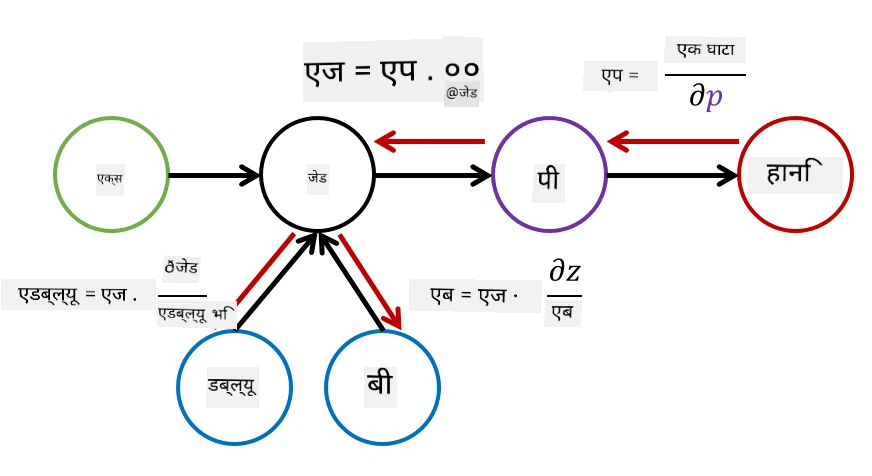

# न्युरल नेटवर्कको परिचय। मल्टि-लेयर्ड पर्सेप्ट्रोन

अघिल्लो खण्डमा, तपाईंले सबैभन्दा सरल न्युरल नेटवर्क मोडेल - एक-स्तरीय पर्सेप्ट्रोन, एक रेखीय दुई-वर्ग वर्गीकरण मोडेलको बारेमा सिक्नुभयो।

यस खण्डमा हामी यो मोडेललाई थप लचिलो फ्रेमवर्कमा विस्तार गर्नेछौं, जसले हामीलाई निम्न कार्यहरू गर्न अनुमति दिनेछ:

* दुई-वर्गको अतिरिक्त **मल्टि-वर्ग वर्गीकरण** गर्न
* वर्गीकरणको अतिरिक्त **रेग्रेशन समस्या** समाधान गर्न
* रेखीय रूपमा अलग गर्न नसकिने वर्गहरू छुट्याउन

हामी हाम्रो आफ्नै मोड्युलर फ्रेमवर्क पनि Python मा विकास गर्नेछौं, जसले विभिन्न न्युरल नेटवर्क आर्किटेक्चर निर्माण गर्न अनुमति दिनेछ।

## [प्री-लेक्चर क्विज](https://ff-quizzes.netlify.app/en/ai/quiz/7)

## मेसिन लर्निङको औपचारिकता

मेसिन लर्निङ समस्यालाई औपचारिक बनाउने कामबाट सुरु गरौं। मानौं कि हामीसँग प्रशिक्षण डेटासेट **X** र लेबलहरू **Y** छन्, र हामीले एक मोडेल *f* निर्माण गर्नुपर्छ जसले सबैभन्दा सही भविष्यवाणीहरू गर्नेछ। भविष्यवाणीहरूको गुणस्तर **Loss function** &lagran; द्वारा मापन गरिन्छ। निम्न लस फङ्सनहरू प्राय: प्रयोग गरिन्छ:

* रिग्रेशन समस्याको लागि, जहाँ हामीले कुनै संख्या भविष्यवाणी गर्नुपर्छ, हामी **absolute error** &sum;i|f(x(i))-y(i)|, वा **squared error** &sum;i(f(x(i))-y(i))2 प्रयोग गर्न सक्छौं।
* वर्गीकरणको लागि, हामी **0-1 loss** (जसले मोडेलको **accuracy** जस्तै काम गर्छ), वा **logistic loss** प्रयोग गर्छौं।

एक-स्तरीय पर्सेप्ट्रोनको लागि, फङ्सन *f* लाई रेखीय फङ्सन *f(x)=wx+b* को रूपमा परिभाषित गरिएको थियो (यहाँ *w* तौल म्याट्रिक्स हो, *x* इनपुट विशेषताहरूको भेक्टर हो, र *b* बायस भेक्टर हो)। विभिन्न न्युरल नेटवर्क आर्किटेक्चरहरूको लागि, यो फङ्सनले थप जटिल रूप लिन सक्छ।

> वर्गीकरणको अवस्थामा, सम्बन्धित वर्गहरूको सम्भाव्यता नेटवर्कको आउटपुटको रूपमा प्राप्त गर्नु प्राय: वाञ्छनीय हुन्छ। मनमानी संख्याहरूलाई सम्भाव्यतामा रूपान्तरण गर्न (जस्तै आउटपुटलाई सामान्यीकरण गर्न), हामी प्राय: **softmax** फङ्सन &sigma; प्रयोग गर्छौं, र फङ्सन *f* *f(x)=&sigma;(wx+b)* हुन्छ।

उपरोक्त *f* को परिभाषामा, *w* र *b* लाई **parameters** &theta;=⟨*w,b*⟩ भनिन्छ। दिइएको डेटासेट ⟨**X**,**Y**⟩ को आधारमा, हामी सम्पूर्ण डेटासेटमा समग्र त्रुटि &theta; को रूपमा गणना गर्न सक्छौं।

> ✅ **न्युरल नेटवर्क प्रशिक्षणको लक्ष्य भनेको &theta; परिमार्जन गरेर त्रुटि न्यूनतम बनाउनु हो।**

## ग्रेडियन्ट डिसेन्ट अप्टिमाइजेसन

फङ्सन अप्टिमाइजेसनको एक प्रसिद्ध विधि **gradient descent** हो। यसको विचार यो हो कि हामी लस फङ्सनको डेरिभेटिभ (बहु-आयामको अवस्थामा **gradient** भनिन्छ) परिमितहरूसँग गणना गर्न सक्छौं, र परिमितहरू यसरी परिवर्तन गर्न सक्छौं कि त्रुटि घट्छ। यसलाई निम्नानुसार औपचारिक बनाउन सकिन्छ:

* परिमितहरूलाई केही अनियमित मानहरू w(0), b(0) द्वारा आरम्भ गर्नुहोस्।
* निम्न चरण धेरै पटक दोहोर्याउनुहोस्:
    - w(i+1) = w(i)-&eta;&part;&lagran;/&part;w
    - b(i+1) = b(i)-&eta;&part;&lagran;/&part;b

प्रशिक्षणको क्रममा, अप्टिमाइजेसन चरणहरू सम्पूर्ण डेटासेटलाई ध्यानमा राखेर गणना गरिनुपर्छ (स्मरण रहोस् कि लस सबै प्रशिक्षण नमूनाहरूको योगको रूपमा गणना गरिन्छ)। तर, वास्तविक जीवनमा हामी डेटासेटका साना भागहरूलाई **minibatches** भनिन्छ, र डाटाको उपसमूहको आधारमा ग्रेडियन्टहरू गणना गर्छौं। किनकि उपसमूह प्रत्येक पटक अनियमित रूपमा लिइन्छ, यस्तो विधिलाई **stochastic gradient descent** (SGD) भनिन्छ।

## मल्टि-लेयर्ड पर्सेप्ट्रोन र ब्याकप्रोपोगेसन

एक-स्तरीय नेटवर्क, जस्तो कि हामीले माथि देख्यौं, रेखीय रूपमा अलग गर्न सकिने वर्गहरू वर्गीकृत गर्न सक्षम छ। थप समृद्ध मोडेल निर्माण गर्न, हामी नेटवर्कका धेरै तहहरू संयोजन गर्न सक्छौं। गणितीय रूपमा यसको मतलब फङ्सन *f* को थप जटिल रूप हुनेछ, र यो धेरै चरणहरूमा गणना गरिनेछ:
* z1=w1x+b1
* z2=w2&alpha;(z1)+b2
* f = &sigma;(z2)

यहाँ, &alpha; एक **non-linear activation function** हो, &sigma; एक softmax फङ्सन हो, र परिमितहरू &theta;=<*w1,b1,w2,b2*> हुन्।

ग्रेडियन्ट डिसेन्ट एल्गोरिदम उस्तै रहनेछ, तर ग्रेडियन्टहरू गणना गर्न कठिन हुनेछ। चेन डिफरेन्सिएसन नियमलाई ध्यानमा राख्दै, हामी डेरिभेटिभहरू निम्नानुसार गणना गर्न सक्छौं:

* &part;&lagran;/&part;w2 = (&part;&lagran;/&part;&sigma;)(&part;&sigma;/&part;z2)(&part;z2/&part;w2)
* &part;&lagran;/&part;w1 = (&part;&lagran;/&part;&sigma;)(&part;&sigma;/&part;z2)(&part;z2/&part;&alpha;)(&part;&alpha;/&part;z1)(&part;z1/&part;w1)

> ✅ चेन डिफरेन्सिएसन नियम लस फङ्सनको परिमितहरूसँग डेरिभेटिभहरू गणना गर्न प्रयोग गरिन्छ।

ध्यान दिनुहोस् कि यी सबै अभिव्यक्तिहरूको बाँया-पक्षीय भाग उस्तै छ, र यसरी हामी प्रभावकारी रूपमा लस फङ्सनबाट सुरु गरेर "पछाडि" कम्प्युटेशनल ग्राफ मार्फत डेरिभेटिभहरू गणना गर्न सक्छौं। यसरी मल्टि-लेयर्ड पर्सेप्ट्रोनको प्रशिक्षण विधिलाई **backpropagation**, वा 'backprop' भनिन्छ।

> TODO: चित्र स्रोत

> ✅ हामी ब्याकप्रोपलाई हाम्रो नोटबुक उदाहरणमा धेरै विस्तृत रूपमा कभर गर्नेछौं।  

## निष्कर्ष

यस पाठमा, हामीले हाम्रो आफ्नै न्युरल नेटवर्क लाइब्रेरी निर्माण गरेका छौं, र हामीले यसलाई सरल दुई-आयामीय वर्गीकरण कार्यको लागि प्रयोग गरेका छौं।

## 🚀 चुनौती

संग्लग्न नोटबुकमा, तपाईंले मल्टि-लेयर्ड पर्सेप्ट्रोन निर्माण र प्रशिक्षणको लागि आफ्नो फ्रेमवर्क कार्यान्वयन गर्नुहुनेछ। तपाईं आधुनिक न्युरल नेटवर्कहरू कसरी काम गर्छन् भन्ने विस्तृत रूपमा देख्न सक्नुहुनेछ।

[OwnFramework](OwnFramework.ipynb) नोटबुकमा जानुहोस् र यसलाई पूरा गर्नुहोस्।

## [पोस्ट-लेक्चर क्विज](https://ff-quizzes.netlify.app/en/ai/quiz/8)

## समीक्षा र आत्म-अध्ययन

ब्याकप्रोपोगेसन AI र ML मा प्रयोग गरिने सामान्य एल्गोरिदम हो, [थप विस्तृत रूपमा अध्ययन गर्न](https://wikipedia.org/wiki/Backpropagation) लायक छ।

## [असाइनमेन्ट](lab/README.md)

यस प्रयोगशालामा, तपाईंलाई यस पाठमा निर्माण गरिएको फ्रेमवर्क प्रयोग गरेर MNIST हस्तलेखन अंक वर्गीकरण समाधान गर्न भनिएको छ।

* [निर्देशनहरू](lab/README.md)
* [नोटबुक](lab/MyFW_MNIST.ipynb)

---

