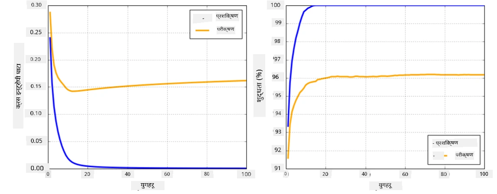

# न्युरल नेटवर्क फ्रेमवर्कहरू

जसरी हामीले पहिले नै सिकेका छौं, न्युरल नेटवर्कलाई प्रभावकारी रूपमा प्रशिक्षण गर्न हामीले दुई कुराहरू गर्नुपर्छ:

* टेन्सरहरूमा सञ्चालन गर्न, जस्तै गुणन, थप, र केही कार्यहरू जस्तै सिग्मोइड वा सफ्टम्याक्स गणना गर्न
* सबै अभिव्यक्तिहरूको ग्रेडियन्ट गणना गर्न, ग्रेडियन्ट डिसेन्ट अप्टिमाइजेसन गर्नको लागि

## [पाठ अघि क्विज](https://ff-quizzes.netlify.app/en/ai/quiz/9)

`numpy` लाइब्रेरीले पहिलो भाग गर्न सक्छ, तर हामीलाई ग्रेडियन्ट गणना गर्न केही मेकानिजम चाहिन्छ। [हाम्रो फ्रेमवर्क](../04-OwnFramework/OwnFramework.ipynb) मा, जुन हामीले अघिल्लो खण्डमा विकास गरेका थियौं, हामीले `backward` मेथड भित्र सबै डेरिभेटिभ कार्यहरू म्यानुअली प्रोग्राम गर्नुपरेको थियो, जसले ब्याकप्रोपोगेसन गर्छ। आदर्श रूपमा, फ्रेमवर्कले हामीलाई *कुनै पनि अभिव्यक्ति* को ग्रेडियन्ट गणना गर्ने अवसर दिनुपर्छ जुन हामी परिभाषित गर्न सक्छौं।

अर्को महत्त्वपूर्ण कुरा GPU वा अन्य विशेष कम्प्युट युनिटहरू, जस्तै [TPU](https://en.wikipedia.org/wiki/Tensor_Processing_Unit) मा गणना गर्न सक्षम हुनु हो। गहिरो न्युरल नेटवर्क प्रशिक्षणले *धेरै* गणनाहरू आवश्यक पर्दछ, र GPU मा ती गणनाहरू समानान्तर गर्न सक्षम हुनु धेरै महत्त्वपूर्ण छ।

> ✅ 'समानान्तर' भन्नाले गणनाहरूलाई धेरै उपकरणहरूमा वितरण गर्नु हो।

हाल, दुई सबैभन्दा लोकप्रिय न्युरल फ्रेमवर्कहरू हुन्: [TensorFlow](http://TensorFlow.org) र [PyTorch](https://pytorch.org/)। दुवैले CPU र GPU मा टेन्सरहरूसँग काम गर्न कम-स्तरीय API प्रदान गर्छन्। कम-स्तरीय API को माथि, उच्च-स्तरीय API पनि छ, जसलाई [Keras](https://keras.io/) र [PyTorch Lightning](https://pytorchlightning.ai/) क्रमशः भनिन्छ।

Low-Level API | [TensorFlow](http://TensorFlow.org) | [PyTorch](https://pytorch.org/)
--------------|-------------------------------------|--------------------------------
High-level API| [Keras](https://keras.io/) | [PyTorch Lightning](https://pytorchlightning.ai/)

**कम-स्तरीय API** दुवै फ्रेमवर्कमा तथाकथित **गणनात्मक ग्राफहरू** निर्माण गर्न अनुमति दिन्छ। यो ग्राफले दिइएको इनपुट प्यारामिटरहरूसँग आउटपुट (सामान्यतया हानि कार्य) कसरी गणना गर्ने भनेर परिभाषित गर्छ, र GPU मा गणना गर्न पठाउन सकिन्छ, यदि उपलब्ध छ भने। यस ग्राफलाई डिफरेन्सिएट गर्न र ग्रेडियन्टहरू गणना गर्न कार्यहरू छन्, जसलाई त्यसपछि मोडेल प्यारामिटरहरू अनुकूलन गर्न प्रयोग गर्न सकिन्छ।

**उच्च-स्तरीय API** न्युरल नेटवर्कलाई **लेयरहरूको क्रम** को रूपमा मान्छ, र अधिकांश न्युरल नेटवर्कहरू निर्माण गर्न धेरै सजिलो बनाउँछ। मोडेल प्रशिक्षण सामान्यतया डेटा तयार पारेर `fit` कार्यलाई कल गरेर गरिन्छ।

उच्च-स्तरीय API ले तपाईंलाई सामान्य न्युरल नेटवर्कहरू धेरै छिटो निर्माण गर्न अनुमति दिन्छ बिना धेरै विवरणहरूको चिन्ता। त्यस्तै, कम-स्तरीय API ले प्रशिक्षण प्रक्रियामा धेरै नियन्त्रण प्रदान गर्छ, र यसैले नयाँ न्युरल नेटवर्क आर्किटेक्चरहरूसँग काम गर्दा अनुसन्धानमा धेरै प्रयोग गरिन्छ।

यो पनि बुझ्न महत्त्वपूर्ण छ कि तपाईं दुवै API सँगै प्रयोग गर्न सक्नुहुन्छ, जस्तै तपाईं आफ्नो नेटवर्क लेयर आर्किटेक्चर कम-स्तरीय API प्रयोग गरेर विकास गर्न सक्नुहुन्छ, र त्यसपछि यसलाई ठूलो नेटवर्क भित्र प्रयोग गर्न सक्नुहुन्छ जुन उच्च-स्तरीय API प्रयोग गरेर निर्माण र प्रशिक्षण गरिएको छ। वा तपाईं लेयरहरूको क्रमको रूपमा उच्च-स्तरीय API प्रयोग गरेर नेटवर्क परिभाषित गर्न सक्नुहुन्छ, र त्यसपछि आफ्नो कम-स्तरीय प्रशिक्षण लूप प्रयोग गरेर अनुकूलन गर्न सक्नुहुन्छ। दुवै API ले समान आधारभूत अवधारणाहरू प्रयोग गर्छन्, र तिनीहरू एकअर्कासँग राम्रोसँग काम गर्न डिजाइन गरिएको छ।

## सिकाइ

यस पाठक्रममा, हामीले अधिकांश सामग्री PyTorch र TensorFlow दुवैको लागि उपलब्ध गराएका छौं। तपाईं आफ्नो मनपर्ने फ्रेमवर्क चयन गर्न सक्नुहुन्छ र केवल सम्बन्धित नोटबुकहरू अध्ययन गर्न सक्नुहुन्छ। यदि तपाईंलाई कुन फ्रेमवर्क चयन गर्ने निश्चित छैन भने, **PyTorch vs. TensorFlow** सम्बन्धी इन्टरनेटमा केही छलफलहरू पढ्नुहोस्। तपाईं दुवै फ्रेमवर्कलाई हेरेर राम्रो बुझाइ प्राप्त गर्न सक्नुहुन्छ।

जहाँ सम्भव छ, हामी सरलताको लागि उच्च-स्तरीय API प्रयोग गर्नेछौं। तर, हामी विश्वास गर्छौं कि न्युरल नेटवर्कहरू कसरी काम गर्छन् भन्ने कुरा आधारभूत रूपमा बुझ्न महत्त्वपूर्ण छ, त्यसैले सुरुमा हामी कम-स्तरीय API र टेन्सरहरूसँग काम गरेर सुरु गर्छौं। तर, यदि तपाईं छिटो अगाडि बढ्न चाहनुहुन्छ र यी विवरणहरू सिक्न धेरै समय खर्च गर्न चाहनुहुन्न भने, तपाईं तिनीहरूलाई छोडेर उच्च-स्तरीय API नोटबुकहरूमा सिधै जान सक्नुहुन्छ।

## ✍️ अभ्यास: फ्रेमवर्कहरू

तलका नोटबुकहरूमा आफ्नो सिकाइ जारी राख्नुहोस्:

Low-Level API | [TensorFlow+Keras Notebook](IntroKerasTF.ipynb) | [PyTorch](IntroPyTorch.ipynb)
--------------|-------------------------------------|--------------------------------
High-level API| [Keras](IntroKeras.ipynb) | *PyTorch Lightning*

फ्रेमवर्कहरूमा महारत हासिल गरेपछि, ओभरफिटिङको अवधारणालाई पुनः सम्झौं।

# ओभरफिटिङ

ओभरफिटिङ मेसिन लर्निङमा एक अत्यन्त महत्त्वपूर्ण अवधारणा हो, र यसलाई सही बुझ्न धेरै महत्त्वपूर्ण छ!

तलको समस्या विचार गर्नुहोस् जहाँ ५ बिन्दुहरूलाई (ग्राफमा `x` ले प्रतिनिधित्व गरिएको) अनुमान गर्नुपर्छ:

 | 
-------------------------|--------------------------
**रेखीय मोडेल, २ प्यारामिटरहरू** | **गैर-रेखीय मोडेल, ७ प्यारामिटरहरू**
प्रशिक्षण त्रुटि = ५.३ | प्रशिक्षण त्रुटि = ०
मान्यकरण त्रुटि = ५.१ | मान्यकरण त्रुटि = २०

* बायाँतिर, हामी राम्रो सीधा रेखा अनुमान देख्छौं। किनभने प्यारामिटरहरूको संख्या उपयुक्त छ, मोडेलले बिन्दु वितरणको पछाडि रहेको विचारलाई सही रूपमा बुझ्छ।
* दायाँतिर, मोडेल धेरै शक्तिशाली छ। किनभने हामीसँग केवल ५ बिन्दुहरू छन् र मोडेलसँग ७ प्यारामिटरहरू छन्, यसले सबै बिन्दुहरू पार गर्न समायोजन गर्न सक्छ, जसले प्रशिक्षण त्रुटिलाई ० बनाउँछ। तर, यसले मोडेललाई डेटा पछाडि रहेको सही ढाँचा बुझ्नबाट रोक्छ, जसले मान्यकरण त्रुटिलाई धेरै उच्च बनाउँछ।

मोडेलको समृद्धि (प्यारामिटरहरूको संख्या) र प्रशिक्षण नमूनाहरूको संख्या बीच सही सन्तुलन कायम गर्नु धेरै महत्त्वपूर्ण छ।

## किन ओभरफिटिङ हुन्छ

  * पर्याप्त प्रशिक्षण डेटा छैन
  * धेरै शक्तिशाली मोडेल
  * इनपुट डेटामा धेरै शोर

## ओभरफिटिङ कसरी पत्ता लगाउने

जसरी माथिको ग्राफबाट देख्न सकिन्छ, ओभरफिटिङलाई धेरै कम प्रशिक्षण त्रुटि र उच्च मान्यकरण त्रुटिबाट पत्ता लगाउन सकिन्छ। सामान्यतया प्रशिक्षणको क्रममा हामीले प्रशिक्षण र मान्यकरण त्रुटिहरू दुवै घट्न थालेको देख्छौं, र त्यसपछि कुनै बिन्दुमा मान्यकरण त्रुटि घट्न रोक्न सक्छ र बढ्न थाल्न सक्छ। यो ओभरफिटिङको संकेत हुनेछ, र यो बिन्दुमा प्रशिक्षण रोक्नुपर्छ (वा कम्तीमा मोडेलको स्न्यापशट लिनुपर्छ) भन्ने सूचक हुनेछ।

## ओभरफिटिङ रोक्न कसरी

यदि तपाईंले देख्नुभयो कि ओभरफिटिङ भइरहेको छ, तपाईं निम्न कार्यहरू गर्न सक्नुहुन्छ:

 * प्रशिक्षण डेटा बढाउनुहोस्
 * मोडेलको जटिलता घटाउनुहोस्
 * केही [रेगुलराइजेसन प्रविधि](../../4-ComputerVision/08-TransferLearning/TrainingTricks.md) प्रयोग गर्नुहोस्, जस्तै [Dropout](../../4-ComputerVision/08-TransferLearning/TrainingTricks.md#Dropout), जुन हामी पछि विचार गर्नेछौं।

## ओभरफिटिङ र बायस-भेरियन्स ट्रेडअफ

ओभरफिटिङ वास्तवमा स्ट्याटिस्टिक्समा रहेको एक सामान्य समस्याको केस हो जसलाई [बायस-भेरियन्स ट्रेडअफ](https://en.wikipedia.org/wiki/Bias%E2%80%93variance_tradeoff) भनिन्छ। यदि हामी हाम्रो मोडेलमा त्रुटिको सम्भावित स्रोतहरू विचार गर्छौं भने, हामी दुई प्रकारका त्रुटिहरू देख्न सक्छौं:

* **बायस त्रुटिहरू** हाम्रो एल्गोरिदमले प्रशिक्षण डेटाको सम्बन्ध सही रूपमा समात्न नसक्दा उत्पन्न हुन्छ। यो हाम्रो मोडेल पर्याप्त शक्तिशाली नभएको कारणले हुन सक्छ (**अन्डरफिटिङ**)।  
* **भेरियन्स त्रुटिहरू**, जुन मोडेलले इनपुट डेटामा रहेको शोरलाई अर्थपूर्ण सम्बन्धको सट्टा अनुमान गर्दा उत्पन्न हुन्छ (**ओभरफिटिङ**)।  

प्रशिक्षणको क्रममा, बायस त्रुटि घट्छ (जसरी हाम्रो मोडेलले डेटा अनुमान गर्न सिक्छ), र भेरियन्स त्रुटि बढ्छ। ओभरफिटिङ रोक्न प्रशिक्षण रोक्न महत्त्वपूर्ण छ - या त म्यानुअली (जब हामी ओभरफिटिङ पत्ता लगाउँछौं) वा स्वतः (रेगुलराइजेसनको परिचय दिएर)।

## निष्कर्ष

यस पाठमा, तपाईंले दुई सबैभन्दा लोकप्रिय AI फ्रेमवर्कहरू, TensorFlow र PyTorch का विभिन्न API हरूको भिन्नता सिक्नुभयो। साथै, तपाईंले एक अत्यन्त महत्त्वपूर्ण विषय, ओभरफिटिङ, बारे सिक्नुभयो।

## 🚀 चुनौती

संगसँगै रहेका नोटबुकहरूमा, तपाईंले 'कार्यहरू' तल पाउनुहुनेछ; नोटबुकहरूमा काम गर्नुहोस् र कार्यहरू पूरा गर्नुहोस्।

## [पाठ पछि क्विज](https://ff-quizzes.netlify.app/en/ai/quiz/10)

## समीक्षा र आत्म अध्ययन

तलका विषयहरूमा केही अनुसन्धान गर्नुहोस्:

- TensorFlow
- PyTorch
- ओभरफिटिङ

आफ्नो लागि यी प्रश्नहरू सोध्नुहोस्:

- TensorFlow र PyTorch बीच के फरक छ?
- ओभरफिटिङ र अन्डरफिटिङ बीच के फरक छ?

## [असाइनमेन्ट](lab/README.md)

यस प्रयोगशालामा, तपाईंलाई PyTorch वा TensorFlow प्रयोग गरेर एकल- र बहु-स्तरीय पूर्ण रूपमा जडित नेटवर्कहरू प्रयोग गरी दुई वर्गीकरण समस्याहरू समाधान गर्न भनिएको छ।

* [निर्देशनहरू](lab/README.md)
* [नोटबुक](lab/LabFrameworks.ipynb)

---

