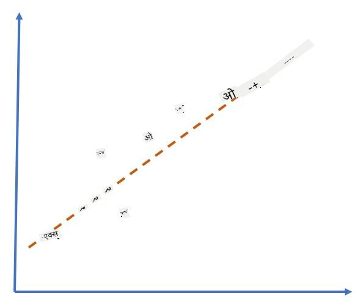
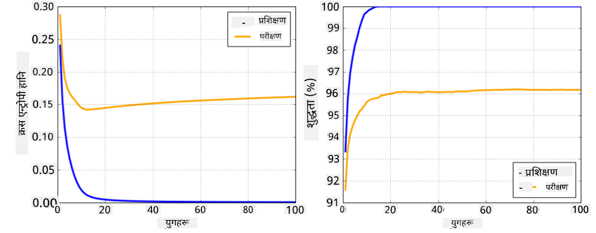

<!--
CO_OP_TRANSLATOR_METADATA:
{
  "original_hash": "2b544f20b796402507fb05a0df893323",
  "translation_date": "2025-08-26T10:32:59+00:00",
  "source_file": "lessons/3-NeuralNetworks/05-Frameworks/README.md",
  "language_code": "ne"
}
-->
# न्युरल नेटवर्क फ्रेमवर्कहरू

हामीले पहिले नै सिकिसकेका छौं कि न्युरल नेटवर्कलाई प्रभावकारी रूपमा प्रशिक्षण दिनका लागि हामीले दुईवटा कुरा गर्नुपर्छ:

* टेन्सरहरूमा अपरेसन गर्न, जस्तै गुणन, थप, र केही कार्यहरू जस्तै सिग्मोइड वा सफ्टम्याक्स गणना गर्न
* सबै अभिव्यक्तिहरूको ग्रेडियन्ट गणना गर्न, ताकि ग्रेडियन्ट डिसेन्ट अप्टिमाइजेसन गर्न सकियोस्

## [Pre-lecture quiz](https://red-field-0a6ddfd03.1.azurestaticapps.net/quiz/105)

`numpy` लाइब्रेरीले पहिलो भाग गर्न सक्छ, तर हामीलाई ग्रेडियन्ट गणना गर्न केही मेकानिज्म चाहिन्छ। [हाम्रो फ्रेमवर्क](../../../../../lessons/3-NeuralNetworks/04-OwnFramework/OwnFramework.ipynb) मा, जुन हामीले अघिल्लो खण्डमा विकास गरेका थियौं, हामीले `backward` मेथडभित्र सबै डेरिभेटिभ फङ्सनहरू म्यानुअली प्रोग्राम गर्नुपर्थ्यो, जसले ब्याकप्रोपोगेसन गर्छ। आदर्श रूपमा, फ्रेमवर्कले हामीलाई *कुनै पनि अभिव्यक्ति* को ग्रेडियन्ट गणना गर्ने अवसर दिनुपर्छ, जुन हामी परिभाषित गर्न सक्छौं।

अर्को महत्त्वपूर्ण कुरा भनेको GPU वा अन्य विशेष कम्प्युट युनिटहरू, जस्तै [TPU](https://en.wikipedia.org/wiki/Tensor_Processing_Unit) मा गणना गर्न सक्षम हुनु हो। गहिरो न्युरल नेटवर्क प्रशिक्षणमा *धेरै* गणना आवश्यक पर्छ, र ती गणनाहरू GPU मा समानान्तर रूपमा गर्न सक्षम हुनु अत्यन्त महत्त्वपूर्ण छ।

> ✅ 'समानान्तर' भन्नाले गणनाहरूलाई धेरै उपकरणहरूमा वितरण गर्नु हो।

हाल, दुई सबैभन्दा लोकप्रिय न्युरल फ्रेमवर्कहरू हुन्: [TensorFlow](http://TensorFlow.org) र [PyTorch](https://pytorch.org/)। यी दुवैले CPU र GPU मा टेन्सरहरूसँग काम गर्नका लागि लो-लेभल API प्रदान गर्छन्। लो-लेभल API को माथि, उच्च-स्तरीय API पनि छ, जसलाई [Keras](https://keras.io/) र [PyTorch Lightning](https://pytorchlightning.ai/) भनिन्छ।

Low-Level API | [TensorFlow](http://TensorFlow.org) | [PyTorch](https://pytorch.org/)
--------------|-------------------------------------|--------------------------------
High-level API| [Keras](https://keras.io/) | [PyTorch Lightning](https://pytorchlightning.ai/)

**लो-लेभल API** ले तथाकथित **गणनात्मक ग्राफहरू** निर्माण गर्न अनुमति दिन्छ। यो ग्राफले दिइएको इनपुट प्यारामिटरहरूसँग आउटपुट (सामान्यतया हानि कार्य) कसरी गणना गर्ने भनेर परिभाषित गर्छ, र GPU मा गणना गर्न पठाउन सकिन्छ, यदि GPU उपलब्ध छ भने। यस ग्राफलाई डिफरेन्सिएट गर्न र ग्रेडियन्टहरू गणना गर्नका लागि फङ्सनहरू छन्, जसलाई त्यसपछि मोडेल प्यारामिटरहरू अप्टिमाइज गर्न प्रयोग गर्न सकिन्छ।

**हाई-लेभल API** ले न्युरल नेटवर्कलाई प्रायः **लेयरहरूको क्रम** को रूपमा लिन्छ, र अधिकांश न्युरल नेटवर्कहरू निर्माण गर्न सजिलो बनाउँछ। मोडेल प्रशिक्षण सामान्यतया डेटा तयार पारेर `fit` फङ्सनलाई कल गरेर गरिन्छ।

हाई-लेभल API ले धेरै छिटो सामान्य न्युरल नेटवर्कहरू निर्माण गर्न अनुमति दिन्छ, धेरै विवरणहरूको चिन्ता नगरी। त्यही समयमा, लो-लेभल API ले प्रशिक्षण प्रक्रियामा धेरै नियन्त्रण प्रदान गर्छ, र यसैले नयाँ न्युरल नेटवर्क आर्किटेक्चरहरूसँग काम गर्दा अनुसन्धानमा धेरै प्रयोग गरिन्छ।

यो बुझ्न महत्त्वपूर्ण छ कि तपाईं दुवै API सँगै प्रयोग गर्न सक्नुहुन्छ, जस्तै तपाईं आफ्नो नेटवर्क लेयर आर्किटेक्चर लो-लेभल API प्रयोग गरेर विकास गर्न सक्नुहुन्छ, र त्यसपछि यसलाई उच्च-स्तरीय API प्रयोग गरेर निर्माण गरिएको ठूलो नेटवर्कभित्र प्रयोग गर्न सक्नुहुन्छ। वा तपाईं उच्च-स्तरीय API प्रयोग गरेर लेयरहरूको क्रमको रूपमा नेटवर्क परिभाषित गर्न सक्नुहुन्छ, र त्यसपछि आफ्नो लो-लेभल प्रशिक्षण लूप प्रयोग गरेर अप्टिमाइजेसन गर्न सक्नुहुन्छ। दुवै API ले एउटै आधारभूत अवधारणाहरू प्रयोग गर्छन्, र तिनीहरू एकअर्कासँग राम्रोसँग काम गर्न डिजाइन गरिएका छन्।

## सिकाइ

यस कोर्समा, हामीले अधिकांश सामग्री PyTorch र TensorFlow दुवैका लागि उपलब्ध गराएका छौं। तपाईं आफ्नो मनपर्ने फ्रेमवर्क छान्न सक्नुहुन्छ र त्यससँग सम्बन्धित नोटबुकहरू मात्र अध्ययन गर्न सक्नुहुन्छ। यदि तपाईं कुन फ्रेमवर्क छान्ने निश्चित हुनुहुन्न भने, **PyTorch vs. TensorFlow** सम्बन्धी इन्टरनेटमा केही छलफलहरू पढ्नुहोस्। तपाईं दुवै फ्रेमवर्क हेरेर राम्रो बुझाइ पनि प्राप्त गर्न सक्नुहुन्छ।

जहाँ सम्भव छ, हामी सरलताका लागि हाई-लेभल API प्रयोग गर्नेछौं। तर, हामी विश्वास गर्छौं कि न्युरल नेटवर्कहरू कसरी काम गर्छन् भन्ने कुरा आधारदेखि बुझ्न महत्त्वपूर्ण छ, त्यसैले सुरुमा हामी लो-लेभल API र टेन्सरहरूसँग काम गरेर सुरु गर्नेछौं। तर, यदि तपाईं छिटो अघि बढ्न चाहनुहुन्छ र यी विवरणहरू सिक्न धेरै समय खर्च गर्न चाहनुहुन्न भने, तपाईं ती छोडेर सिधै हाई-लेभल API नोटबुकहरूमा जान सक्नुहुन्छ।

## ✍️ अभ्यास: फ्रेमवर्कहरू

तपाईंको सिकाइलाई निम्न नोटबुकहरूमा जारी राख्नुहोस्:

Low-Level API | [TensorFlow+Keras Notebook](../../../../../lessons/3-NeuralNetworks/05-Frameworks/IntroKerasTF.ipynb) | [PyTorch](../../../../../lessons/3-NeuralNetworks/05-Frameworks/IntroPyTorch.ipynb)
--------------|-------------------------------------|--------------------------------
High-level API| [Keras](../../../../../lessons/3-NeuralNetworks/05-Frameworks/IntroKeras.ipynb) | *PyTorch Lightning*

फ्रेमवर्कहरूमा महारथ हासिल गरेपछि, ओभरफिटिङको अवधारणा पुनः सम्झौं।

# ओभरफिटिङ

ओभरफिटिङ मेसिन लर्निङमा अत्यन्त महत्त्वपूर्ण अवधारणा हो, र यसलाई सही रूपमा बुझ्न अत्यन्त महत्त्वपूर्ण छ!

तलको समस्या विचार गर्नुहोस्, जसमा ५ वटा बिन्दुहरूलाई (ग्राफमा `x` ले प्रतिनिधित्व गरिएको) अनुमान गर्नुपर्छ:

 | 
-------------------------|--------------------------
**रेखीय मोडेल, २ प्यारामिटरहरू** | **गैर-रेखीय मोडेल, ७ प्यारामिटरहरू**
प्रशिक्षण त्रुटि = ५.३ | प्रशिक्षण त्रुटि = ०
प्रमाणीकरण त्रुटि = ५.१ | प्रमाणीकरण त्रुटि = २०

* बायाँतिर, हामीले राम्रो सिधा रेखा अनुमान देख्छौं। किनभने प्यारामिटरहरूको संख्या उपयुक्त छ, मोडेलले बिन्दुहरूको वितरणको सही विचार पाउँछ।
* दायाँतिर, मोडेल धेरै शक्तिशाली छ। किनभने हामीसँग केवल ५ बिन्दुहरू छन् र मोडेलसँग ७ प्यारामिटरहरू छन्, यसले सबै बिन्दुहरू पार गर्न मिल्ने गरी समायोजन गर्न सक्छ, जसले गर्दा प्रशिक्षण त्रुटि ० हुन्छ। तर, यसले मोडेललाई डाटाको सही ढाँचा बुझ्नबाट रोक्छ, जसले गर्दा प्रमाणीकरण त्रुटि धेरै उच्च हुन्छ।

यो मोडेलको समृद्धि (प्यारामिटरहरूको संख्या) र प्रशिक्षण नमूनाहरूको संख्याबीच सही सन्तुलन कायम गर्नु अत्यन्त महत्त्वपूर्ण छ।

## किन ओभरफिटिङ हुन्छ

  * पर्याप्त प्रशिक्षण डाटा नभएको
  * धेरै शक्तिशाली मोडेल
  * इनपुट डाटामा धेरै धेरै शोर

## ओभरफिटिङ कसरी पत्ता लगाउने

ग्राफबाट देख्न सकिन्छ, ओभरफिटिङलाई धेरै कम प्रशिक्षण त्रुटि र उच्च प्रमाणीकरण त्रुटिबाट पत्ता लगाउन सकिन्छ। सामान्यतया प्रशिक्षणको क्रममा, हामीले प्रशिक्षण र प्रमाणीकरण त्रुटिहरू दुवै घट्दै गरेको देख्छौं, र त्यसपछि कुनै बिन्दुमा प्रमाणीकरण त्रुटि घट्न रोक्न सक्छ र बढ्न थाल्छ। यो ओभरफिटिङको संकेत हुनेछ, र यो बिन्दुमा प्रशिक्षण रोक्नुपर्छ (वा कम्तीमा मोडेलको स्न्यापशट लिनुपर्छ)।

## ओभरफिटिङ रोक्ने उपाय

यदि तपाईंले ओभरफिटिङ भइरहेको देख्नुभयो भने, तपाईं निम्नमध्ये कुनै एक गर्न सक्नुहुन्छ:

 * प्रशिक्षण डाटाको मात्रा बढाउनुहोस्
 * मोडेलको जटिलता घटाउनुहोस्
 * [रेगुलराइजेसन प्रविधि](../../4-ComputerVision/08-TransferLearning/TrainingTricks.md) प्रयोग गर्नुहोस्, जस्तै [ड्रपआउट](../../4-ComputerVision/08-TransferLearning/TrainingTricks.md#Dropout), जुन हामी पछि विचार गर्नेछौं।

## ओभरफिटिङ र बायस-भेरियन्स ट्रेडअफ

ओभरफिटिङ वास्तवमा तथ्याङ्कमा [बायस-भेरियन्स ट्रेडअफ](https://en.wikipedia.org/wiki/Bias%E2%80%93variance_tradeoff) भनिने अधिक सामान्य समस्याको एउटा केस हो। यदि हामी हाम्रो मोडेलमा त्रुटिको सम्भावित स्रोतहरू विचार गर्छौं भने, हामी दुई प्रकारका त्रुटिहरू देख्न सक्छौं:

* **बायस त्रुटिहरू** हाम्रो एल्गोरिदमले प्रशिक्षण डाटाबीचको सम्बन्धलाई सही रूपमा समात्न नसक्दा हुने त्रुटिहरू हुन्। यो हाम्रो मोडेल पर्याप्त शक्तिशाली नभएको कारणले हुन सक्छ (**अन्डरफिटिङ**)।  
* **भेरियन्स त्रुटिहरू**, जुन इनपुट डाटामा शोरलाई अर्थपूर्ण सम्बन्धको सट्टा अनुमान गर्दा हुने त्रुटिहरू हुन् (**ओभरफिटिङ**)।  

प्रशिक्षणको क्रममा, बायस त्रुटि घट्छ (किनभने हाम्रो मोडेलले डाटालाई अनुमान गर्न सिक्छ), र भेरियन्स त्रुटि बढ्छ। ओभरफिटिङ रोक्न - चाहे म्यानुअली (जब हामी ओभरफिटिङ पत्ता लगाउँछौं) वा स्वचालित रूपमा (रेगुलराइजेसनको परिचय दिएर) - प्रशिक्षण रोक्नु महत्त्वपूर्ण छ।

## निष्कर्ष

यस पाठमा, तपाईंले दुई सबैभन्दा लोकप्रिय AI फ्रेमवर्कहरू, TensorFlow र PyTorch का विभिन्न API हरूको भिन्नताहरूको बारेमा सिक्नुभयो। साथै, तपाईंले एक अत्यन्त महत्त्वपूर्ण विषय, ओभरफिटिङको बारेमा पनि सिक्नुभयो।

## 🚀 चुनौती

संगत नोटबुकहरूमा, तपाईंले 'कार्यहरू' पाउनुहुनेछ; नोटबुकहरू अध्ययन गर्नुहोस् र कार्यहरू पूरा गर्नुहोस्।

## [Post-lecture quiz](https://red-field-0a6ddfd03.1.azurestaticapps.net/quiz/205)

## समीक्षा र आत्म-अध्ययन

निम्न विषयहरूमा केही अनुसन्धान गर्नुहोस्:

- TensorFlow
- PyTorch
- ओभरफिटिङ

आफैंलाई निम्न प्रश्नहरू सोध्नुहोस्:

- TensorFlow र PyTorch बीच के फरक छ?
- ओभरफिटिङ र अन्डरफिटिङ बीच के फरक छ?

## [Assignment](lab/README.md)

यस प्रयोगशालामा, तपाईंलाई PyTorch वा TensorFlow प्रयोग गरेर एकल- र बहु-स्तरीय पूर्ण रूपमा जडित नेटवर्कहरू प्रयोग गरी दुई वर्गीकरण समस्याहरू समाधान गर्न भनिएको छ।

* [निर्देशहरू](lab/README.md)
* [नोटबुक](../../../../../lessons/3-NeuralNetworks/05-Frameworks/lab/LabFrameworks.ipynb)

**अस्वीकरण**:  
यो दस्तावेज़ AI अनुवाद सेवा [Co-op Translator](https://github.com/Azure/co-op-translator) प्रयोग गरेर अनुवाद गरिएको छ। हामी यथार्थताको लागि प्रयास गर्छौं, तर कृपया ध्यान दिनुहोस् कि स्वचालित अनुवादमा त्रुटिहरू वा अशुद्धताहरू हुन सक्छ। यसको मूल भाषा मा रहेको मूल दस्तावेज़लाई आधिकारिक स्रोत मानिनुपर्छ। महत्वपूर्ण जानकारीको लागि, व्यावसायिक मानव अनुवाद सिफारिस गरिन्छ। यस अनुवादको प्रयोगबाट उत्पन्न हुने कुनै पनि गलतफहमी वा गलत व्याख्याको लागि हामी जिम्मेवार हुने छैनौं।