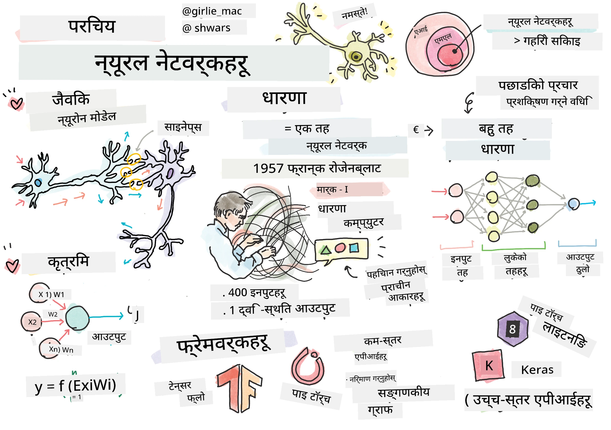
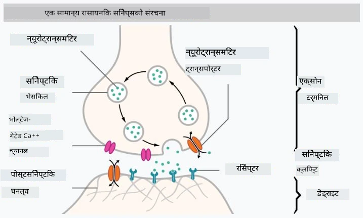
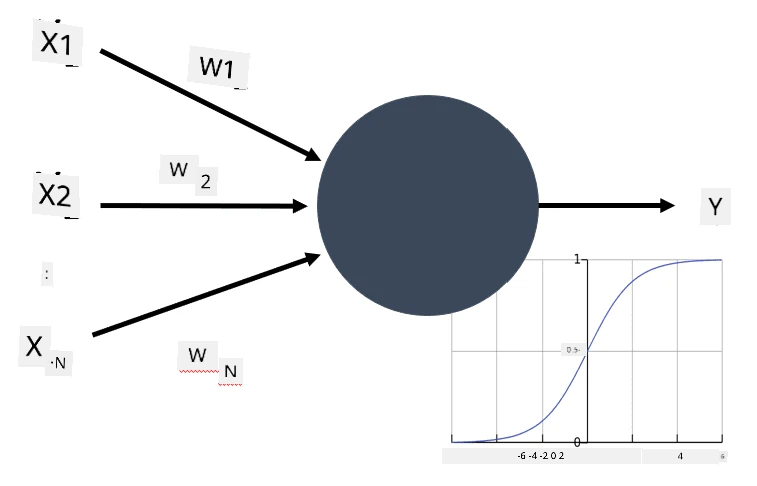

# न्युरल नेटवर्कको परिचय

जसरी हामीले परिचयमा चर्चा गर्यौं, बुद्धिमत्ता प्राप्त गर्ने एक तरिका भनेको **कम्प्युटर मोडेल** वा **कृत्रिम मस्तिष्क**लाई प्रशिक्षण दिनु हो। २०औं शताब्दीको मध्यदेखि, अनुसन्धानकर्ताहरूले विभिन्न गणितीय मोडेलहरू प्रयास गरे, र पछिल्लो केही वर्षमा यो दिशा अत्यन्त सफल साबित भयो। मस्तिष्कको यस्ता गणितीय मोडेलहरूलाई **न्युरल नेटवर्क** भनिन्छ।

> कहिलेकाहीं न्युरल नेटवर्कलाई *कृत्रिम न्युरल नेटवर्क* (Artificial Neural Networks, ANNs) भनिन्छ, जसले मोडेलको कुरा गरिरहेको संकेत गर्दछ, वास्तविक न्युरोनहरूको नेटवर्क होइन।

## मेशिन लर्निङ

न्युरल नेटवर्कहरू **मेशिन लर्निङ** नामक ठूलो क्षेत्रको हिस्सा हुन्, जसको उद्देश्य डाटाको प्रयोग गरेर कम्प्युटर मोडेलहरूलाई समस्या समाधान गर्न सक्षम बनाउनु हो। मेशिन लर्निङ कृत्रिम बुद्धिमत्ताको ठूलो हिस्सा हो, तर हामी यस पाठ्यक्रममा परम्परागत मेशिन लर्निङलाई समेट्दैनौं।

> परम्परागत मेशिन लर्निङबारे थप जान्नको लागि हाम्रो छुट्टै **[मेशिन लर्निङ फर बिगिनर्स](http://github.com/microsoft/ml-for-beginners)** पाठ्यक्रम हेर्नुहोस्।

मेशिन लर्निङमा, हामी मान्छौं कि हामीसँग केही उदाहरणहरूको डाटासेट **X** छ, र त्यससँग सम्बन्धित आउटपुट मानहरू **Y** छन्। उदाहरणहरू प्रायः N-आयामीय भेक्टरहरू हुन्छन् जसमा **फिचरहरू** हुन्छन्, र आउटपुटहरूलाई **लेबलहरू** भनिन्छ।

हामी दुई सबैभन्दा सामान्य मेशिन लर्निङ समस्याहरूलाई विचार गर्नेछौं:

* **वर्गीकरण (Classification)**, जहाँ हामीले इनपुट वस्तुलाई दुई वा बढी वर्गहरूमा वर्गीकृत गर्नुपर्छ।
* **रेग्रेशन (Regression)**, जहाँ हामीले प्रत्येक इनपुट नमूनाको लागि संख्यात्मक मान भविष्यवाणी गर्नुपर्छ।

> इनपुट र आउटपुटलाई टेन्सरको रूपमा प्रतिनिधित्व गर्दा, इनपुट डाटासेट M&times;N आकारको म्याट्रिक्स हुन्छ, जहाँ M नमूनाहरूको संख्या हो र N फिचरहरूको संख्या हो। आउटपुट लेबलहरू Y भनेको M आकारको भेक्टर हो।

यस पाठ्यक्रममा, हामी केवल न्युरल नेटवर्क मोडेलहरूमा ध्यान केन्द्रित गर्नेछौं।

## न्युरोनको मोडेल

जैविक विज्ञानबाट, हामीलाई थाहा छ कि हाम्रो मस्तिष्क न्युरल कोषहरू (न्युरोनहरू) बाट बनेको छ, जसको प्रत्येकमा धेरै "इनपुट" (डेंड्राइटहरू) र एक "आउटपुट" (एक्सन) हुन्छ। डेंड्राइटहरू र एक्सनहरू दुवैले विद्युतीय संकेतहरू प्रवाह गर्न सक्छन्, र तिनीहरू बीचको जडानहरू — जसलाई सिन्याप्स भनिन्छ — विभिन्न स्तरको प्रवाहशीलता देखाउन सक्छन्, जुन न्युरोट्रान्समिटरहरूले नियमन गर्छन्।

 | 
----|----
वास्तविक न्युरोन *([छवि](https://en.wikipedia.org/wiki/Synapse#/media/File:SynapseSchematic_lines.svg) विकिपीडियाबाट)* | कृत्रिम न्युरोन *(लेखकद्वारा बनाइएको छवि)*

त्यसैले, न्युरोनको सबैभन्दा सरल गणितीय मोडेलमा धेरै इनपुटहरू X1, ..., XN र एक आउटपुट Y हुन्छ, र तौलहरूको श्रृंखला W1, ..., WN हुन्छ। आउटपुट यसरी गणना गरिन्छ:

जहाँ f भनेको केही गैर-रेखीय **सक्रियता फलन** हो।

> न्युरोनको प्रारम्भिक मोडेलहरू वारेन म्याकुलक र वाल्टर पिट्सद्वारा १९४३ मा लेखिएको शास्त्रीय पेपर [A logical calculus of the ideas immanent in nervous activity](https://www.cs.cmu.edu/~./epxing/Class/10715/reading/McCulloch.and.Pitts.pdf) मा वर्णन गरिएको थियो। डोनाल्ड हेबले आफ्नो पुस्तक "[The Organization of Behavior: A Neuropsychological Theory](https://books.google.com/books?id=VNetYrB8EBoC)" मा ती नेटवर्कहरू कसरी प्रशिक्षण गर्न सकिन्छ भन्ने तरिका प्रस्ताव गरे।

## यस खण्डमा

यस खण्डमा हामी निम्न विषयहरू सिक्नेछौं:
* [पर्सेप्ट्रोन](03-Perceptron/README.md), दुई-वर्ग वर्गीकरणको लागि प्रारम्भिक न्युरल नेटवर्क मोडेलहरू मध्ये एक
* [बहु-स्तरीय नेटवर्कहरू](04-OwnFramework/README.md) र यससँग सम्बन्धित नोटबुक [हाम्रो आफ्नै फ्रेमवर्क कसरी निर्माण गर्ने](04-OwnFramework/OwnFramework.ipynb)
* [न्युरल नेटवर्क फ्रेमवर्कहरू](05-Frameworks/README.md), यी नोटबुकहरूसहित: [PyTorch](05-Frameworks/IntroPyTorch.ipynb) र [Keras/Tensorflow](05-Frameworks/IntroKerasTF.ipynb)
* [ओभरफिटिङ](../../../../lessons/3-NeuralNetworks/05-Frameworks)

---

**अस्वीकरण**:  
यो दस्तावेज़ AI अनुवाद सेवा [Co-op Translator](https://github.com/Azure/co-op-translator) प्रयोग गरी अनुवाद गरिएको हो। हामी यथासम्भव शुद्धता सुनिश्चित गर्न प्रयास गर्छौं, तर कृपया जानकार रहनुहोस् कि स्वचालित अनुवादहरूमा त्रुटिहरू वा अशुद्धताहरू हुन सक्छन्। यसको मूल भाषामा रहेको मूल दस्तावेज़लाई आधिकारिक स्रोत मानिनुपर्छ। महत्त्वपूर्ण जानकारीका लागि, व्यावसायिक मानव अनुवाद सिफारिस गरिन्छ। यस अनुवादको प्रयोगबाट उत्पन्न हुने कुनै पनि गलतफहमी वा गलत व्याख्याका लागि हामी जिम्मेवार हुनेछैनौं।