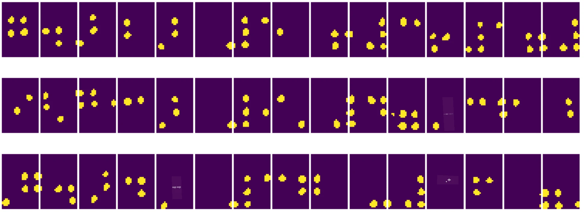

# कम्प्युटर भिजनको परिचय

[कम्प्युटर भिजन](https://wikipedia.org/wiki/Computer_vision) एउटा क्षेत्र हो जसको उद्देश्य कम्प्युटरलाई डिजिटल छविहरूको उच्च-स्तरीय बुझाइ दिनु हो। यो परिभाषा धेरै व्यापक छ किनभने *बुझाइ* ले धेरै फरक कुराहरू जनाउन सक्छ, जस्तै तस्बिरमा वस्तु पत्ता लगाउने (**वस्तु पहिचान**), के भइरहेको छ बुझ्ने (**घटना पहिचान**), तस्बिरलाई पाठमा वर्णन गर्ने, वा दृश्यलाई 3D मा पुनर्निर्माण गर्ने। मानव छविसँग सम्बन्धित विशेष कार्यहरू पनि छन्: उमेर र भावनाको अनुमान, अनुहार पहिचान र चिन्नु, र 3D पोज अनुमान, केही उदाहरणका लागि।

## [पूर्व-व्याख्यान क्विज](https://ff-quizzes.netlify.app/en/ai/quiz/11)

कम्प्युटर भिजनको सबैभन्दा सरल कार्यहरू मध्ये एक हो **छवि वर्गीकरण**।

कम्प्युटर भिजनलाई प्राय: AI को शाखा मानिन्छ। आजकल, कम्प्युटर भिजनका अधिकांश कार्यहरू न्यूरल नेटवर्कहरू प्रयोग गरेर समाधान गरिन्छ। हामी कम्प्युटर भिजनका लागि प्रयोग हुने विशेष प्रकारका न्यूरल नेटवर्कहरू, [कन्भोल्युसनल न्यूरल नेटवर्कहरू](../07-ConvNets/README.md), यस खण्डमा सिक्नेछौं।

तर, छवि न्यूरल नेटवर्कमा पठाउनु अघि, धेरै अवस्थामा छवि सुधार गर्न केही एल्गोरिथमिक प्रविधिहरू प्रयोग गर्नु उपयुक्त हुन्छ।

छवि प्रशोधनका लागि उपलब्ध केही पायथन पुस्तकालयहरू:

* **[imageio](https://imageio.readthedocs.io/en/stable/)** विभिन्न छवि ढाँचाहरू पढ्न/लेखन गर्न प्रयोग गर्न सकिन्छ। यसले ffmpeg पनि समर्थन गर्दछ, जसले भिडियो फ्रेमलाई छविमा रूपान्तरण गर्न उपयोगी उपकरण हो।
* **[Pillow](https://pillow.readthedocs.io/en/stable/index.html)** (PIL को रूपमा पनि चिनिन्छ) अलि शक्तिशाली छ, र केही छवि हेरफेर जस्तै मोर्फिङ, प्यालेट समायोजन, र अन्य समर्थन गर्दछ।
* **[OpenCV](https://opencv.org/)** C++ मा लेखिएको शक्तिशाली छवि प्रशोधन पुस्तकालय हो, जुन छवि प्रशोधनको *डि फ्याक्टो* मानक बनेको छ। यसमा पायथन इन्टरफेस छ।
* **[dlib](http://dlib.net/)** C++ पुस्तकालय हो जसले धेरै मेसिन लर्निङ एल्गोरिथ्महरू कार्यान्वयन गर्दछ, जसमा केही कम्प्युटर भिजन एल्गोरिथ्महरू पनि समावेश छन्। यसमा पायथन इन्टरफेस छ, र अनुहार र अनुहारको महत्त्वपूर्ण बिन्दु पहिचान जस्ता चुनौतीपूर्ण कार्यहरूको लागि प्रयोग गर्न सकिन्छ।

## OpenCV

[OpenCV](https://opencv.org/) छवि प्रशोधनको *डि फ्याक्टो* मानक मानिन्छ। यसमा धेरै उपयोगी एल्गोरिथ्महरू छन्, जुन C++ मा कार्यान्वयन गरिएको छ। तपाईं OpenCV लाई पायथनबाट पनि कल गर्न सक्नुहुन्छ।

OpenCV सिक्नको लागि राम्रो ठाउँ [यो Learn OpenCV कोर्स](https://learnopencv.com/getting-started-with-opencv/) हो। हाम्रो पाठ्यक्रममा, हाम्रो उद्देश्य OpenCV सिक्नु होइन, तर तपाईंलाई केही उदाहरणहरू देखाउनु हो कि यो कहिले प्रयोग गर्न सकिन्छ र कसरी।

### छवि लोड गर्ने

पायथनमा छविहरूलाई सजिलैसँग NumPy एरेहरूद्वारा प्रतिनिधित्व गर्न सकिन्छ। उदाहरणका लागि, 320x200 पिक्सेलको साइज भएको ग्रेस्केल छविहरूलाई 200x320 एरेमा भण्डारण गरिन्छ, र समान आयामको रंगीन छविहरूको आकार 200x320x3 हुन्छ (3 रंग च्यानलहरूको लागि)। छवि लोड गर्न, तपाईं निम्न कोड प्रयोग गर्न सक्नुहुन्छ:

```python
import cv2
import matplotlib.pyplot as plt

im = cv2.imread('image.jpeg')
plt.imshow(im)
```

परम्परागत रूपमा, OpenCV ले रंगीन छविहरूको लागि BGR (ब्लू-ग्रीन-रेड) इन्कोडिङ प्रयोग गर्दछ, जबकि पायथनका अन्य उपकरणहरूले अधिक परम्परागत RGB (रेड-ग्रीन-ब्लू) प्रयोग गर्दछ। छवि सही देखिनको लागि, तपाईंले यसलाई RGB रंग स्थानमा रूपान्तरण गर्न आवश्यक छ, या त NumPy एरेमा आयामहरू स्वाप गरेर, या OpenCV फङ्सन कल गरेर:

```python
im = cv2.cvtColor(im,cv2.COLOR_BGR2RGB)
```

उही `cvtColor` फङ्सन अन्य रंग स्थान रूपान्तरणहरू गर्न प्रयोग गर्न सकिन्छ, जस्तै छविलाई ग्रेस्केलमा रूपान्तरण गर्ने वा HSV (Hue-Saturation-Value) रंग स्थानमा।

तपाईं OpenCV प्रयोग गरेर भिडियो फ्रेम-बाइ-फ्रेम लोड गर्न पनि सक्नुहुन्छ - उदाहरण [OpenCV Notebook](OpenCV.ipynb) मा दिइएको छ।

### छवि प्रशोधन

छवि न्यूरल नेटवर्कमा पठाउनु अघि, तपाईंले केही पूर्व-प्रशोधन चरणहरू लागू गर्न चाहनुहुन्छ। OpenCV ले धेरै कार्यहरू गर्न सक्छ, जस्तै:

* `im = cv2.resize(im, (320,200),interpolation=cv2.INTER_LANCZOS)` प्रयोग गरेर छवि **साइज परिवर्तन** गर्ने।
* `im = cv2.medianBlur(im,3)` वा `im = cv2.GaussianBlur(im, (3,3), 0)` प्रयोग गरेर छवि **ब्लर गर्ने**।
* छविको **उज्यालो र कन्ट्रास्ट परिवर्तन** NumPy एरे हेरफेरद्वारा गर्न सकिन्छ, जस्तै [यो Stackoverflow नोटमा वर्णन गरिएको छ](https://stackoverflow.com/questions/39308030/how-do-i-increase-the-contrast-of-an-image-in-python-opencv)।
* [थ्रेसहोल्डिङ](https://docs.opencv.org/4.x/d7/d4d/tutorial_py_thresholding.html) प्रयोग गरेर `cv2.threshold`/`cv2.adaptiveThreshold` फङ्सनहरू कल गर्ने, जुन उज्यालो वा कन्ट्रास्ट समायोजन गर्न भन्दा प्राय: राम्रो हुन्छ।
* छविमा विभिन्न [रूपान्तरणहरू](https://docs.opencv.org/4.5.5/da/d6e/tutorial_py_geometric_transformations.html) लागू गर्ने:
    - **[Affine रूपान्तरणहरू](https://docs.opencv.org/4.5.5/d4/d61/tutorial_warp_affine.html)** उपयोगी हुन सक्छ यदि तपाईंलाई घुमाउने, साइज परिवर्तन गर्ने र झुकाउने संयोजन गर्न आवश्यक छ र छविमा तीन बिन्दुको स्रोत र गन्तव्य स्थान थाहा छ। Affine रूपान्तरणहरूले समानान्तर रेखाहरू समानान्तर राख्छ।
    - **[परिप्रेक्ष्य रूपान्तरणहरू](https://medium.com/analytics-vidhya/opencv-perspective-transformation-9edffefb2143)** उपयोगी हुन सक्छ जब तपाईंलाई छविमा चार बिन्दुको स्रोत र गन्तव्य स्थान थाहा छ। उदाहरणका लागि, यदि तपाईंले स्मार्टफोन क्यामेराबाट कोणबाट आयताकार कागजातको तस्बिर लिन्छन्, र तपाईं कागजातको आयताकार छवि बनाउन चाहनुहुन्छ।
* **[अप्टिकल फ्लो](https://docs.opencv.org/4.5.5/d4/dee/tutorial_optical_flow.html)** प्रयोग गरेर छविभित्रको गति बुझ्ने।

## कम्प्युटर भिजन प्रयोगका उदाहरणहरू

हाम्रो [OpenCV Notebook](OpenCV.ipynb) मा, हामीले कम्प्युटर भिजन प्रयोग गरेर विशिष्ट कार्यहरू कसरी गर्न सकिन्छ भन्ने केही उदाहरणहरू दिएका छौं:

* **ब्रेल पुस्तकको तस्बिर पूर्व-प्रशोधन गर्ने**। हामी थ्रेसहोल्डिङ, फिचर डिटेक्सन, परिप्रेक्ष्य रूपान्तरण र NumPy हेरफेर प्रयोग गरेर व्यक्तिगत ब्रेल प्रतीकहरू अलग गर्नेमा केन्द्रित छौं, जसलाई न्यूरल नेटवर्कद्वारा थप वर्गीकरण गर्न सकिन्छ।

 |  | 
----|-----|-----

> छवि [OpenCV.ipynb](OpenCV.ipynb) बाट

* **फ्रेम भिन्नता प्रयोग गरेर भिडियोमा गति पत्ता लगाउने**। यदि क्यामेरा स्थिर छ भने, क्यामेरा फिडका फ्रेमहरू एकअर्कासँग धेरै समान हुनुपर्छ। किनभने फ्रेमहरू एरेको रूपमा प्रतिनिधित्व गरिन्छ, दुई लगातार फ्रेमहरूको लागि ती एरेहरू घटाएर मात्र हामी पिक्सेल भिन्नता प्राप्त गर्नेछौं, जुन स्थिर फ्रेमहरूको लागि कम हुनुपर्छ, र छविमा पर्याप्त गति हुँदा उच्च हुन्छ।


> छवि [OpenCV.ipynb](OpenCV.ipynb) बाट

* **अप्टिकल फ्लो प्रयोग गरेर गति पत्ता लगाउने**। [अप्टिकल फ्लो](https://docs.opencv.org/3.4/d4/dee/tutorial_optical_flow.html) ले हामीलाई भिडियो फ्रेमहरूमा व्यक्तिगत पिक्सेलहरू कसरी सर्छन् भन्ने बुझ्न अनुमति दिन्छ। अप्टिकल फ्लोका दुई प्रकार छन्:

   - **डेंस अप्टिकल फ्लो** प्रत्येक पिक्सेलको लागि भेक्टर फिल्ड गणना गर्दछ जसले देखाउँछ कि यो कहाँ सर्दैछ।
   - **स्पार्स अप्टिकल फ्लो** छविमा केही विशिष्ट फिचरहरू (जस्तै किनाराहरू) लिनेमा आधारित छ, र फ्रेमबाट फ्रेममा तिनीहरूको ट्राजेक्टोरी निर्माण गर्ने।


> छवि [OpenCV.ipynb](OpenCV.ipynb) बाट

## ✍️ उदाहरण नोटबुकहरू: OpenCV [OpenCV प्रयोग गरेर हेर्नुहोस्](OpenCV.ipynb)

OpenCV Notebook [OpenCV.ipynb](OpenCV.ipynb) अन्वेषण गरेर OpenCV सँग केही प्रयोग गरौं।

## निष्कर्ष

कहिलेकाहीं, जटिल कार्यहरू जस्तै गति पत्ता लगाउने वा औंलाको टुप्पो पत्ता लगाउने कार्यहरू केवल कम्प्युटर भिजनद्वारा समाधान गर्न सकिन्छ। त्यसैले, कम्प्युटर भिजनका आधारभूत प्रविधिहरू र OpenCV जस्ता पुस्तकालयहरूले के गर्न सक्छन् भन्ने जान्नु धेरै उपयोगी हुन्छ।

## 🚀 चुनौती

AI शोको [यो भिडियो](https://docs.microsoft.com/shows/ai-show/ai-show--2021-opencv-ai-competition--grand-prize-winners--cortic-tigers--episode-32?WT.mc_id=academic-77998-cacaste) हेर्नुहोस् Cortic Tigers परियोजनाको बारेमा जान्न र कसरी उनीहरूले रोबोटमार्फत कम्प्युटर भिजन कार्यहरूलाई लोकतान्त्रिक बनाउन ब्लक-आधारित समाधान निर्माण गरे। यस क्षेत्रमा नयाँ सिक्नेहरूलाई भित्र्याउन मद्दत गर्ने अन्य परियोजनाहरूमा अनुसन्धान गर्नुहोस्।

## [पश्च-व्याख्यान क्विज](https://ff-quizzes.netlify.app/en/ai/quiz/12)

## समीक्षा र आत्म-अध्ययन

अप्टिकल फ्लोको बारेमा [यस उत्कृष्ट ट्यूटोरियलमा](https://learnopencv.com/optical-flow-in-opencv/) थप पढ्नुहोस्।

## [असाइनमेन्ट](lab/README.md)

यस प्रयोगशालामा, तपाईंले सरल इशाराहरू भएको भिडियो लिनेछ, र तपाईंको लक्ष्य अप्टिकल फ्लो प्रयोग गरेर माथि/तल/बायाँ/दायाँ गति निकाल्नु हो।


---

