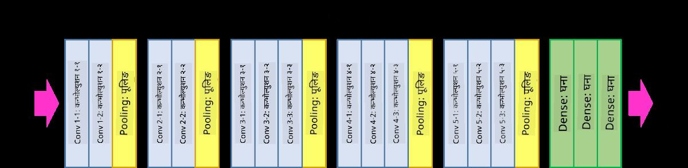

<!--
CO_OP_TRANSLATOR_METADATA:
{
  "original_hash": "2f7b97b375358cb51a1e098df306bf73",
  "translation_date": "2025-08-26T09:32:07+00:00",
  "source_file": "lessons/4-ComputerVision/07-ConvNets/CNN_Architectures.md",
  "language_code": "ne"
}
-->
# प्रख्यात CNN आर्किटेक्चरहरू

### VGG-16

VGG-16 एउटा नेटवर्क हो जसले २०१४ मा ImageNet को टप-५ वर्गीकरणमा ९२.७% शुद्धता हासिल गरेको थियो। यसको लेयर संरचना यस प्रकार छ:

जसरी तपाईं देख्न सक्नुहुन्छ, VGG ले परम्परागत पिरामिड आर्किटेक्चर अनुसरण गर्दछ, जुन कनभोल्युसन-पुलिङ लेयरहरूको क्रम हो।

> तस्बिर [Researchgate](https://www.researchgate.net/figure/Vgg16-model-structure-To-get-the-VGG-NIN-model-we-replace-the-2-nd-4-th-6-th-7-th_fig2_335194493) बाट

### ResNet

ResNet मोडेलहरूको एउटा परिवार हो जुन २०१५ मा Microsoft Research द्वारा प्रस्ताव गरिएको थियो। ResNet को मुख्य विचार भनेको **residual blocks** प्रयोग गर्नु हो:

> तस्बिर [यस पेपर](https://arxiv.org/pdf/1512.03385.pdf) बाट

Identity pass-through प्रयोग गर्ने कारण भनेको हाम्रो लेयरले अघिल्लो लेयरको नतिजा र residual block को आउटपुट बीचको **अन्तर** भविष्यवाणी गर्न हो - त्यसैले यसलाई *residual* भनिन्छ। यी ब्लकहरू प्रशिक्षण गर्न धेरै सजिलो हुन्छ, र सयौं ब्लकहरू भएको नेटवर्क निर्माण गर्न सकिन्छ (सबैभन्दा सामान्य भेरियन्टहरू ResNet-52, ResNet-101, र ResNet-152 हुन्)।

तपाईं यस नेटवर्कलाई डेटासेटको जटिलतासँग समायोजन गर्न सक्षम भएको रूपमा पनि सोच्न सक्नुहुन्छ। सुरुमा, जब तपाईं नेटवर्क प्रशिक्षण गर्न थाल्नुहुन्छ, तौलहरूको मान सानो हुन्छ, र अधिकांश संकेत passthrough identity लेयरहरू मार्फत जान्छ। जब प्रशिक्षण अगाडि बढ्छ र तौलहरू ठूलो बन्छन्, नेटवर्क प्यारामिटरहरूको महत्त्व बढ्छ, र नेटवर्कले आवश्यक अभिव्यक्तिको शक्ति समायोजन गर्दछ ताकि प्रशिक्षण छविहरूलाई सही रूपमा वर्गीकृत गर्न सकियोस्।

### Google Inception

Google Inception आर्किटेक्चरले यस विचारलाई अझ एक कदम अगाडि लैजान्छ, र प्रत्येक नेटवर्क लेयरलाई विभिन्न पथहरूको संयोजनको रूपमा निर्माण गर्दछ:

> तस्बिर [Researchgate](https://www.researchgate.net/figure/Inception-module-with-dimension-reductions-left-and-schema-for-Inception-ResNet-v1_fig2_355547454) बाट

यहाँ, हामीले १x१ कनभोल्युसनहरूको भूमिकालाई जोड दिनुपर्छ, किनभने सुरुमा तिनीहरू अर्थपूर्ण लाग्दैनन्। किन हामीले १x१ फिल्टरको साथ छविमा चलाउन आवश्यक छ? तर, तपाईंले सम्झनुपर्छ कि कनभोल्युसन फिल्टरहरूले धेरै गहिराइ च्यानलहरूसँग पनि काम गर्छन् (मूलतः - RGB रंगहरू, त्यसपछि अन्य फिल्टरहरूको लागि च्यानलहरू), र १x१ कनभोल्युसन इनपुट च्यानलहरूलाई विभिन्न ट्रेन योग्य तौलहरूको प्रयोग गरेर मिसाउन प्रयोग गरिन्छ। यसलाई च्यानल आयाममा डाउनस्याम्पलिङ (पुलिङ) को रूपमा पनि हेरिन सक्छ।

यस विषयमा [एक राम्रो ब्लग पोस्ट](https://medium.com/analytics-vidhya/talented-mr-1x1-comprehensive-look-at-1x1-convolution-in-deep-learning-f6b355825578) छ, र [मूल पेपर](https://arxiv.org/pdf/1312.4400.pdf) पनि।

### MobileNet

MobileNet साना आकारका मोडेलहरूको परिवार हो, जुन मोबाइल उपकरणहरूको लागि उपयुक्त छ। यदि तपाईं स्रोतहरूमा कमी हुनुहुन्छ र थोरै शुद्धता त्याग्न सक्नुहुन्छ भने तिनीहरू प्रयोग गर्नुहोस्। यसको मुख्य विचार भनेको **depthwise separable convolution** हो, जसले कनभोल्युसन फिल्टरहरूलाई स्थानिक कनभोल्युसन र गहिराइ च्यानलहरूमा १x१ कनभोल्युसनको संरचनाबाट प्रतिनिधित्व गर्न अनुमति दिन्छ। यसले प्यारामिटरहरूको संख्या उल्लेखनीय रूपमा घटाउँछ, जसले नेटवर्कलाई सानो आकारको बनाउँछ, र कम डाटाको साथ प्रशिक्षण गर्न सजिलो बनाउँछ।

MobileNet सम्बन्धी [एक राम्रो ब्लग पोस्ट](https://medium.com/analytics-vidhya/image-classification-with-mobilenet-cc6fbb2cd470) यहाँ छ।

## निष्कर्ष

यस इकाईमा, तपाईंले कम्प्युटर भिजन न्यूरल नेटवर्कहरूको मुख्य अवधारणा - कनभोल्युसनल नेटवर्कहरू - सिक्नुभयो। छवि वर्गीकरण, वस्तु पहिचान, र छवि उत्पादन नेटवर्कहरूलाई शक्ति दिने वास्तविक जीवनका आर्किटेक्चरहरू सबै CNNs मा आधारित छन्, केवल थप लेयरहरू र केही अतिरिक्त प्रशिक्षण तरिकाहरूको साथ।

## 🚀 चुनौती

संगैका नोटबुकहरूमा, उच्च शुद्धता प्राप्त गर्ने तरिकाहरूको बारेमा तल नोटहरू छन्। केही प्रयोगहरू गर्नुहोस् र हेर्नुहोस् कि तपाईं उच्च शुद्धता प्राप्त गर्न सक्नुहुन्छ कि।

## [पोस्ट-व्याख्यान क्विज](https://red-field-0a6ddfd03.1.azurestaticapps.net/quiz/207)

## समीक्षा र आत्म-अध्ययन

यद्यपि CNNs प्रायः कम्प्युटर भिजन कार्यहरूको लागि प्रयोग गरिन्छ, तिनीहरू सामान्यतया निश्चित आकारका ढाँचाहरू निकाल्नका लागि राम्रो हुन्छन्। उदाहरणका लागि, यदि हामी ध्वनिहरूसँग व्यवहार गर्दैछौं भने, हामीले अडियो सिग्नलमा केही विशिष्ट ढाँचाहरू खोज्न CNNs प्रयोग गर्न चाहन सक्छौं - जसको अवस्थामा फिल्टरहरू १-आयामिक हुनेछन् (र यस CNN लाई 1D-CNN भनिन्छ)। साथै, कहिलेकाहीं 3D-CNN बहु-आयामिक ठाउँमा सुविधाहरू निकाल्न प्रयोग गरिन्छ, जस्तै भिडियोमा हुने निश्चित घटनाहरू - CNN ले समयसँगै परिवर्तन हुने सुविधाहरूको ढाँचाहरू समात्न सक्छ। CNNs द्वारा गर्न सकिने अन्य कार्यहरूको बारेमा समीक्षा र आत्म-अध्ययन गर्नुहोस्।

## [असाइनमेन्ट](lab/README.md)

यस प्रयोगशालामा, तपाईंलाई विभिन्न बिरालो र कुकुरका प्रजातिहरू वर्गीकृत गर्न जिम्मा दिइएको छ। यी छविहरू MNIST डेटासेटभन्दा बढी जटिल छन् र उच्च आयामका छन्, र १० भन्दा बढी वर्गहरू छन्।

**अस्वीकरण**:  
यो दस्तावेज़ AI अनुवाद सेवा [Co-op Translator](https://github.com/Azure/co-op-translator) प्रयोग गरी अनुवाद गरिएको हो। हामी यथासम्भव सटीकता सुनिश्चित गर्न प्रयास गर्छौं, तर कृपया ध्यान दिनुहोस् कि स्वचालित अनुवादहरूमा त्रुटि वा अशुद्धता हुन सक्छ। यसको मूल भाषामा रहेको मूल दस्तावेज़लाई आधिकारिक स्रोत मानिनुपर्छ। महत्त्वपूर्ण जानकारीका लागि, व्यावसायिक मानव अनुवाद सिफारिस गरिन्छ। यस अनुवादको प्रयोगबाट उत्पन्न हुने कुनै पनि गलतफहमी वा गलत व्याख्याको लागि हामी जिम्मेवार हुने छैनौं।