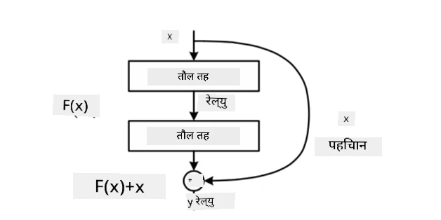
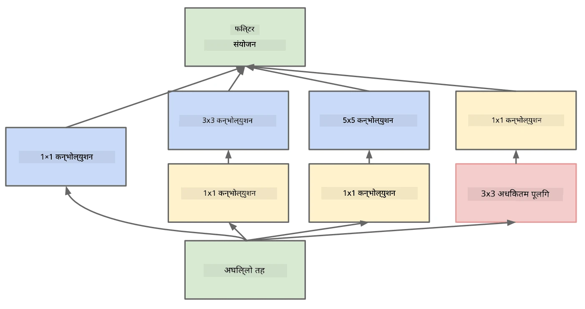

# प्रख्यात CNN आर्किटेक्चरहरू

### VGG-16

VGG-16 एक नेटवर्क हो जसले २०१४ मा ImageNet टप-५ वर्गीकरणमा ९२.७% शुद्धता प्राप्त गर्यो। यसको लेयर संरचना निम्नानुसार छ:

जस्तो कि तपाईं देख्न सक्नुहुन्छ, VGG ले परम्परागत पिरामिड आर्किटेक्चर अनुसरण गर्दछ, जुन कनभोल्युसन-पूलिङ लेयरहरूको क्रम हो।

> [Researchgate](https://www.researchgate.net/figure/Vgg16-model-structure-To-get-the-VGG-NIN-model-we-replace-the-2-nd-4-th-6-th-7-th_fig2_335194493) बाट छवि

### ResNet

ResNet माइक्रोसफ्ट रिसर्चद्वारा २०१५ मा प्रस्ताव गरिएको मोडेलहरूको परिवार हो। ResNet को मुख्य विचार **residual blocks** प्रयोग गर्नु हो:

> [यस पेपर](https://arxiv.org/pdf/1512.03385.pdf) बाट छवि

Identity पास-थ्रु प्रयोग गर्ने कारण भनेको हाम्रो लेयरले **अन्तर** भविष्यवाणी गर्नु हो जुन अघिल्लो लेयरको नतिजा र residual block को आउटपुट बीचको हो - त्यसैले यसलाई *residual* नाम दिइएको हो। यी ब्लकहरू प्रशिक्षण गर्न धेरै सजिलो हुन्छन्, र सयौं ब्लकहरू प्रयोग गरेर नेटवर्क निर्माण गर्न सकिन्छ (सबैभन्दा सामान्य भेरियन्टहरू ResNet-52, ResNet-101 र ResNet-152 हुन्)।

तपाईं यस नेटवर्कलाई डेटासेटको जटिलता अनुसार समायोजन गर्न सक्ने नेटवर्कको रूपमा पनि सोच्न सक्नुहुन्छ। सुरुमा, जब तपाईं नेटवर्क प्रशिक्षण गर्न सुरु गर्नुहुन्छ, तौलको मान सानो हुन्छ, र अधिकांश संकेत पास-थ्रु identity लेयरहरूबाट जान्छ। प्रशिक्षणको क्रममा तौलहरू ठूलो हुँदै जान्छन्, र नेटवर्कको प्यारामिटरहरूको महत्त्व बढ्छ, जसले प्रशिक्षण छविहरूलाई सही रूपमा वर्गीकरण गर्न आवश्यक अभिव्यक्तिको शक्ति समायोजन गर्दछ।

### Google Inception

Google Inception आर्किटेक्चरले यस विचारलाई अझ अगाडि बढाउँछ, र प्रत्येक नेटवर्क लेयरलाई विभिन्न पथहरूको संयोजनको रूपमा निर्माण गर्दछ:

> [Researchgate](https://www.researchgate.net/figure/Inception-module-with-dimension-reductions-left-and-schema-for-Inception-ResNet-v1_fig2_355547454) बाट छवि

यहाँ, १x१ कनभोल्युसनहरूको भूमिकालाई जोड दिन आवश्यक छ, किनकि सुरुमा तिनीहरूले अर्थपूर्ण देखिँदैनन्। किन हामीले छविमा १x१ फिल्टर चलाउन आवश्यक छ? तर, तपाईंले सम्झनु पर्छ कि कनभोल्युसन फिल्टरहरू धेरै गहिराइ च्यानलहरूसँग काम गर्छन् (सुरुमा - RGB रंगहरू, त्यसपछि विभिन्न फिल्टरहरूको च्यानलहरू), र १x१ कनभोल्युसन विभिन्न ट्रेन योग्य तौलहरू प्रयोग गरेर ती इनपुट च्यानलहरूलाई मिसाउन प्रयोग गरिन्छ। यसलाई च्यानल आयाममा डाउनस्याम्पलिङ (पूलिङ) को रूपमा पनि हेर्न सकिन्छ।

यस विषयमा [एक राम्रो ब्लग पोस्ट](https://medium.com/analytics-vidhya/talented-mr-1x1-comprehensive-look-at-1x1-convolution-in-deep-learning-f6b355825578) र [मूल पेपर](https://arxiv.org/pdf/1312.4400.pdf) उपलब्ध छ।

### MobileNet

MobileNet सानो आकारका मोडेलहरूको परिवार हो, जुन मोबाइल उपकरणहरूको लागि उपयुक्त छ। यदि तपाईं स्रोतहरूमा कमी हुनुहुन्छ र थोरै शुद्धता त्याग गर्न सक्नुहुन्छ भने तिनीहरू प्रयोग गर्नुहोस्। यसको मुख्य विचार **depthwise separable convolution** हो, जसले कनभोल्युसन फिल्टरहरूलाई स्थानिक कनभोल्युसन र गहिराइ च्यानलहरूमा १x१ कनभोल्युसनको संरचना द्वारा प्रतिनिधित्व गर्न अनुमति दिन्छ। यसले प्यारामिटरहरूको संख्या उल्लेखनीय रूपमा घटाउँछ, नेटवर्कलाई सानो आकारको बनाउँछ, र कम डाटासँग प्रशिक्षण गर्न सजिलो बनाउँछ।

MobileNet सम्बन्धी [एक राम्रो ब्लग पोस्ट](https://medium.com/analytics-vidhya/image-classification-with-mobilenet-cc6fbb2cd470) यहाँ उपलब्ध छ।

## निष्कर्ष

यस इकाईमा, तपाईंले कम्प्युटर भिजन न्यूरल नेटवर्कहरूको मुख्य अवधारणा - कनभोल्युसनल नेटवर्कहरू सिक्नुभएको छ। छवि वर्गीकरण, वस्तु पहिचान, र छवि निर्माण नेटवर्कहरूलाई शक्ति प्रदान गर्ने वास्तविक जीवनका आर्किटेक्चरहरू सबै CNN मा आधारित छन्, केवल थप लेयरहरू र केही अतिरिक्त प्रशिक्षण तरिकाहरूको साथ।

## 🚀 चुनौती

संग्लग्न नोटबुकहरूमा, उच्च शुद्धता प्राप्त गर्ने तरिकाहरूको बारेमा तल नोटहरू छन्। केही प्रयोगहरू गर्नुहोस् र उच्च शुद्धता प्राप्त गर्न सक्नुहुन्छ कि हेर्नुहोस्।

## [पोस्ट-व्याख्यान क्विज](https://ff-quizzes.netlify.app/en/ai/quiz/14)

## समीक्षा र आत्म-अध्ययन

CNN प्राय: कम्प्युटर भिजन कार्यहरूको लागि प्रयोग गरिन्छ, तर तिनीहरू निश्चित आकारका ढाँचाहरू निकाल्न सामान्यत: राम्रो हुन्छन्। उदाहरणका लागि, यदि हामी ध्वनिहरूसँग व्यवहार गरिरहेका छौं भने, हामीले अडियो संकेतमा केही विशिष्ट ढाँचाहरू खोज्न CNN प्रयोग गर्न चाहन सक्छौं - जसमा फिल्टरहरू १-डायमेन्सनल हुनेछन् (र यस CNN लाई 1D-CNN भनिन्छ)। साथै, कहिलेकाहीं 3D-CNN बहु-आयामिक स्थानमा सुविधाहरू निकाल्न प्रयोग गरिन्छ, जस्तै भिडियोमा हुने निश्चित घटनाहरू - CNN ले समयको साथ परिवर्तन हुने सुविधाहरूको निश्चित ढाँचाहरू समात्न सक्छ। CNN द्वारा गर्न सकिने अन्य कार्यहरूको बारेमा समीक्षा र आत्म-अध्ययन गर्नुहोस्।

## [असाइनमेन्ट](lab/README.md)

यस प्रयोगशालामा, तपाईंलाई विभिन्न बिरालो र कुकुरको प्रजातिहरू वर्गीकरण गर्न जिम्मा दिइएको छ। यी छविहरू MNIST डेटासेटभन्दा जटिल छन् र उच्च आयामका छन्, र १० भन्दा बढी वर्गहरू छन्।

---

