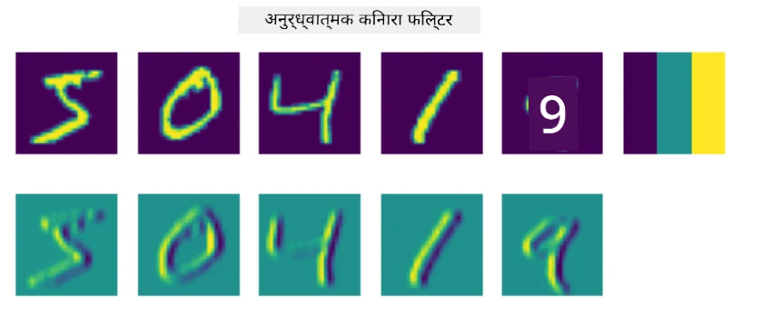
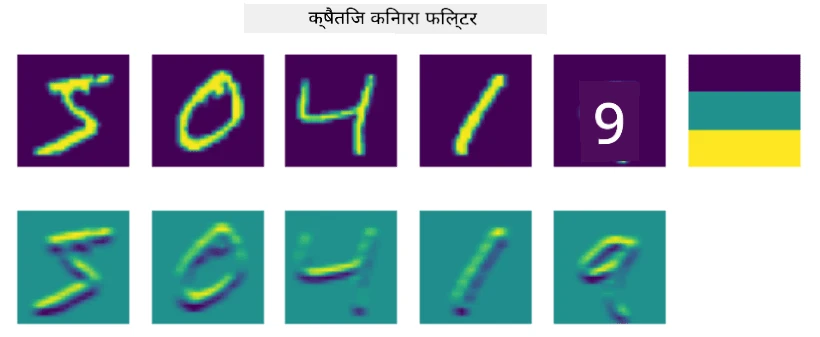
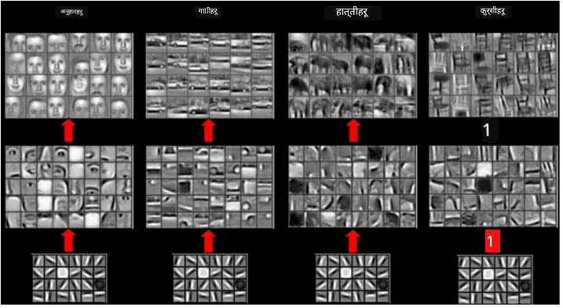
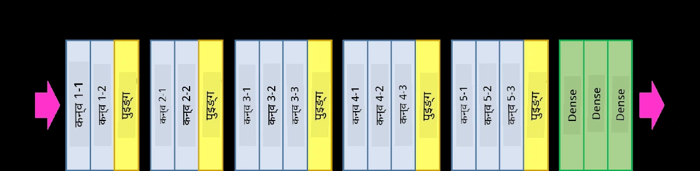
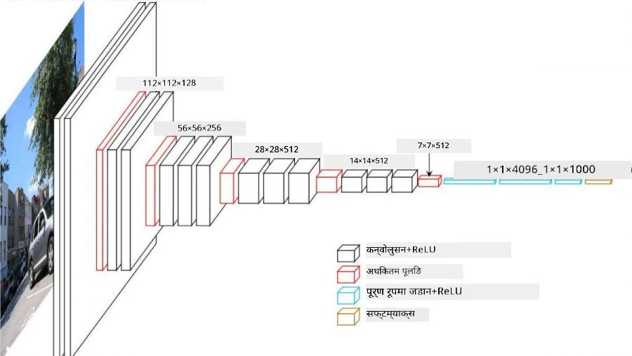

# Convolutional Neural Networks

हामीले पहिले देखिसकेका छौं कि न्युरल नेटवर्कहरू छविहरूसँग काम गर्न निकै राम्रो छन्, र एक तहको परसेप्ट्रोनले पनि MNIST डेटासेटबाट हस्तलेखन गरिएको अंकहरू उचित शुद्धतासँग चिन्हित गर्न सक्षम छ। तर, MNIST डेटासेट विशेष छ, र सबै अंकहरू छविको बीचमा केन्द्रित छन्, जसले कार्यलाई सरल बनाउँछ।

## [Pre-lecture quiz](https://ff-quizzes.netlify.app/en/ai/quiz/13)

वास्तविक जीवनमा, हामी छविमा वस्तुहरूको ठ्याक्कै स्थानको पर्वाह नगरी तिनीहरूलाई चिन्हित गर्न सक्षम हुन चाहन्छौं। कम्प्युटर भिजन सामान्य वर्गीकरणभन्दा फरक छ, किनकि जब हामी छविमा कुनै निश्चित वस्तु खोज्ने प्रयास गरिरहेका हुन्छौं, हामी छविलाई स्क्यान गर्दै केही विशेष **ढाँचाहरू** र तिनीहरूको संयोजन खोजिरहेका हुन्छौं। उदाहरणका लागि, बिरालो खोज्दा, हामी पहिले तेर्सो रेखाहरू खोज्न सक्छौं, जसले जुँगा बनाउन सक्छ, र त्यसपछि जुँगाको निश्चित संयोजनले हामीलाई यो वास्तवमा बिरालोको तस्वीर हो भन्ने बताउन सक्छ। ढाँचाहरूको सापेक्ष स्थिति र उपस्थिति महत्त्वपूर्ण छ, तर तिनीहरूको छविमा ठ्याक्कै स्थिति होइन।

ढाँचाहरू निकाल्न, हामी **कन्भोल्युसनल फिल्टरहरू** को धारणा प्रयोग गर्नेछौं। तपाईंलाई थाहा छ, छवि 2D-म्याट्रिक्स वा रंग गहिराइ भएको 3D-टेन्सरद्वारा प्रतिनिधित्व गरिन्छ। फिल्टर लागू गर्नुको मतलब हामी सानो **फिल्टर कर्नेल** म्याट्रिक्स लिन्छौं, र मूल छविको प्रत्येक पिक्सेलको लागि हामी छिमेकी बिन्दुहरूसँग तौलित औसत गणना गर्छौं। हामी यसलाई सानो झ्यालले सम्पूर्ण छविमा स्लाइड गर्दै, र फिल्टर कर्नेल म्याट्रिक्समा तौलहरू अनुसार सबै पिक्सेलहरू औसत गर्दै हेर्न सक्छौं।

 | 
----|----

> छवि: दिमित्री सोश्निकोभ

उदाहरणका लागि, यदि हामी 3x3 ठाडो किनारा र तेर्सो किनारा फिल्टरहरू MNIST अंकहरूमा लागू गर्छौं भने, हामी मूल छविमा ठाडो र तेर्सो किनाराहरू भएको ठाउँमा हाइलाइटहरू (जस्तै उच्च मानहरू) प्राप्त गर्न सक्छौं। त्यसैले ती दुई फिल्टरहरू किनाराहरू "खोज्न" प्रयोग गर्न सकिन्छ। यसैगरी, हामी अन्य तल्लो-स्तरका ढाँचाहरू खोज्न विभिन्न फिल्टरहरू डिजाइन गर्न सक्छौं:

> [Leung-Malik Filter Bank](https://www.robots.ox.ac.uk/~vgg/research/texclass/filters.html) को छवि

तर, हामी ढाँचाहरू निकाल्न फिल्टरहरू म्यानुअली डिजाइन गर्न सक्छौं भने, हामी नेटवर्कलाई यसरी डिजाइन गर्न सक्छौं कि यसले ढाँचाहरू स्वचालित रूपमा सिक्छ। यो CNN को पछाडि मुख्य विचारहरू मध्ये एक हो।

## CNN को मुख्य विचारहरू

CNN काम गर्ने तरिका निम्न महत्त्वपूर्ण विचारहरूमा आधारित छ:

* कन्भोल्युसनल फिल्टरहरूले ढाँचाहरू निकाल्न सक्छन्
* हामी नेटवर्कलाई यसरी डिजाइन गर्न सक्छौं कि फिल्टरहरू स्वचालित रूपमा प्रशिक्षित हुन्छन्
* हामी मूल छविमा मात्र होइन, उच्च-स्तरका विशेषताहरूमा ढाँचाहरू फेला पार्न उस्तै दृष्टिकोण प्रयोग गर्न सक्छौं। यसरी CNN विशेषता निकाल्ने काम विशेषताको पदानुक्रममा हुन्छ, तल्लो-स्तरका पिक्सेल संयोजनबाट सुरु गर्दै, चित्रका भागहरूको उच्च-स्तर संयोजनसम्म।

> छवि: [Hislop-Lynch को पेपर](https://www.semanticscholar.org/paper/Computer-vision-based-pedestrian-trajectory-Hislop-Lynch/26e6f74853fc9bbb7487b06dc2cf095d36c9021d) बाट, [तिनीहरूको अनुसन्धान](https://dl.acm.org/doi/abs/10.1145/1553374.1553453) मा आधारित

## ✍️ अभ्यास: कन्भोल्युसनल न्युरल नेटवर्कहरू

आउनुहोस्, कन्भोल्युसनल न्युरल नेटवर्कहरू कसरी काम गर्छन् र कसरी हामी प्रशिक्षित फिल्टरहरू प्राप्त गर्न सक्छौं भनेर सम्बन्धित नोटबुकहरू मार्फत काम गरेर अन्वेषण जारी राखौं:

* [Convolutional Neural Networks - PyTorch](ConvNetsPyTorch.ipynb)
* [Convolutional Neural Networks - TensorFlow](ConvNetsTF.ipynb)

## पिरामिड आर्किटेक्चर

छवि प्रशोधनका लागि प्रयोग गरिएका अधिकांश CNN ले तथाकथित पिरामिड आर्किटेक्चर अनुसरण गर्छन्। मूल छविहरूमा लागू गरिएको पहिलो कन्भोल्युसनल तहमा सामान्यतया तुलनात्मक रूपमा कम संख्याका फिल्टरहरू (8-16) हुन्छन्, जसले विभिन्न पिक्सेल संयोजनहरूलाई प्रतिनिधित्व गर्छ, जस्तै तेर्सो/ठाडो रेखाहरू। अर्को स्तरमा, हामी नेटवर्कको स्थानिक आयाम घटाउँछौं, र फिल्टरहरूको संख्या बढाउँछौं, जसले साधारण विशेषताहरूको सम्भावित संयोजनहरूलाई प्रतिनिधित्व गर्छ। प्रत्येक तहसँग, अन्तिम वर्गीकरणतर्फ जाँदा, छविको स्थानिक आयाम घट्छ, र फिल्टरहरूको संख्या बढ्छ।

उदाहरणका लागि, VGG-16 को आर्किटेक्चरलाई हेरौं, जसले 2014 मा ImageNet को शीर्ष-5 वर्गीकरणमा 92.7% शुद्धता प्राप्त गर्यो:

> छवि: [Researchgate](https://www.researchgate.net/figure/Vgg16-model-structure-To-get-the-VGG-NIN-model-we-replace-the-2-nd-4-th-6-th-7-th_fig2_335194493) बाट

## सबैभन्दा प्रख्यात CNN आर्किटेक्चरहरू

[सबैभन्दा प्रख्यात CNN आर्किटेक्चरहरूको अध्ययन जारी राख्नुहोस्](CNN_Architectures.md)

---

