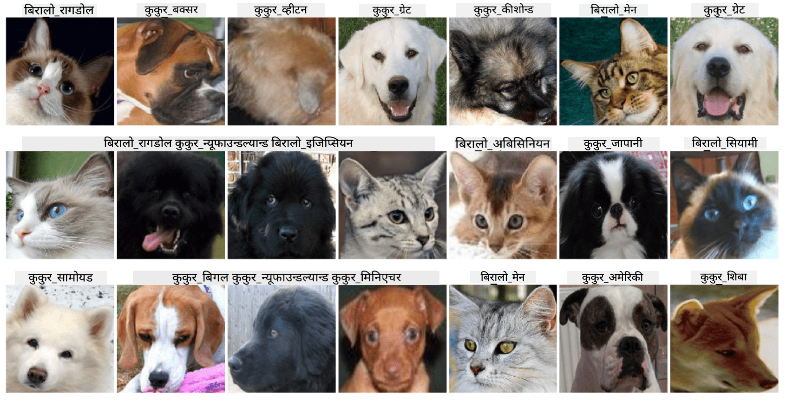

<!--
CO_OP_TRANSLATOR_METADATA:
{
  "original_hash": "f3d2cee9cb3c52160419e560c57a690e",
  "translation_date": "2025-08-26T09:34:18+00:00",
  "source_file": "lessons/4-ComputerVision/07-ConvNets/lab/README.md",
  "language_code": "ne"
}
-->
# पाल्तु जनावरहरूको अनुहारको वर्गीकरण

[AI for Beginners Curriculum](https://github.com/microsoft/ai-for-beginners) बाट ल्याब असाइनमेन्ट।

## कार्य

कल्पना गर्नुहोस् कि तपाईंले पाल्तु जनावरहरूको नर्सरीको लागि सबै जनावरहरूको सूची बनाउन एउटा एप्लिकेसन विकास गर्नुपर्नेछ। यस्तो एप्लिकेसनको एक उत्कृष्ट विशेषता भनेको फोटोबाट स्वचालित रूपमा प्रजाति पत्ता लगाउने क्षमता हुनेछ। यो कार्य न्यूरल नेटवर्कहरूको प्रयोग गरेर सफलतापूर्वक गर्न सकिन्छ।

तपाईंले **Pet Faces** डाटासेट प्रयोग गरेर बिरालो र कुकुरका विभिन्न प्रजातिहरूलाई वर्गीकरण गर्न एक कनभोल्युसनल न्यूरल नेटवर्क प्रशिक्षण गर्नुपर्नेछ।

## डाटासेट

हामी **Pet Faces** डाटासेट प्रयोग गर्नेछौं, जुन [Oxford-IIIT](https://www.robots.ox.ac.uk/~vgg/data/pets/) पाल्तु जनावरहरूको डाटासेटबाट लिइएको हो। यसमा कुकुर र बिरालोका ३५ विभिन्न प्रजातिहरू समावेश छन्।



डाटासेट डाउनलोड गर्न, यो कोड स्निपेट प्रयोग गर्नुहोस्:

```python
!wget https://mslearntensorflowlp.blob.core.windows.net/data/petfaces.tar.gz
!tar xfz petfaces.tar.gz
!rm petfaces.tar.gz
```

## नोटबुक सुरु गर्नुहोस्

[PetFaces.ipynb](../../../../../../lessons/4-ComputerVision/07-ConvNets/lab/PetFaces.ipynb) खोल्दै ल्याब सुरु गर्नुहोस्।

## मुख्य सिकाइ

तपाईंले सुरुबाट नै छविको वर्गीकरणको जटिल समस्या समाधान गर्नुभयो! धेरै वर्गहरू थिए, तर तपाईंले अझै पनि राम्रो सटीकता प्राप्त गर्न सक्नुभयो! साथै, शीर्ष-k सटीकता मापन गर्नु पनि महत्त्वपूर्ण छ, किनभने केही वर्गहरूलाई छुट्याउन मानिसहरूलाई पनि गाह्रो हुन सक्छ।

**अस्वीकरण**:  
यो दस्तावेज़ AI अनुवाद सेवा [Co-op Translator](https://github.com/Azure/co-op-translator) प्रयोग गरी अनुवाद गरिएको हो। हामी यथासम्भव सटीकता सुनिश्चित गर्न प्रयास गर्छौं, तर कृपया ध्यान दिनुहोस् कि स्वचालित अनुवादहरूमा त्रुटि वा अशुद्धता हुन सक्छ। यसको मूल भाषामा रहेको मूल दस्तावेजलाई आधिकारिक स्रोत मानिनुपर्छ। महत्वपूर्ण जानकारीका लागि, व्यावसायिक मानव अनुवाद सिफारिस गरिन्छ। यस अनुवादको प्रयोगबाट उत्पन्न हुने कुनै पनि गलतफहमी वा गलत व्याख्याको लागि हामी जिम्मेवार हुने छैनौं।