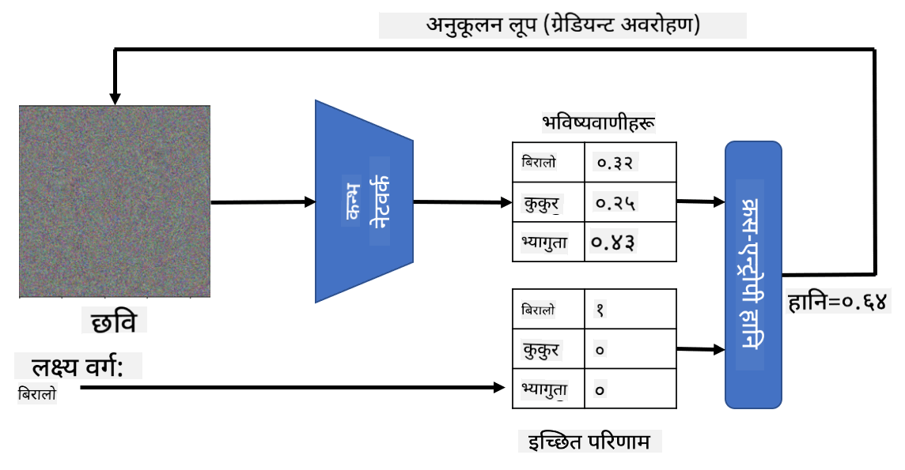

<!--
CO_OP_TRANSLATOR_METADATA:
{
  "original_hash": "717775c4050ccbffbe0c961ad8bf7bf7",
  "translation_date": "2025-08-26T09:44:19+00:00",
  "source_file": "lessons/4-ComputerVision/08-TransferLearning/README.md",
  "language_code": "ne"
}
-->
# पूर्व-प्रशिक्षित नेटवर्कहरू र ट्रान्सफर लर्निङ

CNN हरूलाई प्रशिक्षण दिन धेरै समय लाग्न सक्छ, र यसका लागि धेरै डाटा आवश्यक पर्छ। तर, धेरैजसो समय नेटवर्कले तल्लो-स्तरका फिल्टरहरू सिक्नमा खर्च हुन्छ, जसले छविहरूबाट ढाँचाहरू निकाल्न प्रयोग गर्न सकिन्छ। एउटा स्वाभाविक प्रश्न उठ्छ - के हामी एउटा डेटासेटमा प्रशिक्षित न्यूरल नेटवर्कलाई प्रयोग गरेर फरक छविहरू वर्गीकृत गर्न अनुकूलन गर्न सक्छौं, पूर्ण प्रशिक्षण प्रक्रिया बिना?

## [पूर्व-व्याख्यान क्विज](https://red-field-0a6ddfd03.1.azurestaticapps.net/quiz/108)

यस दृष्टिकोणलाई **ट्रान्सफर लर्निङ** भनिन्छ, किनभने हामी एउटा न्यूरल नेटवर्क मोडेलबाट अर्कोमा केही ज्ञान स्थानान्तरण गर्छौं। ट्रान्सफर लर्निङमा, हामी सामान्यतया एउटा पूर्व-प्रशिक्षित मोडेलबाट सुरु गर्छौं, जुन ठूलो छवि डेटासेट, जस्तै **ImageNet**, मा प्रशिक्षित गरिएको हुन्छ। ती मोडेलहरूले पहिले नै सामान्य छविहरूबाट विभिन्न विशेषताहरू निकाल्न राम्रो काम गर्न सक्छन्, र धेरै अवस्थामा ती निकालेका विशेषताहरूको आधारमा एउटा वर्गीकर्ता निर्माण गर्दा राम्रो नतिजा दिन सक्छ।

> ✅ ट्रान्सफर लर्निङ अन्य शैक्षिक क्षेत्रहरूमा पनि पाइन्छ, जस्तै शिक्षा। यसले एउटा क्षेत्रमा लिइएको ज्ञानलाई अर्को क्षेत्रमा लागू गर्ने प्रक्रियालाई जनाउँछ।

## पूर्व-प्रशिक्षित मोडेलहरूलाई विशेषता निकाल्ने उपकरणको रूपमा प्रयोग गर्नु

हामीले अघिल्लो खण्डमा चर्चा गरेका कन्भोल्युसनल नेटवर्कहरूमा धेरै तहहरू हुन्छन्, जसले छविबाट केही विशेषताहरू निकाल्नुपर्छ। यो प्रक्रिया तल्लो-स्तरका पिक्सेल संयोजनहरू (जस्तै तेर्सो/ठाडो रेखा वा स्ट्रोक) बाट सुरु भएर उच्च-स्तरका विशेषताहरू (जस्तै ज्वालाको आँखा) सम्म पुग्छ। यदि हामीले सामान्य र विविध छविहरूको पर्याप्त ठूलो डेटासेटमा CNN प्रशिक्षण गर्‍यौं भने, नेटवर्कले ती सामान्य विशेषताहरू निकाल्न सिक्नुपर्छ।

Keras र PyTorch दुबैमा सामान्य आर्किटेक्चरहरूको लागि पूर्व-प्रशिक्षित न्यूरल नेटवर्क वेटहरू सजिलै लोड गर्नका लागि कार्यहरू छन्, जसको धेरैजसो ImageNet छविहरूमा प्रशिक्षित गरिएका छन्। प्रायः प्रयोग गरिने मोडेलहरू [CNN आर्किटेक्चरहरू](../07-ConvNets/CNN_Architectures.md) पृष्ठमा वर्णन गरिएका छन्। विशेष गरी, तपाईं निम्नमध्ये कुनै एक प्रयोग गर्न विचार गर्न सक्नुहुन्छ:

* **VGG-16/VGG-19**: यी तुलनात्मक रूपमा सरल मोडेलहरू हुन्, जसले अझै राम्रो शुद्धता दिन्छन्। ट्रान्सफर लर्निङ कसरी काम गरिरहेको छ भनेर हेर्न VGG प्रयोग गर्नु राम्रो पहिलो प्रयास हुन सक्छ।
* **ResNet**: यो मोडेलहरूको परिवार हो, जुन Microsoft Research ले २०१५ मा प्रस्ताव गरेको थियो। यीमा धेरै तहहरू हुन्छन्, जसले गर्दा बढी स्रोतहरू आवश्यक पर्छ।
* **MobileNet**: यो सानो आकारका मोडेलहरूको परिवार हो, जुन मोबाइल उपकरणहरूको लागि उपयुक्त छ। यदि तपाईं स्रोतहरूमा सीमित हुनुहुन्छ र थोरै शुद्धता त्याग्न सक्नुहुन्छ भने, यी प्रयोग गर्नुहोस्।

यहाँ VGG-16 नेटवर्कले बिरालोको तस्वीरबाट निकालेका नमूना विशेषताहरू छन्:

## बिरालो र कुकुर डेटासेट

यस उदाहरणमा, हामी [बिरालो र कुकुर](https://www.microsoft.com/download/details.aspx?id=54765&WT.mc_id=academic-77998-cacaste) को डेटासेट प्रयोग गर्नेछौं, जुन वास्तविक जीवनको छवि वर्गीकरण परिदृश्यसँग धेरै नजिक छ।

## ✍️ अभ्यास: ट्रान्सफर लर्निङ

आउनुहोस्, सम्बन्धित नोटबुकहरूमा ट्रान्सफर लर्निङलाई कार्यान्वयनमा हेर्नुहोस्:

* [ट्रान्सफर लर्निङ - PyTorch](../../../../../lessons/4-ComputerVision/08-TransferLearning/TransferLearningPyTorch.ipynb)
* [ट्रान्सफर लर्निङ - TensorFlow](../../../../../lessons/4-ComputerVision/08-TransferLearning/TransferLearningTF.ipynb)

## प्रतिकूल बिरालोको दृश्यकरण

पूर्व-प्रशिक्षित न्यूरल नेटवर्कको *मस्तिष्क* भित्र विभिन्न ढाँचाहरू हुन्छन्, जसमा **आदर्श बिरालो** (र आदर्श कुकुर, आदर्श जेब्रा, आदि) को अवधारणाहरू पनि समावेश छन्। यो छवि कसरी **दृश्यकरण गर्ने** भन्ने कुरा रोचक हुनेछ। तर, यो सजिलो छैन, किनभने ढाँचाहरू नेटवर्क वेटहरूमा फैलिएका हुन्छन्, र तिनीहरू पदानुक्रमित संरचनामा व्यवस्थित हुन्छन्।

हामीले लिन सक्ने एउटा दृष्टिकोण भनेको एउटा अनियमित छविबाट सुरु गर्नु हो, र त्यसपछि **ग्रेडियन्ट डिसेन्ट अप्टिमाइजेसन** प्रविधि प्रयोग गरेर त्यो छविलाई यसरी समायोजन गर्नु हो, जसले गर्दा नेटवर्कले यसलाई बिरालो ठान्न थाल्छ। 

तर, यदि हामीले यसो गर्‍यौं भने, हामीले अनियमित आवाजसँग मिल्दोजुल्दो केही प्राप्त गर्नेछौं। यसको कारण हो *नेटवर्कलाई इनपुट छवि बिरालो हो भनेर सोच्न बनाउने धेरै तरिकाहरू छन्*, जसमा केही दृश्य रूपमा अर्थपूर्ण हुँदैनन्। ती छविहरूमा बिरालोका लागि विशिष्ट धेरै ढाँचाहरू हुन्छन्, तर तिनीहरूलाई दृश्य रूपमा फरक पार्ने कुनै बाध्यता हुँदैन।

नतिजा सुधार गर्न, हामी हानि कार्यमा अर्को पद थप्न सक्छौं, जसलाई **भिन्नता हानि** भनिन्छ। यो एउटा मेट्रिक हो, जसले छविका छिमेकी पिक्सेलहरू कत्तिको समान छन् भनेर देखाउँछ। भिन्नता हानिलाई न्यूनतम बनाउँदा छवि चिल्लो हुन्छ, र आवाज हट्छ - जसले गर्दा दृश्य रूपमा आकर्षक ढाँचाहरू प्रकट हुन्छन्। यहाँ यस्ता "आदर्श" छविहरूको उदाहरण छ, जसलाई उच्च सम्भावनाका साथ बिरालो र जेब्रा भनेर वर्गीकृत गरिएको छ:

 | 
-----|-----
 *आदर्श बिरालो* | *आदर्श जेब्रा*

यस्तै दृष्टिकोण प्रयोग गरेर तथाकथित **प्रतिकूल आक्रमणहरू** न्यूरल नेटवर्कमा गर्न सकिन्छ। मानौं हामीले न्यूरल नेटवर्कलाई मूर्ख बनाउनुपर्छ र कुकुरलाई बिरालो जस्तो देखाउनुपर्छ। यदि हामीले कुकुरको छवि लियौं, जसलाई नेटवर्कले कुकुर भनेर चिन्छ, हामी त्यसलाई अलिकति समायोजन गर्न सक्छौं, जबसम्म नेटवर्कले यसलाई बिरालो भनेर वर्गीकृत गर्न थाल्दैन:

 | 
-----|-----
*कुकुरको मूल तस्वीर* | *कुकुरको तस्वीरलाई बिरालो भनेर वर्गीकृत गरिएको*

माथिका नतिजाहरू पुन: उत्पादन गर्न कोड निम्न नोटबुकमा हेर्नुहोस्:

* [आदर्श र प्रतिकूल बिरालो - TensorFlow](../../../../../lessons/4-ComputerVision/08-TransferLearning/AdversarialCat_TF.ipynb)

## निष्कर्ष

ट्रान्सफर लर्निङ प्रयोग गरेर, तपाईंले अनुकूल वस्तु वर्गीकरण कार्यको लागि छिटो वर्गीकर्ता तयार गर्न र उच्च शुद्धता प्राप्त गर्न सक्नुहुन्छ। तपाईंले देख्न सक्नुहुन्छ कि हामी अहिले समाधान गरिरहेका जटिल कार्यहरू उच्च कम्प्युटेशनल पावर आवश्यक छ, र CPU मा सजिलै समाधान गर्न सकिँदैन। अर्को इकाईमा, हामी कम कम्प्युट स्रोतहरू प्रयोग गरेर उस्तै मोडेल प्रशिक्षण गर्न हल्का कार्यान्वयन प्रयोग गर्ने प्रयास गर्नेछौं, जसले थोरै कम शुद्धता परिणाम दिन्छ।

## 🚀 चुनौती

संगत नोटबुकहरूमा, तल नोटहरू छन् कि ट्रान्सफर ज्ञान समान प्रकारको प्रशिक्षण डाटासँग राम्रोसँग काम गर्छ (सायद नयाँ प्रकारको जनावर)। पूर्ण रूपमा नयाँ प्रकारका छविहरूसँग केही प्रयोग गरेर हेर्नुहोस् कि तपाईंको ट्रान्सफर ज्ञान मोडेलहरूले कत्तिको राम्रो वा नराम्रो प्रदर्शन गर्छन्।

## [पश्च-व्याख्यान क्विज](https://red-field-0a6ddfd03.1.azurestaticapps.net/quiz/208)

## समीक्षा र आत्म-अध्ययन

[TrainingTricks.md](TrainingTricks.md) पढेर आफ्नो मोडेलहरू प्रशिक्षण गर्ने अन्य तरिकाहरूको ज्ञानलाई गहिरो बनाउनुहोस्।

## [असाइनमेन्ट](lab/README.md)

यस प्रयोगशालामा, हामी वास्तविक जीवनको [Oxford-IIIT](https://www.robots.ox.ac.uk/~vgg/data/pets/) पालतू जनावरहरूको डेटासेट प्रयोग गर्नेछौं, जसमा बिरालो र कुकुरका ३५ प्रजातिहरू छन्, र हामी ट्रान्सफर लर्निङ वर्गीकर्ता निर्माण गर्नेछौं।

**अस्वीकरण**:  
यो दस्तावेज़ AI अनुवाद सेवा [Co-op Translator](https://github.com/Azure/co-op-translator) प्रयोग गरी अनुवाद गरिएको हो। हामी यथासम्भव सटीकता सुनिश्चित गर्न प्रयास गर्छौं, तर कृपया ध्यान दिनुहोस् कि स्वचालित अनुवादहरूमा त्रुटि वा अशुद्धता हुन सक्छ। यसको मूल भाषामा रहेको मूल दस्तावेज़लाई आधिकारिक स्रोत मानिनुपर्छ। महत्त्वपूर्ण जानकारीका लागि, व्यावसायिक मानव अनुवाद सिफारिस गरिन्छ। यस अनुवादको प्रयोगबाट उत्पन्न हुने कुनै पनि गलतफहमी वा गलत व्याख्याको लागि हामी जिम्मेवार हुने छैनौं।