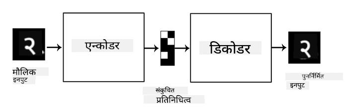

<!--
CO_OP_TRANSLATOR_METADATA:
{
  "original_hash": "0b306c04f5337b6e7430e5c0b16bb5c0",
  "translation_date": "2025-08-26T09:06:58+00:00",
  "source_file": "lessons/4-ComputerVision/09-Autoencoders/README.md",
  "language_code": "ne"
}
-->
# अटोएनकोडरहरू

CNN प्रशिक्षण गर्दा, एउटा समस्या यो हो कि हामीलाई धेरै लेबल गरिएको डाटा चाहिन्छ। छवि वर्गीकरणको अवस्थामा, हामीले छविहरूलाई विभिन्न वर्गहरूमा छुट्याउनुपर्छ, जुन एक म्यानुअल प्रयास हो।

## [Pre-lecture quiz](https://ff-quizzes.netlify.app/en/ai/quiz/17)

तर, हामी कच्चा (लेबल नगरिएको) डाटा CNN फीचर एक्स्ट्र्याक्टरहरू प्रशिक्षण गर्न प्रयोग गर्न चाहन सक्छौं, जसलाई **स्व-पर्यवेक्षित शिक्षण** भनिन्छ। लेबलहरूको सट्टा, हामी प्रशिक्षण छविहरूलाई नेटवर्क इनपुट र आउटपुट दुवैको रूपमा प्रयोग गर्नेछौं। **अटोएनकोडर** को मुख्य विचार यो हो कि हामीसँग एक **एन्कोडर नेटवर्क** हुनेछ जसले इनपुट छविलाई केही **गुप्त स्थान** मा रूपान्तरण गर्दछ (सामान्यतया यो केही सानो आकारको भेक्टर मात्र हो), त्यसपछि **डिकोडर नेटवर्क**, जसको लक्ष्य मूल छवि पुनर्निर्माण गर्नु हो।

> ✅ [अटोएनकोडर](https://wikipedia.org/wiki/Autoencoder) भनेको "एक प्रकारको कृत्रिम न्यूरल नेटवर्क हो जसले लेबल नगरिएको डाटाको कुशल कोडिङ सिक्न प्रयोग गरिन्छ।"

किनकि हामी अटोएनकोडरलाई मूल छविबाट यथासम्भव धेरै जानकारी कब्जा गर्न प्रशिक्षण गर्दैछौं ताकि सही पुनर्निर्माण गर्न सकियोस्, नेटवर्कले इनपुट छविहरूको उत्तम **एम्बेडिङ** पत्ता लगाउन प्रयास गर्दछ।

> छवि [Keras blog](https://blog.keras.io/building-autoencoders-in-keras.html) बाट

## अटोएनकोडर प्रयोग गर्ने परिदृश्यहरू

मूल छविहरू पुनर्निर्माण गर्नु आफैंमा उपयोगी नदेखिए पनि, केही परिदृश्यहरू छन् जहाँ अटोएनकोडरहरू विशेष रूपमा उपयोगी छन्:

* **छविहरूको आयाम घटाउने** वा **छवि एम्बेडिङ प्रशिक्षण गर्ने**। सामान्यतया अटोएनकोडरहरूले PCA भन्दा राम्रो परिणाम दिन्छन्, किनकि यसले छविहरूको स्थानिक प्रकृति र पदानुक्रमिक विशेषताहरूलाई ध्यानमा राख्छ।
* **डिनोइजिङ**, अर्थात् छविबाट शोर हटाउने। किनकि शोरले धेरै अनावश्यक जानकारी बोकेको हुन्छ, अटोएनकोडरले यसलाई सानो गुप्त स्थानमा फिट गर्न सक्दैन, र यसले छविको महत्त्वपूर्ण भाग मात्र कब्जा गर्दछ। डिनोइजरहरू प्रशिक्षण गर्दा, हामी मूल छविहरूबाट सुरु गर्छौं, र कृत्रिम रूपमा थपिएको शोर भएको छविहरूलाई अटोएनकोडरको इनपुटको रूपमा प्रयोग गर्छौं।
* **सुपर-रेजोल्युसन**, छविको रिजोल्युसन बढाउने। हामी उच्च रिजोल्युसन छविहरूबाट सुरु गर्छौं, र कम रिजोल्युसन भएको छविलाई अटोएनकोडर इनपुटको रूपमा प्रयोग गर्छौं।
* **जनरेटिभ मोडेलहरू**। एकपटक हामीले अटोएनकोडर प्रशिक्षण गरेपछि, डिकोडर भागलाई नयाँ वस्तुहरू सिर्जना गर्न प्रयोग गर्न सकिन्छ, जसको सुरुवात गुप्त भेक्टरहरूबाट हुन्छ।

## भेरिएशनल अटोएनकोडरहरू (VAE)

परम्परागत अटोएनकोडरहरूले इनपुट डाटाको आयामलाई कुनै न कुनै रूपमा घटाउँछन्, इनपुट छविहरूका महत्त्वपूर्ण विशेषताहरू पत्ता लगाउँछन्। तर, गुप्त भेक्टरहरू प्रायः धेरै अर्थपूर्ण हुँदैनन्। अन्य शब्दमा, MNIST डेटासेटलाई उदाहरणको रूपमा लिँदा, विभिन्न गुप्त भेक्टरहरू कुन अंकसँग सम्बन्धित छन् भनेर पत्ता लगाउनु सजिलो काम होइन, किनकि नजिकका गुप्त भेक्टरहरूले अनिवार्य रूपमा उही अंकलाई प्रतिनिधित्व गर्दैनन्।

अर्कोतर्फ, *जनरेटिभ* मोडेलहरू प्रशिक्षण गर्न गुप्त स्थानको केही बुझाइ हुनु राम्रो हुन्छ। यस विचारले हामीलाई **भेरिएशनल अटोएनकोडर** (VAE) तर्फ लैजान्छ।

VAE भनेको अटोएनकोडर हो जसले गुप्त प्यारामिटरहरूको *सांख्यिकीय वितरण* भविष्यवाणी गर्न सिक्छ, जसलाई **गुप्त वितरण** भनिन्छ। उदाहरणका लागि, हामी चाहन सक्छौं कि गुप्त भेक्टरहरू सामान्य रूपमा केही औसत zmean र मानक विचलन zsigma (दुवै औसत र मानक विचलन केही आयामको भेक्टर हुन्) संग वितरण गरियोस्। VAE मा एन्कोडरले ती प्यारामिटरहरू भविष्यवाणी गर्न सिक्छ, र त्यसपछि डिकोडरले यस वितरणबाट एक र्यान्डम भेक्टर लिन्छ ताकि वस्तु पुनर्निर्माण गर्न सकियोस्।

सारांशमा:

 * इनपुट भेक्टरबाट, हामी `z_mean` र `z_log_sigma` भविष्यवाणी गर्छौं (मानक विचलन आफैं भविष्यवाणी गर्ने सट्टा, हामी यसको लघुगणक भविष्यवाणी गर्छौं)
 * हामी वितरण N(zmean,exp(zlog\_sigma)) बाट `sample` भेक्टर लिन्छौं
 * डिकोडरले `sample` लाई इनपुट भेक्टरको रूपमा प्रयोग गरेर मूल छवि डिकोड गर्न प्रयास गर्छ

 

> छवि [यो ब्लग पोस्ट](https://ijdykeman.github.io/ml/2016/12/21/cvae.html) बाट, लेखक: इसाक डाइकमन

भेरिएशनल अटोएनकोडरहरूले जटिल हानिको कार्य प्रयोग गर्छन् जसमा दुई भागहरू हुन्छन्:

* **पुनर्निर्माण हानि** भनेको हानिको कार्य हो जसले पुनर्निर्मित छवि लक्ष्यसँग कति नजिक छ भनेर देखाउँछ (यो Mean Squared Error, वा MSE हुन सक्छ)। यो सामान्य अटोएनकोडरहरूमा प्रयोग गरिने हानिको कार्य जस्तै हो।
* **KL हानि**, जसले सुनिश्चित गर्छ कि गुप्त भेरिएबल वितरणहरू सामान्य वितरणको नजिक रहन्छ। यो [Kullback-Leibler divergence](https://www.countbayesie.com/blog/2017/5/9/kullback-leibler-divergence-explained) को धारणा आधारित छ - दुई सांख्यिकीय वितरणहरू कति समान छन् भनेर अनुमान गर्न मेट्रिक।

VAE को एउटा महत्त्वपूर्ण फाइदा यो हो कि यसले हामीलाई नयाँ छविहरू तुलनात्मक रूपमा सजिलै सिर्जना गर्न अनुमति दिन्छ, किनकि हामीलाई थाहा छ कुन वितरणबाट गुप्त भेक्टरहरू नमूना गर्नुपर्छ। उदाहरणका लागि, यदि हामीले MNIST मा 2D गुप्त भेक्टरको साथ VAE प्रशिक्षण गर्छौं भने, हामी गुप्त भेक्टरका घटकहरू फरक पारेर विभिन्न अंकहरू प्राप्त गर्न सक्छौं:

> छवि [Dmitry Soshnikov](http://soshnikov.com) द्वारा

छविहरू एकअर्कामा कसरी मिश्रित हुन्छन् हेर्नुहोस्, किनकि हामी गुप्त प्यारामिटर स्थानको विभिन्न भागहरूबाट गुप्त भेक्टरहरू प्राप्त गर्न थाल्छौं। हामी यस स्थानलाई 2D मा पनि दृश्यात्मक बनाउन सक्छौं:

 

> छवि [Dmitry Soshnikov](http://soshnikov.com) द्वारा

## ✍️ अभ्यास: अटोएनकोडरहरू

यी सम्बन्धित नोटबुकहरूमा अटोएनकोडरहरूको बारेमा थप जान्नुहोस्:

* [TensorFlow मा अटोएनकोडरहरू](../../../../../lessons/4-ComputerVision/09-Autoencoders/AutoencodersTF.ipynb)
* [PyTorch मा अटोएनकोडरहरू](../../../../../lessons/4-ComputerVision/09-Autoencoders/AutoEncodersPyTorch.ipynb)

## अटोएनकोडरहरूको विशेषताहरू

* **डाटा विशिष्ट** - तिनीहरूले केवल तिनीहरूलाई प्रशिक्षण गरिएको छविहरूको प्रकारसँग राम्रोसँग काम गर्छन्। उदाहरणका लागि, यदि हामी फूलहरूमा सुपर-रेजोल्युसन नेटवर्क प्रशिक्षण गर्छौं भने, यो पोर्ट्रेटहरूमा राम्रोसँग काम गर्नेछैन। यो किनभने नेटवर्कले उच्च रिजोल्युसन छवि उत्पादन गर्न प्रशिक्षण डेटासेटबाट सिकेका विशेषताहरूबाट राम्रो विवरण लिन्छ।
* **हानिपूर्ण** - पुनर्निर्मित छवि मूल छविको जस्तै हुँदैन। हानिको प्रकृति प्रशिक्षणको क्रममा प्रयोग गरिएको *हानिको कार्य* द्वारा परिभाषित हुन्छ।
* **लेबल नगरिएको डाटा** मा काम गर्छ।

## [Post-lecture quiz](https://ff-quizzes.netlify.app/en/ai/quiz/18)

## निष्कर्ष

यस पाठमा, तपाईंले AI वैज्ञानिकका लागि उपलब्ध विभिन्न प्रकारका अटोएनकोडरहरूको बारेमा सिक्नुभयो। तपाईंले तिनीहरूलाई कसरी निर्माण गर्ने र छविहरू पुनर्निर्माण गर्न कसरी प्रयोग गर्ने भनेर सिक्नुभयो। तपाईंले VAE को बारेमा पनि सिक्नुभयो र नयाँ छविहरू सिर्जना गर्न यसलाई कसरी प्रयोग गर्ने।

## 🚀 चुनौती

यस पाठमा, तपाईंले छविहरूको लागि अटोएनकोडरहरू प्रयोग गर्ने बारेमा सिक्नुभयो। तर तिनीहरू संगीतको लागि पनि प्रयोग गर्न सकिन्छ! Magenta परियोजनाको [MusicVAE](https://magenta.tensorflow.org/music-vae) परियोजना हेर्नुहोस्, जसले अटोएनकोडरहरू प्रयोग गरेर संगीत पुनर्निर्माण गर्न सिक्छ। यस पुस्तकालयसँग केही [प्रयोगहरू](https://colab.research.google.com/github/magenta/magenta-demos/blob/master/colab-notebooks/Multitrack_MusicVAE.ipynb) गर्नुहोस् र तपाईं के सिर्जना गर्न सक्नुहुन्छ हेर्नुहोस्।

## [Post-lecture quiz](https://ff-quizzes.netlify.app/en/ai/quiz/16)

## समीक्षा र आत्म अध्ययन

सन्दर्भको लागि, यी स्रोतहरूमा अटोएनकोडरहरूको बारेमा थप पढ्नुहोस्:

* [Keras मा अटोएनकोडरहरू निर्माण गर्दै](https://blog.keras.io/building-autoencoders-in-keras.html)
* [NeuroHive मा ब्लग पोस्ट](https://neurohive.io/ru/osnovy-data-science/variacionnyj-avtojenkoder-vae/)
* [भेरिएशनल अटोएनकोडरहरू व्याख्या गरिएको](https://kvfrans.com/variational-autoencoders-explained/)
* [सशर्त भेरिएशनल अटोएनकोडरहरू](https://ijdykeman.github.io/ml/2016/12/21/cvae.html)

## असाइनमेन्ट

[TensorFlow प्रयोग गरेर यस नोटबुक](../../../../../lessons/4-ComputerVision/09-Autoencoders/AutoencodersTF.ipynb) को अन्त्यमा, तपाईंले 'कार्य' पाउनुहुनेछ - यसलाई आफ्नो असाइनमेन्टको रूपमा प्रयोग गर्नुहोस्।

**अस्वीकरण**:  
यो दस्तावेज़ AI अनुवाद सेवा [Co-op Translator](https://github.com/Azure/co-op-translator) प्रयोग गरी अनुवाद गरिएको हो। हामी यथासम्भव सटीकता सुनिश्चित गर्न प्रयास गर्छौं, तर कृपया ध्यान दिनुहोस् कि स्वचालित अनुवादहरूमा त्रुटिहरू वा अशुद्धताहरू हुन सक्छन्। यसको मूल भाषामा रहेको मूल दस्तावेज़लाई आधिकारिक स्रोत मानिनुपर्छ। महत्त्वपूर्ण जानकारीका लागि, व्यावसायिक मानव अनुवाद सिफारिस गरिन्छ। यस अनुवादको प्रयोगबाट उत्पन्न हुने कुनै पनि गलतफहमी वा गलत व्याख्याका लागि हामी जिम्मेवार हुने छैनौं।