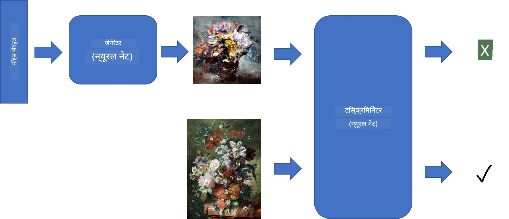
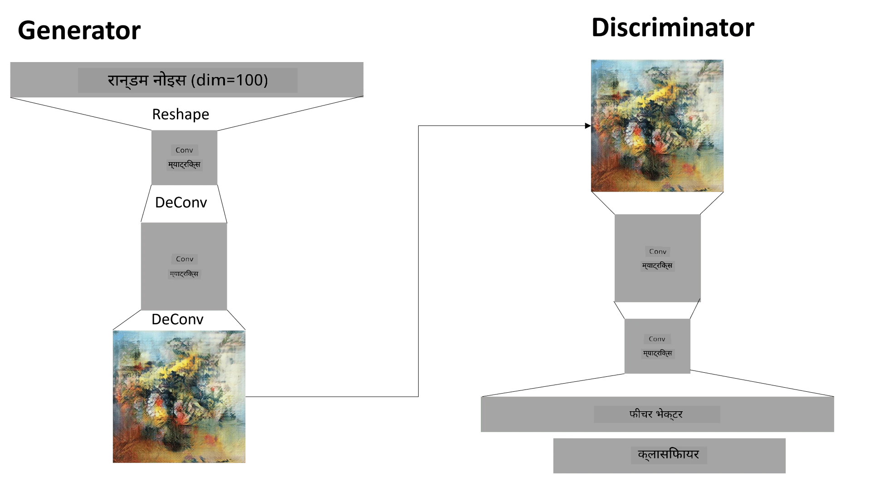

# जेनेरेटिभ एड्भर्सेरियल नेटवर्कहरू

अघिल्लो खण्डमा, हामीले **जेनेरेटिभ मोडेलहरू** को बारेमा सिक्यौं: यस्ता मोडेलहरू जसले प्रशिक्षण डेटासेटमा भएका छविहरू जस्तै नयाँ छविहरू सिर्जना गर्न सक्छ। VAE एक राम्रो उदाहरण थियो जेनेरेटिभ मोडेलको।

## [पाठ अघि क्विज](https://ff-quizzes.netlify.app/en/ai/quiz/19)

तर, यदि हामीले केही साँच्चै अर्थपूर्ण सिर्जना गर्न खोज्यौं, जस्तै उपयुक्त रिजोल्युसनमा चित्रकला, VAE प्रयोग गर्दा प्रशिक्षण राम्रोसँग सँगै जाँदैन। यस प्रयोगको लागि, हामीले जेनेरेटिभ मोडेलहरूका लागि विशेष रूपमा लक्षित अर्को आर्किटेक्चर सिक्नुपर्छ - **जेनेरेटिभ एड्भर्सेरियल नेटवर्कहरू**, वा GANs।

GAN को मुख्य विचार दुई न्यूरल नेटवर्कहरूलाई एक-अर्काविरुद्ध प्रशिक्षण गराउनु हो:

> चित्र: [दिमित्री सश्निकोभ](http://soshnikov.com)

> ✅ केही शब्दावली:
> * **जेनेरेटर**: यो नेटवर्क हो जसले केही र्यान्डम भेक्टर लिन्छ र परिणामस्वरूप छवि उत्पादन गर्छ।
> * **डिस्क्रिमिनेटर**: यो नेटवर्क हो जसले छवि लिन्छ, र यो बताउनुपर्छ कि यो वास्तविक छवि हो (प्रशिक्षण डेटासेटबाट) वा यो जेनेरेटरले सिर्जना गरेको हो। यो मूलतः छवि वर्गीकरणकर्ता हो।

### डिस्क्रिमिनेटर

डिस्क्रिमिनेटरको आर्किटेक्चर साधारण छवि वर्गीकरण नेटवर्कबाट फरक छैन। सबैभन्दा साधारण अवस्थामा, यो पूर्ण रूपमा जडित वर्गीकरणकर्ता हुन सक्छ, तर सम्भवतः यो [कन्भोल्युसनल नेटवर्क](../07-ConvNets/README.md) हुनेछ।

> ✅ कन्भोल्युसनल नेटवर्कमा आधारित GAN लाई [DCGAN](https://arxiv.org/pdf/1511.06434.pdf) भनिन्छ।

CNN डिस्क्रिमिनेटरमा निम्न तहहरू हुन्छन्: धेरै कन्भोल्युसन+पूलिङ (स्पेसियल साइज घट्दै जाने) र, "फिचर भेक्टर" प्राप्त गर्न एक वा धेरै पूर्ण रूपमा जडित तहहरू, अन्तिम द्विआधारी वर्गीकरणकर्ता।

> ✅ 'पूलिङ' भनेको छवि आकार घटाउने प्रविधि हो। "पूलिङ तहहरूले एक तहमा न्यूरोन क्लस्टरहरूको आउटपुटलाई अर्को तहमा एकल न्यूरोनमा मिलाएर डाटा आयाम घटाउँछन्।" - [स्रोत](https://wikipedia.org/wiki/Convolutional_neural_network#Pooling_layers)

### जेनेरेटर

जेनेरेटर अलि जटिल छ। तपाईं यसलाई उल्टो डिस्क्रिमिनेटरको रूपमा विचार गर्न सक्नुहुन्छ। लेटेन्ट भेक्टरबाट सुरु गर्दै (फिचर भेक्टरको ठाउँमा), यसले आवश्यक आकार/आकारमा रूपान्तरण गर्न पूर्ण रूपमा जडित तह हुन्छ, त्यसपछि डिकन्भोल्युसन+अपस्केलिङ। यो [अटोएनकोडर](../09-Autoencoders/README.md) को *डिकोडर* भागसँग मिल्दोजुल्दो छ।

> ✅ किनभने कन्भोल्युसन तह छविमा रेखीय फिल्टरको रूपमा कार्यान्वयन गरिन्छ, डिकन्भोल्युसन कन्भोल्युसनसँग मिल्दोजुल्दो छ, र समान तह तर्क प्रयोग गरेर कार्यान्वयन गर्न सकिन्छ।

> चित्र: [दिमित्री सश्निकोभ](http://soshnikov.com)

### GAN को प्रशिक्षण

GAN लाई **एड्भर्सेरियल** भनिन्छ किनभने जेनेरेटर र डिस्क्रिमिनेटर बीच निरन्तर प्रतिस्पर्धा हुन्छ। यस प्रतिस्पर्धाको क्रममा, जेनेरेटर र डिस्क्रिमिनेटर दुवै सुधार हुन्छन्, जसले नेटवर्कलाई अझ राम्रो छविहरू उत्पादन गर्न सिकाउँछ।

प्रशिक्षण दुई चरणमा हुन्छ:

* **डिस्क्रिमिनेटरको प्रशिक्षण**। यो कार्य धेरै सरल छ: हामी जेनेरेटरद्वारा छविहरूको ब्याच सिर्जना गर्छौं, तिनीहरूलाई 0 लेबल गर्दै, जसले नक्कली छविलाई जनाउँछ, र इनपुट डेटासेटबाट छविहरूको ब्याच लिन्छौं (लेबल 1, वास्तविक छवि)। हामी केही *डिस्क्रिमिनेटर हानि* प्राप्त गर्छौं, र ब्याकप्रोप गर्छौं।
* **जेनेरेटरको प्रशिक्षण**। यो अलि जटिल छ, किनभने हामीले जेनेरेटरको लागि अपेक्षित आउटपुट प्रत्यक्ष रूपमा थाहा पाउँदैनौं। हामी जेनेरेटर र डिस्क्रिमिनेटर समावेश गर्ने सम्पूर्ण GAN नेटवर्क लिन्छौं, यसलाई केही र्यान्डम भेक्टरहरूद्वारा फिड गर्छौं, र परिणामलाई 1 (वास्तविक छविहरूको लागि) अपेक्षा गर्छौं। त्यसपछि हामी डिस्क्रिमिनेटरको प्यारामिटरहरू फ्रिज गर्छौं (हामी यस चरणमा यसलाई प्रशिक्षण गर्न चाहँदैनौं), र ब्याकप्रोप गर्छौं।

यस प्रक्रियाको क्रममा, जेनेरेटर र डिस्क्रिमिनेटर दुवै हानिहरू उल्लेखनीय रूपमा तल झर्दैनन्। आदर्श अवस्थामा, तिनीहरूले कम्पन गर्नुपर्छ, जसले दुवै नेटवर्कको प्रदर्शन सुधार भएको देखाउँछ।

## ✍️ अभ्यास: GANs

* [TensorFlow/Keras मा GAN नोटबुक](GANTF.ipynb)
* [PyTorch मा GAN नोटबुक](GANPyTorch.ipynb)

### GAN प्रशिक्षणको समस्याहरू

GAN प्रशिक्षण गर्न विशेष रूपमा कठिन मानिन्छ। यहाँ केही समस्याहरू छन्:

* **मोड कोलाप्स**। यसले जेनेरेटरले डिस्क्रिमिनेटरलाई छल्न सफल एक छवि मात्र उत्पादन गर्न सिक्छ, र विभिन्न छविहरूको विविधता उत्पादन गर्दैन।
* **हाइपरप्यारामिटरहरूमा संवेदनशीलता**। प्रायः तपाईं देख्न सक्नुहुन्छ कि GAN बिल्कुलै सँगै जाँदैन, र त्यसपछि अचानक सिकाइ दर घटाउँदा सँगै जान्छ।
* जेनेरेटर र डिस्क्रिमिनेटर बीच **सन्तुलन** राख्नु। धेरै अवस्थामा डिस्क्रिमिनेटर हानि अपेक्षाकृत छिटो शून्यमा झर्न सक्छ, जसले जेनेरेटरलाई थप प्रशिक्षण गर्न असमर्थ बनाउँछ। यसलाई पार गर्न, हामी जेनेरेटर र डिस्क्रिमिनेटरको लागि फरक सिकाइ दर सेट गर्न प्रयास गर्न सक्छौं, वा यदि हानि पहिले नै धेरै कम छ भने डिस्क्रिमिनेटर प्रशिक्षण छोड्न सक्छौं।
* **उच्च रिजोल्युसनको लागि प्रशिक्षण**। अटोएनकोडरहरूसँग समान समस्या प्रतिबिम्बित गर्दै, यो समस्या धेरै तहहरूको पुनर्निर्माण गर्दा कलाकृतिहरू उत्पन्न हुने कारणले ट्रिगर हुन्छ। यो समस्या सामान्यतया **प्रोग्रेसिभ ग्रोइङ** द्वारा समाधान गरिन्छ, जब सुरुमा केही तहहरू कम-रिजोल्युसन छविहरूमा प्रशिक्षण गरिन्छ, र त्यसपछि तहहरू "अनब्लक" वा थपिन्छ। अर्को समाधान भनेको तहहरू बीच अतिरिक्त जडानहरू थप्नु र एकै समयमा धेरै रिजोल्युसनहरू प्रशिक्षण गर्नु हो - यस [मल्टी-स्केल ग्रेडियन्ट GANs पेपर](https://arxiv.org/abs/1903.06048) मा विवरणहरू हेर्नुहोस्।

## शैली ट्रान्सफर

GANs कलात्मक छविहरू सिर्जना गर्नको लागि उत्कृष्ट तरिका हो। अर्को रोचक प्रविधि भनेको **शैली ट्रान्सफर** हो, जसले एक **कन्टेन्ट छवि** लिन्छ, र यसलाई फरक शैलीमा पुनःचित्रण गर्छ, **शैली छवि** बाट फिल्टरहरू लागू गर्दै।

यसले निम्न तरिकाले काम गर्छ:
* हामी र्यान्डम न्वाइज छवि (वा कन्टेन्ट छवि, तर बुझ्नको लागि र्यान्डम न्वाइजबाट सुरु गर्नु सजिलो हुन्छ) बाट सुरु गर्छौं।
* हाम्रो लक्ष्य यस्तो छवि सिर्जना गर्नु हो, जुन कन्टेन्ट छवि र शैली छवि दुवैसँग नजिक हुनेछ। यो दुई हानि कार्यहरूद्वारा निर्धारण गरिन्छ:
   - **कन्टेन्ट हानि**: यो CNN द्वारा केही तहहरूमा वर्तमान छवि र कन्टेन्ट छविबाट निकालिएका फिचरहरूमा आधारित हुन्छ।
   - **शैली हानि**: यो वर्तमान छवि र शैली छविबीच चतुर तरिकाले ग्राम म्याट्रिक्सहरू प्रयोग गरेर गणना गरिन्छ (थप विवरण [उदाहरण नोटबुक](StyleTransfer.ipynb) मा हेर्नुहोस्)।
* छवि स्मूथ बनाउन र न्वाइज हटाउन, हामी **भेरिएसन हानि** पनि परिचय गराउँछौं, जसले छिमेकी पिक्सेलहरू बीचको औसत दूरी गणना गर्छ।
* मुख्य अनुकूलन लूपले वर्तमान छविलाई समायोजन गर्छ, कुल हानि (तीन हानिहरूको भारित योग) न्यूनतम बनाउन ग्रेडियन्ट डिसेन्ट (वा अन्य अनुकूलन एल्गोरिदम) प्रयोग गरेर।

## ✍️ उदाहरण: [शैली ट्रान्सफर](StyleTransfer.ipynb)

## [पाठ पछि क्विज](https://ff-quizzes.netlify.app/en/ai/quiz/20)

## निष्कर्ष

यस पाठमा, तपाईंले GANs र तिनीहरूलाई कसरी प्रशिक्षण गर्ने सिक्नुभयो। तपाईंले यस प्रकारको न्यूरल नेटवर्कले सामना गर्न सक्ने विशेष चुनौतीहरू र तिनीहरूलाई पार गर्न केही रणनीतिहरू पनि सिक्नुभयो।

## 🚀 चुनौती

आफ्नै छविहरू प्रयोग गरेर [शैली ट्रान्सफर नोटबुक](StyleTransfer.ipynb) चलाउनुहोस्।

## समीक्षा र आत्म-अध्ययन

सन्दर्भको लागि, यी स्रोतहरूमा GANs को बारेमा थप पढ्नुहोस्:

* मार्को पासिनी, [10 पाठहरू मैले एक वर्ष GANs प्रशिक्षण गर्दा सिकें](https://towardsdatascience.com/10-lessons-i-learned-training-generative-adversarial-networks-gans-for-a-year-c9071159628)
* [स्टाइलGAN](https://en.wikipedia.org/wiki/StyleGAN), विचार गर्न लायक *डि फ्याक्टो* GAN आर्किटेक्चर
* [Azure ML मा GANs प्रयोग गरेर जेनेरेटिभ कला सिर्जना गर्दै](https://soshnikov.com/scienceart/creating-generative-art-using-gan-on-azureml/)

## असाइनमेन्ट

यस पाठसँग सम्बन्धित दुई नोटबुकमध्ये एकलाई पुनः हेर्नुहोस् र GAN लाई आफ्नै छविहरूमा पुनः प्रशिक्षण गर्नुहोस्। तपाईं के सिर्जना गर्न सक्नुहुन्छ?

---

