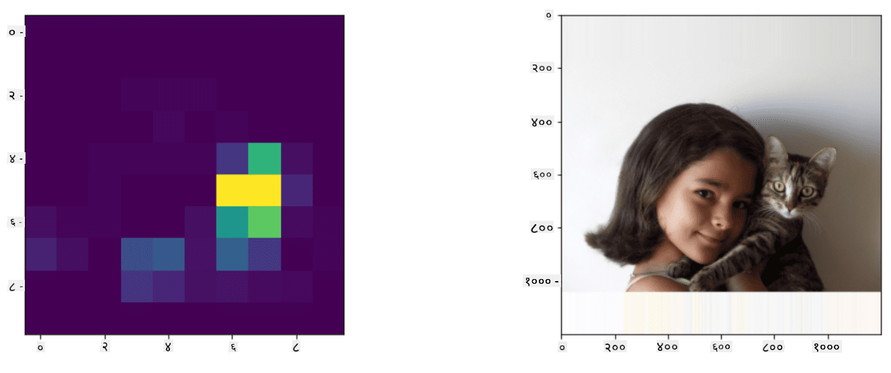

<!--
CO_OP_TRANSLATOR_METADATA:
{
  "original_hash": "d85c8b08f6d1b48fd7f35b99f93c1138",
  "translation_date": "2025-08-26T09:22:10+00:00",
  "source_file": "lessons/4-ComputerVision/11-ObjectDetection/README.md",
  "language_code": "ne"
}
-->
# वस्तु पहिचान

अहिलेसम्म हामीले प्रयोग गरेका छवि वर्गीकरण मोडेलहरूले एउटा छवि लिएर वर्गीय नतिजा उत्पादन गर्थे, जस्तै MNIST समस्यामा 'संख्या' वर्ग। तर, धेरै अवस्थामा हामीलाई केवल यो थाहा पाउन चाहिँदैन कि तस्बिरले वस्तुहरू देखाउँछ - हामीलाई तिनीहरूको ठ्याक्कै स्थान निर्धारण गर्न सक्षम हुन चाहिन्छ। यही नै **वस्तु पहिचान**को उद्देश्य हो।

## [Pre-lecture quiz](https://red-field-0a6ddfd03.1.azurestaticapps.net/quiz/111)

> छवि [YOLO v2 वेब साइट](https://pjreddie.com/darknet/yolov2/) बाट

## वस्तु पहिचानको साधारण तरिका

मानौं हामीले तस्बिरमा बिरालो खोज्न चाहेका छौं, वस्तु पहिचानको एकदम साधारण तरिका निम्नानुसार हुनेछ:

1. तस्बिरलाई धेरै टाइलहरूमा विभाजन गर्नुहोस्।
2. प्रत्येक टाइलमा छवि वर्गीकरण चलाउनुहोस्।
3. ती टाइलहरू जसले पर्याप्त उच्च सक्रियता देखाउँछन्, तिनीहरूमा सोधिएको वस्तु भएको मान्न सकिन्छ।

> *छवि [Exercise Notebook](../../../../../lessons/4-ComputerVision/11-ObjectDetection/ObjectDetection-TF.ipynb) बाट*

तर, यो तरिका आदर्शबाट धेरै टाढा छ, किनकि यसले एल्गोरिदमलाई वस्तुको बाउन्डिङ बक्सको स्थान धेरै अस्पष्ट रूपमा निर्धारण गर्न मात्र अनुमति दिन्छ। थप सटीक स्थानको लागि, हामीले बाउन्डिङ बक्सको समन्वय भविष्यवाणी गर्न **रेग्रेशन**को केही प्रकार चलाउन आवश्यक छ - र त्यसका लागि, हामीलाई विशेष डेटासेटहरू चाहिन्छ।

## वस्तु पहिचानका लागि रेग्रेशन

[यो ब्लग पोस्ट](https://towardsdatascience.com/object-detection-with-neural-networks-a4e2c46b4491)ले आकारहरू पहिचान गर्नको लागि राम्रो परिचय प्रदान गर्दछ।

## वस्तु पहिचानका लागि डेटासेटहरू

तपाईंले निम्न डेटासेटहरू भेट्टाउन सक्नुहुन्छ:

* [PASCAL VOC](http://host.robots.ox.ac.uk/pascal/VOC/) - २० वर्गहरू
* [COCO](http://cocodataset.org/#home) - सामान्य वस्तुहरू सन्दर्भमा। ८० वर्गहरू, बाउन्डिङ बक्सहरू र सेग्मेन्टेसन मास्कहरू

## वस्तु पहिचान मेट्रिक्स

### Intersection over Union

छवि वर्गीकरणको लागि एल्गोरिदम कत्तिको राम्रो प्रदर्शन गर्छ भनेर मापन गर्न सजिलो छ, तर वस्तु पहिचानको लागि हामीले वर्गको शुद्धता मात्र होइन, अनुमान गरिएको बाउन्डिङ बक्सको स्थानको सटीकता पनि मापन गर्नुपर्छ। यसका लागि, हामी **Intersection over Union** (IoU) प्रयोग गर्छौं, जसले दुई बक्सहरू (वा दुई मनमौजी क्षेत्रहरू) कत्तिको ओभरलाप गर्छन् भनेर मापन गर्छ।

> *[IoU सम्बन्धी उत्कृष्ट ब्लग पोस्ट](https://pyimagesearch.com/2016/11/07/intersection-over-union-iou-for-object-detection/) बाट चित्र २*

यो विचार सरल छ - हामी दुई आकृतिहरूको बीचको अन्तर क्षेत्रलाई तिनीहरूको युनियन क्षेत्रले विभाजन गर्छौं। दुई समान क्षेत्रहरूको लागि, IoU १ हुनेछ, जबकि पूर्ण रूपमा अलग क्षेत्रहरूको लागि यो ० हुनेछ। अन्यथा यो ० देखि १ सम्म फरक हुनेछ। हामी सामान्यतया ती बाउन्डिङ बक्सहरू मात्र विचार गर्छौं जसको IoU निश्चित मानभन्दा माथि छ।

### Average Precision

मानौं हामीले $C$ वर्गको वस्तुहरू कत्तिको राम्रोसँग पहिचान गरिन्छ भनेर मापन गर्न चाहेका छौं। यसलाई मापन गर्न, हामी **Average Precision** मेट्रिक्स प्रयोग गर्छौं, जुन निम्नानुसार गणना गरिन्छ:

1. Precision-Recall कर्भले थ्रेसहोल्ड मान (० देखि १ सम्म) अनुसार शुद्धता देखाउँछ।
2. थ्रेसहोल्डको आधारमा, तस्बिरमा धेरै वा थोरै वस्तुहरू पहिचान गरिन्छ, र शुद्धता र रिकलका विभिन्न मानहरू प्राप्त हुन्छन्।
3. कर्भ यस प्रकार देखिन्छ:

> *छवि [NeuroWorkshop](http://github.com/shwars/NeuroWorkshop) बाट*

$C$ वर्गको लागि Average Precision कर्भको क्षेत्र हो। थप स्पष्ट रूपमा, Recall अक्षलाई सामान्यतया १० भागमा विभाजन गरिन्छ, र Precision ती सबै बिन्दुहरूमा औसत गरिन्छ:

$$
AP = {1\over11}\sum_{i=0}^{10}\mbox{Precision}(\mbox{Recall}={i\over10})
$$

### AP र IoU

हामी केवल ती पहिचानहरू विचार गर्नेछौं, जसको IoU निश्चित मानभन्दा माथि छ। उदाहरणका लागि, PASCAL VOC डेटासेटमा सामान्यतया $\mbox{IoU Threshold} = 0.5$ मानिन्छ, जबकि COCO मा AP विभिन्न $\mbox{IoU Threshold}$ मानहरूको लागि मापन गरिन्छ।

> *छवि [NeuroWorkshop](http://github.com/shwars/NeuroWorkshop) बाट*

### Mean Average Precision - mAP

वस्तु पहिचानको मुख्य मेट्रिकलाई **Mean Average Precision** वा **mAP** भनिन्छ। यो Average Precisionको मान हो, सबै वस्तु वर्गहरूमा औसत गरिएको, र कहिलेकाहीं $\mbox{IoU Threshold}$ मा पनि। थप विवरणमा, **mAP** गणना गर्ने प्रक्रिया [यो ब्लग पोस्ट](https://medium.com/@timothycarlen/understanding-the-map-evaluation-metric-for-object-detection-a07fe6962cf3)मा वर्णन गरिएको छ, र [यहाँ कोड नमूनाहरू सहित](https://gist.github.com/tarlen5/008809c3decf19313de216b9208f3734)।

## वस्तु पहिचानका विभिन्न तरिकाहरू

वस्तु पहिचान एल्गोरिदमका दुई व्यापक वर्गहरू छन्:

* **Region Proposal Networks** (R-CNN, Fast R-CNN, Faster R-CNN)। मुख्य विचार भनेको **Regions of Interests** (ROI) उत्पन्न गर्नु हो र तिनीहरूमा CNN चलाउनु हो, अधिकतम सक्रियता खोज्दै। यो साधारण तरिकासँग अलिकति मिल्दोजुल्दो छ, तर ROIs अधिक चतुर तरिकाले उत्पन्न गरिन्छ। यस्ता विधिहरूको मुख्य कमजोरी भनेको तिनीहरू ढिलो हुनु हो, किनकि तस्बिरमा CNN वर्गीकरणको धेरै पासहरू आवश्यक हुन्छ।
* **One-pass** (YOLO, SSD, RetinaNet) विधिहरू। ती आर्किटेक्चरहरूमा हामी नेटवर्कलाई एक पासमा वर्गहरू र ROIs दुवै भविष्यवाणी गर्न डिजाइन गर्छौं।

### R-CNN: Region-Based CNN

[R-CNN](http://islab.ulsan.ac.kr/files/announcement/513/rcnn_pami.pdf)ले [Selective Search](http://www.huppelen.nl/publications/selectiveSearchDraft.pdf) प्रयोग गरेर ROI क्षेत्रहरूको हाइरार्किकल संरचना उत्पन्न गर्छ, जुन CNN फिचर एक्स्ट्र्याक्टरहरू र SVM-क्लासिफायरहरू मार्फत पास गरिन्छ, वस्तु वर्ग निर्धारण गर्न, र *बाउन्डिङ बक्स* समन्वय निर्धारण गर्न रेखीय रेग्रेशन प्रयोग गरिन्छ। [Official Paper](https://arxiv.org/pdf/1506.01497v1.pdf)

> *छवि van de Sande et al. ICCV’11 बाट*

> *छवि [यो ब्लग](https://towardsdatascience.com/r-cnn-fast-r-cnn-faster-r-cnn-yolo-object-detection-algorithms-36d53571365e) बाट*

### F-RCNN - Fast R-CNN

यो विधि R-CNNसँग मिल्दोजुल्दो छ, तर क्षेत्रहरू कनभोल्युसन तहहरू लागू भएपछि परिभाषित गरिन्छ।

> छवि [Official Paper](https://www.cv-foundation.org/openaccess/content_iccv_2015/papers/Girshick_Fast_R-CNN_ICCV_2015_paper.pdf), [arXiv](https://arxiv.org/pdf/1504.08083.pdf), 2015 बाट

### Faster R-CNN

यस विधिको मुख्य विचार भनेको ROIs भविष्यवाणी गर्न न्युरल नेटवर्क प्रयोग गर्नु हो - *Region Proposal Network* भनिन्छ। [Paper](https://arxiv.org/pdf/1506.01497.pdf), 2016

> छवि [Official Paper](https://arxiv.org/pdf/1506.01497.pdf) बाट

### R-FCN: Region-Based Fully Convolutional Network

यो एल्गोरिदम Faster R-CNN भन्दा पनि छिटो छ। मुख्य विचार निम्नानुसार छ:

1. हामी ResNet-101 प्रयोग गरेर फिचरहरू निकाल्छौं।
2. फिचरहरू **Position-Sensitive Score Map** द्वारा प्रशोधन गरिन्छ। $C$ वर्गका प्रत्येक वस्तुहरूलाई $k\times k$ क्षेत्रहरूद्वारा विभाजन गरिन्छ, र हामी वस्तुका भागहरू भविष्यवाणी गर्न प्रशिक्षण गर्छौं।
3. $k\times k$ क्षेत्रका प्रत्येक भागका लागि सबै नेटवर्कहरूले वस्तु वर्गहरूको लागि मतदान गर्छन्, र अधिकतम मतदान भएको वस्तु वर्ग चयन गरिन्छ।

> छवि [Official Paper](https://arxiv.org/abs/1605.06409) बाट

### YOLO - You Only Look Once

YOLO एक रियलटाइम एक-पास एल्गोरिदम हो। मुख्य विचार निम्नानुसार छ:

 * तस्बिरलाई $S\times S$ क्षेत्रहरूमा विभाजन गरिन्छ।
 * प्रत्येक क्षेत्रका लागि, **CNN**ले $n$ सम्भावित वस्तुहरू, *बाउन्डिङ बक्स* समन्वयहरू र *confidence*=*probability* * IoU भविष्यवाणी गर्छ।

 

> छवि [Official Paper](https://arxiv.org/abs/1506.02640) बाट

### अन्य एल्गोरिदमहरू

* RetinaNet: [Official Paper](https://arxiv.org/abs/1708.02002)
   - [PyTorch Implementation in Torchvision](https://pytorch.org/vision/stable/_modules/torchvision/models/detection/retinanet.html)
   - [Keras Implementation](https://github.com/fizyr/keras-retinanet)
   - [Object Detection with RetinaNet](https://keras.io/examples/vision/retinanet/) in Keras Samples
* SSD (Single Shot Detector): [Official Paper](https://arxiv.org/abs/1512.02325)

## ✍️ अभ्यास: वस्तु पहिचान

निम्न नोटबुकमा आफ्नो सिकाइ जारी राख्नुहोस्:

[ObjectDetection.ipynb](../../../../../lessons/4-ComputerVision/11-ObjectDetection/ObjectDetection.ipynb)

## निष्कर्ष

यस पाठमा तपाईंले वस्तु पहिचान गर्न सकिने विभिन्न तरिकाहरूको संक्षिप्त भ्रमण गर्नुभयो!

## 🚀 चुनौती

यी लेखहरू र नोटबुकहरू पढ्नुहोस् र YOLO आफैं प्रयास गर्नुहोस्:

* [YOLO सम्बन्धी राम्रो ब्लग पोस्ट](https://www.analyticsvidhya.com/blog/2018/12/practical-guide-object-detection-yolo-framewor-python/)
 * [Official Site](https://pjreddie.com/darknet/yolo/)
 * Yolo: [Keras Implementation](https://github.com/experiencor/keras-yolo2), [Step-by-Step Notebook](https://github.com/experiencor/basic-yolo-keras/blob/master/Yolo%20Step-by-Step.ipynb)
 * Yolo v2: [Keras Implementation](https://github.com/experiencor/keras-yolo2), [Step-by-Step Notebook](https://github.com/experiencor/keras-yolo2/blob/master/Yolo%20Step-by-Step.ipynb)

## [Post-lecture quiz](https://red-field-0a6ddfd03.1.azurestaticapps.net/quiz/211)

## समीक्षा र आत्म अध्ययन

* [Object Detection](https://tjmachinelearning.com/lectures/1718/obj/) by Nikhil Sardana
* [वस्तु पहिचान एल्गोरिदमहरूको राम्रो तुलना](https://lilianweng.github.io/lil-log/2018/12/27/object-detection-part-4.html)
* [वस्तु पहिचानका लागि डीप लर्निङ एल्गोरिदमहरूको समीक्षा](https://medium.com/comet-app/review-of-deep-learning-algorithms-for-object-detection-c1f3d437b852)
* [वस्तु पहिचान एल्गोरिदमहरूको आधारभूत परिचय](https://www.analyticsvidhya.com/blog/2018/10/a-step-by-step-introduction-to-the-basic-object-detection-algorithms-part-1/)
* [Python मा Faster R-CNN को कार्यान्वयन](https://www.analyticsvidhya.com/blog/2018/11/implementation-faster-r-cnn-python-object-detection/)

## [Assignment: Object Detection](lab/README.md)

**अस्वीकरण**:  
यो दस्तावेज़ AI अनुवाद सेवा [Co-op Translator](https://github.com/Azure/co-op-translator) प्रयोग गरी अनुवाद गरिएको हो। हामी यथासम्भव सटीकता सुनिश्चित गर्न प्रयास गर्छौं, तर कृपया ध्यान दिनुहोस् कि स्वचालित अनुवादहरूमा त्रुटिहरू वा अशुद्धताहरू हुन सक्छन्। यसको मूल भाषामा रहेको मूल दस्तावेज़लाई आधिकारिक स्रोत मानिनुपर्छ। महत्त्वपूर्ण जानकारीका लागि, व्यावसायिक मानव अनुवाद सिफारिस गरिन्छ। यस अनुवादको प्रयोगबाट उत्पन्न हुने कुनै पनि गलतफहमी वा गलत व्याख्याका लागि हामी जिम्मेवार हुने छैनौं।