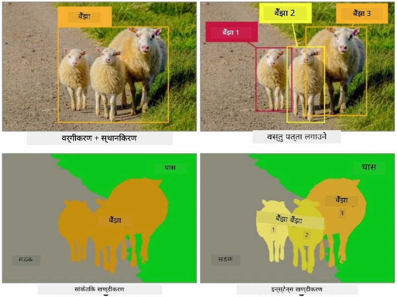
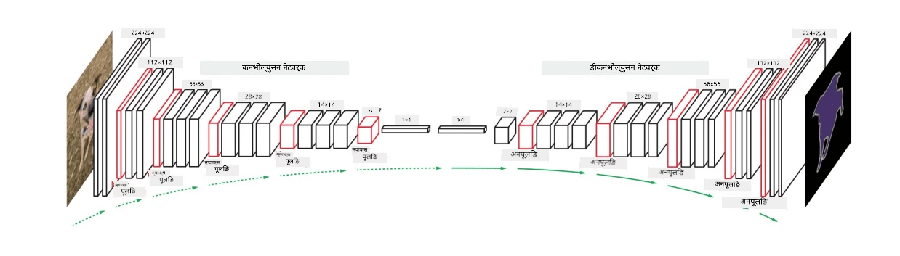
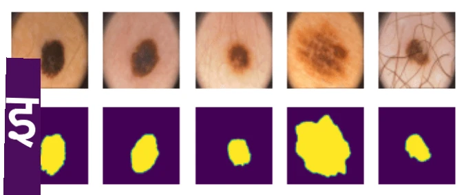

# सेग्मेन्टेसन

हामीले पहिले **Object Detection** को बारेमा सिकेका थियौं, जसले हामीलाई तस्बिरमा वस्तुहरूको *bounding boxes* भविष्यवाणी गरेर तिनीहरूको स्थान पत्ता लगाउन मद्दत गर्छ। तर, केही कार्यहरूको लागि हामीलाई केवल bounding boxes मात्र होइन, वस्तुको अझै सटीक स्थान पत्ता लगाउन आवश्यक हुन्छ। यस कार्यलाई **सेग्मेन्टेसन** भनिन्छ।

## [Pre-lecture quiz](https://ff-quizzes.netlify.app/en/ai/quiz/23)

सेग्मेन्टेसनलाई **पिक्सेल वर्गीकरण** को रूपमा हेर्न सकिन्छ, जहाँ तस्बिरको **प्रत्येक** पिक्सेलको वर्ग भविष्यवाणी गर्नुपर्छ (*background* पनि वर्गहरूमध्ये एक हो)। सेग्मेन्टेसनका दुई मुख्य एल्गोरिदमहरू छन्:

* **Semantic segmentation** केवल पिक्सेलको वर्ग बताउँछ, तर एउटै वर्गका विभिन्न वस्तुहरू बीच भिन्नता गर्दैन।
* **Instance segmentation** वर्गहरूलाई विभिन्न instances मा विभाजन गर्छ।

उदाहरणका लागि, instance segmentation मा यी भेडाहरू अलग-अलग वस्तुहरू हुन्, तर semantic segmentation मा सबै भेडाहरू एउटै वर्गले प्रतिनिधित्व गरिन्छ।

> तस्बिर [यस ब्लग पोस्ट](https://nirmalamurali.medium.com/image-classification-vs-semantic-segmentation-vs-instance-segmentation-625c33a08d50) बाट।

सेग्मेन्टेसनका लागि विभिन्न न्युरल आर्किटेक्चरहरू छन्, तर तिनीहरूको संरचना समान हुन्छ। यसले तपाईंले पहिले सिकेको **autoencoder** जस्तै देखिन्छ, तर मूल तस्बिरलाई पुनःनिर्माण गर्ने सट्टा, हाम्रो लक्ष्य **mask** पुनःनिर्माण गर्नु हो। त्यसैले, सेग्मेन्टेसन नेटवर्कमा निम्न भागहरू हुन्छन्:

* **Encoder** इनपुट तस्बिरबाट विशेषताहरू निकाल्छ।
* **Decoder** ती विशेषताहरूलाई **mask image** मा रूपान्तरण गर्छ, जसको आकार र च्यानलहरूको संख्या वर्गहरूको संख्यालाई प्रतिनिधित्व गर्छ।

> तस्बिर [यस प्रकाशन](https://arxiv.org/pdf/2001.05566.pdf) बाट।

हामीले विशेष रूपमा सेग्मेन्टेसनमा प्रयोग हुने **loss function** उल्लेख गर्नुपर्छ। जब क्लासिकल autoencoders प्रयोग गरिन्छ, हामीले दुई तस्बिरहरू बीचको समानता मापन गर्नुपर्छ, र त्यसका लागि mean square error (MSE) प्रयोग गर्न सकिन्छ। सेग्मेन्टेसनमा, लक्ष्य mask तस्बिरको प्रत्येक पिक्सेलले वर्ग संख्या (तीस्रो आयाममा one-hot-encoded) प्रतिनिधित्व गर्छ, त्यसैले हामीले वर्गीकरणका लागि विशिष्ट loss functions प्रयोग गर्नुपर्छ - cross-entropy loss, सबै पिक्सेलहरूमा औसत गरिएको। यदि mask binary हो भने - **binary cross-entropy loss** (BCE) प्रयोग गरिन्छ।

> ✅ One-hot encoding वर्ग लेबललाई वर्गहरूको संख्याको बराबर लम्बाइको भेक्टरमा रूपान्तरण गर्ने तरिका हो। [यस लेख](https://datagy.io/sklearn-one-hot-encode/) मा यस प्रविधिको बारेमा हेर्नुहोस्।

## मेडिकल इमेजिङका लागि सेग्मेन्टेसन

यस पाठमा, हामी सेग्मेन्टेसनलाई व्यवहारमा देख्नेछौं, जहाँ नेटवर्कलाई मेडिकल तस्बिरहरूमा मानव nevi (मोल्स) चिन्हित गर्न प्रशिक्षण दिनेछौं। हामी <a href="https://www.fc.up.pt/addi/ph2%20database.html">PH2 Database</a> को dermoscopy तस्बिरहरू प्रयोग गर्नेछौं। यस डेटासेटमा तीन वर्गका २०० तस्बिरहरू छन्: typical nevus, atypical nevus, र melanoma। सबै तस्बिरहरूमा **mask** पनि समावेश छ, जसले nevus लाई outline गर्छ।

> ✅ यो प्रविधि विशेष रूपमा यस प्रकारको मेडिकल इमेजिङका लागि उपयुक्त छ, तर तपाईं अन्य वास्तविक-जीवन अनुप्रयोगहरू के कल्पना गर्न सक्नुहुन्छ?

> तस्बिर PH2 Database बाट।

हामीले कुनै पनि nevus लाई यसको background बाट अलग गर्न सेग्मेन्ट गर्न मोडेल प्रशिक्षण दिनेछौं।

## ✍️ अभ्यास: सेम्यान्टिक सेग्मेन्टेसन

तलका नोटबुकहरू खोल्नुहोस् र विभिन्न सेम्यान्टिक सेग्मेन्टेसन आर्किटेक्चरहरूको बारेमा थप जान्नुहोस्, तिनीहरूसँग काम गर्ने अभ्यास गर्नुहोस्, र तिनीहरूलाई व्यवहारमा देख्नुहोस्।

* [Semantic Segmentation Pytorch](SemanticSegmentationPytorch.ipynb)
* [Semantic Segmentation TensorFlow](SemanticSegmentationTF.ipynb)

## [Post-lecture quiz](https://ff-quizzes.netlify.app/en/ai/quiz/24)

## निष्कर्ष

सेग्मेन्टेसन तस्बिर वर्गीकरणको लागि एक शक्तिशाली प्रविधि हो, जसले bounding boxes बाट अगाडि बढेर पिक्सेल-स्तरको वर्गीकरणसम्म पुग्छ। यो मेडिकल इमेजिङ लगायत अन्य अनुप्रयोगहरूमा प्रयोग गरिन्छ।

## 🚀 चुनौती

शरीर सेग्मेन्टेसन तस्बिरहरूमा मानिसहरूको साथ गर्न सकिने सामान्य कार्यहरूमध्ये एक हो। अन्य महत्त्वपूर्ण कार्यहरूमा **skeleton detection** र **pose detection** समावेश छन्। [OpenPose](https://github.com/CMU-Perceptual-Computing-Lab/openpose) लाइब्रेरी प्रयास गर्नुहोस् र pose detection कसरी प्रयोग गर्न सकिन्छ हेर्नुहोस्।

## समीक्षा र आत्म-अध्ययन

यो [विकिपिडिया लेख](https://wikipedia.org/wiki/Image_segmentation) ले यस प्रविधिको विभिन्न अनुप्रयोगहरूको राम्रो अवलोकन प्रदान गर्दछ। Instance segmentation र Panoptic segmentation का उपक्षेत्रहरूको बारेमा थप जान्न आफैं अध्ययन गर्नुहोस्।

## [Assignment](lab/README.md)

यस प्रयोगशालामा, [Segmentation Full Body MADS Dataset](https://www.kaggle.com/datasets/tapakah68/segmentation-full-body-mads-dataset) प्रयोग गरेर **मानव शरीर सेग्मेन्टेसन** प्रयास गर्नुहोस्।

---

