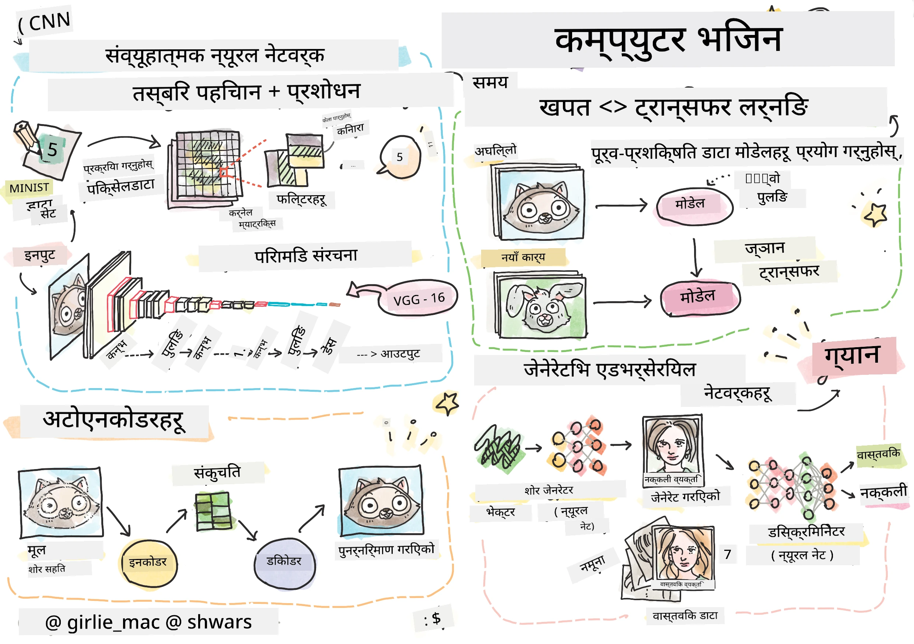

# कम्प्युटर भिजन

यस खण्डमा हामी सिक्नेछौं:

* [कम्प्युटर भिजन र OpenCV को परिचय](06-IntroCV/README.md)
* [कन्भोलुसनल न्युरल नेटवर्कहरू](07-ConvNets/README.md)
* [पूर्व-प्रशिक्षित नेटवर्कहरू र ट्रान्सफर लर्निङ](08-TransferLearning/README.md) 
* [अटोएनकोडरहरू](09-Autoencoders/README.md)
* [जेनेरेटिभ एड्भर्सेरियल नेटवर्कहरू](10-GANs/README.md)
* [वस्तु पहिचान](11-ObjectDetection/README.md)
* [सेम्यान्टिक सेग्मेन्टेसन](12-Segmentation/README.md)

**अस्वीकरण**:  
यो दस्तावेज़ AI अनुवाद सेवा [Co-op Translator](https://github.com/Azure/co-op-translator) प्रयोग गरी अनुवाद गरिएको हो। हामी यथासम्भव सटीकता सुनिश्चित गर्न प्रयास गर्छौं, तर कृपया ध्यान दिनुहोस् कि स्वचालित अनुवादहरूमा त्रुटिहरू वा अशुद्धताहरू हुन सक्छन्। यसको मूल भाषामा रहेको मूल दस्तावेज़लाई आधिकारिक स्रोत मानिनुपर्छ। महत्वपूर्ण जानकारीका लागि, व्यावसायिक मानव अनुवाद सिफारिस गरिन्छ। यस अनुवादको प्रयोगबाट उत्पन्न हुने कुनै पनि गलतफहमी वा गलत व्याख्याका लागि हामी जिम्मेवार हुने छैनौं।