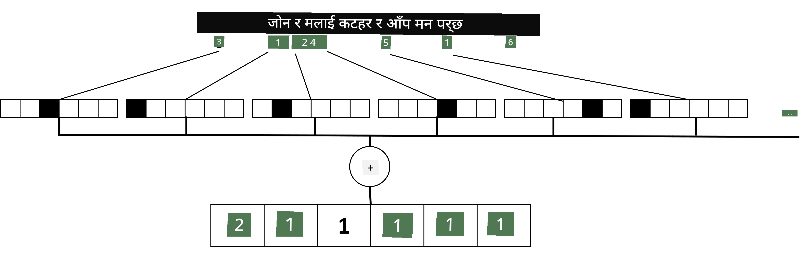

# टेक्स्टलाई टेन्सरको रूपमा प्रतिनिधित्व गर्ने

## [पाठ अघि क्विज](https://ff-quizzes.netlify.app/en/ai/quiz/25)

## टेक्स्ट वर्गीकरण

यस खण्डको पहिलो भागमा, हामी **टेक्स्ट वर्गीकरण** कार्यमा केन्द्रित हुनेछौं। हामी [AG News](https://www.kaggle.com/amananandrai/ag-news-classification-dataset) डेटासेट प्रयोग गर्नेछौं, जसमा निम्न जस्ता समाचार लेखहरू समावेश छन्:

* श्रेणी: विज्ञान/प्रविधि
* शीर्षक: Ky. कम्पनीले पेप्टाइड्स अध्ययन गर्न अनुदान जित्यो (AP)
* शरीर: AP - लुइसभिल विश्वविद्यालयका रसायनशास्त्र अनुसन्धानकर्ताले स्थापना गरेको कम्पनीले विकास गर्न अनुदान जित्यो...

हाम्रो लक्ष्य टेक्स्टको आधारमा समाचारलाई विभिन्न श्रेणीहरूमा वर्गीकृत गर्नु हुनेछ।

## टेक्स्टको प्रतिनिधित्व

यदि हामी न्यूरल नेटवर्कको साथ प्राकृतिक भाषा प्रशोधन (NLP) कार्यहरू समाधान गर्न चाहन्छौं भने, टेक्स्टलाई टेन्सरको रूपमा प्रतिनिधित्व गर्ने कुनै तरिका आवश्यक छ। कम्प्युटरहरूले पहिले नै ASCII वा UTF-8 जस्ता एन्कोडिङहरू प्रयोग गरेर स्क्रिनमा फन्टहरूमा म्याप गरिएका संख्याहरूको रूपमा पाठ्य वर्णहरू प्रतिनिधित्व गर्छन्।

> [छवि स्रोत](https://www.seobility.net/en/wiki/ASCII)

मानवको रूपमा, हामी प्रत्येक अक्षरले **के प्रतिनिधित्व गर्छ** भन्ने बुझ्छौं, र सबै वर्णहरू मिलेर वाक्यका शब्दहरू बनाउँछन्। तर, कम्प्युटरहरूले आफैंले यस्तो बुझाइ राख्दैनन्, र न्यूरल नेटवर्कले प्रशिक्षणको क्रममा अर्थ सिक्नुपर्छ।

त्यसैले, टेक्स्टलाई प्रतिनिधित्व गर्दा विभिन्न दृष्टिकोणहरू प्रयोग गर्न सकिन्छ:

* **क्यारेक्टर-स्तरको प्रतिनिधित्व**, जहाँ हामी प्रत्येक क्यारेक्टरलाई नम्बरको रूपमा लिन्छौं। यदि हाम्रो टेक्स्ट कर्पसमा *C* विभिन्न क्यारेक्टरहरू छन् भने, *Hello* शब्दलाई 5x*C* टेन्सरले प्रतिनिधित्व गरिन्छ। प्रत्येक अक्षरलाई एक-हट एन्कोडिङमा टेन्सर स्तम्भसँग मिलाइन्छ।
* **शब्द-स्तरको प्रतिनिधित्व**, जहाँ हामी हाम्रो टेक्स्टको सबै शब्दहरूको **शब्दकोश** बनाउँछौं, र त्यसपछि शब्दहरूलाई एक-हट एन्कोडिङ प्रयोग गरेर प्रतिनिधित्व गर्छौं। यो दृष्टिकोण केही हदसम्म राम्रो छ, किनकि प्रत्येक अक्षर आफैंले धेरै अर्थ राख्दैन, र उच्च-स्तरको अर्थपूर्ण अवधारणाहरू - शब्दहरू - प्रयोग गरेर हामी न्यूरल नेटवर्कको लागि कार्यलाई सरल बनाउँछौं। तर, ठूलो शब्दकोश आकारको कारण, हामी उच्च-आयामीय स्पार्स टेन्सरहरू सामना गर्नुपर्छ।

प्रतिनिधित्वको प्रकार जेसुकै होस्, हामीले पहिलोमा टेक्स्टलाई **टोकनहरू**को क्रममा रूपान्तरण गर्नुपर्छ, जहाँ एक टोकन क्यारेक्टर, शब्द, वा कहिलेकाहीँ शब्दको भाग पनि हुन सक्छ। त्यसपछि, हामी टोकनलाई **शब्दकोश** प्रयोग गरेर नम्बरमा रूपान्तरण गर्छौं, र यो नम्बरलाई एक-हट एन्कोडिङ प्रयोग गरेर न्यूरल नेटवर्कमा खुवाउन सकिन्छ।

## एन-ग्रामहरू

प्राकृतिक भाषामा, शब्दहरूको सटीक अर्थ केवल सन्दर्भमा निर्धारण गर्न सकिन्छ। उदाहरणका लागि, *न्यूरल नेटवर्क* र *माछा मार्ने नेटवर्क*को अर्थ पूर्ण रूपमा फरक छ। यसलाई ध्यानमा राख्नको लागि, हाम्रो मोडेललाई शब्दहरूको जोडीमा निर्माण गर्ने र शब्द जोडीहरूलाई अलग शब्दकोश टोकनको रूपमा विचार गर्ने तरिका अपनाउन सकिन्छ। यस तरिकाले, *I like to go fishing* वाक्यलाई निम्न टोकनहरूको क्रमले प्रतिनिधित्व गरिन्छ: *I like*, *like to*, *to go*, *go fishing*। यस दृष्टिकोणको समस्या भनेको शब्दकोश आकार उल्लेखनीय रूपमा बढ्छ, र *go fishing* र *go shopping* जस्ता संयोजनहरू फरक टोकनहरूद्वारा प्रस्तुत गरिन्छ, जसले समान क्रियाको बाबजुद कुनै अर्थपूर्ण समानता साझा गर्दैन।

कहिलेकाहीँ, हामी त्रि-ग्रामहरू -- तीन शब्दहरूको संयोजन -- प्रयोग गर्न विचार गर्न सक्छौं। यस प्रकारको दृष्टिकोणलाई प्रायः **एन-ग्रामहरू** भनिन्छ। साथै, क्यारेक्टर-स्तरको प्रतिनिधित्वमा एन-ग्रामहरू प्रयोग गर्दा, एन-ग्रामहरू विभिन्न अक्षरहरूको समूहसँग लगभग मेल खान्छ।

## ब्याग-अफ-वर्ड्स र TF/IDF

टेक्स्ट वर्गीकरण जस्ता कार्यहरू समाधान गर्दा, हामीलाई टेक्स्टलाई एक निश्चित आकारको भेक्टरद्वारा प्रतिनिधित्व गर्न सक्षम हुनुपर्छ, जसलाई अन्तिम घनत्व वर्गीकर्तामा इनपुटको रूपमा प्रयोग गरिन्छ। यसको सबैभन्दा सरल तरिका भनेको सबै व्यक्तिगत शब्द प्रतिनिधित्वहरूलाई संयोजन गर्नु हो, जस्तै तिनीहरूलाई थपेर। यदि हामी प्रत्येक शब्दको एक-हट एन्कोडिङहरू थप्छौं भने, हामी आवृत्तिहरूको भेक्टरमा पुग्छौं, जसले टेक्स्टभित्र प्रत्येक शब्द कति पटक देखा पर्छ भन्ने देखाउँछ। यस्तो टेक्स्टको प्रतिनिधित्वलाई **ब्याग-अफ-वर्ड्स** (BoW) भनिन्छ।

> लेखकद्वारा छवि

BoWले टेक्स्टमा कुन शब्दहरू देखा पर्छन् र कुन मात्रामा देखा पर्छन् भन्ने प्रतिनिधित्व गर्छ, जसले टेक्स्टको बारेमा राम्रो संकेत दिन सक्छ। उदाहरणका लागि, राजनीतिमा समाचार लेखले *president* र *country* जस्ता शब्दहरू समावेश गर्ने सम्भावना छ, जबकि वैज्ञानिक प्रकाशनमा *collider*, *discovered* जस्ता शब्दहरू हुनेछन्। यसरी, शब्द आवृत्तिहरू धेरै अवस्थामा टेक्स्ट सामग्रीको राम्रो संकेतक हुन सक्छ।

BoWको समस्या भनेको केही सामान्य शब्दहरू, जस्तै *and*, *is*, आदि अधिकांश टेक्स्टहरूमा देखा पर्छन्, र तिनीहरूको उच्च आवृत्तिहरूले वास्तवमै महत्त्वपूर्ण शब्दहरूलाई छोप्छ। हामीले ती शब्दहरूको महत्त्व घटाउन सक्छौं यदि हामी सम्पूर्ण दस्तावेज संग्रहमा शब्दहरू कति पटक देखा पर्छन् भन्ने आवृत्तिलाई ध्यानमा राख्छौं। यही मुख्य विचार TF/IDF दृष्टिकोणको हो, जुन यस पाठसँग संलग्न नोटबुकहरूमा थप विवरणमा समेटिएको छ।

तर, यी दृष्टिकोणहरूले टेक्स्टको **अर्थ**लाई पूर्ण रूपमा ध्यानमा राख्न सक्दैन। यसका लागि हामीलाई अझ शक्तिशाली न्यूरल नेटवर्क मोडेलहरू आवश्यक छ, जुन हामी यस खण्डमा पछि छलफल गर्नेछौं।

## ✍️ अभ्यास: टेक्स्ट प्रतिनिधित्व

निम्न नोटबुकहरूमा आफ्नो सिकाइ जारी राख्नुहोस्:

* [PyTorchसँग टेक्स्ट प्रतिनिधित्व](TextRepresentationPyTorch.ipynb)
* [TensorFlowसँग टेक्स्ट प्रतिनिधित्व](TextRepresentationTF.ipynb)

## निष्कर्ष

अहिलेसम्म, हामीले विभिन्न शब्दहरूमा आवृत्ति तौल थप्न सक्ने प्रविधिहरू अध्ययन गरेका छौं। तर, तिनीहरू अर्थ वा क्रमलाई प्रतिनिधित्व गर्न असमर्थ छन्। प्रसिद्ध भाषाविद् J. R. Firthले 1935 मा भनेका थिए, "शब्दको पूर्ण अर्थ सधैं सन्दर्भात्मक हुन्छ, र सन्दर्भबाहेकको अर्थको कुनै अध्ययनलाई गम्भीरतापूर्वक लिन सकिँदैन।" हामी यस पाठक्रममा पछि टेक्स्टबाट सन्दर्भात्मक जानकारी कसरी कब्जा गर्ने भन्ने कुरा सिक्नेछौं।

## 🚀 चुनौती

ब्याग-अफ-वर्ड्स र विभिन्न डेटा मोडेलहरू प्रयोग गरेर अन्य अभ्यासहरू प्रयास गर्नुहोस्। तपाईंलाई यो [Kaggle प्रतियोगिता](https://www.kaggle.com/competitions/word2vec-nlp-tutorial/overview/part-1-for-beginners-bag-of-words)ले प्रेरित गर्न सक्छ।

## [पाठ पछि क्विज](https://ff-quizzes.netlify.app/en/ai/quiz/26)

## समीक्षा र आत्म अध्ययन

[Microsoft Learn](https://docs.microsoft.com/learn/modules/intro-natural-language-processing-pytorch/?WT.mc_id=academic-77998-cacaste)मा टेक्स्ट एम्बेडिङ र ब्याग-अफ-वर्ड्स प्रविधिहरूमा आफ्नो सीप अभ्यास गर्नुहोस्।

## [असाइनमेन्ट: नोटबुकहरू](assignment.md)

---

