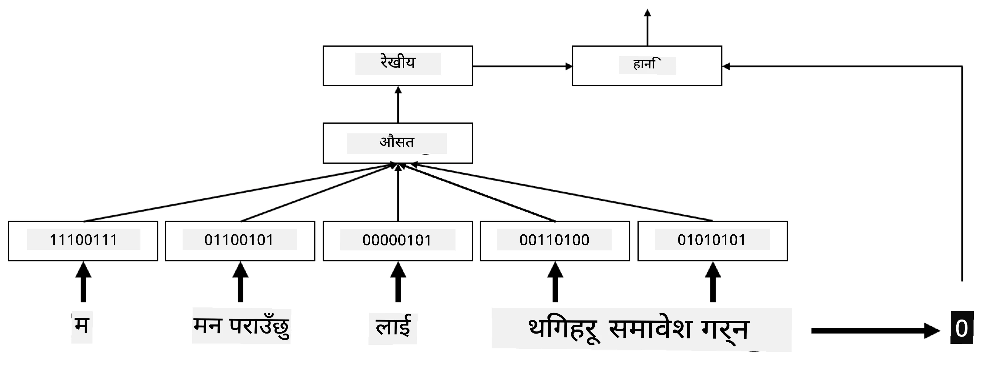

# एम्बेडिङ्स

## [पाठ अघि क्विज](https://ff-quizzes.netlify.app/en/ai/quiz/27)

जब हामी BoW वा TF/IDF आधारित वर्गीकरणकर्ताहरूलाई प्रशिक्षण गरिरहेका थियौं, हामी उच्च-आयामीय बाग-ऑफ-वर्ड्स भेक्टरहरूमा काम गरिरहेका थियौं जसको लम्बाइ `vocab_size` थियो, र हामी कम-आयामीय स्थानिक प्रतिनिधित्व भेक्टरहरूलाई sparse one-hot प्रतिनिधित्वमा स्पष्ट रूपमा रूपान्तरण गरिरहेका थियौं। तर, यो one-hot प्रतिनिधित्व स्मृति-कुशल छैन। साथै, प्रत्येक शब्दलाई एकअर्काबाट स्वतन्त्र रूपमा व्यवहार गरिन्छ, अर्थात् one-hot एन्कोड गरिएको भेक्टरहरूले शब्दहरू बीचको कुनै पनि अर्थपूर्ण समानता व्यक्त गर्दैनन्।

**एम्बेडिङ** को विचार भनेको शब्दहरूलाई कम-आयामीय घना भेक्टरहरूद्वारा प्रतिनिधित्व गर्नु हो, जसले कुनै न कुनै रूपमा शब्दको अर्थपूर्ण अर्थलाई प्रतिबिम्बित गर्छ। हामी पछि कसरी अर्थपूर्ण शब्द एम्बेडिङ्स निर्माण गर्ने भन्ने छलफल गर्नेछौं, तर अहिलेको लागि एम्बेडिङ्सलाई शब्द भेक्टरको आयाम घटाउने तरिकाको रूपमा सोचौं।

त्यसैले, एम्बेडिङ लेयरले शब्दलाई इनपुटको रूपमा लिन्छ, र निर्दिष्ट गरिएको `embedding_size` को आउटपुट भेक्टर उत्पादन गर्छ। यो एक प्रकारले `Linear` लेयरसँग धेरै मिल्दोजुल्दो छ, तर यो one-hot एन्कोड गरिएको भेक्टर लिने सट्टा, यो शब्द नम्बरलाई इनपुटको रूपमा लिन सक्षम हुनेछ, जसले हामीलाई ठूला one-hot-एन्कोड गरिएको भेक्टरहरू सिर्जना गर्नबाट जोगाउँछ।

हाम्रो वर्गीकरणकर्ता नेटवर्कमा पहिलो लेयरको रूपमा एम्बेडिङ लेयर प्रयोग गरेर, हामी बाग-ऑफ-वर्ड्सबाट **embedding bag** मोडेलमा स्विच गर्न सक्छौं, जहाँ हामी हाम्रो पाठमा प्रत्येक शब्दलाई सम्बन्धित एम्बेडिङमा रूपान्तरण गर्छौं, र त्यसपछि ती सबै एम्बेडिङ्समा केही समग्र कार्य जस्तै `sum`, `average` वा `max` गणना गर्छौं।  

> लेखकद्वारा प्रदान गरिएको छवि

## ✍️ अभ्यास: एम्बेडिङ्स

तपाईंको अध्ययनलाई निम्न नोटबुकहरूमा जारी राख्नुहोस्:
* [PyTorch सँग एम्बेडिङ्स](EmbeddingsPyTorch.ipynb)
* [TensorFlow सँग एम्बेडिङ्स](EmbeddingsTF.ipynb)

## अर्थपूर्ण एम्बेडिङ्स: Word2Vec

जबकि एम्बेडिङ लेयरले शब्दहरूलाई भेक्टर प्रतिनिधित्वमा म्याप गर्न सिक्यो, यो प्रतिनिधित्वले अनिवार्य रूपमा धेरै अर्थपूर्ण अर्थ राख्दैन। यस्तो भेक्टर प्रतिनिधित्व सिक्न राम्रो हुनेछ जसले समान शब्दहरू वा पर्यायवाची शब्दहरूलाई केही भेक्टर दूरी (जस्तै, Euclidean दूरी) को सन्दर्भमा एकअर्काको नजिकको भेक्टरहरूसँग मेल खान्छ।

यसका लागि, हामीले हाम्रो एम्बेडिङ मोडेललाई ठूलो पाठ संग्रहमा विशेष तरिकाले पूर्व-प्रशिक्षण गर्न आवश्यक छ। अर्थपूर्ण एम्बेडिङ्स प्रशिक्षण गर्ने एउटा तरिका [Word2Vec](https://en.wikipedia.org/wiki/Word2vec) भनिन्छ। यो दुई मुख्य आर्किटेक्चरहरूमा आधारित छ, जसले शब्दहरूको वितरित प्रतिनिधित्व उत्पादन गर्न प्रयोग गरिन्छ:

 - **निरन्तर बाग-ऑफ-वर्ड्स** (CBoW) — यस आर्किटेक्चरमा, हामीले मोडेललाई वरपरको सन्दर्भबाट शब्दको भविष्यवाणी गर्न प्रशिक्षण दिन्छौं। दिइएको ngram $(W_{-2},W_{-1},W_0,W_1,W_2)$, मोडेलको लक्ष्य $W_0$ लाई $(W_{-2},W_{-1},W_1,W_2)$ बाट भविष्यवाणी गर्नु हो।
 - **निरन्तर स्किप-ग्राम** CBoW को विपरीत हो। मोडेलले सन्दर्भ शब्दहरूको वरपरको झ्याल प्रयोग गरेर वर्तमान शब्दको भविष्यवाणी गर्छ।

CBoW छिटो छ, जबकि स्किप-ग्राम ढिलो छ, तर दुर्लभ शब्दहरूको प्रतिनिधित्व गर्न राम्रो काम गर्छ।

> [यस पेपर](https://arxiv.org/pdf/1301.3781.pdf) बाट लिइएको छवि

Word2Vec पूर्व-प्रशिक्षित एम्बेडिङ्स (र अन्य समान मोडेलहरू, जस्तै GloVe) पनि न्यूरल नेटवर्कहरूमा एम्बेडिङ लेयरको सट्टा प्रयोग गर्न सकिन्छ। तर, हामीले शब्दकोशहरूसँग व्यवहार गर्न आवश्यक छ, किनभने Word2Vec/GloVe लाई पूर्व-प्रशिक्षण गर्न प्रयोग गरिएको शब्दकोश हाम्रो पाठ संग्रहको शब्दकोशसँग फरक हुने सम्भावना छ। माथिका नोटबुकहरूमा हेरेर यो समस्या कसरी समाधान गर्ने भनेर बुझ्नुहोस्।

## सन्दर्भात्मक एम्बेडिङ्स

Word2Vec जस्ता परम्परागत पूर्व-प्रशिक्षित एम्बेडिङ प्रतिनिधित्वहरूको एउटा प्रमुख सीमितता भनेको शब्द अर्थ अस्पष्टताको समस्या हो। पूर्व-प्रशिक्षित एम्बेडिङ्सले सन्दर्भमा शब्दहरूको केही अर्थ समेट्न सक्छ, तर शब्दको प्रत्येक सम्भावित अर्थ एउटै एम्बेडिङमा कोड गरिएको हुन्छ। यसले डाउनस्ट्रीम मोडेलहरूमा समस्या निम्त्याउन सक्छ, किनभने धेरै शब्दहरू, जस्तै 'play', सन्दर्भमा निर्भर गर्दै फरक अर्थ राख्छन्।

उदाहरणका लागि, 'play' शब्द यी दुई वाक्यहरूमा फरक अर्थ राख्छ:

- म थिएटरमा एउटा **play** हेर्न गएँ।
- जोन आफ्ना साथीहरूसँग **play** गर्न चाहन्छ।

माथिका पूर्व-प्रशिक्षित एम्बेडिङ्सले 'play' शब्दको यी दुवै अर्थलाई एउटै एम्बेडिङमा प्रतिनिधित्व गर्छ। यस सीमिततालाई पार गर्न, हामीले **भाषा मोडेल** मा आधारित एम्बेडिङ्स निर्माण गर्न आवश्यक छ, जुन ठूलो पाठ संग्रहमा प्रशिक्षण गरिएको हुन्छ, र *जान्दछ* कसरी शब्दहरू विभिन्न सन्दर्भहरूमा राख्न सकिन्छ। सन्दर्भात्मक एम्बेडिङ्सको चर्चा यस ट्युटोरियलको दायराभन्दा बाहिर छ, तर हामी यसबारे पछि भाषिक मोडेलहरूको चर्चा गर्दा फर्कनेछौं।

## निष्कर्ष

यस पाठमा, तपाईंले TensorFlow र PyTorch मा एम्बेडिङ लेयरहरू निर्माण र प्रयोग गरेर शब्दहरूको अर्थपूर्ण अर्थलाई राम्रोसँग प्रतिबिम्बित गर्ने तरिका पत्ता लगाउनुभयो।

## 🚀 चुनौती

Word2Vec केही रोचक अनुप्रयोगहरूको लागि प्रयोग गरिएको छ, जस्तै गीतका शब्दहरू र कविता सिर्जना गर्ने। [यस लेख](https://www.politetype.com/blog/word2vec-color-poems) मा हेर्नुहोस्, जसले लेखकले Word2Vec प्रयोग गरेर कविता कसरी सिर्जना गरे भन्ने देखाउँछ। [ड्यान शिफम्यानको यो भिडियो](https://www.youtube.com/watch?v=LSS_bos_TPI&ab_channel=TheCodingTrain) पनि हेर्नुहोस्, जसले यस प्रविधिको फरक व्याख्या दिन्छ। त्यसपछि यी प्रविधिहरूलाई आफ्नो पाठ संग्रहमा लागू गर्न प्रयास गर्नुहोस्, सम्भवतः Kaggle बाट स्रोत गरिएको।

## [पाठ पछि क्विज](https://ff-quizzes.netlify.app/en/ai/quiz/28)

## समीक्षा र आत्म-अध्ययन

Word2Vec मा यो पेपर पढ्नुहोस्: [Efficient Estimation of Word Representations in Vector Space](https://arxiv.org/pdf/1301.3781.pdf)

## [कार्य: नोटबुकहरू](assignment.md)

---

