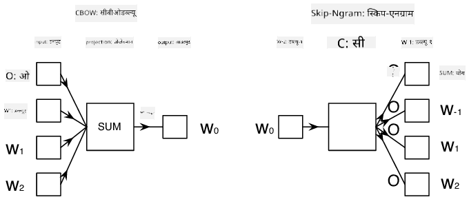

<!--
CO_OP_TRANSLATOR_METADATA:
{
  "original_hash": "31b46ba1f3aa78578134d4829f88be53",
  "translation_date": "2025-08-26T08:30:35+00:00",
  "source_file": "lessons/5-NLP/15-LanguageModeling/README.md",
  "language_code": "ne"
}
-->
# भाषा मोडेलिङ

Word2Vec र GloVe जस्ता सेम्यान्टिक एम्बेडिङहरू वास्तवमा **भाषा मोडेलिङ** तर्फको पहिलो कदम हुन् - यस्तो मोडेल बनाउने जसले कुनै प्रकारले भाषा *बुझ्न* (वा *प्रतिनिधित्व गर्न*) सक्दछ।

## [Pre-lecture quiz](https://red-field-0a6ddfd03.1.azurestaticapps.net/quiz/115)

भाषा मोडेलिङको मुख्य विचार भनेको unlabeled datasets मा unsupervised तरिकाले प्रशिक्षण गर्नु हो। यो महत्त्वपूर्ण छ किनभने हामीसँग unlabeled पाठको ठूलो मात्रा उपलब्ध छ, जबकि labeled पाठको मात्रा सधैं सीमित हुन्छ किनभने labeling मा खर्च गर्न सकिने प्रयास सीमित हुन्छ। प्रायः, हामी यस्तो भाषा मोडेल बनाउन सक्छौं जसले **पाठमा हराएका शब्दहरू भविष्यवाणी गर्न सक्छ** किनभने पाठमा कुनै पनि शब्दलाई mask गरेर प्रशिक्षण नमूना बनाउन सजिलो हुन्छ।

## एम्बेडिङ प्रशिक्षण

हाम्रो अघिल्लो उदाहरणहरूमा, हामीले pre-trained semantic embeddings प्रयोग गरेका थियौं, तर ती embeddings कसरी प्रशिक्षण गर्न सकिन्छ भन्ने हेर्न रोचक छ। यसका लागि विभिन्न सम्भावित विचारहरू प्रयोग गर्न सकिन्छ:

* **N-Gram** भाषा मोडेलिङ, जहाँ हामी N अघिल्लो टोकनहरू हेरेर टोकन भविष्यवाणी गर्छौं (N-gram)
* **Continuous Bag-of-Words** (CBoW), जहाँ हामी टोकन अनुक्रम $W_{-N}$, ..., $W_N$ को बीचको टोकन $W_0$ भविष्यवाणी गर्छौं।
* **Skip-gram**, जहाँ हामी बीचको टोकन $W_0$ बाट छिमेकी टोकनहरूको सेट {$W_{-N},\dots, W_{-1}, W_1,\dots, W_N$} भविष्यवाणी गर्छौं।

> चित्र [यस कागज](https://arxiv.org/pdf/1301.3781.pdf) बाट

## ✍️ उदाहरण नोटबुकहरू: CBoW मोडेल प्रशिक्षण

निम्न नोटबुकहरूमा सिकाइ जारी राख्नुहोस्:

* [TensorFlow प्रयोग गरेर CBoW Word2Vec प्रशिक्षण](../../../../../lessons/5-NLP/15-LanguageModeling/CBoW-TF.ipynb)
* [PyTorch प्रयोग गरेर CBoW Word2Vec प्रशिक्षण](../../../../../lessons/5-NLP/15-LanguageModeling/CBoW-PyTorch.ipynb)

## निष्कर्ष

अघिल्लो पाठमा हामीले देख्यौं कि शब्द एम्बेडिङहरू जादुजस्तै काम गर्छन्! अब हामीलाई थाहा छ कि शब्द एम्बेडिङ प्रशिक्षण गर्नु धेरै जटिल कार्य होइन, र आवश्यक परेमा हामी आफ्नो क्षेत्र विशेष पाठका लागि आफ्नै शब्द एम्बेडिङ प्रशिक्षण गर्न सक्षम हुनुपर्छ।

## [Post-lecture quiz](https://red-field-0a6ddfd03.1.azurestaticapps.net/quiz/215)

## समीक्षा र आत्म-अध्ययन

* [PyTorch को आधिकारिक भाषा मोडेलिङ ट्युटोरियल](https://pytorch.org/tutorials/beginner/nlp/word_embeddings_tutorial.html)।
* [Word2Vec मोडेल प्रशिक्षणको लागि TensorFlow को आधिकारिक ट्युटोरियल](https://www.TensorFlow.org/tutorials/text/word2vec)।
* **gensim** फ्रेमवर्क प्रयोग गरेर केही लाइनको कोडमा प्रचलित एम्बेडिङहरू प्रशिक्षण गर्ने तरिका [यस दस्तावेजमा](https://pytorch.org/tutorials/beginner/nlp/word_embeddings_tutorial.html) वर्णन गरिएको छ।

## 🚀 [असाइनमेन्ट: Skip-Gram मोडेल प्रशिक्षण गर्नुहोस्](lab/README.md)

प्रयोगशालामा, हामी तपाईंलाई यस पाठको कोडलाई संशोधन गरेर CBoW को सट्टा Skip-Gram मोडेल प्रशिक्षण गर्न चुनौती दिन्छौं। [विवरण पढ्नुहोस्](lab/README.md)

**अस्वीकरण**:  
यो दस्तावेज़ AI अनुवाद सेवा [Co-op Translator](https://github.com/Azure/co-op-translator) प्रयोग गरी अनुवाद गरिएको हो। हामी यथासम्भव शुद्धताको प्रयास गर्छौं, तर कृपया ध्यान दिनुहोस् कि स्वचालित अनुवादमा त्रुटि वा अशुद्धता हुन सक्छ। यसको मूल भाषामा रहेको मूल दस्तावेज़लाई आधिकारिक स्रोत मानिनुपर्छ। महत्वपूर्ण जानकारीका लागि, व्यावसायिक मानव अनुवाद सिफारिस गरिन्छ। यस अनुवादको प्रयोगबाट उत्पन्न हुने कुनै पनि गलतफहमी वा गलत व्याख्याका लागि हामी जिम्मेवार हुने छैनौं।