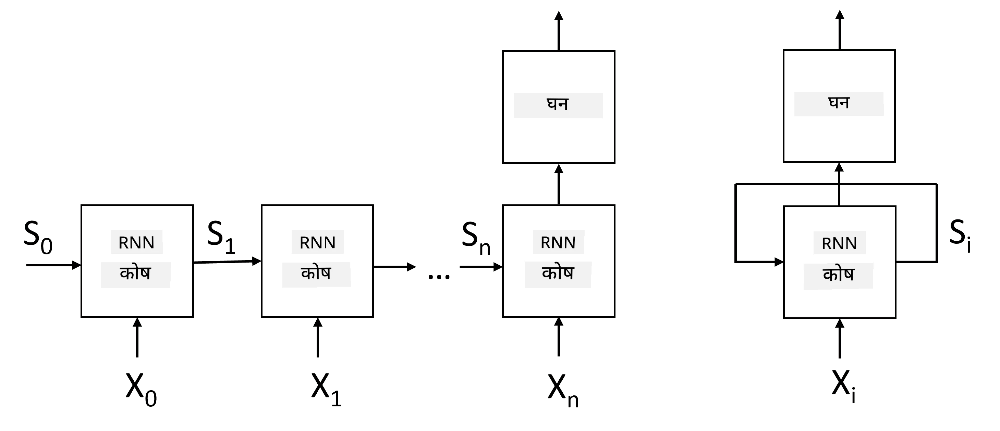
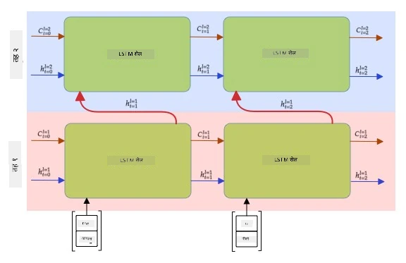

# पुनरावर्ती न्यूरल नेटवर्कहरू

## [पूर्व-व्याख्यान प्रश्नोत्तरी](https://ff-quizzes.netlify.app/en/ai/quiz/31)

अघिल्ला खण्डहरूमा, हामीले पाठको धनी अर्थपूर्ण प्रतिनिधित्वहरू र इम्बेडिङहरूमा आधारित साधारण रेखीय वर्गीकरणकर्ता प्रयोग गरेका थियौं। यो वास्तुकलाले वाक्यमा शब्दहरूको समग्र अर्थलाई समेट्छ, तर यो शब्दहरूको **क्रम**लाई ध्यानमा राख्दैन, किनभने इम्बेडिङहरूमा गरिएको समग्र अपरेशनले मूल पाठबाट यो जानकारी हटाइदिन्छ। यी मोडेलहरूले शब्दहरूको क्रमलाई मोडल गर्न नसक्ने भएकाले, तिनीहरूले पाठ उत्पादन वा प्रश्न उत्तरजस्ता जटिल वा अस्पष्ट कार्यहरू समाधान गर्न सक्दैनन्।

पाठ अनुक्रमको अर्थ समेट्नका लागि, हामीले अर्को न्यूरल नेटवर्क वास्तुकला प्रयोग गर्नुपर्छ, जसलाई **पुनरावर्ती न्यूरल नेटवर्क** (RNN) भनिन्छ। RNN मा, हामी हाम्रो वाक्यलाई नेटवर्कमार्फत एक पटकमा एउटा प्रतीक पठाउँछौं, र नेटवर्कले केही **स्थिति** उत्पादन गर्छ, जसलाई हामी अर्को प्रतीकसँग पुनः नेटवर्कमा पठाउँछौं।

> लेखकद्वारा तयार गरिएको छवि

प्रतीकहरूको इनपुट अनुक्रम X0,...,Xn दिइएको अवस्थामा, RNN ले न्यूरल नेटवर्क ब्लकहरूको अनुक्रम सिर्जना गर्छ, र यो अनुक्रमलाई अन्त्यसम्म ब्याकप्रोपोगेसन प्रयोग गरेर तालिम दिन्छ। प्रत्येक नेटवर्क ब्लकले (Xi,Si) जोडीलाई इनपुटको रूपमा लिन्छ, र Si+1 परिणामस्वरूप उत्पादन गर्छ। अन्तिम स्थिति Sn वा (आउटपुट Yn) लाई नतिजा उत्पादन गर्न रेखीय वर्गीकरणकर्तामा पठाइन्छ। सबै नेटवर्क ब्लकहरूले एउटै तौल साझा गर्छन्, र एक ब्याकप्रोपोगेसन पास प्रयोग गरेर अन्त्यसम्म तालिम दिइन्छ।

किनभने स्थिति भेक्टरहरू S0,...,Sn नेटवर्कमार्फत पठाइन्छन्, यसले शब्दहरू बीचको अनुक्रमिक निर्भरता सिक्न सक्षम हुन्छ। उदाहरणका लागि, जब *not* शब्द अनुक्रममा कतै देखा पर्छ, यसले स्थिति भेक्टरभित्रका निश्चित तत्वहरूलाई नकार्न सिक्न सक्छ, जसले नकारात्मकता परिणाम दिन्छ।

> ✅ माथिको चित्रमा सबै RNN ब्लकहरूको तौल साझा गरिएको छ, त्यसैले एउटै चित्रलाई पुनरावर्ती फिडब्याक लूप भएको एउटा ब्लक (दायाँपट्टि) को रूपमा प्रतिनिधित्व गर्न सकिन्छ, जसले नेटवर्कको आउटपुट स्थितिलाई इनपुटमा फिर्ता पठाउँछ।

## RNN सेलको संरचना

अब, एउटा साधारण RNN सेल कसरी व्यवस्थित छ भनेर हेरौं। यसले अघिल्लो स्थिति Si-1 र वर्तमान प्रतीक Xi लाई इनपुटको रूपमा स्वीकार्छ, र आउटपुट स्थिति Si उत्पादन गर्नुपर्छ (र, कहिलेकाहीँ, हामी अन्य आउटपुट Yi मा पनि रुचि राख्छौं, जस्तै उत्पादनशील नेटवर्कहरूको अवस्थामा)।

साधारण RNN सेलभित्र दुईवटा तौल म्याट्रिक्स हुन्छन्: एउटा इनपुट प्रतीकलाई रूपान्तरण गर्छ (यसलाई W भनौं), र अर्को इनपुट स्थितिलाई रूपान्तरण गर्छ (H)। यस अवस्थामा, नेटवर्कको आउटपुट &sigma;(W&times;Xi+H&times;Si-1+b) को रूपमा गणना गरिन्छ, जहाँ &sigma; सक्रियता प्रकार्य हो र b थप पूर्वाग्रह हो।

> लेखकद्वारा तयार गरिएको छवि

धेरै अवस्थामा, इनपुट प्रतीकहरूलाई RNN मा प्रवेश गर्नु अघि इम्बेडिङ तहमार्फत पठाइन्छ, जसले आयाम घटाउँछ। यस अवस्थामा, यदि इनपुट भेक्टरहरूको आयाम *emb_size* हो, र स्थिति भेक्टर *hid_size* हो - W को आकार *emb_size*&times;*hid_size* हुन्छ, र H को आकार *hid_size*&times;*hid_size* हुन्छ।

## लामो छोटो समय स्मृति (LSTM)

क्लासिकल RNNहरूको मुख्य समस्यामध्ये एकलाई **विलुप्त ग्रेडियन्ट** समस्या भनिन्छ। किनभने RNNहरूलाई एक ब्याकप्रोपोगेसन पासमा अन्त्यसम्म तालिम दिइन्छ, यसले नेटवर्कका पहिलो तहहरूमा त्रुटि फैलाउन कठिनाइ अनुभव गर्छ, र यसैले नेटवर्कले टाढाका प्रतीकहरू बीचको सम्बन्ध सिक्न सक्दैन। यो समस्यालाई समाधान गर्नका लागि **स्पष्ट स्थिति व्यवस्थापन**लाई **गेटहरू** प्रयोग गरेर परिचय गराइन्छ। यस प्रकारका दुई प्रसिद्ध वास्तुकलाहरू छन्: **लामो छोटो समय स्मृति** (LSTM) र **गेटेड रिलेस यूनिट** (GRU)।

> छवि स्रोत TBD

LSTM नेटवर्क RNN जस्तै व्यवस्थित छ, तर दुईवटा स्थितिहरू तहबाट तहमा पास गरिन्छ: वास्तविक स्थिति C, र लुकेको भेक्टर H। प्रत्येक युनिटमा, लुकेको भेक्टर Hi इनपुट Xi सँग जोडिन्छ, र तिनीहरूले **गेटहरू** मार्फत स्थिति C मा के हुन्छ भन्ने नियन्त्रण गर्छन्। प्रत्येक गेट एक सिग्मोइड सक्रियता भएको न्यूरल नेटवर्क हो (आउटपुट [0,1] को दायरामा), जसलाई स्थिति भेक्टरसँग गुणा गर्दा बिटवाइज मास्कको रूपमा सोच्न सकिन्छ। तलका गेटहरू छन् (चित्रमा बायाँदेखि दायाँ):

* **भूल गेट** लुकेको भेक्टर लिन्छ र भेक्टर C का कुन तत्वहरू बिर्सनु पर्छ र कुन तत्वहरू पास गर्नुपर्छ भनेर निर्धारण गर्छ।
* **इनपुट गेट** इनपुट र लुकेको भेक्टरबाट केही जानकारी लिन्छ र स्थितिमा समावेश गर्छ।
* **आउटपुट गेट** स्थितिलाई *tanh* सक्रियतासहितको रेखीय तहमार्फत रूपान्तरण गर्छ, त्यसपछि नयाँ स्थिति Ci+1 उत्पादन गर्न लुकेको भेक्टर Hi प्रयोग गरेर यसको केही तत्वहरू चयन गर्छ।

स्थिति C का तत्वहरूलाई केही झण्डाहरूको रूपमा सोच्न सकिन्छ, जसलाई अन र अफ गर्न सकिन्छ। उदाहरणका लागि, जब हामी अनुक्रममा *Alice* नाम भेट्छौं, हामीले यो महिला पात्रलाई जनाउँछ भन्ने मान्न सक्छौं, र स्थितिमा महिला संज्ञा भएको झण्डा उठाउन सक्छौं। जब हामी थप *and Tom* वाक्यांश भेट्छौं, हामीले बहुवचन संज्ञा भएको झण्डा उठाउनेछौं। यसरी, स्थितिलाई हेरफेर गरेर, हामी वाक्यका व्याकरणिक गुणहरू ट्र्याक गर्न सक्छौं।

> ✅ LSTM को आन्तरिक संरचना बुझ्नका लागि उत्कृष्ट स्रोत यो उत्कृष्ट लेख [Understanding LSTM Networks](https://colah.github.io/posts/2015-08-Understanding-LSTMs/) हो, जसलाई क्रिस्टोफर ओलाहले लेखेका छन्।

## द्विदिशात्मक र बहु-तह RNNहरू

हामीले यस्तो पुनरावर्ती नेटवर्कहरूको चर्चा गर्यौं, जुन एक दिशामा काम गर्छ, अनुक्रमको सुरुदेखि अन्त्यसम्म। यो स्वाभाविक देखिन्छ, किनभने यसले हामीले पढ्ने र बोल्ने तरिकालाई झल्काउँछ। तर, धेरै व्यावहारिक अवस्थामा हामीसँग इनपुट अनुक्रममा अनियमित पहुँच हुन्छ, त्यसैले पुनरावर्ती गणना दुवै दिशामा चलाउन उपयुक्त हुन सक्छ। यस्ता नेटवर्कहरूलाई **द्विदिशात्मक** RNN भनिन्छ। द्विदिशात्मक नेटवर्कसँग व्यवहार गर्दा, हामीलाई प्रत्येक दिशाका लागि दुईवटा लुकेका स्थिति भेक्टरहरू आवश्यक पर्छ।

पुनरावर्ती नेटवर्क, चाहे एक-दिशात्मक होस् वा द्विदिशात्मक, अनुक्रमभित्रका निश्चित ढाँचाहरू समात्छ, र तिनीहरूलाई स्थिति भेक्टरमा भण्डारण गर्न वा आउटपुटमा पास गर्न सक्छ। कन्भोल्युसनल नेटवर्कहरूको जस्तै, हामी पहिलो तहले निकालेका तल्लो-स्तरका ढाँचाहरूबाट उच्च-स्तरका ढाँचाहरू समात्न अर्को पुनरावर्ती तह निर्माण गर्न सक्छौं। यसले हामीलाई **बहु-तह RNN** को अवधारणामा पुर्‍याउँछ, जसमा दुई वा बढी पुनरावर्ती नेटवर्कहरू हुन्छन्, जहाँ अघिल्लो तहको आउटपुटलाई अर्को तहमा इनपुटको रूपमा पास गरिन्छ।

*फर्नान्डो लोपेजको [यो अद्भुत पोस्ट](https://towardsdatascience.com/from-a-lstm-cell-to-a-multilayer-lstm-network-with-pytorch-2899eb5696f3) बाट लिइएको चित्र*

## ✍️ अभ्यास: इम्बेडिङहरू

तपाईंको अध्ययनलाई निम्न नोटबुकहरूमा जारी राख्नुहोस्:

* [PyTorch सँग RNNs](RNNPyTorch.ipynb)
* [TensorFlow सँग RNNs](RNNTF.ipynb)

## निष्कर्ष

यस खण्डमा, हामीले देख्यौं कि RNNs लाई अनुक्रम वर्गीकरणका लागि प्रयोग गर्न सकिन्छ, तर वास्तवमा, तिनीहरूले पाठ उत्पादन, मेसिन अनुवाद, र अन्य धेरै कार्यहरू पनि गर्न सक्छन्। हामी ती कार्यहरूको अध्ययन अर्को खण्डमा गर्नेछौं।

## 🚀 चुनौती

LSTMs को बारेमा केही साहित्य पढ्नुहोस् र तिनका प्रयोगहरूको बारेमा विचार गर्नुहोस्:

- [Grid Long Short-Term Memory](https://arxiv.org/pdf/1507.01526v1.pdf)
- [Show, Attend and Tell: Neural Image Caption
Generation with Visual Attention](https://arxiv.org/pdf/1502.03044v2.pdf)

## [पश्च-व्याख्यान प्रश्नोत्तरी](https://ff-quizzes.netlify.app/en/ai/quiz/32)

## समीक्षा र आत्म-अध्ययन

- [Understanding LSTM Networks](https://colah.github.io/posts/2015-08-Understanding-LSTMs/) क्रिस्टोफर ओलाहद्वारा।

## [कार्य: नोटबुकहरू](assignment.md)

---

