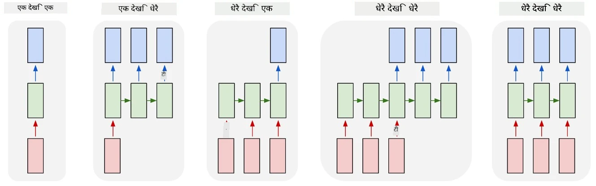

# जेनेरेटिभ नेटवर्कहरू

## [प्री-लेक्चर क्विज](https://ff-quizzes.netlify.app/en/ai/quiz/33)

Recurrent Neural Networks (RNNs) र तिनका गेटेड सेल भेरियन्टहरू जस्तै Long Short Term Memory Cells (LSTMs) र Gated Recurrent Units (GRUs) ले भाषा मोडलिङको लागि एक मेकानिज्म प्रदान गर्छन् जसले शब्दहरूको क्रम सिक्न सक्छ र अनुक्रममा अर्को शब्दको भविष्यवाणी गर्न सक्छ। यसले RNNs लाई **जेनेरेटिभ कार्यहरू** जस्तै सामान्य पाठ उत्पादन, मेशिन अनुवाद, र यहाँसम्म कि छवि क्याप्शनिङको लागि प्रयोग गर्न अनुमति दिन्छ।

> ✅ तपाईंले टाइप गर्दा पाठ पूरा गर्ने जस्ता जेनेरेटिभ कार्यहरूबाट फाइदा लिएको समयको बारेमा सोच्नुहोस्। तपाईंको मनपर्ने एप्लिकेसनहरूमा अनुसन्धान गर्नुहोस् कि तिनीहरूले RNNs प्रयोग गरेका थिए कि थिएनन्।

पछिल्लो युनिटमा हामीले छलफल गरेको RNN आर्किटेक्चरमा, प्रत्येक RNN युनिटले अर्को लुकेको अवस्था उत्पादन गर्थ्यो। तर, हामी प्रत्येक पुनरावर्ती युनिटमा अर्को आउटपुट थप्न सक्छौं, जसले हामीलाई **अनुक्रम** (जसको लम्बाइ मूल अनुक्रमको बराबर छ) उत्पादन गर्न अनुमति दिन्छ। साथै, हामी RNN युनिटहरू प्रयोग गर्न सक्छौं जसले प्रत्येक चरणमा इनपुट स्वीकार गर्दैनन्, र केवल केही प्रारम्भिक अवस्था भेक्टर लिन्छन्, र त्यसपछि आउटपुटहरूको अनुक्रम उत्पादन गर्छन्।

यसले विभिन्न न्युरल आर्किटेक्चरहरूलाई अनुमति दिन्छ जुन तलको चित्रमा देखाइएको छ:



> [Andrej Karpaty](http://karpathy.github.io/) द्वारा [Unreasonable Effectiveness of Recurrent Neural Networks](http://karpathy.github.io/2015/05/21/rnn-effectiveness/) ब्लग पोस्टबाट चित्र

* **वन-टु-वन** एक परम्परागत न्युरल नेटवर्क हो जसमा एक इनपुट र एक आउटपुट हुन्छ।
* **वन-टु-म्यानी** एक जेनेरेटिभ आर्किटेक्चर हो जसले एक इनपुट मान स्वीकार्छ, र आउटपुट मानहरूको अनुक्रम उत्पन्न गर्छ। उदाहरणका लागि, यदि हामी एउटा **छवि क्याप्शनिङ** नेटवर्कलाई तालिम दिन चाहन्छौं जसले चित्रको पाठ विवरण उत्पादन गर्छ, हामी चित्रलाई इनपुटको रूपमा लिन सक्छौं, यसलाई CNN मार्फत पास गर्न सक्छौं यसको लुकेको अवस्था प्राप्त गर्न, र त्यसपछि पुनरावर्ती चेनले शब्द-दर-शब्द क्याप्शन उत्पन्न गर्न सक्छ।
* **म्यानी-टु-वन** पछिल्लो युनिटमा वर्णन गरिएको RNN आर्किटेक्चरहरूसँग मेल खान्छ, जस्तै पाठ वर्गीकरण।
* **म्यानी-टु-म्यानी**, वा **अनुक्रम-टु-अनुक्रम** जस्ता कार्यहरूलाई मेल खान्छ जस्तै **मेशिन अनुवाद**, जहाँ पहिलो RNN ले इनपुट अनुक्रमबाट सबै जानकारी लुकेको अवस्थामा सङ्कलन गर्छ, र अर्को RNN चेनले यो अवस्था आउटपुट अनुक्रममा अनरोल गर्छ।

यस युनिटमा, हामी सरल जेनेरेटिभ मोडेलहरूमा केन्द्रित हुनेछौं जसले हामीलाई पाठ उत्पन्न गर्न मद्दत गर्छ। सरलताको लागि, हामी क्यारेक्टर-स्तर टोकनाइजेशन प्रयोग गर्नेछौं।

हामीले यो RNN लाई चरण-दर-चरण पाठ उत्पन्न गर्न तालिम दिनेछौं। प्रत्येक चरणमा, हामी `nchars` लम्बाइको क्यारेक्टरहरूको अनुक्रम लिनेछौं, र नेटवर्कलाई प्रत्येक इनपुट क्यारेक्टरको लागि अर्को आउटपुट क्यारेक्टर उत्पन्न गर्न सोध्नेछौं:


पाठ उत्पन्न गर्दा (इनफरेन्सको समयमा), हामी केही **प्रम्प्ट** बाट सुरु गर्छौं, जुन RNN सेलहरू मार्फत पास गरिन्छ यसको मध्यवर्ती अवस्था उत्पन्न गर्न, र त्यसपछि यो अवस्थाबाट उत्पादन सुरु हुन्छ। हामी एक पटकमा एक क्यारेक्टर उत्पन्न गर्छौं, र अर्को RNN सेलमा अवस्था र उत्पन्न क्यारेक्टर पास गर्छौं अर्को क्यारेक्टर उत्पन्न गर्न, जबसम्म हामी पर्याप्त क्यारेक्टरहरू उत्पन्न गर्दैनौं।


> लेखकद्वारा चित्र

## ✍️ अभ्यासहरू: जेनेरेटिभ नेटवर्कहरू

तलका नोटबुकहरूमा आफ्नो सिकाइ जारी राख्नुहोस्:

* [PyTorch संग जेनेरेटिभ नेटवर्कहरू](GenerativePyTorch.ipynb)
* [TensorFlow संग जेनेरेटिभ नेटवर्कहरू](GenerativeTF.ipynb)

## नरम पाठ उत्पादन र तापक्रम

प्रत्येक RNN सेलको आउटपुट क्यारेक्टरहरूको सम्भाव्यता वितरण हो। यदि हामीले सधैं उत्पन्न पाठमा अर्को क्यारेक्टरको रूपमा उच्चतम सम्भावनाको क्यारेक्टर लिने हो भने, पाठ अक्सर "चक्रित" हुन सक्छ र बारम्बार उही क्यारेक्टर अनुक्रमहरूमा फस्न सक्छ, जस्तै यो उदाहरणमा:

```
today of the second the company and a second the company ...
```

तर, यदि हामी अर्को क्यारेक्टरको सम्भाव्यता वितरणलाई हेर्छौं भने, केही उच्चतम सम्भावनाहरूको बीचको भिन्नता ठूलो नहुन सक्छ, जस्तै एक क्यारेक्टरको सम्भाव्यता 0.2 हुन सक्छ, अर्को - 0.19, आदि। उदाहरणका लागि, '*play*' अनुक्रममा अर्को क्यारेक्टर खोज्दा, अर्को क्यारेक्टर समान रूपमा स्पेस वा **e** (जस्तै शब्द *player* मा) हुन सक्छ।

यसले हामीलाई यो निष्कर्षमा पुर्‍याउँछ कि उच्च सम्भावनाको क्यारेक्टर चयन गर्नु सधैं "न्यायोचित" हुँदैन, किनकि दोस्रो उच्चतम चयन गर्दा पनि अर्थपूर्ण पाठमा पुग्न सक्छ। यो अधिक बुद्धिमानी हुन्छ कि नेटवर्क आउटपुटले दिएको सम्भाव्यता वितरणबाट क्यारेक्टरहरू **नमूना** गरौं। हामी एउटा प्यारामिटर, **तापक्रम**, प्रयोग गर्न सक्छौं जसले सम्भाव्यता वितरणलाई समतल बनाउँछ, यदि हामी थप अनियमितता थप्न चाहन्छौं, वा यसलाई थप तीव्र बनाउँछौं, यदि हामी उच्च सम्भावनाका क्यारेक्टरहरूमा बढी टाँसिन चाहन्छौं।

तलका नोटबुकहरूमा यो नरम पाठ उत्पादन कसरी कार्यान्वयन गरिएको छ भनेर अन्वेषण गर्नुहोस्।

## निष्कर्ष

पाठ उत्पादन आफैंमा उपयोगी हुन सक्छ, तर मुख्य फाइदा RNNs प्रयोग गरेर केही प्रारम्भिक फिचर भेक्टरबाट पाठ उत्पन्न गर्ने क्षमताबाट आउँछ। उदाहरणका लागि, पाठ उत्पादन मेशिन अनुवादको भागको रूपमा प्रयोग गरिन्छ (अनुक्रम-टु-अनुक्रम, यस अवस्थामा *एन्कोडर* बाट राज्य भेक्टर प्रयोग गरेर अनुवाद गरिएको सन्देश उत्पन्न वा *डिकोड* गरिन्छ), वा छविको पाठ विवरण उत्पन्न गर्न (यस अवस्थामा फिचर भेक्टर CNN एक्स्ट्र्याक्टरबाट आउँछ)।

## 🚀 चुनौती

यस विषयमा Microsoft Learn मा केही पाठहरू लिनुहोस्

* [PyTorch](https://docs.microsoft.com/learn/modules/intro-natural-language-processing-pytorch/6-generative-networks/?WT.mc_id=academic-77998-cacaste)/[TensorFlow](https://docs.microsoft.com/learn/modules/intro-natural-language-processing-tensorflow/5-generative-networks/?WT.mc_id=academic-77998-cacaste) संग पाठ उत्पादन

## [पोस्ट-लेक्चर क्विज](https://ff-quizzes.netlify.app/en/ai/quiz/34)

## समीक्षा र आत्म अध्ययन

तपाईंको ज्ञान विस्तार गर्नका लागि यहाँ केही लेखहरू छन्

* Markov Chain, LSTM र GPT-2 संग पाठ उत्पादनका विभिन्न दृष्टिकोणहरू: [ब्लग पोस्ट](https://towardsdatascience.com/text-generation-gpt-2-lstm-markov-chain-9ea371820e1e)
* [Keras डकुमेन्टेशन](https://keras.io/examples/generative/lstm_character_level_text_generation/) मा पाठ उत्पादनको नमूना

## [असाइनमेन्ट](lab/README.md)

हामीले क्यारेक्टर-दर-क्यारेक्टर पाठ उत्पादन कसरी गर्ने देख्यौं। प्रयोगशालामा, तपाईं शब्द-स्तर पाठ उत्पादन अन्वेषण गर्नुहुनेछ।

---

