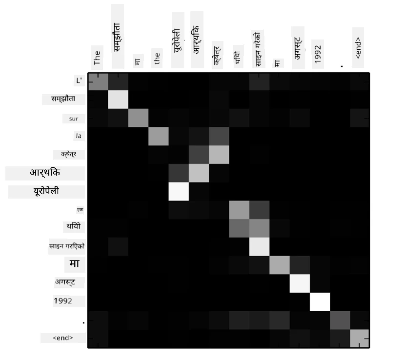
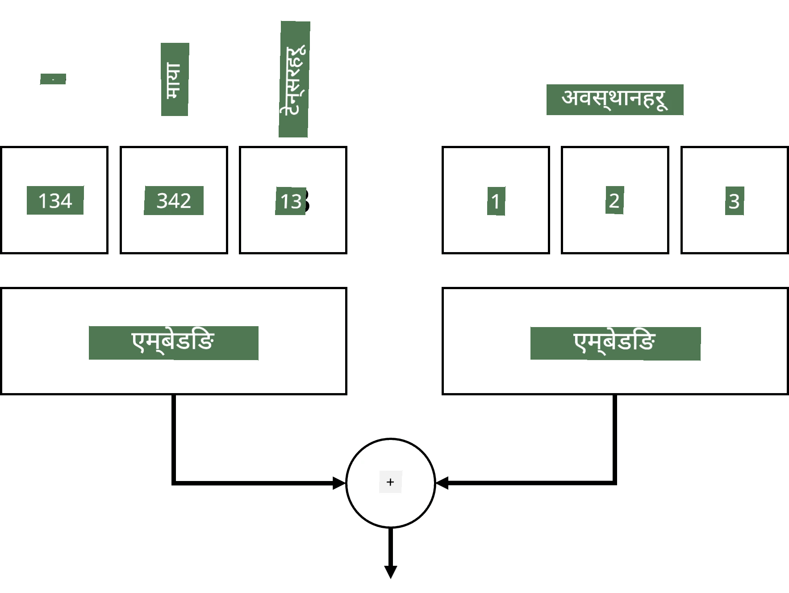
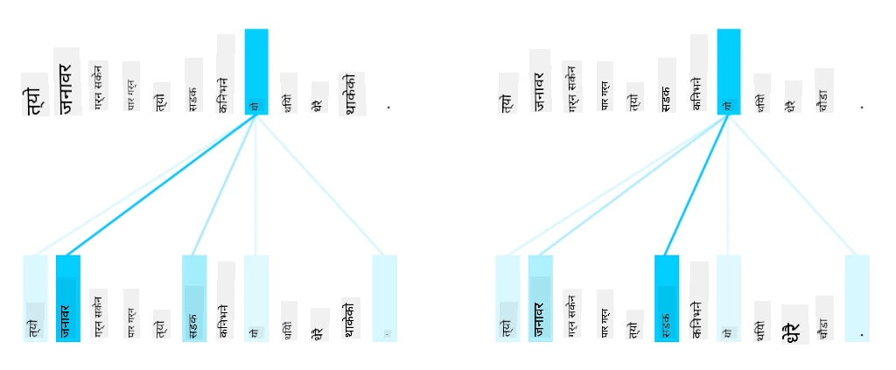
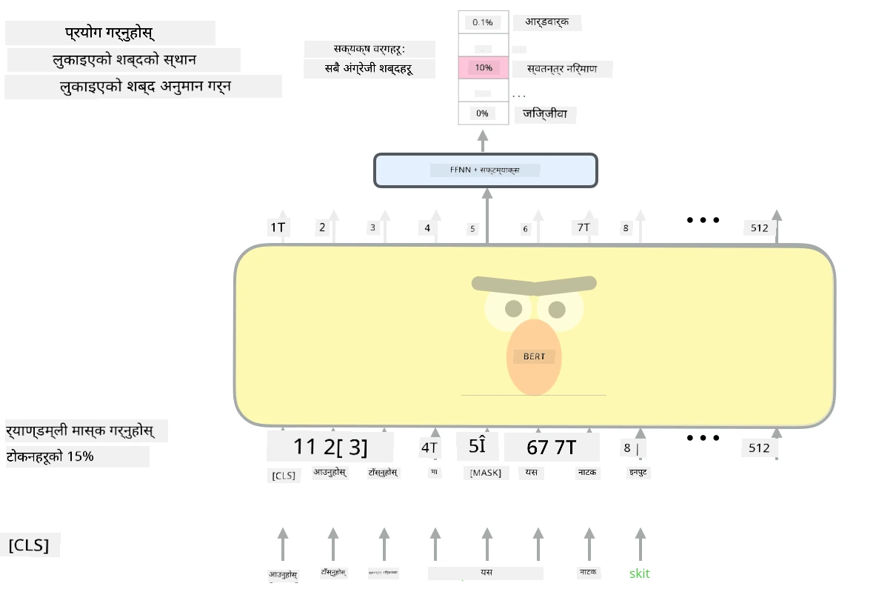

# ध्यान मेकानिज्म र ट्रान्सफर्मरहरू

## [पाठ अघि क्विज](https://ff-quizzes.netlify.app/en/ai/quiz/35)

NLP क्षेत्रमा सबैभन्दा महत्त्वपूर्ण समस्याहरू मध्ये एक हो **मेसिन अनुवाद**, जुन Google Translate जस्ता उपकरणहरूको आधारभूत कार्य हो। यस खण्डमा, हामी मेसिन अनुवादमा केन्द्रित हुनेछौं, वा सामान्य रूपमा, कुनै पनि *sequence-to-sequence* कार्यमा (जसलाई **sentence transduction** पनि भनिन्छ)।

RNNs प्रयोग गर्दा, sequence-to-sequence दुई पुनरावर्ती नेटवर्कहरूद्वारा कार्यान्वयन गरिन्छ, जहाँ एउटा नेटवर्क, **encoder**, इनपुट अनुक्रमलाई लुकाइएको अवस्थामा संकुचित गर्छ, जबकि अर्को नेटवर्क, **decoder**, यस लुकाइएको अवस्थालाई अनुवादित परिणाममा अनरोल गर्छ। यस दृष्टिकोणसँग केही समस्याहरू छन्:

* encoder नेटवर्कको अन्तिम अवस्थाले वाक्यको सुरुवात सम्झन गाह्रो हुन्छ, जसले लामो वाक्यहरूको लागि मोडेलको गुणस्तर कमजोर बनाउँछ।
* अनुक्रमका सबै शब्दहरूले नतिजामा समान प्रभाव पार्छन्। तर वास्तविकतामा, इनपुट अनुक्रमका विशिष्ट शब्दहरूले अन्य शब्दहरूको तुलनामा अनुक्रमिक आउटपुटमा बढी प्रभाव पार्छन्।

**ध्यान मेकानिज्महरू** प्रत्येक इनपुट भेक्टरको सन्दर्भात्मक प्रभावलाई प्रत्येक RNN को आउटपुट भविष्यवाणीमा तौल दिने माध्यम प्रदान गर्छ। यसलाई कार्यान्वयन गर्ने तरिका भनेको इनपुट RNN र आउटपुट RNN का बीचमा छोटो मार्गहरू सिर्जना गर्नु हो। यस प्रकार, आउटपुट प्रतीक yt उत्पन्न गर्दा, हामी सबै इनपुट लुकाइएको अवस्थाहरू hi लाई विभिन्न तौल गुणांकहरू &alpha;t,i सहित विचार गर्नेछौं।

> [Bahdanau et al., 2015](https://arxiv.org/pdf/1409.0473.pdf) मा additive attention मेकानिज्मसहितको encoder-decoder मोडेल, [यो ब्लग पोस्ट](https://lilianweng.github.io/lil-log/2018/06/24/attention-attention.html) बाट उद्धृत।

ध्यान म्याट्रिक्स {&alpha;i,j} ले इनपुट अनुक्रमका निश्चित शब्दहरूले आउटपुट अनुक्रमको कुनै शब्दको उत्पत्तिमा कति भूमिका खेल्छन् भन्ने प्रतिनिधित्व गर्दछ। तल यस्तो म्याट्रिक्सको उदाहरण छ:

> [Bahdanau et al., 2015](https://arxiv.org/pdf/1409.0473.pdf) बाट चित्र (Fig.3)

ध्यान मेकानिज्महरू NLP मा हालको वा निकट भविष्यको उत्कृष्ट अवस्थाको लागि जिम्मेवार छन्। ध्यान थप्दा मोडेलको प्यारामिटरहरूको संख्या धेरै बढ्छ, जसले RNNs सँग स्केलिङ समस्याहरू निम्त्यायो। RNNs को स्केलिङको मुख्य बाधा भनेको मोडेलहरूको पुनरावर्ती प्रकृतिले प्रशिक्षणलाई ब्याच र समानान्तर बनाउन चुनौतीपूर्ण बनाउँछ। RNN मा अनुक्रमको प्रत्येक तत्वलाई क्रमिक रूपमा प्रक्रिया गर्न आवश्यक हुन्छ, जसले यसलाई सजिलै समानान्तर बनाउन असम्भव बनाउँछ।

> [Google's Blog](https://research.googleblog.com/2016/09/a-neural-network-for-machine.html) बाट चित्र।

ध्यान मेकानिज्महरूको अपनत्व र यस बाधाले आज हामीले चिनेका र प्रयोग गर्ने उत्कृष्ट ट्रान्सफर्मर मोडेलहरूको सिर्जना गर्‍यो, जस्तै BERT देखि Open-GPT3।

## ट्रान्सफर्मर मोडेलहरू

ट्रान्सफर्मरहरूको पछाडि मुख्य विचार भनेको RNNs को क्रमिक प्रकृतिलाई टाढा राख्नु र प्रशिक्षणको क्रममा समानान्तर बनाउन सकिने मोडेल सिर्जना गर्नु हो। यो दुई विचारहरू कार्यान्वयन गरेर प्राप्त गरिन्छ:

* positional encoding
* RNNs (वा CNNs) को सट्टा ढाँचाहरू कब्जा गर्न self-attention मेकानिज्म प्रयोग गर्नु (त्यसैले ट्रान्सफर्मरहरू प्रस्तुत गर्ने पेपरलाई *[Attention is all you need](https://arxiv.org/abs/1706.03762)* भनिएको हो)

### Positional Encoding/Embedding

Positional encoding को विचार निम्नानुसार छ। 
1. RNNs प्रयोग गर्दा, टोकनहरूको सापेक्ष स्थिति चरणहरूको संख्याले प्रतिनिधित्व गरिन्छ, र यसलाई स्पष्ट रूपमा प्रतिनिधित्व गर्न आवश्यक छैन। 
2. तर, ध्यानमा स्विच गरेपछि, हामीलाई अनुक्रमभित्र टोकनहरूको सापेक्ष स्थिति थाहा हुन आवश्यक छ। 
3. Positional encoding प्राप्त गर्न, हामी टोकनहरूको अनुक्रमलाई अनुक्रमभित्र टोकन स्थितिहरूको अनुक्रम (जस्तै, 0,1, ...) संग बढाउँछौं। 
4. त्यसपछि हामी टोकन स्थिति र टोकन embedding भेक्टरलाई मिसाउँछौं। स्थिति (integer) लाई भेक्टरमा रूपान्तरण गर्न, हामी विभिन्न दृष्टिकोणहरू प्रयोग गर्न सक्छौं:

* टोकन embedding जस्तै trainable embedding। यो यहाँ हामीले विचार गरेको दृष्टिकोण हो। हामी टोकनहरू र तिनका स्थितिहरूमा embedding लेयरहरू लागू गर्छौं, जसले समान आयामका embedding भेक्टरहरू उत्पादन गर्छ, जुन हामीले एकसाथ थप्छौं।
* मूल पेपरमा प्रस्ताव गरिएको fixed position encoding function।

> लेखकद्वारा चित्र।

Positional embedding को परिणामले मूल टोकन र यसको अनुक्रमभित्रको स्थिति दुवैलाई embedding गर्छ।

### Multi-Head Self-Attention

अब, हामीले हाम्रो अनुक्रमभित्र केही ढाँचाहरू कब्जा गर्न आवश्यक छ। यो गर्न ट्रान्सफर्मरहरूले **self-attention** मेकानिज्म प्रयोग गर्छन्, जुन इनपुट र आउटपुटको रूपमा समान अनुक्रममा लागू गरिएको ध्यान हो। Self-attention लागू गर्दा हामी वाक्यभित्रको **सन्दर्भ**लाई विचार गर्न सक्छौं, र कुन शब्दहरू परस्पर सम्बन्धित छन् हेर्न सक्छौं। उदाहरणका लागि, यसले *it* जस्ता coreferences द्वारा उल्लेख गरिएका शब्दहरू हेर्न र सन्दर्भलाई विचार गर्न अनुमति दिन्छ:

> [Google Blog](https://research.googleblog.com/2017/08/transformer-novel-neural-network.html) बाट चित्र।

ट्रान्सफर्मरहरूमा, हामी **Multi-Head Attention** प्रयोग गर्छौं ताकि नेटवर्कले विभिन्न प्रकारका निर्भरता कब्जा गर्न सक्ने शक्ति प्राप्त गरोस्, जस्तै लामो-अवधि बनाम छोटो-अवधि शब्द सम्बन्धहरू, co-reference बनाम अन्य केही।

[TensorFlow Notebook](TransformersTF.ipynb) मा ट्रान्सफर्मर लेयरहरूको कार्यान्वयनको थप विवरणहरू छन्।

### Encoder-Decoder Attention

ट्रान्सफर्मरहरूमा, ध्यान दुई स्थानमा प्रयोग गरिन्छ:

* इनपुट पाठभित्र ढाँचाहरू कब्जा गर्न self-attention प्रयोग गर्न
* अनुक्रम अनुवाद गर्न - यो encoder र decoder बीचको ध्यान लेयर हो।

Encoder-decoder attention RNNs मा प्रयोग गरिएको ध्यान मेकानिज्मसँग धेरै समान छ, जसको वर्णन यस खण्डको सुरुवातमा गरिएको थियो। यो एनिमेटेड डायग्रामले encoder-decoder attention को भूमिकालाई स्पष्ट गर्दछ।

किनकि प्रत्येक इनपुट स्थिति स्वतन्त्र रूपमा प्रत्येक आउटपुट स्थितिमा म्याप गरिन्छ, ट्रान्सफर्मरहरूले RNNs भन्दा राम्रो समानान्तर गर्न सक्छन्, जसले धेरै ठूलो र अधिक अभिव्यक्तिपूर्ण भाषा मोडेलहरू सक्षम बनाउँछ। प्रत्येक attention head विभिन्न शब्दहरूको सम्बन्धहरू सिक्न प्रयोग गर्न सकिन्छ, जसले Natural Language Processing कार्यहरूमा सुधार ल्याउँछ।

## BERT

**BERT** (Bidirectional Encoder Representations from Transformers) एक धेरै ठूलो बहु-लेयर ट्रान्सफर्मर नेटवर्क हो, *BERT-base* को लागि 12 लेयरहरू, र *BERT-large* को लागि 24। मोडेललाई पहिलो पटक ठूलो पाठ डाटाको संग्रह (WikiPedia + किताबहरू) मा unsupervised प्रशिक्षण (वाक्यमा masked शब्दहरूको भविष्यवाणी गर्दै) प्रयोग गरेर प्रि-ट्रेन गरिन्छ। प्रि-ट्रेनिङको क्रममा मोडेलले भाषा बुझ्ने महत्त्वपूर्ण स्तरहरू अवशोषित गर्छ, जसलाई अन्य डाटासेटहरूसँग fine tuning गरेर उपयोग गर्न सकिन्छ। यस प्रक्रियालाई **transfer learning** भनिन्छ।

> [स्रोत](http://jalammar.github.io/illustrated-bert/)

## ✍️ अभ्यासहरू: ट्रान्सफर्मरहरू

तपाईंको सिकाइलाई निम्न नोटबुकहरूमा जारी राख्नुहोस्:

* [Transformers in PyTorch](TransformersPyTorch.ipynb)
* [Transformers in TensorFlow](TransformersTF.ipynb)

## निष्कर्ष

यस पाठमा तपाईंले ट्रान्सफर्मरहरू र ध्यान मेकानिज्महरूबारे सिक्नुभयो, जुन NLP टूलबक्सका सबै आवश्यक उपकरणहरू हुन्। ट्रान्सफर्मर आर्किटेक्चरका धेरै भेरिएसनहरू छन्, जस्तै BERT, DistilBERT, BigBird, OpenGPT3 र अन्य, जसलाई fine tune गर्न सकिन्छ। [HuggingFace package](https://github.com/huggingface/) ले PyTorch र TensorFlow दुवैसँग धेरै आर्किटेक्चरहरू प्रशिक्षण गर्नको लागि रिपोजिटरी प्रदान गर्दछ।

## 🚀 चुनौती

## [पाठ पछि क्विज](https://ff-quizzes.netlify.app/en/ai/quiz/36)

## समीक्षा र आत्म-अध्ययन

* [ब्लग पोस्ट](https://mchromiak.github.io/articles/2017/Sep/12/Transformer-Attention-is-all-you-need/), ट्रान्सफर्मरहरूमा [Attention is all you need](https://arxiv.org/abs/1706.03762) पेपरलाई व्याख्या गर्दै।
* [ब्लग पोस्टहरूको श्रृंखला](https://towardsdatascience.com/transformers-explained-visually-part-1-overview-of-functionality-95a6dd460452), ट्रान्सफर्मरहरूलाई विस्तृत रूपमा व्याख्या गर्दै।

## [असाइनमेन्ट](assignment.md)

---

