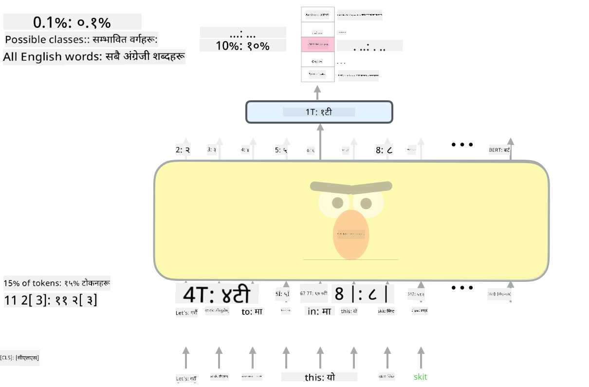

<!--
CO_OP_TRANSLATOR_METADATA:
{
  "original_hash": "7e617f0b8de85a43957a853aba09bfeb",
  "translation_date": "2025-08-26T08:37:07+00:00",
  "source_file": "lessons/5-NLP/18-Transformers/README.md",
  "language_code": "ne"
}
-->
# ध्यान मेकानिज्म र ट्रान्सफर्मरहरू

## [पाठ अघि क्विज](https://ff-quizzes.netlify.app/en/ai/quiz/35)

NLP क्षेत्रमा सबैभन्दा महत्त्वपूर्ण समस्याहरू मध्ये एक हो **मेसिन अनुवाद**, जुन Google Translate जस्ता उपकरणहरूको आधारभूत कार्य हो। यस खण्डमा, हामी मेसिन अनुवादमा केन्द्रित हुनेछौं, वा सामान्य रूपमा, कुनै पनि *सिक्वेन्स-टु-सिक्वेन्स* कार्यमा (जसलाई **वाक्य ट्रान्सडक्शन** पनि भनिन्छ)।

RNNs प्रयोग गर्दा, सिक्वेन्स-टु-सिक्वेन्स दुई पुनरावर्ती नेटवर्कहरूद्वारा कार्यान्वयन गरिन्छ, जहाँ एउटा नेटवर्क, **एन्कोडर**, इनपुट सिक्वेन्सलाई लुकाइएको अवस्थामा संकुचित गर्छ, जबकि अर्को नेटवर्क, **डिकोडर**, यस लुकाइएको अवस्थालाई अनुवादित परिणाममा अनरोल गर्छ। यस दृष्टिकोणमा केही समस्याहरू छन्:

* एन्कोडर नेटवर्कको अन्तिम अवस्थाले वाक्यको सुरुवात सम्झन गाह्रो हुन्छ, जसले लामो वाक्यहरूको लागि मोडेलको गुणस्तर कमजोर बनाउँछ।
* सिक्वेन्सका सबै शब्दहरूले नतिजामा समान प्रभाव पार्छ। तर वास्तविकतामा, इनपुट सिक्वेन्सका विशिष्ट शब्दहरूले अन्य शब्दहरूको तुलनामा क्रमिक आउटपुटमा बढी प्रभाव पार्छ।

**ध्यान मेकानिज्महरू** प्रत्येक इनपुट भेक्टरको सन्दर्भात्मक प्रभावलाई RNN को प्रत्येक आउटपुट भविष्यवाणीमा तौल दिने माध्यम प्रदान गर्छ। यसलाई कार्यान्वयन गर्ने तरिका भनेको इनपुट RNN र आउटपुट RNN का बीचमा छोटो मार्गहरू सिर्जना गर्नु हो। यस प्रकार, आउटपुट प्रतीक yt उत्पन्न गर्दा, हामी सबै इनपुट लुकाइएको अवस्थाहरू hi लाई विभिन्न तौल गुणांकहरू αt,i सहित विचार गर्नेछौं।

> [Bahdanau et al., 2015](https://arxiv.org/pdf/1409.0473.pdf) मा एडिटिभ ध्यान मेकानिज्मसहितको एन्कोडर-डिकोडर मोडेल, [यो ब्लग पोस्ट](https://lilianweng.github.io/lil-log/2018/06/24/attention-attention.html) बाट उद्धृत।

ध्यान म्याट्रिक्स {αi,j} ले इनपुट शब्दहरूले आउटपुट सिक्वेन्सको कुनै शब्दको उत्पन्नमा खेल्ने डिग्रीलाई प्रतिनिधित्व गर्नेछ। तल यस्तो म्याट्रिक्सको उदाहरण छ:

> [Bahdanau et al., 2015](https://arxiv.org/pdf/1409.0473.pdf) बाट चित्र (Fig.3)

ध्यान मेकानिज्महरू NLP मा हालको वा निकट वर्तमान अवस्था-को-कला मोडेलहरूको लागि जिम्मेवार छन्। ध्यान थप्दा मोडेल प्यारामिटरहरूको संख्या धेरै बढ्छ, जसले RNNs सँग स्केलिङ समस्याहरू निम्त्यायो। RNNs को स्केलिङको मुख्य बाधा भनेको मोडेलहरूको पुनरावर्ती प्रकृतिले प्रशिक्षणलाई ब्याच र समानान्तर बनाउन चुनौतीपूर्ण बनाउँछ। RNN मा सिक्वेन्सको प्रत्येक तत्वलाई क्रमिक रूपमा प्रक्रिया गर्न आवश्यक हुन्छ, जसले गर्दा यसलाई सजिलै समानान्तर बनाउन सकिँदैन।

> [Google's Blog](https://research.googleblog.com/2016/09/a-neural-network-for-machine.html) बाट चित्र।

ध्यान मेकानिज्महरूको अपनत्वले यो बाधासँग मिलेर आज हामीले चिनेका र प्रयोग गर्ने BERT देखि Open-GPT3 जस्ता अवस्था-को-कला ट्रान्सफर्मर मोडेलहरूको सिर्जना गर्‍यो।

## ट्रान्सफर्मर मोडेलहरू

ट्रान्सफर्मरहरूको पछाडि मुख्य विचारहरू मध्ये एक हो RNNs को क्रमिक प्रकृतिलाई टार्न र प्रशिक्षणको क्रममा समानान्तर बनाउन सकिने मोडेल सिर्जना गर्नु। यो दुई विचारहरू कार्यान्वयन गरेर प्राप्त गरिन्छ:

* पोजिसनल इन्कोडिङ
* RNNs (वा CNNs) को सट्टा ढाँचाहरू कब्जा गर्न सेल्फ-अटेंशन मेकानिज्म प्रयोग गर्नु (त्यसैले ट्रान्सफर्मरलाई परिचय गराउने पेपरलाई *[Attention is all you need](https://arxiv.org/abs/1706.03762)* भनिएको छ)

### पोजिसनल इन्कोडिङ/एम्बेडिङ

पोजिसनल इन्कोडिङको विचार निम्न छ।  
1. RNNs प्रयोग गर्दा, टोकनहरूको सापेक्ष स्थिति चरणहरूको संख्याले प्रतिनिधित्व गरिन्छ, र यसलाई स्पष्ट रूपमा प्रतिनिधित्व गर्न आवश्यक छैन।  
2. तर, ध्यानमा स्विच गरेपछि, हामीलाई सिक्वेन्सभित्र टोकनहरूको सापेक्ष स्थिति थाहा हुन आवश्यक छ।  
3. पोजिसनल इन्कोडिङ प्राप्त गर्न, हामी टोकनहरूको सिक्वेन्सलाई सिक्वेन्सभित्र टोकन पोजिसनहरूको सिक्वेन्ससँग (जस्तै, 0,1, ...) बढाउँछौं।  
4. त्यसपछि हामी टोकन पोजिसनलाई टोकन एम्बेडिङ भेक्टरसँग मिसाउँछौं। पोजिसन (इन्टिजर) लाई भेक्टरमा रूपान्तरण गर्न, हामी विभिन्न दृष्टिकोणहरू प्रयोग गर्न सक्छौं:

* टोकन एम्बेडिङ जस्तै ट्रेन योग्य एम्बेडिङ। यो यहाँ हामीले विचार गर्ने दृष्टिकोण हो। हामी टोकनहरू र तिनीहरूको पोजिसनहरूमा एम्बेडिङ तहहरू लागू गर्छौं, जसले समान आयामका एम्बेडिङ भेक्टरहरू उत्पादन गर्छ, जुन हामी एकसाथ थप्छौं।  
* मूल पेपरमा प्रस्ताव गरिएको स्थिर पोजिसन इन्कोडिङ फङ्सन।  

> लेखकद्वारा चित्र।

पोजिसनल एम्बेडिङको परिणामले मूल टोकन र यसको सिक्वेन्सभित्रको पोजिसनलाई एम्बेड गर्छ।

### मल्टी-हेड सेल्फ-अटेंशन

अब, हामीलाई हाम्रो सिक्वेन्सभित्र केही ढाँचाहरू कब्जा गर्न आवश्यक छ। यो गर्न, ट्रान्सफर्मरहरूले **सेल्फ-अटेंशन** मेकानिज्म प्रयोग गर्छन्, जुन इनपुट र आउटपुटको रूपमा समान सिक्वेन्समा लागू गरिएको ध्यान हो। सेल्फ-अटेंशन लागू गर्दा हामीलाई वाक्यभित्रको **सन्दर्भ** विचार गर्न अनुमति दिन्छ, र कुन शब्दहरू परस्पर सम्बन्धित छन् हेर्न अनुमति दिन्छ। उदाहरणका लागि, यसले *it* जस्ता कोरिफरेन्सहरूद्वारा सन्दर्भित शब्दहरू हेर्न अनुमति दिन्छ, र सन्दर्भलाई विचारमा लिन्छ:

> [Google Blog](https://research.googleblog.com/2017/08/transformer-novel-neural-network.html) बाट चित्र।

ट्रान्सफर्मरहरूमा, हामी **मल्टी-हेड अटेंशन** प्रयोग गर्छौं ताकि नेटवर्कलाई विभिन्न प्रकारका निर्भरता कब्जा गर्ने शक्ति दिन सकियोस्, जस्तै लामो-अवधि बनाम छोटो-अवधि शब्द सम्बन्ध, कोरिफरेन्स बनाम अन्य केही, आदि।

[TensorFlow Notebook](../../../../../lessons/5-NLP/18-Transformers/TransformersTF.ipynb) मा ट्रान्सफर्मर तहहरूको कार्यान्वयनको थप विवरणहरू छन्।

### एन्कोडर-डिकोडर ध्यान

ट्रान्सफर्मरहरूमा, ध्यान दुई स्थानमा प्रयोग गरिन्छ:

* इनपुट पाठभित्र ढाँचाहरू कब्जा गर्न सेल्फ-अटेंशन प्रयोग गर्न।  
* सिक्वेन्स अनुवाद गर्न - यो एन्कोडर र डिकोडर बीचको ध्यान तह हो।  

एन्कोडर-डिकोडर ध्यान RNNs मा प्रयोग गरिएको ध्यान मेकानिज्मसँग धेरै समान छ, जसको वर्णन यस खण्डको सुरुवातमा गरिएको छ। यो एनिमेटेड डायग्रामले एन्कोडर-डिकोडर ध्यानको भूमिका व्याख्या गर्छ।

किनभने प्रत्येक इनपुट पोजिसन स्वतन्त्र रूपमा प्रत्येक आउटपुट पोजिसनमा म्याप गरिन्छ, ट्रान्सफर्मरहरूले RNNs भन्दा राम्रो समानान्तर बनाउन सक्छ, जसले धेरै ठूलो र अभिव्यक्तिपूर्ण भाषा मोडेलहरू सक्षम बनाउँछ। प्रत्येक ध्यान हेडले शब्दहरू बीचको सम्बन्धहरू सिक्न प्रयोग गर्न सकिन्छ, जसले डाउनस्ट्रीम प्राकृतिक भाषा प्रशोधन कार्यहरू सुधार गर्छ।

## BERT

**BERT** (Bidirectional Encoder Representations from Transformers) एक धेरै ठूलो बहु तह ट्रान्सफर्मर नेटवर्क हो जसमा *BERT-base* को लागि 12 तहहरू छन्, र *BERT-large* को लागि 24। मोडेललाई पहिलो पटक ठूलो पाठ डाटाको कर्पस (WikiPedia + किताबहरू) मा असुपरभाइज्ड प्रशिक्षण (वाक्यमा मास्क गरिएको शब्दहरूको भविष्यवाणी गर्दै) प्रयोग गरेर प्रि-ट्रेन गरिन्छ। प्रि-ट्रेनिङको क्रममा मोडेलले भाषा बुझाइको महत्त्वपूर्ण स्तरहरू अवशोषित गर्छ, जसलाई अन्य डाटासेटहरूसँग फाइन ट्युनिङ प्रयोग गरेर लाभ उठाउन सकिन्छ। यस प्रक्रियालाई **ट्रान्सफर लर्निङ** भनिन्छ।

> [स्रोत](http://jalammar.github.io/illustrated-bert/)

## ✍️ अभ्यासहरू: ट्रान्सफर्मरहरू

तपाईंको सिकाइलाई निम्न नोटबुकहरूमा जारी राख्नुहोस्:

* [PyTorch मा ट्रान्सफर्मरहरू](../../../../../lessons/5-NLP/18-Transformers/TransformersPyTorch.ipynb)
* [TensorFlow मा ट्रान्सफर्मरहरू](../../../../../lessons/5-NLP/18-Transformers/TransformersTF.ipynb)

## निष्कर्ष

यस पाठमा तपाईंले ट्रान्सफर्मरहरू र ध्यान मेकानिज्महरूबारे सिक्नुभयो, NLP टूलबक्सका सबै आवश्यक उपकरणहरू। ट्रान्सफर्मर आर्किटेक्चरका धेरै भेरिएसनहरू छन्, जस्तै BERT, DistilBERT, BigBird, OpenGPT3 र अन्य, जसलाई फाइन ट्युन गर्न सकिन्छ। [HuggingFace प्याकेज](https://github.com/huggingface/) ले PyTorch र TensorFlow दुवैसँग धेरै आर्किटेक्चरहरू प्रशिक्षणको लागि रिपोजिटरी प्रदान गर्छ।

## 🚀 चुनौती

## [पाठ पछि क्विज](https://ff-quizzes.netlify.app/en/ai/quiz/36)

## समीक्षा र आत्म अध्ययन

* [ब्लग पोस्ट](https://mchromiak.github.io/articles/2017/Sep/12/Transformer-Attention-is-all-you-need/), ट्रान्सफर्मरहरूमा क्लासिकल [Attention is all you need](https://arxiv.org/abs/1706.03762) पेपरको व्याख्या गर्दै।  
* [ब्लग पोस्टहरूको श्रृंखला](https://towardsdatascience.com/transformers-explained-visually-part-1-overview-of-functionality-95a6dd460452) ट्रान्सफर्मरहरूमा, आर्किटेक्चरलाई विस्तारमा व्याख्या गर्दै।  

## [असाइनमेन्ट](assignment.md)

**अस्वीकरण**:  
यो दस्तावेज़ AI अनुवाद सेवा [Co-op Translator](https://github.com/Azure/co-op-translator) प्रयोग गरी अनुवाद गरिएको हो। हामी यथासम्भव शुद्धताको प्रयास गर्छौं, तर कृपया ध्यान दिनुहोस् कि स्वचालित अनुवादमा त्रुटिहरू वा अशुद्धताहरू हुन सक्छन्। यसको मूल भाषामा रहेको मूल दस्तावेज़लाई आधिकारिक स्रोत मानिनुपर्छ। महत्वपूर्ण जानकारीका लागि, व्यावसायिक मानव अनुवाद सिफारिस गरिन्छ। यस अनुवादको प्रयोगबाट उत्पन्न हुने कुनै पनि गलतफहमी वा गलत व्याख्याका लागि हामी जिम्मेवार हुने छैनौं।