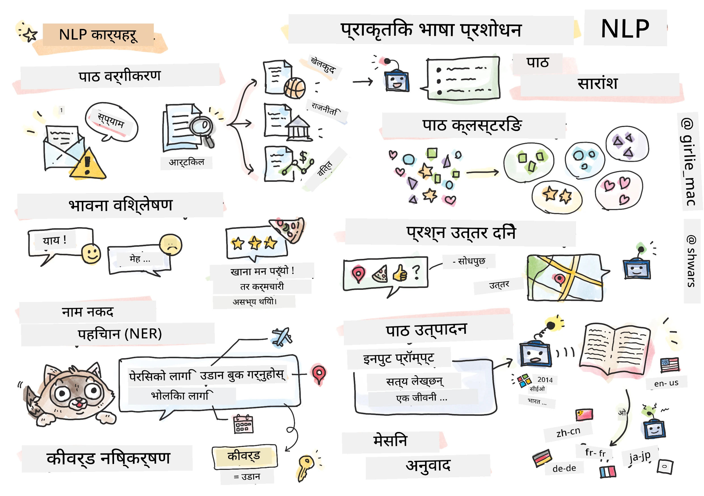

# प्राकृतिक भाषा प्रसंस्करण



यस खण्डमा, हामी प्राकृतिक भाषा प्रसंस्करण (NLP) सम्बन्धित कार्यहरू सम्हाल्न न्यूरल नेटवर्कहरू प्रयोग गर्नेमा केन्द्रित हुने छौं। त्यहाँ धेरै NLP समस्याहरू छन् जुन हामी कम्प्युटरहरूले समाधान गर्न सक्षम हुन चाहन्छौं:

* **पाठ वर्गीकरण** पाठ अनुक्रमहरू सम्बन्धित एक सामान्य वर्गीकरण समस्या हो। उदाहरणहरूको रूपमा ई-मेल सन्देशलाई स्प्याम विरुद्ध नन-स्प्यामको रूपमा वर्गीकरण गर्ने, वा लेखहरूलाई खेलकुद, व्यवसाय, राजनीति आदि वर्गहरूमा वर्गीकरण गर्ने समावेश छ। साथै, चाट बोटहरू विकास गर्दा, हामी प्रायः बुझ्न आवश्यक हुन्छ कि प्रयोगकर्ताले के भन्न चाहे - यस अवस्थामा हामी **इच्छा वर्गीकरण**सँग व्यवहार गर्दैछौं। प्रायः, इच्छा वर्गीकरणमा हामीलाई धेरै वर्गहरूबाट डिल गर्नुपर्छ।
* **भाव्यता विश्लेषण** एक सामान्य रिग्रेसन समस्या हो, जहाँ हामीले वाक्यको अर्थ कत्तिको सकारात्मक/नकारात्मक छ भनेर एक संख्या (भाव्यता) दिनुपर्छ। भाव्यता विश्लेषणको एक उन्नत संस्करण हो **पक्ष-आधारित भाव्यता विश्लेषण** (ABSA), जहाँ हामी भाव्यता पुरा वाक्यमा होइन, तर त्यसका विभिन्न भागहरूमा (पक्षहरू) दिन्छौं, जस्तै *यस रेस्टुरेन्टमा, मलाई खाना मन पर्यो, तर वातावरण भयानक थियो*।
* **नामित इकाई पहिचान** (NER) भनेको पाठबाट निश्चित इकाइहरू निकाल्ने समस्या हो। उदाहरणका लागि, हामीले बुझ्न आवश्यक पर्न सक्छ कि वाक्यांश *म भोलि पेरिस जानु पर्छ* मा शब्द *भोलि* मिति (DATE) लाई जनाउँछ, र *पेरिस* स्थान (LOCATION) हो।  
* **मुख्यशब्द निकाल्ने** NER जस्तै छ, तर हामीलाई स्वचालित रूपमा वाक्यको अर्थसँग सम्बन्धित महत्वपूर्ण शब्दहरू निकाल्नुपर्छ, विशिष्ट इकाई प्रकारहरूका लागि पूर्व प्रशिक्षण बिना।
* **पाठ क्लस्टरिङ** तब उपयोगी हुन्छ जब हामी समान वाक्यहरूलाई समूहीकरण गर्न चाहन्छौं, उदाहरणका लागि प्राविधिक समर्थन कुराकानीहरूमा समान अनुरोधहरू।
* **प्रश्न उत्तर दिने** भनेको मोडेलले विशेष प्रश्नको उत्तर दिन सक्ने क्षमता हो। मोडेलले एउटा पाठ अंश र प्रश्न इनपुटको रूपमा प्राप्त गर्छ, र त्यस प्रश्नको जवाफ भएको ठाँउ पाठमा देखाउनुपर्छ (वा कहिलेकाहीँ, उत्तरको पाठ सिर्जना गर्नुपर्छ)।
* **पाठ सिर्जना** भनेको मोडेलले नयाँ पाठ सिर्जना गर्ने क्षमता हो। यसलाई वर्गीकरण कार्यको रूपमा हेरिन्छ जुन कुनै *पाठ प्रॉम्प्ट* को आधारमा अर्को अक्षर/शब्दको भविष्यवाणी गर्छ। उन्नत पाठ सिर्जना मोडेलहरू, जस्तै GPT-3, वर्गीकरण जस्ता अन्य NLP कार्यहरू समाधान गर्न सक्षम छन् जसलाई [प्रॉम्प्ट प्रोग्रामिङ](https://towardsdatascience.com/software-3-0-how-prompting-will-change-the-rules-of-the-game-a982fbfe1e0) वा [प्रॉम्प्ट इञ्जिनियरिङ](https://medium.com/swlh/openai-gpt-3-and-prompt-engineering-dcdc2c5fcd29) भनिन्छ।
* **पाठ सारांशकरण** त्यो प्रविधि हो जब हामी कम्प्युटरलाई लामो पाठ "पढ्न" र केही वाक्यहरूमा सारांश गर्न चाहन्छौं।
* **मेशिन अनुवाद** एक भाषाको पाठ बुझ्ने र अर्को भाषामा पाठ सिर्जना गर्ने संयोजनको रूपमा हेरिन सक्छ।

आरम्भमा, अधिकांश NLP कार्यहरू परम्परागत विधिहरू जस्तै व्याकरणहरू प्रयोग गरेर समाधान गरिन्थ्यो। उदाहरणका लागि, मेशिन अनुवादमा पार्सरहरूले सुरुको वाक्यलाई व्याकरण ट्रीमा रूपान्तरण गर्थे, त्यसपछि अर्थ प्रतिनिधित्व गर्न उच्च तहको सैमेन्टिक संरचनाहरू निकालिन्थे, र उक्त अर्थ र लक्ष्य भाषाको व्याकरण आधारमा परिणाम सिर्जना गरिन्थ्यो। आजकल, धेरै NLP कार्यहरू न्यूरल नेटवर्कहरू प्रयोग गरेर प्रभावकारी रूपमा समाधान गरिन्छन्।

> धेरै क्लासिक NLP विधिहरू [Natural Language Processing Toolkit (NLTK)](https://www.nltk.org) Python पुस्तकालयमा कार्यान्वयन गरिएको छ। त्यहाँ एक उत्कृष्ट [NLTK पुस्तक](https://www.nltk.org/book/) अनलाइन उपलब्ध छ जसले विभिन्न NLP कार्यहरू कसरी NLTK प्रयोग गरेर समाधान गर्न सकिन्छ देखाउँछ।

हाम्रो कोर्समा, हामी प्रायः NLP का लागि न्यूरल नेटवर्कहरू प्रयोग गर्न केन्द्रित हुने छौं, र आवश्यक परेमा NLTK प्रयोग गर्ने छौं।

हामीले पहिले नै न्यूरल नेटवर्कहरू प्रयोग गरी तालिकागत डेटा र छविहरूमा काम गर्ने कुरा सिकिसकेका छौं। ती प्रकारका डेटाहरू र पाठबीच मुख्य फरक भनेको पाठ एक चर लम्बाइको अनुक्रम हो, जबकि छविहरूमा इनपुट आकार पहिले नै थाहा हुन्छ। कन्भोलुसनल नेटवर्कहरूले इनपुट डेटाबाट ढाँचाहरू निकाल्न सक्छन्, तर पाठमा ढाँचाहरू जटिल हुन्छन्। उदाहरणका लागि, नकारात्मकता विषयबाट फरक हुनु धेरै शब्दहरूमा स्वैच्छिक हुन सक्छ (जस्तै *म सुन्तलाहरु मन पर्दैन*, बनाम *म ती ठूला रङीन स्वादिला सुन्तलाहरु मन पर्दैन*), र त्यो अझै पनि एउटै ढाँचाको रूपमा व्याख्या हुनुपर्छ। त्यसैले, भाषा सम्हाल्न हामीले नयाँ न्यूरल नेटवर्क प्रकारहरू जस्तै *पुनरावृत्ति नेटवर्क* र *ट्रान्सफर्मरहरू* परिचय गराउनुपर्छ।

## पुस्तकालयहरू स्थापना गर्नुहोस्

यदि तपाईं यो कोर्स चलाउन स्थानीय Python स्थापना प्रयोग गर्दै हुनुहुन्छ भने, तपाईंले निम्न आदेशहरू प्रयोग गरेर NLP का लागि आवश्यक सबै पुस्तकालयहरू स्थापना गर्नु पर्ने हुन सक्छ:

**PyTorch का लागि**
```bash
pip install -r requirements-pytorch.txt
```
**TensorFlow का लागि**
```bash
pip install -r requirements-tf.txt
```

> तपाईं [Microsoft Learn](https://docs.microsoft.com/learn/modules/intro-natural-language-processing-tensorflow/?WT.mc_id=academic-77998-cacaste) मा TensorFlow संग NLP प्रयास गर्न सक्नुहुन्छ

## GPU चेतावनी

यस खण्डमा, केही उदाहरणहरूमा हामी ठूलो मोडेलहरू तालिम गर्नेछौं।
* **GPU-सक्षम कम्प्युटर प्रयोग गर्नुहोस्**: ठूलो मोडेलहरूसँग काम गर्दा पर्खाइ कम गर्न, आफ्नो नोटबुकहरू GPU-सक्षम कम्प्युटरमा चलाउनु बुद्धिमानी हुन्छ।
* **GPU स्मृति सीमाहरू**: GPU मा चलाउँदा GPU स्मृति सकिन सक्ने स्थिति आउन सक्छ, विशेष गरी ठूलो मोडेल तालिम गर्दा।
* **GPU स्मृति खपत**: तालिम अवधिमा GPU स्मृतिको खपत विभिन्न कारकहरूमा निर्भर गर्दछ, जस्तै मिनिब्याच आकार।
* **मिनिब्याच आकार न्यूनतम गर्नुहोस्**: यदि GPU स्मृति समस्या आएमा, आफ्नो कोडमा मिनिब्याच आकार घटाउने विचार गर्न सक्नुहुन्छ।
* **TensorFlow GPU स्मृति रिहाई**: TensorFlow का पुराना संस्करणहरूले एउटै Python कर्नेलमा धेरै मोडेल तालिम गर्दा GPU स्मृति सही रूपमा रिहा नहुन सक्छ। GPU स्मृति उपयोग प्रभावकारी रूपमा व्यवस्थापन गर्न TensorFlow लाई आवश्यक पर्दा मात्र GPU स्मृति बाँड्न कन्फिगर गर्न सकिन्छ।
* **कोड समावेश गर्नुहोस्**: TensorFlow लाई आवश्यक पर्दा मात्र GPU स्मृति विस्तार गर्न सेट गर्न तलको कोड आफ्नो नोटबुकहरूमा राख्नुहोस्:

```python
physical_devices = tf.config.list_physical_devices('GPU') 
if len(physical_devices)>0:
    tf.config.experimental.set_memory_growth(physical_devices[0], True) 
```

यदि तपाईं क्लासिक ML दृष्टिकोणबाट NLP सिक्न इच्छुक हुनुहुन्छ भने, [यस पाठहरूको श्रृंखला](https://github.com/microsoft/ML-For-Beginners/tree/main/6-NLP) भ्रमण गर्नुहोस्

## यस खण्डमा
यस खण्डमा हामी सिक्नेछौं:

* [टेक्स्टलाई टेन्सरको रूपमा प्रतिनिधित्व गर्दै](13-TextRep/README.md)
* [शब्द एम्बेडिङहरू](14-Embeddings/README.md)
* [भाषा मोडेलिङ](15-LanguageModeling/README.md)
* [पुनरावृत्त न्यूरल नेटवर्कहरू](16-RNN/README.md)
* [जनरेटिभ नेटवर्कहरू](17-GenerativeNetworks/README.md)
* [ट्रान्सफर्मरहरू](18-Transformers/README.md)

---

<!-- CO-OP TRANSLATOR DISCLAIMER START -->
**अस्वीकरण**:
यो दस्तावेज़ AI अनुवाद सेवा [Co-op Translator](https://github.com/Azure/co-op-translator) प्रयोग गरेर अनुवाद गरिएको हो। हामी सही हुन प्रयास गर्छौं, तर कृपया जानकार हुनुस् कि स्वचालित अनुवादमा त्रुटिहरू वा अशुद्धताहरू हुन सक्छन्। मूल दस्तावेज़ यसको मूल भाषामा आधिकारिक स्रोत मानिनुपर्छ। महत्वपूर्ण जानकारीका लागि व्यावसायिक मानव अनुवाद सिफारिस गरिन्छ। यस अनुवादको प्रयोगबाट उत्पन्न कुनै पनि गलत बुझाइ वा त्रुटिको लागि हामी जिम्मेवार छैनौं।
<!-- CO-OP TRANSLATOR DISCLAIMER END -->