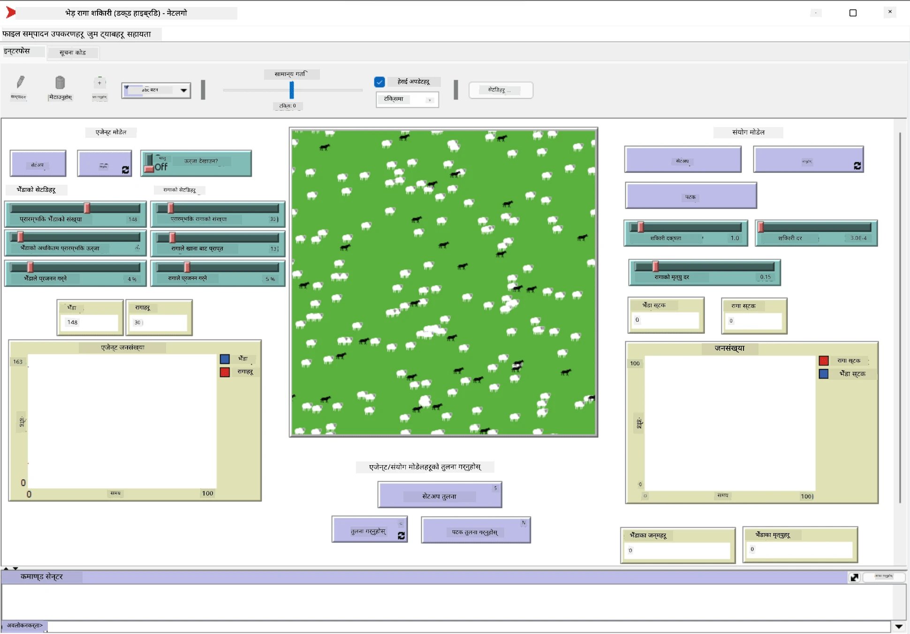

# बहु-एजेन्ट प्रणालीहरू

बुद्धिमत्ता प्राप्त गर्ने सम्भावित तरिकाहरू मध्ये एक **उत्पन्न** (वा **सिनर्जेटिक**) दृष्टिकोण हो, जुन धेरै सरल एजेन्टहरूको संयुक्त व्यवहारले प्रणालीको समग्रमा जटिल (वा बुद्धिमान) व्यवहार उत्पन्न गर्न सक्छ भन्ने तथ्यमा आधारित छ। सैद्धान्तिक रूपमा, यो [सामूहिक बुद्धिमत्ता](https://en.wikipedia.org/wiki/Collective_intelligence), [उत्पन्नवाद](https://en.wikipedia.org/wiki/Global_brain) र [विकासात्मक साइबरनेटिक्स](https://en.wikipedia.org/wiki/Global_brain) का सिद्धान्तहरूमा आधारित छ, जसले उच्च-स्तरीय प्रणालीहरूले तल्लो-स्तरीय प्रणालीहरूलाई सही तरिकाले संयोजन गर्दा थप मूल्य प्राप्त गर्छन् भन्ने कुरा बताउँछ (*मेटासिस्टम ट्रान्जिसनको सिद्धान्त* भनिन्छ)।

## [पूर्व-व्याख्यान क्विज](https://ff-quizzes.netlify.app/en/ai/quiz/45)

**बहु-एजेन्ट प्रणालीहरू** को दिशा १९९० को दशकमा इन्टरनेट र वितरित प्रणालीहरूको वृद्धिको प्रतिक्रियाको रूपमा एआईमा देखा परेको हो। [Artificial Intelligence: A Modern Approach](https://en.wikipedia.org/wiki/Artificial_Intelligence:_A_Modern_Approach) जस्ता क्लासिकल एआई पाठ्यपुस्तकले बहु-एजेन्ट प्रणालीहरूको दृष्टिकोणबाट क्लासिकल एआईलाई हेर्ने दृष्टिकोणमा केन्द्रित छ।

बहु-एजेन्ट दृष्टिकोणको केन्द्रमा **एजेन्ट** को धारणा छ - एउटा इकाई जसले कुनै **पर्यावरण** मा बस्छ, जसलाई यो बुझ्न र कार्य गर्न सक्छ। यो धेरै व्यापक परिभाषा हो, र एजेन्टहरूको धेरै प्रकार र वर्गीकरणहरू हुन सक्छ:

* तर्क गर्ने क्षमताको आधारमा:
   - **प्रतिक्रियात्मक** एजेन्टहरूले सामान्यतया सरल अनुरोध-प्रतिक्रिया प्रकारको व्यवहार देखाउँछन्।
   - **विचारशील** एजेन्टहरूले केही प्रकारको तार्किक तर्क र/वा योजना क्षमताहरू प्रयोग गर्छन्।
* एजेन्टले आफ्नो कोड कहाँ कार्यान्वयन गर्छ भन्ने आधारमा:
   - **स्थिर** एजेन्टहरू समर्पित नेटवर्क नोडमा काम गर्छन्।
   - **मोबाइल** एजेन्टहरूले आफ्नो कोड नेटवर्क नोडहरू बीच सार्न सक्छन्।
* व्यवहारको आधारमा:
   - **निष्क्रिय एजेन्टहरू** को विशिष्ट लक्ष्यहरू हुँदैन। यस्ता एजेन्टहरूले बाह्य उत्तेजनाहरूमा प्रतिक्रिया दिन सक्छन्, तर आफैंले कुनै कार्यहरू सुरु गर्दैनन्।
   - **सक्रिय एजेन्टहरू** केहि लक्ष्यहरू हुन्छन् जसलाई तिनीहरूले पछ्याउँछन्।
   - **संज्ञानात्मक एजेन्टहरू** जटिल योजना र तर्क समावेश गर्छन्।

आजकल बहु-एजेन्ट प्रणालीहरू धेरै अनुप्रयोगहरूमा प्रयोग गरिन्छ:

* खेलहरूमा, धेरै गैर-खेलाडी पात्रहरूले केही प्रकारको एआई प्रयोग गर्छन्, र तिनीहरूलाई बुद्धिमान एजेन्ट मान्न सकिन्छ।
* भिडियो उत्पादनमा, भीडहरू समावेश गर्ने जटिल ३डी दृश्यहरू रेंडर गर्न सामान्यतया बहु-एजेन्ट सिमुलेशन प्रयोग गरिन्छ।
* प्रणालीहरूको मोडेलिङमा, बहु-एजेन्ट दृष्टिकोण जटिल मोडेलको व्यवहारलाई सिमुलेट गर्न प्रयोग गरिन्छ। उदाहरणका लागि, बहु-एजेन्ट दृष्टिकोणले COVID-19 रोगको विश्वव्यापी फैलावटको भविष्यवाणी गर्न सफलतापूर्वक प्रयोग गरिएको छ। यस्तै दृष्टिकोणले शहरको ट्राफिकलाई मोडेल गर्न प्रयोग गर्न सकिन्छ, र ट्राफिक नियमहरूमा परिवर्तनहरूमा यसको प्रतिक्रिया हेर्न सकिन्छ।
* जटिल स्वचालन प्रणालीहरूमा, प्रत्येक उपकरणले स्वतन्त्र एजेन्टको रूपमा कार्य गर्न सक्छ, जसले सम्पूर्ण प्रणालीलाई कम मोनोलिथिक र अधिक मजबुत बनाउँछ।

हामी बहु-एजेन्ट प्रणालीहरूमा गहिरो जान धेरै समय खर्च गर्ने छैनौं, तर **बहु-एजेन्ट मोडेलिङ** को एक उदाहरण विचार गर्नेछौं।

## NetLogo

[NetLogo](https://ccl.northwestern.edu/netlogo/) एक बहु-एजेन्ट मोडेलिङ वातावरण हो जुन [Logo](https://en.wikipedia.org/wiki/Logo_(programming_language)) प्रोग्रामिङ भाषाको परिमार्जित संस्करणमा आधारित छ। यो भाषा बच्चाहरूलाई प्रोग्रामिङ अवधारणाहरू सिकाउनको लागि विकसित गरिएको थियो, र यसले तपाईंलाई **टर्टल** नामक एजेन्टलाई नियन्त्रण गर्न अनुमति दिन्छ, जसले पछाडि ट्रेस छोड्दै सर्न सक्छ। यसले जटिल ज्यामितीय आकृतिहरू सिर्जना गर्न अनुमति दिन्छ, जुन एजेन्टको व्यवहार बुझ्नको लागि धेरै दृश्यात्मक तरिका हो।

NetLogo मा, हामी `create-turtles` कमाण्ड प्रयोग गरेर धेरै टर्टलहरू सिर्जना गर्न सक्छौं। त्यसपछि हामी सबै टर्टलहरूलाई केही कार्यहरू गर्न आदेश दिन सक्छौं (तलको उदाहरणमा - १० बिन्दु अगाडि बढ्नु):

```
create-turtles 10
ask turtles [
  forward 10
]
```

पक्कै पनि, जब सबै टर्टलहरूले एउटै कुरा गर्छन्, यो रोचक हुँदैन, त्यसैले हामी `ask` समूहहरूलाई आदेश दिन सक्छौं, जस्तै ती टर्टलहरू जो कुनै निश्चित बिन्दुको वरिपरि छन्। हामी `breed [cats cat]` कमाण्ड प्रयोग गरेर विभिन्न *जात* का टर्टलहरू पनि सिर्जना गर्न सक्छौं। यहाँ `cat` जातको नाम हो, र हामीले एकवचन र बहुवचन शब्द दुवै निर्दिष्ट गर्नुपर्छ, किनकि विभिन्न कमाण्डहरूले स्पष्टताको लागि विभिन्न रूपहरू प्रयोग गर्छन्।

> ✅ हामी NetLogo भाषा सिक्नमा जान्दैनौं - यदि तपाईं थप जान्न इच्छुक हुनुहुन्छ भने तपाईं उत्कृष्ट [Beginner's Interactive NetLogo Dictionary](https://ccl.northwestern.edu/netlogo/bind/) स्रोत भ्रमण गर्न सक्नुहुन्छ।

तपाईं NetLogo [डाउनलोड](https://ccl.northwestern.edu/netlogo/download.shtml) गरेर स्थापना गर्न सक्नुहुन्छ।

### मोडेल पुस्तकालय

NetLogo को एक उत्कृष्ट पक्ष यो हो कि यसमा काम गर्ने मोडेलहरूको पुस्तकालय छ जुन तपाईं प्रयास गर्न सक्नुहुन्छ। **File &rightarrow; Models Library** मा जानुहोस्, र तपाईंले मोडेलहरूको धेरै श्रेणीहरू छनोट गर्न सक्नुहुन्छ।


> Dmitry Soshnikov द्वारा मोडेल पुस्तकालयको स्क्रिनशट

तपाईं मोडेलहरू मध्ये एक खोल्न सक्नुहुन्छ, उदाहरणका लागि **Biology &rightarrow; Flocking**।

### मुख्य सिद्धान्तहरू

मोडेल खोलिसकेपछि, तपाईंलाई मुख्य NetLogo स्क्रिनमा लगिन्छ। यहाँ सीमित स्रोतहरू (घाँस) दिइएको भेडा र ब्वाँसोको जनसंख्यालाई वर्णन गर्ने नमूना मोडेल छ।



> Dmitry Soshnikov द्वारा स्क्रिनशट

यस स्क्रिनमा, तपाईं देख्न सक्नुहुन्छ:

* **इन्टरफेस** खण्ड जसमा समावेश छ:
  - मुख्य क्षेत्र, जहाँ सबै एजेन्टहरू बस्छन्
  - विभिन्न नियन्त्रणहरू: बटनहरू, स्लाइडरहरू, आदि।
  - ग्राफहरू जसलाई तपाईं सिमुलेशनको प्यारामिटरहरू प्रदर्शन गर्न प्रयोग गर्न सक्नुहुन्छ
* **कोड** ट्याब जसमा सम्पादक समावेश छ, जहाँ तपाईं NetLogo प्रोग्राम टाइप गर्न सक्नुहुन्छ

अधिकांश अवस्थामा, इन्टरफेसमा **Setup** बटन हुन्छ, जसले सिमुलेशनको अवस्था आरम्भ गर्छ, र **Go** बटन हुन्छ जसले कार्यान्वयन सुरु गर्छ। ती सम्बन्धित ह्यान्डलरहरूद्वारा कोडमा यस प्रकार देखिन्छ:

```
to go [
...
]
```

NetLogo को संसार निम्न वस्तुहरूबाट बनेको छ:

* **एजेन्टहरू** (टर्टलहरू) जसले क्षेत्रभरि सर्न सक्छन् र केही गर्न सक्छन्। तपाईं `ask turtles [...]` वाक्यविन्यास प्रयोग गरेर एजेन्टहरूलाई आदेश दिन सक्नुहुन्छ, र कोष्ठकभित्रको कोड सबै एजेन्टहरूले *टर्टल मोड* मा कार्यान्वयन गर्छन्।
* **प्याचहरू** क्षेत्रका वर्गाकार क्षेत्रहरू हुन्, जहाँ एजेन्टहरू बस्छन्। तपाईं सबै एजेन्टहरूलाई एउटै प्याचमा सन्दर्भ गर्न सक्नुहुन्छ, वा तपाईं प्याचको रंग र केही अन्य गुणहरू परिवर्तन गर्न सक्नुहुन्छ। तपाईं `ask patches` प्रयोग गरेर प्याचहरूलाई केही गर्न आदेश दिन सक्नुहुन्छ।
* **अवलोकनकर्ता** एक अद्वितीय एजेन्ट हो जसले संसारलाई नियन्त्रण गर्छ। सबै बटन ह्यान्डलरहरू *अवलोकनकर्ता मोड* मा कार्यान्वयन हुन्छन्।

> ✅ बहु-एजेन्ट वातावरणको सुन्दरता यो हो कि टर्टल मोड वा प्याच मोडमा चल्ने कोड सबै एजेन्टहरूले समानान्तर रूपमा एकै समयमा कार्यान्वयन गर्छन्। यसरी, थोरै कोड लेखेर र व्यक्तिगत एजेन्टको व्यवहार प्रोग्राम गरेर, तपाईं सिमुलेशन प्रणालीको समग्र जटिल व्यवहार सिर्जना गर्न सक्नुहुन्छ।

### फ्लकिङ

बहु-एजेन्ट व्यवहारको उदाहरणको रूपमा, **[Flocking](https://en.wikipedia.org/wiki/Flocking_(behavior))** विचार गरौं। फ्लकिङ एक जटिल ढाँचा हो जुन चराहरूको झुण्डले उड्ने तरिकासँग धेरै मिल्दोजुल्दो छ। तिनीहरूलाई उडिरहेको हेर्दा तपाईं सोच्न सक्नुहुन्छ कि तिनीहरूले कुनै प्रकारको सामूहिक एल्गोरिदम पछ्याउँछन्, वा तिनीहरूसँग *सामूह

---

