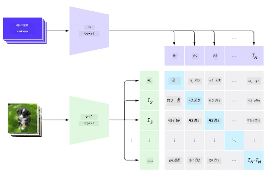
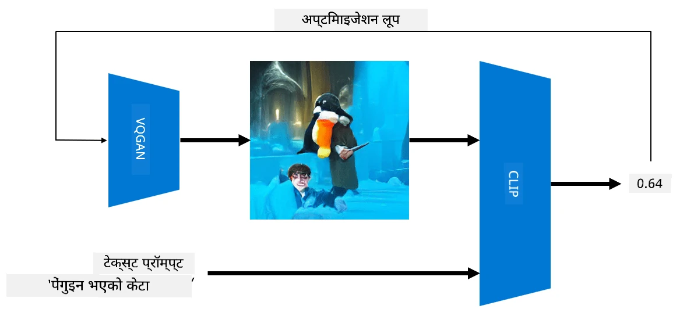
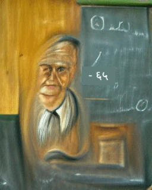

# मल्टी-मोडल नेटवर्कहरू

NLP कार्यहरू समाधान गर्न ट्रान्सफर्मर मोडेलहरूको सफलतापछि, त्यस्तै वा समान आर्किटेक्चरहरू कम्प्युटर भिजन कार्यहरूमा लागू गरिएको छ। भिजन र प्राकृतिक भाषाको क्षमता *जोड्ने* मोडेलहरू निर्माण गर्ने चासो बढ्दै गएको छ। यस्ता प्रयासहरू मध्ये एक OpenAI द्वारा गरिएको थियो, जसलाई CLIP र DALL.E भनिन्छ।

## कन्फ्रास्टिभ इमेज प्रि-ट्रेनिङ (CLIP)

CLIP को मुख्य विचार भनेको टेक्स्ट प्रम्प्टहरूलाई तस्बिरसँग तुलना गर्न र तस्बिरले प्रम्प्टसँग कत्तिको मेल खान्छ भनेर निर्धारण गर्न सक्षम हुनु हो।

> *[यो ब्लग पोस्ट](https://openai.com/blog/clip/) बाट तस्बिर*

मोडेल इन्टरनेटबाट प्राप्त तस्बिरहरू र तिनका क्याप्सनहरूमा प्रशिक्षित गरिएको छ। प्रत्येक ब्याचको लागि, हामी N जोडीहरू (तस्बिर, टेक्स्ट) लिन्छौं, र तिनीहरूलाई केही भेक्टर प्रतिनिधित्वहरूमा रूपान्तरण गर्छौं I, ..., T। 

त्यो प्रतिनिधित्वलाई एक-अर्कासँग मिलाइन्छ। लस फङ्क्सनले एक जोडी (जस्तै I र T) बीचको कोसाइन समानता अधिकतम बनाउन र अन्य सबै जोडीहरू बीचको कोसाइन समानता न्यूनतम बनाउन परिभाषित गरिएको छ। यही कारणले यो दृष्टिकोणलाई **कन्फ्रास्टिभ** भनिन्छ।

CLIP मोडेल/लाइब्रेरी [OpenAI GitHub](https://github.com/openai/CLIP) बाट उपलब्ध छ। यो दृष्टिकोण [यो ब्लग पोस्ट](https://openai.com/blog/clip/) मा वर्णन गरिएको छ, र थप विवरणमा [यो पेपर](https://arxiv.org/pdf/2103.00020.pdf) मा।

मोडेल प्रि-ट्रेन भएपछि, हामी यसलाई तस्बिरहरूको ब्याच र टेक्स्ट प्रम्प्टहरूको ब्याच दिन सक्छौं, र यसले हामीलाई सम्भावनाहरूको टेन्सर फर्काउँछ। CLIP विभिन्न कार्यहरूको लागि प्रयोग गर्न सकिन्छ:

**इमेज क्लासिफिकेशन**

मानौं हामीलाई तस्बिरहरूलाई बिरालो, कुकुर र मानिसहरू बीच वर्गीकरण गर्नुपर्छ। यस अवस्थामा, हामी मोडेललाई तस्बिर र टेक्स्ट प्रम्प्टहरूको श्रृंखला दिन सक्छौं: "*बिरालोको तस्बिर*", "*कुकुरको तस्बिर*", "*मानिसको तस्बिर*"। परिणामस्वरूप 3 सम्भावनाहरूको भेक्टरमा हामीले सबैभन्दा उच्च मान भएको इन्डेक्स चयन गर्नुपर्छ।

> *[यो ब्लग पोस्ट](https://openai.com/blog/clip/) बाट तस्बिर*

**टेक्स्ट-आधारित इमेज खोज**

हामी उल्टो पनि गर्न सक्छौं। यदि हामीसँग तस्बिरहरूको संग्रह छ भने, हामी यो संग्रहलाई मोडेलमा पास गर्न सक्छौं, र टेक्स्ट प्रम्प्ट - यसले हामीलाई दिइएको प्रम्प्टसँग सबैभन्दा मिल्दो तस्बिर दिन्छ।

## ✍️ उदाहरण: [इमेज क्लासिफिकेशन र इमेज खोजको लागि CLIP प्रयोग गर्दै](../../../../../lessons/X-Extras/X1-MultiModal/Clip.ipynb)

CLIP लाई कार्यमा देख्न [Clip.ipynb](../../../../../lessons/X-Extras/X1-MultiModal/Clip.ipynb) नोटबुक खोल्नुहोस्।

## VQGAN+CLIP प्रयोग गरेर तस्बिर निर्माण

CLIP टेक्स्ट प्रम्प्टबाट **तस्बिर निर्माण** को लागि पनि प्रयोग गर्न सकिन्छ। यसलाई गर्नको लागि, हामीलाई **जेनरेटर मोडेल** चाहिन्छ जसले केही भेक्टर इनपुटको आधारमा तस्बिरहरू निर्माण गर्न सक्षम हुनेछ। यस्ता मोडेलहरू मध्ये एकलाई [VQGAN](https://compvis.github.io/taming-transformers/) (भेक्टर-क्वान्टाइज्ड GAN) भनिन्छ।

VQGAN को मुख्य विचारहरू, जसले यसलाई साधारण [GAN](../../4-ComputerVision/10-GANs/README.md) बाट फरक बनाउँछ, निम्न छन्:
* तस्बिर बनाउने सन्दर्भ-समृद्ध दृश्य भागहरूको अनुक्रम उत्पन्न गर्न अटोरेग्रेसिभ ट्रान्सफर्मर आर्किटेक्चरको प्रयोग। ती दृश्य भागहरू [CNN](../../4-ComputerVision/07-ConvNets/README.md) द्वारा सिकाइन्छ।
* उप-तस्बिर डिस्क्रिमिनेटरको प्रयोग, जसले तस्बिरका भागहरू "वास्तविक" वा "नक्कली" हुन् भनेर पत्ता लगाउँछ (पारम्परिक GAN मा "सबै-वा-कुनै पनि होइन" दृष्टिकोणको विपरीत)।

VQGAN को बारेमा थप जान्न [Taming Transformers](https://compvis.github.io/taming-transformers/) वेबसाइटमा जानुहोस्।

VQGAN र पारम्परिक GAN बीचको महत्त्वपूर्ण भिन्नता भनेको पछिल्लोले कुनै पनि इनपुट भेक्टरबाट राम्रो तस्बिर उत्पादन गर्न सक्छ, जबकि VQGAN ले सुसंगत तस्बिर उत्पादन गर्न सक्दैन। त्यसैले, हामीले तस्बिर निर्माण प्रक्रियालाई थप मार्गदर्शन गर्न आवश्यक छ, र त्यो CLIP प्रयोग गरेर गर्न सकिन्छ।

टेक्स्ट प्रम्प्टसँग मेल खाने तस्बिर निर्माण गर्न, हामी केही र्यान्डम इन्कोडिङ भेक्टरबाट सुरु गर्छौं जुन VQGAN मार्फत पास गरिन्छ र तस्बिर उत्पादन गरिन्छ। त्यसपछि CLIP प्रयोग गरेर लस फङ्क्सन उत्पादन गरिन्छ जसले तस्बिर टेक्स्ट प्रम्प्टसँग कत्तिको मेल खान्छ भनेर देखाउँछ। त्यसपछि यो लसलाई न्यूनतम बनाउने लक्ष्य राखिन्छ, ब्याक प्रोपोगेसन प्रयोग गरेर इनपुट भेक्टर प्यारामिटरहरू समायोजन गरिन्छ।

VQGAN+CLIP कार्यान्वयन गर्ने उत्कृष्ट लाइब्रेरी [Pixray](http://github.com/pixray/pixray) हो।

 |   | 
----|----|----
प्रम्प्ट *साहित्यको युवा पुरुष शिक्षकको पुस्तकसहितको नजिकको वाटरकलर पोर्ट्रेट* बाट उत्पन्न तस्बिर | प्रम्प्ट *कम्प्युटर विज्ञानको युवा महिला शिक्षकको कम्प्युटरसहितको नजिकको तेल पोर्ट्रेट* बाट उत्पन्न तस्बिर | प्रम्प्ट *गणितको वृद्ध पुरुष शिक्षकको ब्ल्याकबोर्ड अगाडि नजिकको तेल पोर्ट्रेट* बाट उत्पन्न तस्बिर

> **Artificial Teachers** संग्रहबाट तस्बिरहरू [Dmitry Soshnikov](http://soshnikov.com) द्वारा

## DALL-E
### [DALL-E 1](https://openai.com/research/dall-e)
DALL-E GPT-3 को संस्करण हो जसलाई प्रम्प्टहरूबाट तस्बिरहरू निर्माण गर्न प्रशिक्षित गरिएको छ। यसलाई 12-अर्ब प्यारामिटरहरूसँग प्रशिक्षित गरिएको छ।

CLIP भन्दा फरक, DALL-E ले टेक्स्ट र तस्बिरलाई एकल टोकनहरूको स्ट्रिमको रूपमा प्राप्त गर्दछ। त्यसैले, धेरै प्रम्प्टहरूबाट, तपाईं टेक्स्टको आधारमा तस्बिरहरू निर्माण गर्न सक्नुहुन्छ।

### [DALL-E 2](https://openai.com/dall-e-2)
DALL-E 1 र 2 बीचको मुख्य भिन्नता भनेको यसले थप यथार्थपरक तस्बिरहरू र कला निर्माण गर्दछ।

DALL-E द्वारा तस्बिर निर्माणका उदाहरणहरू:
 |   | 
----|----|----
प्रम्प्ट *साहित्यको युवा पुरुष शिक्षकको पुस्तकसहितको नजिकको वाटरकलर पोर्ट्रेट* बाट उत्पन्न तस्बिर | प्रम्प्ट *कम्प्युटर विज्ञानको युवा महिला शिक्षकको कम्प्युटरसहितको नजिकको तेल पोर्ट्रेट* बाट उत्पन्न तस्बिर | प्रम्प्ट *गणितको वृद्ध पुरुष शिक्षकको ब्ल्याकबोर्ड अगाडि नजिकको तेल पोर्ट्रेट* बाट उत्पन्न तस्बिर

## सन्दर्भहरू

* VQGAN पेपर: [Taming Transformers for High-Resolution Image Synthesis](https://compvis.github.io/taming-transformers/paper/paper.pdf)
* CLIP पेपर: [Learning Transferable Visual Models From Natural Language Supervision](https://arxiv.org/pdf/2103.00020.pdf)

**अस्वीकरण**:  
यो दस्तावेज़ AI अनुवाद सेवा [Co-op Translator](https://github.com/Azure/co-op-translator) प्रयोग गरी अनुवाद गरिएको हो। हामी यथासम्भव सटीकता सुनिश्चित गर्न प्रयास गर्छौं, तर कृपया ध्यान दिनुहोस् कि स्वचालित अनुवादहरूमा त्रुटि वा अशुद्धता हुन सक्छ। यसको मूल भाषामा रहेको मूल दस्तावेजलाई आधिकारिक स्रोत मानिनुपर्छ। महत्त्वपूर्ण जानकारीका लागि, व्यावसायिक मानव अनुवाद सिफारिस गरिन्छ। यस अनुवादको प्रयोगबाट उत्पन्न हुने कुनै पनि गलतफहमी वा गलत व्याख्याका लागि हामी जिम्मेवार हुने छैनौं।