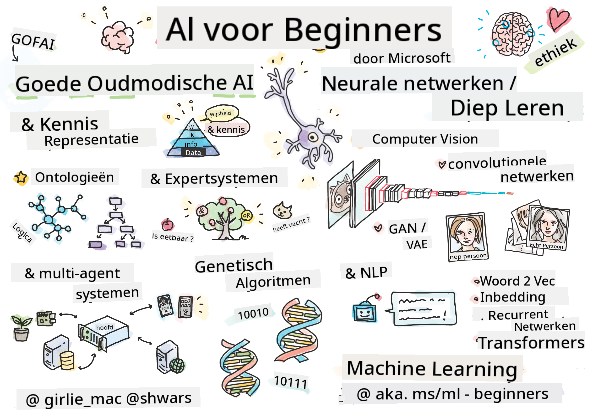

<!--
CO_OP_TRANSLATOR_METADATA:
{
  "original_hash": "14816e97d79b296c87811724f7785923",
  "translation_date": "2026-01-01T12:17:01+00:00",
  "source_file": "README.md",
  "language_code": "nl"
}
-->

# Kunstmatige Intelligentie voor Beginners - Een Curriculum

||
|:---:|
| AI voor Beginners - _Sketchnote door [@girlie_mac](https://twitter.com/girlie_mac)_ |

Verken de wereld van **Kunstmatige Intelligentie** (AI) met ons 12-weekse, 24-les curriculum! Het bevat praktische lessen, quizzen en labs. Het curriculum is geschikt voor beginners en behandelt tools zoals TensorFlow en PyTorch, evenals ethiek in AI

### 🌐 Meertalige ondersteuning

#### Ondersteund via GitHub Action (Geautomatiseerd & Altijd actueel)

<!-- CO-OP TRANSLATOR LANGUAGES TABLE START -->
[Arabisch](../ar/README.md) | [Bengaals](../bn/README.md) | [Bulgaars](../bg/README.md) | [Birmaans (Myanmar)](../my/README.md) | [Chinees (vereenvoudigd)](../zh/README.md) | [Chinees (traditioneel, Hongkong)](../hk/README.md) | [Chinees (traditioneel, Macau)](../mo/README.md) | [Chinees (traditioneel, Taiwan)](../tw/README.md) | [Kroatisch](../hr/README.md) | [Tsjechisch](../cs/README.md) | [Deens](../da/README.md) | [Nederlands](./README.md) | [Ests](../et/README.md) | [Fins](../fi/README.md) | [Frans](../fr/README.md) | [Duits](../de/README.md) | [Grieks](../el/README.md) | [Hebreeuws](../he/README.md) | [Hindi](../hi/README.md) | [Hongaars](../hu/README.md) | [Indonesisch](../id/README.md) | [Italiaans](../it/README.md) | [Japans](../ja/README.md) | [Kannada](../kn/README.md) | [Koreaans](../ko/README.md) | [Litouws](../lt/README.md) | [Maleis](../ms/README.md) | [Malayalam](../ml/README.md) | [Marathi](../mr/README.md) | [Nepalees](../ne/README.md) | [Nigerian Pidgin](../pcm/README.md) | [Noors](../no/README.md) | [Perzisch (Farsi)](../fa/README.md) | [Pools](../pl/README.md) | [Portugees (Brazilië)](../br/README.md) | [Portugees (Portugal)](../pt/README.md) | [Punjabi (Gurmukhi)](../pa/README.md) | [Roemeens](../ro/README.md) | [Russisch](../ru/README.md) | [Servisch (Cyrillisch)](../sr/README.md) | [Slowaaks](../sk/README.md) | [Sloveens](../sl/README.md) | [Spaans](../es/README.md) | [Swahili](../sw/README.md) | [Zweeds](../sv/README.md) | [Tagalog (Filipijns)](../tl/README.md) | [Tamil](../ta/README.md) | [Telugu](../te/README.md) | [Thais](../th/README.md) | [Turks](../tr/README.md) | [Oekraïens](../uk/README.md) | [Urdu](../ur/README.md) | [Vietnamees](../vi/README.md)
<!-- CO-OP TRANSLATOR LANGUAGES TABLE END -->

**Als u extra vertalingen wenst, staan de ondersteunde talen [hier](https://github.com/Azure/co-op-translator/blob/main/getting_started/supported-languages.md) vermeld**

## Doe mee met de community

## Wat je zult leren

**[Mindmap van de cursus](http://soshnikov.com/courses/ai-for-beginners/mindmap.html)**

In dit curriculum leer je:

* Verschillende benaderingen van Kunstmatige Intelligentie, waaronder de "goede oude" symbolische benadering met **Kennisrepresentatie** en redeneren ([GOFAI](https://en.wikipedia.org/wiki/Symbolic_artificial_intelligence)).
* **Neurale netwerken** en **Deep Learning**, die de kern vormen van moderne AI. We illustreren de achterliggende concepten van deze belangrijke onderwerpen met code in twee van de populairste frameworks - [TensorFlow](http://Tensorflow.org) en [PyTorch](http://pytorch.org).
* **Neurale architecturen** voor het werken met afbeeldingen en tekst. We behandelen recente modellen, maar kunnen iets achterlopen op de allernieuwste ontwikkelingen.
* Minder populaire AI-benaderingen, zoals **Genetische algoritmen** en **Multi-agent systemen**.

Wat we niet behandelen in dit curriculum:

> [Vind alle aanvullende bronnen voor deze cursus in onze Microsoft Learn-collectie](https://learn.microsoft.com/en-us/collections/7w28iy2xrqzdj0?WT.mc_id=academic-77998-bethanycheum)

* Zakelijke toepassingen van **AI in het bedrijfsleven**. Overweeg het volgen van het leerpad [Introduction to AI for business users](https://docs.microsoft.com/learn/paths/introduction-ai-for-business-users/?WT.mc_id=academic-77998-bethanycheum) op Microsoft Learn, of [AI Business School](https://www.microsoft.com/ai/ai-business-school/?WT.mc_id=academic-77998-bethanycheum), ontwikkeld in samenwerking met [INSEAD](https://www.insead.edu/).
* **Klassieke Machine Learning**, dat goed beschreven wordt in ons [Machine Learning for Beginners Curriculum](http://github.com/Microsoft/ML-for-Beginners).
* Praktische AI-toepassingen gebouwd met **[Cognitive Services](https://azure.microsoft.com/services/cognitive-services/?WT.mc_id=academic-77998-bethanycheum)**. Hiervoor raden we aan te beginnen met Microsoft Learn-modules voor [vision](https://docs.microsoft.com/learn/paths/create-computer-vision-solutions-azure-cognitive-services/?WT.mc_id=academic-77998-bethanycheum), [natural language processing](https://docs.microsoft.com/learn/paths/explore-natural-language-processing/?WT.mc_id=academic-77998-bethanycheum), **[Generative AI with Azure OpenAI Service](https://learn.microsoft.com/en-us/training/paths/develop-ai-solutions-azure-openai/?WT.mc_id=academic-77998-bethanycheum)** en anderen.
* Specifieke ML **cloudframeworks**, zoals [Azure Machine Learning](https://azure.microsoft.com/services/machine-learning/?WT.mc_id=academic-77998-bethanycheum), [Microsoft Fabric](https://learn.microsoft.com/en-us/training/paths/get-started-fabric/?WT.mc_id=academic-77998-bethanycheum), of [Azure Databricks](https://docs.microsoft.com/learn/paths/data-engineer-azure-databricks?WT.mc_id=academic-77998-bethanycheum). Overweeg de leerpaden [Build and operate machine learning solutions with Azure Machine Learning](https://docs.microsoft.com/learn/paths/build-ai-solutions-with-azure-ml-service/?WT.mc_id=academic-77998-bethanycheum) en [Build and Operate Machine Learning Solutions with Azure Databricks](https://docs.microsoft.com/learn/paths/build-operate-machine-learning-solutions-azure-databricks/?WT.mc_id=academic-77998-bethanycheum).
* **Conversationele AI** en **chatbots**. Er is een apart leerpad [Create conversational AI solutions](https://docs.microsoft.com/learn/paths/create-conversational-ai-solutions/?WT.mc_id=academic-77998-bethanycheum), en je kunt ook naar [dit blogbericht](https://soshnikov.com/azure/hello-bot-conversational-ai-on-microsoft-platform/) verwijzen voor meer details.
* **Diepe wiskunde** achter deep learning. Hiervoor raden we het boek [Deep Learning](https://www.amazon.com/Deep-Learning-Adaptive-Computation-Machine/dp/0262035618) aan van Ian Goodfellow, Yoshua Bengio en Aaron Courville, dat ook online beschikbaar is op [https://www.deeplearningbook.org/](https://www.deeplearningbook.org/).

Voor een zachte introductie in _AI in de cloud_ kun je overwegen het leerpad [Get started with artificial intelligence on Azure](https://docs.microsoft.com/learn/paths/get-started-with-artificial-intelligence-on-azure/?WT.mc_id=academic-77998-bethanycheum) te volgen.

# Inhoud

|     |                                                                 Leslink                                                                  |                                           PyTorch/Keras/TensorFlow                                          | Lab                                                            |
| :-: | :------------------------------------------------------------------------------------------------------------------------------------------: | :---------------------------------------------------------------------------------------------: | ------------------------------------------------------------------------------ |
| 0  |                                 [Cursusopzet](./lessons/0-course-setup/setup.md)                                 |                      [Stel je ontwikkelomgeving in](./lessons/0-course-setup/how-to-run.md)                       |   |
| I  |               [**Inleiding tot AI**](./lessons/1-Intro/README.md)      | | |
| 01  |       [Inleiding en geschiedenis van AI](./lessons/1-Intro/README.md)       |           -                            | -  |
| II |              **Symbolische AI**              |
| 02  |       [Kennisrepresentatie en Expertsystemen](./lessons/2-Symbolic/README.md)       |            [Expertsystemen](./lessons/2-Symbolic/Animals.ipynb) /  [Ontologie](./lessons/2-Symbolic/FamilyOntology.ipynb) /[Conceptgrafiek](./lessons/2-Symbolic/MSConceptGraph.ipynb)                             |  |
| III |                        [**Inleiding in Neurale Netwerken**](./lessons/3-NeuralNetworks/README.md) |||
| 03  |                [Perceptron](./lessons/3-NeuralNetworks/03-Perceptron/README.md)                 |                       [Notebook](./lessons/3-NeuralNetworks/03-Perceptron/Perceptron.ipynb)                      | [Lab](./lessons/3-NeuralNetworks/03-Perceptron/lab/README.md) |
| 04  |                   [Meerlagig Perceptron en het maken van ons eigen framework](./lessons/3-NeuralNetworks/04-OwnFramework/README.md)                   |        [Notebook](./lessons/3-NeuralNetworks/04-OwnFramework/OwnFramework.ipynb)        | [Lab](./lessons/3-NeuralNetworks/04-OwnFramework/lab/README.md) |
| 05  |            [Introductie tot frameworks (PyTorch/TensorFlow) en overfitting](./lessons/3-NeuralNetworks/05-Frameworks/README.md)             |           [PyTorch](./lessons/3-NeuralNetworks/05-Frameworks/IntroPyTorch.ipynb) / [Keras](./lessons/3-NeuralNetworks/05-Frameworks/IntroKeras.ipynb) / [TensorFlow](./lessons/3-NeuralNetworks/05-Frameworks/IntroKerasTF.ipynb)             | [Lab](./lessons/3-NeuralNetworks/05-Frameworks/lab/README.md) |
| IV  |            [**Computervisie**](./lessons/4-ComputerVision/README.md)             | [PyTorch](https://docs.microsoft.com/learn/modules/intro-computer-vision-pytorch/?WT.mc_id=academic-77998-cacaste) / [TensorFlow](https://docs.microsoft.com/learn/modules/intro-computer-vision-TensorFlow/?WT.mc_id=academic-77998-cacaste)| [Ontdek computervisie op Microsoft Azure](https://learn.microsoft.com/en-us/collections/7w28iy2xrqzdj0?WT.mc_id=academic-77998-bethanycheum) |
| 06  |            [Introductie tot computervisie. OpenCV](./lessons/4-ComputerVision/06-IntroCV/README.md)             |           [Notebook](./lessons/4-ComputerVision/06-IntroCV/OpenCV.ipynb)         | [Lab](./lessons/4-ComputerVision/06-IntroCV/lab/README.md) |
| 07  |            [Convolutionele neurale netwerken](./lessons/4-ComputerVision/07-ConvNets/README.md) &  [CNN-architecturen](./lessons/4-ComputerVision/07-ConvNets/CNN_Architectures.md)             |           [PyTorch](./lessons/4-ComputerVision/07-ConvNets/ConvNetsPyTorch.ipynb) /[TensorFlow](./lessons/4-ComputerVision/07-ConvNets/ConvNetsTF.ipynb)             | [Lab](./lessons/4-ComputerVision/07-ConvNets/lab/README.md) |
| 08  |            [Voorgetrainde netwerken en transfer learning](./lessons/4-ComputerVision/08-TransferLearning/README.md) and [Trainingtips](./lessons/4-ComputerVision/08-TransferLearning/TrainingTricks.md)             |           [PyTorch](./lessons/4-ComputerVision/08-TransferLearning/TransferLearningPyTorch.ipynb) / [TensorFlow](./lessons/3-NeuralNetworks/05-Frameworks/IntroKerasTF.ipynb)             | [Lab](./lessons/4-ComputerVision/08-TransferLearning/lab/README.md) |
| 09  |            [Autoencoders en VAE's](./lessons/4-ComputerVision/09-Autoencoders/README.md)             |           [PyTorch](./lessons/4-ComputerVision/09-Autoencoders/AutoEncodersPyTorch.ipynb) / [TensorFlow](./lessons/4-ComputerVision/09-Autoencoders/AutoencodersTF.ipynb)             |  |
| 10  |            [Generatieve adversariële netwerken & artistieke stijloverdracht](./lessons/4-ComputerVision/10-GANs/README.md)             |           [PyTorch](./lessons/4-ComputerVision/10-GANs/GANPyTorch.ipynb) / [TensorFlow](./lessons/4-ComputerVision/10-GANs/GANTF.ipynb)             |  |
| 11  |            [Objectdetectie](./lessons/4-ComputerVision/11-ObjectDetection/README.md)             |         [TensorFlow](./lessons/4-ComputerVision/11-ObjectDetection/ObjectDetection.ipynb)             | [Lab](./lessons/4-ComputerVision/11-ObjectDetection/lab/README.md) |
| 12  |            [Semantische segmentatie. U-Net](./lessons/4-ComputerVision/12-Segmentation/README.md)             |           [PyTorch](./lessons/4-ComputerVision/12-Segmentation/SemanticSegmentationPytorch.ipynb) / [TensorFlow](./lessons/4-ComputerVision/12-Segmentation/SemanticSegmentationTF.ipynb)             |  |
| V  |            [**Natuurlijke taalverwerking**](./lessons/5-NLP/README.md)             | [PyTorch](https://docs.microsoft.com/learn/modules/intro-natural-language-processing-pytorch/?WT.mc_id=academic-77998-cacaste) /[TensorFlow](https://docs.microsoft.com/learn/modules/intro-natural-language-processing-TensorFlow/?WT.mc_id=academic-77998-cacaste) | [Ontdek natuurlijke taalverwerking op Microsoft Azure](https://learn.microsoft.com/en-us/collections/7w28iy2xrqzdj0?WT.mc_id=academic-77998-bethanycheum)|
| 13  |            [Tekstrepresentatie. BoW/TF-IDF](./lessons/5-NLP/13-TextRep/README.md)             |           [PyTorch](https://github.com/microsoft/AI-For-Beginners/blob/main/lessons/5-NLP/13-TextRep/TextRepresentationPyTorch.ipynb) / [TensorFlow](https://github.com/microsoft/AI-For-Beginners/blob/main/lessons/5-NLP/13-TextRep/TextRepresentationTF.ipynb)             | |
| 14  |            [Semantische woord-embeddings. Word2Vec en GloVe](./lessons/5-NLP/14-Embeddings/README.md)             |           [PyTorch](https://github.com/microsoft/AI-For-Beginners/blob/main/lessons/5-NLP/14-Embeddings/EmbeddingsPyTorch.ipynb) / [TensorFlow](https://github.com/microsoft/AI-For-Beginners/blob/main/lessons/5-NLP/14-Embeddings/EmbeddingsTF.ipynb)             |  |
| 15  |            [Taalmodellering. Het trainen van je eigen embeddings](./lessons/5-NLP/15-LanguageModeling/README.md)             |           [PyTorch](https://github.com/microsoft/AI-For-Beginners/blob/main/lessons/5-NLP/15-LanguageModeling/CBoW-PyTorch.ipynb) / [TensorFlow](https://github.com/microsoft/AI-For-Beginners/blob/main/lessons/5-NLP/15-LanguageModeling/CBoW-TF.ipynb)             | [Lab](./lessons/5-NLP/15-LanguageModeling/lab/README.md) |
| 16  |            [Recurrente neurale netwerken](./lessons/5-NLP/16-RNN/README.md)             |           [PyTorch](https://github.com/microsoft/AI-For-Beginners/blob/main/lessons/5-NLP/16-RNN/RNNPyTorch.ipynb) / [TensorFlow](https://github.com/microsoft/AI-For-Beginners/blob/main/lessons/5-NLP/16-RNN/RNNTF.ipynb)             |  |
| 17  |            [Generatieve recurrente netwerken](./lessons/5-NLP/17-GenerativeNetworks/README.md)             |           [PyTorch](https://github.com/microsoft/AI-For-Beginners/blob/main/lessons/5-NLP/17-GenerativeNetworks/GenerativePyTorch.ipynb) / [TensorFlow](https://github.com/microsoft/AI-For-Beginners/blob/main/lessons/5-NLP/17-GenerativeNetworks/GenerativeTF.ipynb)             | [Lab](./lessons/5-NLP/17-GenerativeNetworks/lab/README.md) |
| 18  |            [Transformers. BERT.](./lessons/5-NLP/18-Transformers/README.md)             |           [PyTorch](https://github.com/microsoft/AI-For-Beginners/blob/main/lessons/5-NLP/18-Transformers/TransformersPyTorch.ipynb) /[TensorFlow](https://github.com/microsoft/AI-For-Beginners/blob/main/lessons/5-NLP/18-Transformers/TransformersTF.ipynb)             |  |
| 19  |            [Herkenning van benoemde entiteiten](./lessons/5-NLP/19-NER/README.md)             |           [TensorFlow](https://microsoft.github.io/AI-For-Beginners/lessons/5-NLP/19-NER/NER-TF.ipynb)             | [Lab](./lessons/5-NLP/19-NER/lab/README.md) |
| 20  |            [Grote taalmodellen, prompt-programmering en taken met weinig voorbeelden](./lessons/5-NLP/20-LangModels/README.md)             |           [PyTorch](https://microsoft.github.io/AI-For-Beginners/lessons/5-NLP/20-LangModels/GPT-PyTorch.ipynb) | |
| VI |            **Andere AI-technieken** || |
| 21  |            [Genetische algoritmen](./lessons/6-Other/21-GeneticAlgorithms/README.md)             |           [Notebook](./lessons/6-Other/21-GeneticAlgorithms/Genetic.ipynb) | |
| 22  |            [Diepe versterkende leermethoden](./lessons/6-Other/22-DeepRL/README.md)             |           [PyTorch](./lessons/6-Other/22-DeepRL/CartPole-RL-PyTorch.ipynb) /[TensorFlow](./lessons/6-Other/22-DeepRL/CartPole-RL-TF.ipynb)             | [Lab](./lessons/6-Other/22-DeepRL/lab/README.md) |
| 23  |            [Multi-agentsystemen](./lessons/6-Other/23-MultiagentSystems/README.md)             |  | |
| VII |            **AI-ethiek** | | |
| 24  |            [AI-ethiek en Verantwoorde AI](./lessons/7-Ethics/README.md)             |           [Microsoft Learn: Principes voor Verantwoorde AI](https://docs.microsoft.com/learn/paths/responsible-ai-business-principles/?WT.mc_id=academic-77998-cacaste) | |
| IX  |            **Extra's** | | |
| 25  |            [Multimodale netwerken, CLIP en VQGAN](./lessons/X-Extras/X1-MultiModal/README.md)             |           [Notebook](./lessons/X-Extras/X1-MultiModal/Clip.ipynb)    | |

## Elke les bevat

* Vooraf te lezen materiaal
* Uitvoerbare Jupyter Notebooks, die vaak specifiek zijn voor het framework (**PyTorch** of **TensorFlow**). Het uitvoerbare notebook bevat ook veel theoretisch materiaal, dus om het onderwerp te begrijpen moet je ten minste één versie van het notebook doornemen (ofwel PyTorch of TensorFlow).
* **Labs** beschikbaar voor sommige onderwerpen, die je de kans geven het geleerde toe te passen op een specifiek probleem.
* Sommige secties bevatten links naar [**MS Learn**](https://learn.microsoft.com/en-us/collections/7w28iy2xrqzdj0?WT.mc_id=academic-77998-bethanycheum) modules die gerelateerde onderwerpen behandelen.

## Aan de slag

### 🎯 Nieuw in AI? Begin hier!

Als je helemaal nieuw bent in AI en snelle, praktische voorbeelden wilt, bekijk onze [**Voorbeelden voor beginners**](./examples/README.md)! Deze omvatten:

- 🌟 **Hello AI World** - Je eerste AI-programma (patroonherkenning)
- 🧠 **Eenvoudig neuraal netwerk** - Bouw een neuraal netwerk vanaf nul  
- 🖼️ **Beeldclassificator** - Classificeer afbeeldingen met gedetailleerde opmerkingen
- 💬 **Tekstsentiment** - Analyseer positieve/negatieve tekst

These examples are designed to help you understand AI concepts before diving into the full curriculum.

### 📚 Volledige cursusopzet

- We have created a [instructieles](./lessons/0-course-setup/setup.md) to help you with setting up your development environment. - For Educators, we have created a [curriculumopzetles](./lessons/0-course-setup/for-teachers.md) for you too!
- Hoe [de code in VSCode of Codepace uit te voeren](./lessons/0-course-setup/how-to-run.md)

Follow these steps:

Fork the Repository: Click on the "Fork" button at the top-right corner of this page.

Clone the Repository: `git clone https://github.com/microsoft/AI-For-Beginners.git`

Don't forget to star (🌟) this repo to find it easier later.

## Ontmoet andere leerlingen

Join our [official AI Discord server](https://aka.ms/genai-discord?WT.mc_id=academic-105485-bethanycheum) to meet and network with other learners taking this course and get support.

If you have product feedback or questions whilst building visit our [Azure AI Foundry Developer Forum](https://aka.ms/foundry/forum)

## Quizzes 

> **Een opmerking over quizzen**: All quizzes are contained in the Quiz-app folder in etc\quiz-app, or [Online Here](https://ff-quizzes.netlify.app/) They are linked from within the lessons the quiz app can be run locally or deployed to Azure; follow the instruction in the `quiz-app` folder. They are gradually being localized.

## Hulp gewenst

Do you have suggestions or found spelling or code errors? Raise an issue or create a pull request.

## Speciale dank

* **✍️ Hoofdauteur:** [Dmitry Soshnikov](http://soshnikov.com), PhD
* **🔥 Redacteur:** [Jen Looper](https://twitter.com/jenlooper), PhD
* **🎨 Sketchnote-illustrator:** [Tomomi Imura](https://twitter.com/girlie_mac)
* **✅ Quizmaker:** [Lateefah Bello](https://github.com/CinnamonXI), [MLSA](https://studentambassadors.microsoft.com/)
* **🙏 Kernbijdragers:** [Evgenii Pishchik](https://github.com/Pe4enIks)

## Andere curricula

Our team produces other curricula! Check out:

<!-- CO-OP TRANSLATOR OTHER COURSES START -->
### LangChain

---

### Azure / Edge / MCP / Agents

---
 
### Generative AI Series

[-9333EA?style=for-the-badge&labelColor=E5E7EB&color=9333EA)](https://github.com/microsoft/Generative-AI-for-beginners-dotnet?WT.mc_id=academic-105485-koreyst)
[-C084FC?style=for-the-badge&labelColor=E5E7EB&color=C084FC)](https://github.com/microsoft/generative-ai-for-beginners-java?WT.mc_id=academic-105485-koreyst)
[-E879F9?style=for-the-badge&labelColor=E5E7EB&color=E879F9)](https://github.com/microsoft/generative-ai-with-javascript?WT.mc_id=academic-105485-koreyst)

---
 
### Kernonderwijs

---
 
### Copilot Series

<!-- CO-OP TRANSLATOR OTHER COURSES END -->

## Hulp krijgen

If you get stuck or have any questions about building AI apps. Join fellow learners and experienced developers in discussions about MCP. It's a supportive community where questions are welcome and knowledge is shared freely.

If you have product feedback or errors while building visit:

---

<!-- CO-OP TRANSLATOR DISCLAIMER START -->
**Disclaimer**:
Dit document is vertaald met behulp van de AI-vertalingsdienst [Co-op Translator](https://github.com/Azure/co-op-translator). Hoewel wij streven naar nauwkeurigheid, dient u er rekening mee te houden dat geautomatiseerde vertalingen fouten of onnauwkeurigheden kunnen bevatten. Het oorspronkelijke document in de brontaal dient als gezaghebbende bron te worden beschouwd. Voor cruciale informatie wordt een professionele, door een mens uitgevoerde vertaling aanbevolen. Wij zijn niet aansprakelijk voor eventuele misverstanden of verkeerde interpretaties die voortvloeien uit het gebruik van deze vertaling.
<!-- CO-OP TRANSLATOR DISCLAIMER END -->