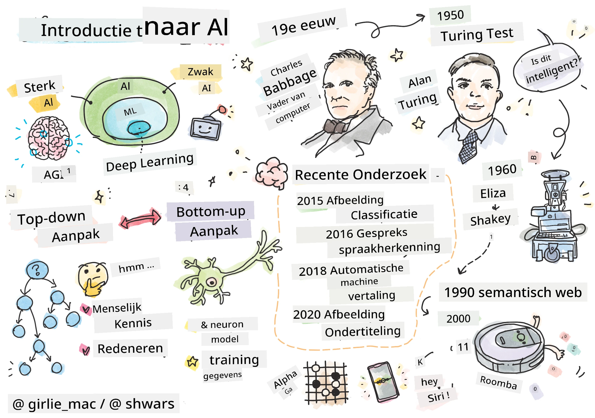
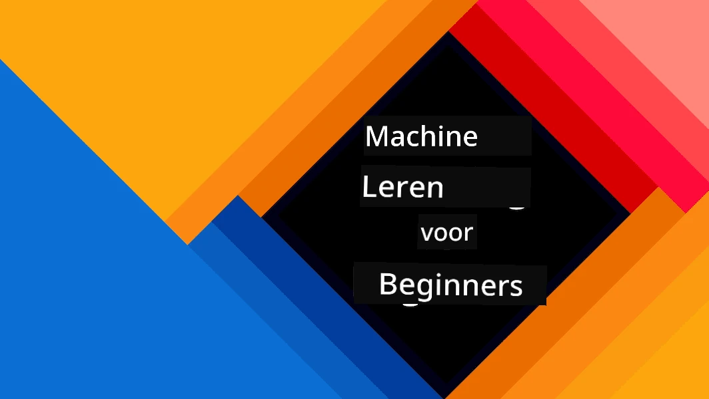
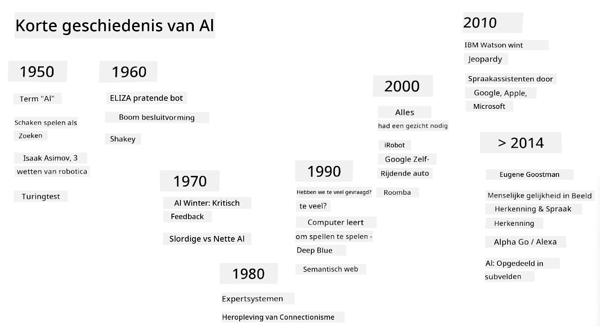
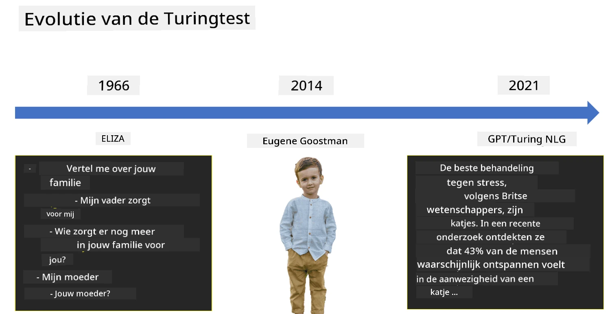

# Introductie tot AI

> Sketchnote door [Tomomi Imura](https://twitter.com/girlie_mac)

## [Quiz voorafgaand aan de les](https://ff-quizzes.netlify.app/en/ai/quiz/1)

**Kunstmatige Intelligentie** is een fascinerende wetenschappelijke discipline die onderzoekt hoe we computers intelligent gedrag kunnen laten vertonen, bijvoorbeeld dingen doen waar mensen goed in zijn.

Oorspronkelijk werden computers uitgevonden door [Charles Babbage](https://en.wikipedia.org/wiki/Charles_Babbage) om met cijfers te werken volgens een goed gedefinieerde procedure - een algoritme. Moderne computers, hoewel aanzienlijk geavanceerder dan het oorspronkelijke model dat in de 19e eeuw werd voorgesteld, volgen nog steeds hetzelfde idee van gecontroleerde berekeningen. Het is dus mogelijk om een computer te programmeren om iets te doen als we de exacte reeks stappen kennen die nodig zijn om het doel te bereiken.

> Foto door [Vickie Soshnikova](http://twitter.com/vickievalerie)

> ✅ Het bepalen van de leeftijd van een persoon aan de hand van een foto is een taak die niet expliciet geprogrammeerd kan worden, omdat we niet weten hoe we in ons hoofd tot een getal komen wanneer we dit doen.

---

Er zijn echter enkele taken waarvan we niet expliciet weten hoe we ze moeten oplossen. Denk bijvoorbeeld aan het bepalen van de leeftijd van een persoon aan de hand van een foto. We leren dit op de een of andere manier, omdat we veel voorbeelden hebben gezien van mensen van verschillende leeftijden, maar we kunnen niet expliciet uitleggen hoe we dit doen, noch kunnen we een computer programmeren om dit te doen. Dit is precies het soort taak dat interessant is voor **Kunstmatige Intelligentie** (kortweg AI).

✅ Bedenk enkele taken die je aan een computer zou kunnen overlaten en die baat zouden hebben bij AI. Denk aan de gebieden financiën, geneeskunde en kunst - hoe profiteren deze gebieden vandaag de dag van AI?

## Zwakke AI vs. Sterke AI

Zwakke AI | Sterke AI
---------------------------------------|-------------------------------------
Zwakke AI verwijst naar AI-systemen die zijn ontworpen en getraind voor een specifieke taak of een beperkt aantal taken.|Sterke AI, of Algemene Kunstmatige Intelligentie (AGI), verwijst naar AI-systemen met menselijk niveau van intelligentie en begrip.
Deze AI-systemen zijn niet algemeen intelligent; ze blinken uit in het uitvoeren van een vooraf gedefinieerde taak, maar missen echt begrip of bewustzijn.|Deze AI-systemen hebben het vermogen om elke intellectuele taak uit te voeren die een mens kan doen, zich aan te passen aan verschillende domeinen en een vorm van bewustzijn of zelfbewustzijn te bezitten.
Voorbeelden van zwakke AI zijn virtuele assistenten zoals Siri of Alexa, aanbevelingsalgoritmen die door streamingdiensten worden gebruikt, en chatbots die zijn ontworpen voor specifieke klantenservicetaken.|Het bereiken van sterke AI is een langetermijndoel van AI-onderzoek en zou de ontwikkeling vereisen van AI-systemen die kunnen redeneren, leren, begrijpen en zich aanpassen aan een breed scala aan taken en contexten.
Zwakke AI is sterk gespecialiseerd en bezit geen mensachtige cognitieve vaardigheden of algemene probleemoplossende capaciteiten buiten zijn beperkte domein.|Sterke AI is momenteel een theoretisch concept, en geen enkel AI-systeem heeft dit niveau van algemene intelligentie bereikt.

Voor meer informatie, zie **[Algemene Kunstmatige Intelligentie](https://en.wikipedia.org/wiki/Artificial_general_intelligence)** (AGI).

## De definitie van intelligentie en de Turing-test

Een van de problemen bij het omgaan met de term **[Intelligentie](https://en.wikipedia.org/wiki/Intelligence)** is dat er geen duidelijke definitie van deze term is. Men kan stellen dat intelligentie verbonden is met **abstract denken**, of met **zelfbewustzijn**, maar we kunnen het niet goed definiëren.

> [Foto](https://unsplash.com/photos/75715CVEJhI) door [Amber Kipp](https://unsplash.com/@sadmax) van Unsplash

Om de ambiguïteit van de term *intelligentie* te zien, probeer een vraag te beantwoorden: "Is een kat intelligent?". Verschillende mensen hebben de neiging om verschillende antwoorden te geven op deze vraag, omdat er geen universeel geaccepteerde test is om te bewijzen dat de bewering waar is of niet. En als je denkt dat die er is - probeer je kat dan eens een IQ-test te laten doen...

✅ Denk een minuut na over hoe jij intelligentie definieert. Is een kraai die een doolhof kan oplossen om bij voedsel te komen intelligent? Is een kind intelligent?

---

Wanneer we spreken over AGI, moeten we een manier hebben om te bepalen of we een echt intelligent systeem hebben gecreëerd. [Alan Turing](https://en.wikipedia.org/wiki/Alan_Turing) stelde een methode voor, genaamd de **[Turing-test](https://en.wikipedia.org/wiki/Turing_test)**, die ook fungeert als een definitie van intelligentie. De test vergelijkt een gegeven systeem met iets inherent intelligents - een echt mens, en omdat elke automatische vergelijking kan worden omzeild door een computerprogramma, gebruiken we een menselijke ondervrager. Dus, als een mens niet in staat is om onderscheid te maken tussen een echt persoon en een computersysteem in een tekstgebaseerde dialoog - wordt het systeem als intelligent beschouwd.

> Een chatbot genaamd [Eugene Goostman](https://en.wikipedia.org/wiki/Eugene_Goostman), ontwikkeld in St. Petersburg, kwam in 2014 dicht bij het doorstaan van de Turing-test door een slimme persoonlijkheidstruc te gebruiken. Het kondigde van tevoren aan dat het een 13-jarige Oekraïense jongen was, wat het gebrek aan kennis en enkele discrepanties in de tekst zou verklaren. De bot overtuigde 30% van de juryleden dat het menselijk was na een dialoog van 5 minuten, een maatstaf waarvan Turing geloofde dat een machine deze tegen 2000 zou kunnen halen. Men moet echter begrijpen dat dit niet aangeeft dat we een intelligent systeem hebben gecreëerd, of dat een computersysteem de menselijke ondervrager heeft misleid - het systeem heeft de mensen niet misleid, maar eerder de makers van de bot!

✅ Ben je ooit misleid door een chatbot en dacht je dat je met een mens sprak? Hoe heeft het je overtuigd?

## Verschillende benaderingen van AI

Als we willen dat een computer zich gedraagt als een mens, moeten we op de een of andere manier ons denkproces in een computer modelleren. Daarom moeten we proberen te begrijpen wat een mens intelligent maakt.

> Om intelligentie in een machine te kunnen programmeren, moeten we begrijpen hoe onze eigen besluitvormingsprocessen werken. Als je een beetje zelfreflectie doet, zul je je realiseren dat er processen zijn die onbewust plaatsvinden – bijvoorbeeld, we kunnen een kat van een hond onderscheiden zonder erover na te denken - terwijl andere processen redenering vereisen.

Er zijn twee mogelijke benaderingen voor dit probleem:

Top-down benadering (Symbolisch redeneren) | Bottom-up benadering (Neurale netwerken)
---------------------------------------|-------------------------------------
Een top-down benadering modelleert de manier waarop een persoon redeneert om een probleem op te lossen. Het omvat het extraheren van **kennis** van een mens en het representeren ervan in een computerleesbare vorm. We moeten ook een manier ontwikkelen om **redeneren** in een computer te modelleren. | Een bottom-up benadering modelleert de structuur van een menselijk brein, bestaande uit een groot aantal eenvoudige eenheden genaamd **neuronen**. Elk neuron werkt als een gewogen gemiddelde van zijn inputs, en we kunnen een netwerk van neuronen trainen om nuttige problemen op te lossen door **trainingsdata** te leveren.

Er zijn ook andere mogelijke benaderingen van intelligentie:

* Een **Emergente**, **Synergetische** of **multi-agent benadering** is gebaseerd op het feit dat complex intelligent gedrag kan ontstaan door interactie van een groot aantal eenvoudige agenten. Volgens [evolutionaire cybernetica](https://en.wikipedia.org/wiki/Global_brain#Evolutionary_cybernetics) kan intelligentie *ontstaan* uit eenvoudiger, reactief gedrag in het proces van *metasysteemtransitie*.

* Een **Evolutionaire benadering**, of **genetisch algoritme**, is een optimalisatieproces gebaseerd op de principes van evolutie.

We zullen deze benaderingen later in de cursus behandelen, maar nu richten we ons op twee hoofdrichtingen: top-down en bottom-up.

### De Top-Down Benadering

Bij een **top-down benadering** proberen we ons redeneerproces te modelleren. Omdat we onze gedachten kunnen volgen wanneer we redeneren, kunnen we proberen dit proces te formaliseren en in de computer te programmeren. Dit wordt **symbolisch redeneren** genoemd.

Mensen hebben de neiging om enkele regels in hun hoofd te hebben die hun besluitvormingsprocessen sturen. Bijvoorbeeld, wanneer een arts een patiënt diagnosticeert, kan hij of zij beseffen dat een persoon koorts heeft, en dus kan er een ontsteking in het lichaam zijn. Door een grote set regels toe te passen op een specifiek probleem kan een arts tot een uiteindelijke diagnose komen.

Deze benadering is sterk afhankelijk van **kennisrepresentatie** en **redeneren**. Het extraheren van kennis van een menselijke expert kan het moeilijkste deel zijn, omdat een arts in veel gevallen niet precies weet waarom hij of zij tot een bepaalde diagnose komt. Soms komt de oplossing gewoon in zijn of haar hoofd op zonder expliciet denken. Sommige taken, zoals het bepalen van de leeftijd van een persoon aan de hand van een foto, kunnen helemaal niet worden gereduceerd tot het manipuleren van kennis.

### Bottom-Up Benadering

Alternatief kunnen we proberen de eenvoudigste elementen in ons brein te modelleren – een neuron. We kunnen een zogenaamd **kunstmatig neuraal netwerk** in een computer construeren en vervolgens proberen het te leren problemen op te lossen door het voorbeelden te geven. Dit proces is vergelijkbaar met hoe een pasgeboren kind leert over zijn of haar omgeving door observaties te maken.

✅ Doe wat onderzoek naar hoe baby's leren. Wat zijn de basiselementen van het brein van een baby?

> | Wat betreft ML?         |      |
> |--------------|-----------|
> | Een onderdeel van Kunstmatige Intelligentie dat gebaseerd is op het leren van een computer om een probleem op te lossen op basis van bepaalde data wordt **Machine Learning** genoemd. We zullen klassieke machine learning niet behandelen in deze cursus - we verwijzen je naar een aparte [Machine Learning voor Beginners](http://aka.ms/ml-beginners) curriculum. |       |

## Een korte geschiedenis van AI

Kunstmatige Intelligentie begon als een vakgebied in het midden van de twintigste eeuw. Aanvankelijk was symbolisch redeneren een veelgebruikte benadering, en dit leidde tot een aantal belangrijke successen, zoals expertsystemen – computerprogramma's die als expert konden optreden in enkele beperkte probleemdomeinen. Het werd echter al snel duidelijk dat deze benadering niet goed schaalbaar is. Het extraheren van kennis van een expert, het representeren ervan in een computer en het nauwkeurig houden van die kennisbank blijkt een zeer complexe taak te zijn, en te duur om in veel gevallen praktisch te zijn. Dit leidde tot de zogenaamde [AI Winter](https://en.wikipedia.org/wiki/AI_winter) in de jaren '70.

> Afbeelding door [Dmitry Soshnikov](http://soshnikov.com)

Naarmate de tijd verstreek, werden computerbronnen goedkoper en kwam er meer data beschikbaar, waardoor benaderingen met neurale netwerken grote prestaties begonnen te tonen in het concurreren met mensen op veel gebieden, zoals computervisie of spraakherkenning. In het afgelopen decennium wordt de term Kunstmatige Intelligentie meestal gebruikt als synoniem voor neurale netwerken, omdat de meeste AI-successen die we horen daarop gebaseerd zijn.

We kunnen zien hoe de benaderingen veranderden, bijvoorbeeld bij het maken van een schaakspelend computerprogramma:

* Vroege schaakprogramma's waren gebaseerd op zoekstrategieën – een programma probeerde expliciet de mogelijke zetten van een tegenstander te schatten voor een bepaald aantal volgende zetten, en selecteerde een optimale zet op basis van de optimale positie die in een paar zetten kan worden bereikt. Dit leidde tot de ontwikkeling van het zogenaamde [alpha-beta pruning](https://en.wikipedia.org/wiki/Alpha%E2%80%93beta_pruning) zoekalgoritme.
* Zoekstrategieën werken goed aan het einde van het spel, waar de zoekruimte beperkt is door een klein aantal mogelijke zetten. Echter, aan het begin van het spel is de zoekruimte enorm, en het algoritme kan worden verbeterd door te leren van bestaande wedstrijden tussen menselijke spelers. Latere experimenten maakten gebruik van het zogenaamde [case-based reasoning](https://en.wikipedia.org/wiki/Case-based_reasoning), waarbij het programma zocht naar gevallen in de kennisbank die erg lijken op de huidige positie in het spel.
* Moderne programma's die menselijke spelers verslaan, zijn gebaseerd op neurale netwerken en [reinforcement learning](https://en.wikipedia.org/wiki/Reinforcement_learning), waarbij de programma's leren spelen door lange tijd tegen zichzelf te spelen en te leren van hun eigen fouten – net zoals mensen doen wanneer ze leren schaken. Een computerprogramma kan echter veel meer spellen spelen in veel minder tijd, en kan dus veel sneller leren.

✅ Doe wat onderzoek naar andere spellen die door AI zijn gespeeld.

Evenzo kunnen we zien hoe de benadering van het creëren van "sprekende programma's" (die mogelijk de Turing-test kunnen doorstaan) is veranderd:

* Vroege programma's van dit soort, zoals [Eliza](https://en.wikipedia.org/wiki/ELIZA), waren gebaseerd op zeer eenvoudige grammaticale regels en het herformuleren van de invoerzinnen in een vraag.
* Moderne assistenten, zoals Cortana, Siri of Google Assistant, zijn allemaal hybride systemen die neurale netwerken gebruiken om spraak om te zetten in tekst en onze intentie te herkennen, en vervolgens enige redenering of expliciete algoritmen gebruiken om de vereiste acties uit te voeren.
* In de toekomst kunnen we een volledig neurale model verwachten dat zelf een dialoog kan afhandelen. De recente GPT- en [Turing-NLG](https://www.microsoft.com/research/blog/turing-nlg-a-17-billion-parameter-language-model-by-microsoft) familie van neurale netwerken tonen hierin grote successen.

> Afbeelding door Dmitry Soshnikov, [foto](https://unsplash.com/photos/r8LmVbUKgns) door [Marina Abrosimova](https://unsplash.com/@abrosimova_marina_foto), Unsplash

## Recente AI-onderzoeken

De enorme groei in onderzoek naar neurale netwerken begon rond 2010, toen grote openbare datasets beschikbaar kwamen. Een enorme verzameling afbeeldingen genaamd [ImageNet](https://en.wikipedia.org/wiki/ImageNet), die ongeveer 14 miljoen geannoteerde afbeeldingen bevat, gaf aanleiding tot de [ImageNet Large Scale Visual Recognition Challenge](https://image-net.org/challenges/LSVRC/).

> Afbeelding door [Dmitry Soshnikov](http://soshnikov.com)

In 2012 werden [Convolutional Neural Networks](../4-ComputerVision/07-ConvNets/README.md) voor het eerst gebruikt bij beeldclassificatie, wat leidde tot een significante daling in classificatiefouten (van bijna 30% naar 16,4%). In 2015 bereikte de ResNet-architectuur van Microsoft Research [menselijke nauwkeurigheid](https://doi.org/10.1109/ICCV.2015.123).

Sindsdien hebben neurale netwerken zeer succesvol gedrag getoond in veel taken:

---

Jaar | Menselijke gelijkwaardigheid bereikt
-----|--------
2015 | [Beeldclassificatie](https://doi.org/10.1109/ICCV.2015.123)
2016 | [Conversatiespraakherkenning](https://arxiv.org/abs/1610.05256)
2018 | [Automatische machinale vertaling](https://arxiv.org/abs/1803.05567) (Chinees-naar-Engels)
2020 | [Beeldonderschriften](https://arxiv.org/abs/2009.13682)

In de afgelopen jaren hebben we enorme successen gezien met grote taalmodellen, zoals BERT en GPT-3. Dit gebeurde vooral omdat er veel algemene tekstdata beschikbaar is, waardoor we modellen kunnen trainen om de structuur en betekenis van teksten vast te leggen, ze vooraf kunnen trainen op algemene tekstverzamelingen en die modellen vervolgens kunnen specialiseren voor meer specifieke taken. We zullen later in deze cursus meer leren over [Natural Language Processing](../5-NLP/README.md).

## 🚀 Uitdaging

Maak een rondgang op het internet om te bepalen waar AI volgens jou het meest effectief wordt gebruikt. Is het in een kaartapp, een spraak-naar-tekstservice of een videogame? Onderzoek hoe het systeem is gebouwd.

## [Quiz na de les](https://ff-quizzes.netlify.app/en/ai/quiz/2)

## Herziening & Zelfstudie

Bekijk de geschiedenis van AI en ML door [deze les](https://github.com/microsoft/ML-For-Beginners/tree/main/1-Introduction/2-history-of-ML) door te nemen. Kies een element uit de sketchnote bovenaan die les of deze en onderzoek het in meer detail om de culturele context te begrijpen die de evolutie ervan heeft beïnvloed.

**Opdracht**: [Game Jam](assignment.md)

---

<!-- CO-OP TRANSLATOR DISCLAIMER START -->
**Disclaimer**:  
Dit document is vertaald met behulp van de AI-vertalingsservice [Co-op Translator](https://github.com/Azure/co-op-translator). Hoewel we streven naar nauwkeurigheid, dient u zich ervan bewust te zijn dat geautomatiseerde vertalingen fouten of onnauwkeurigheden kunnen bevatten. Het originele document in de oorspronkelijke taal moet worden beschouwd als de gezaghebbende bron. Voor kritieke informatie wordt professionele menselijke vertaling aanbevolen. Wij zijn niet aansprakelijk voor eventuele misverstanden of verkeerde interpretaties die voortvloeien uit het gebruik van deze vertaling.
<!-- CO-OP TRANSLATOR DISCLAIMER END -->