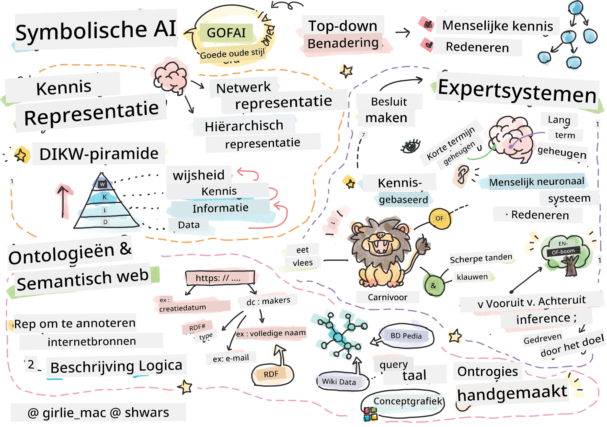
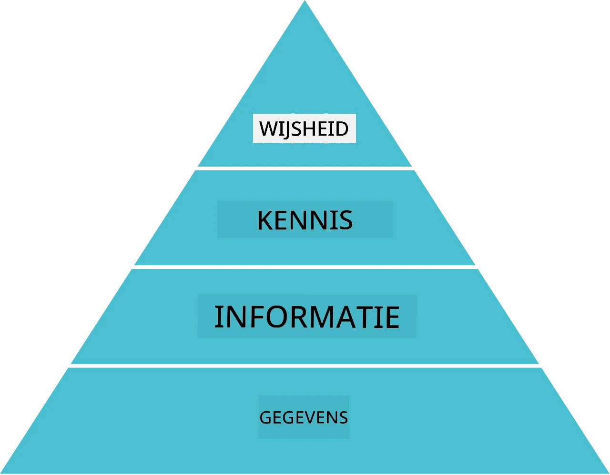
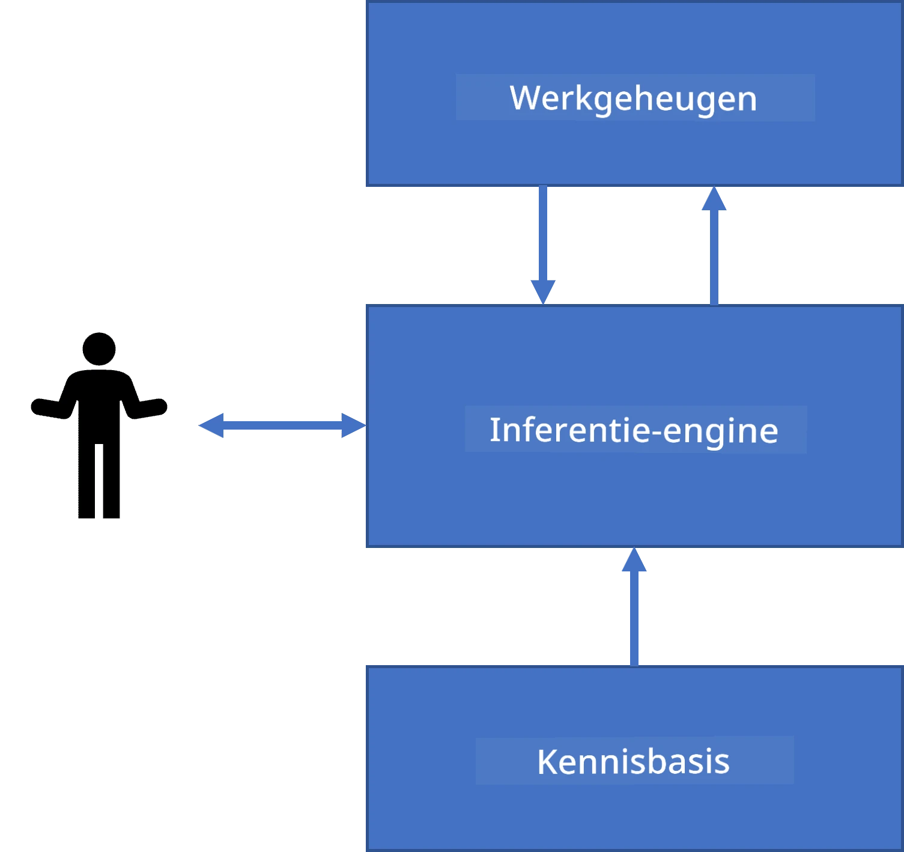
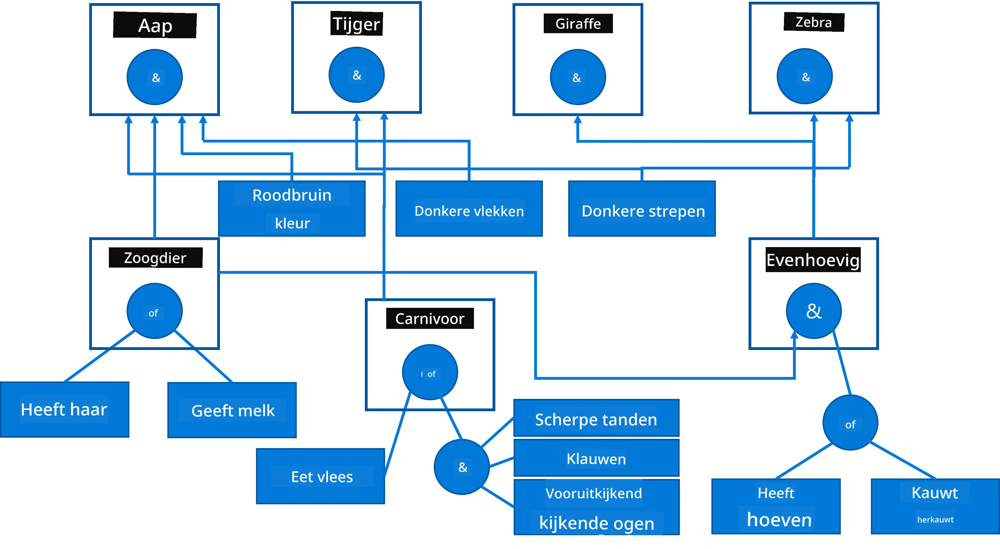
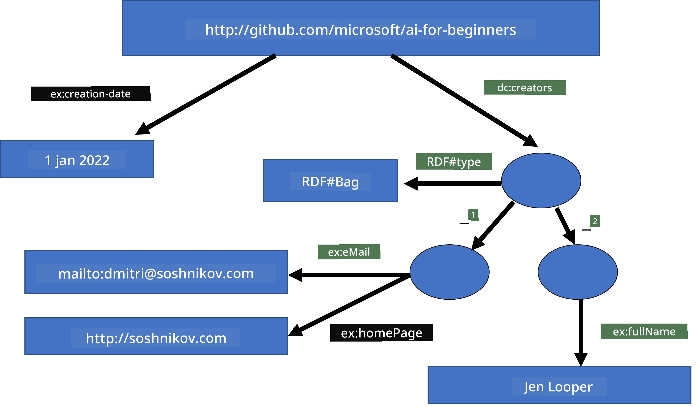

# Kennisrepresentatie en Expert Systemen



> Sketchnote door [Tomomi Imura](https://twitter.com/girlie_mac)

De zoektocht naar kunstmatige intelligentie is gebaseerd op een zoektocht naar kennis, om de wereld te begrijpen op een manier die lijkt op hoe mensen dat doen. Maar hoe kun je dit aanpakken?

## [Pre-lecture quiz](https://ff-quizzes.netlify.app/en/ai/quiz/3)

In de vroege dagen van AI was de top-down benadering om intelligente systemen te creëren (besproken in de vorige les) populair. Het idee was om kennis van mensen te extraheren in een machine-leesbare vorm, en deze vervolgens te gebruiken om automatisch problemen op te lossen. Deze benadering was gebaseerd op twee grote ideeën:

* Kennisrepresentatie
* Redeneren

## Kennisrepresentatie

Een van de belangrijke concepten in Symbolische AI is **kennis**. Het is belangrijk om kennis te onderscheiden van *informatie* of *data*. Bijvoorbeeld, men kan zeggen dat boeken kennis bevatten, omdat men boeken kan bestuderen en een expert kan worden. Echter, wat boeken bevatten wordt eigenlijk *data* genoemd, en door boeken te lezen en deze data te integreren in ons wereldmodel zetten we deze data om in kennis.

> ✅ **Kennis** is iets dat in ons hoofd zit en onze begrip van de wereld vertegenwoordigt. Het wordt verkregen door een actief **leerproces**, dat stukjes informatie die we ontvangen integreert in ons actieve wereldmodel.

Meestal definiëren we kennis niet strikt, maar stemmen het af met andere gerelateerde concepten met behulp van de [DIKW-piramide](https://en.wikipedia.org/wiki/DIKW_pyramid). Deze bevat de volgende concepten:

* **Data** is iets dat wordt weergegeven in fysiek medium, zoals geschreven tekst of gesproken woorden. Data bestaat onafhankelijk van mensen en kan tussen mensen worden doorgegeven.
* **Informatie** is hoe we data interpreteren in ons hoofd. Bijvoorbeeld, wanneer we het woord *computer* horen, hebben we een bepaald begrip van wat het is.
* **Kennis** is informatie die geïntegreerd is in ons wereldmodel. Bijvoorbeeld, zodra we leren wat een computer is, beginnen we ideeën te krijgen over hoe het werkt, hoeveel het kost, en waar het voor kan worden gebruikt. Dit netwerk van onderling verbonden concepten vormt onze kennis.
* **Wijsheid** is nog een niveau dieper in ons begrip van de wereld, en vertegenwoordigt *meta-kennis*, bijvoorbeeld een notie over hoe en wanneer de kennis moet worden gebruikt.



*Afbeelding [van Wikipedia](https://commons.wikimedia.org/w/index.php?curid=37705247), door Longlivetheux - Eigen werk, CC BY-SA 4.0*

Dus, het probleem van **kennisrepresentatie** is het vinden van een effectieve manier om kennis binnen een computer te representeren in de vorm van data, om het automatisch bruikbaar te maken. Dit kan worden gezien als een spectrum:


> Afbeelding door [Dmitry Soshnikov](http://soshnikov.com)

* Links zijn zeer eenvoudige typen kennisrepresentaties die effectief door computers kunnen worden gebruikt. De eenvoudigste is algoritmisch, waarbij kennis wordt weergegeven door een computerprogramma. Dit is echter niet de beste manier om kennis te representeren, omdat het niet flexibel is. Kennis in ons hoofd is vaak niet-algoritmisch.
* Rechts zijn representaties zoals natuurlijke tekst. Dit is het krachtigst, maar kan niet voor automatisch redeneren worden gebruikt.

> ✅ Denk even na over hoe jij kennis in je hoofd representeert en omzet in aantekeningen. Is er een bepaald formaat dat goed voor jou werkt om het beter te onthouden?

## Indelen van Computer Kennisrepresentation

We kunnen verschillende methoden voor computer-kennisrepresentatie indelen in de volgende categorieën:

* **Netwerkrepresentaties** zijn gebaseerd op het feit dat we een netwerk van onderling verbonden concepten in ons hoofd hebben. We kunnen proberen dezezelfde netwerken als een graaf in een computer weer te geven - een zogenaamde **semantisch netwerk**.

1. **Object-Attribute-Value triplets** of **attribuut-waarde paren**. Aangezien een graaf in een computer kan worden weergegeven als een lijst van knopen en verbindingen, kunnen we een semantisch netwerk representeren door een lijst van triplets, die objecten, attributen en waarden bevatten. Bijvoorbeeld, we bouwen de volgende triplets over programmeertalen:

Object | Attribuut | Waarde
-------|-----------|-------
Python | is | Untyped-Language
Python | invented-by | Guido van Rossum
Python | block-syntax | indentation
Untyped-Language | doesn't have | type definitions

> ✅ Denk na over hoe triplets kunnen worden gebruikt om andere soorten kennis te representeren.

2. **Hiërarchische representaties** benadrukken het feit dat we vaak een hiërarchie van objecten in ons hoofd creëren. Bijvoorbeeld, we weten dat een kanarie een vogel is, en dat alle vogels vleugels hebben. We hebben ook een idee welke kleur een kanarie meestal heeft, en wat hun vliegsnelheid is.

   - **Frame-representatie** is gebaseerd op het representeren van elk object of klasse van objecten als een **frame** dat **slots** bevat. Slots hebben mogelijke standaardwaarden, waardebeperkingen of opgeslagen procedures die kunnen worden aangeroepen om de waarde van een slot te verkrijgen. Alle frames vormen een hiërarchie vergelijkbaar met een objecthiërarchie in objectgeoriënteerde programmeertalen.
   - **Scenario's** zijn een speciaal soort frames die complexe situaties vertegenwoordigen die zich in de tijd kunnen ontvouwen.

**Python**

Slot | Waarde | Standaardwaarde | Interval |
-----|--------|-----------------|----------|
Name | Python | | |
Is-A | Untyped-Language | | |
Variable Case | | CamelCase | |
Program Length | | | 5-5000 regels |
Block Syntax | Indent | | |

3. **Procedurele representaties** zijn gebaseerd op het representeren van kennis door een lijst van acties die kunnen worden uitgevoerd wanneer een bepaalde conditie optreedt.
   - Productieregels zijn als-dan uitspraken die ons toestaan conclusies te trekken. Bijvoorbeeld, een dokter kan een regel hebben die zegt dat **ALS** een patiënt hoge koorts heeft **OF** een hoog niveau van C-reactief proteïne in bloedtest **DAN** heeft hij een ontsteking. Zodra we aan een van de condities voldoen, kunnen we een conclusie trekken over de ontsteking, en deze vervolgens gebruiken in verder redeneren.
   - Algoritmes kunnen worden beschouwd als een andere vorm van procedurele representatie, hoewel ze bijna nooit direct worden gebruikt in kennisgebaseerde systemen.

4. **Logica** werd oorspronkelijk voorgesteld door Aristoteles als een manier om universele menselijke kennis te representeren.
   - Predicaatlogica als wiskundige theorie is te rijk om berekenbaar te zijn, daarom wordt normaal een deelverzameling ervan gebruikt, zoals Horn-clausules gebruikt in Prolog.
   - Beschrijvende Logica is een familie van logische systemen die worden gebruikt om te representeren en redeneren over hiërarchieën van objecten en gedistribueerde kennisrepresentaties zoals *semantisch web*.

## Expert Systemen

Een van de vroege successen van symbolische AI waren zogenaamde **expert systemen** - computersystemen die ontworpen waren om als een expert te functioneren in een beperkt probleemdomein. Ze waren gebaseerd op een **kennisbasis** die werd geëxtraheerd van een of meerdere menselijke experts, en ze bevatten een **inference engine** die er bovenop redeneerde.

 | 
---------------------------------------------|------------------------------------------------
Vereenvoudigde structuur van een menselijk neuronensysteem | Architectuur van een kennisgebaseerd systeem

Expert systemen zijn opgebouwd als het menselijke redeneringssysteem, dat een **korte termijn geheugen** en een **lange termijn geheugen** bevat. Op dezelfde manier onderscheiden we in kennisgebaseerde systemen de volgende componenten:

* **Probleemgeheugen**: bevat kennis over het probleem dat op dat moment wordt opgelost, bijvoorbeeld de temperatuur of bloeddruk van een patiënt, of hij een ontsteking heeft of niet, enz. Deze kennis wordt ook wel **statische kennis** genoemd, omdat het een momentopname bevat van wat we momenteel weten over het probleem - de zogenaamde *probleemtoestand*.
* **Kennisbasis**: vertegenwoordigt lange termijn kennis over een probleemdomein. Deze is handmatig geëxtraheerd van menselijke experts, en verandert niet van consult tot consult. Omdat het ons toestaat te navigeren van de ene probleemtoestand naar de andere, wordt het ook **dynamische kennis** genoemd.
* **Inference engine**: orkestreert het hele proces van zoeken in de probleemtoestandruimte, stelt vragen aan de gebruiker waar nodig. Het is ook verantwoordelijk om de juiste regels te vinden die op elke toestand moeten worden toegepast.

Als voorbeeld nemen we het volgende expertsysteem om een dier te bepalen op basis van zijn fysieke kenmerken:



> Afbeelding door [Dmitry Soshnikov](http://soshnikov.com)

Dit diagram wordt een **AND-OR boom** genoemd, en het is een grafische representatie van een set productieregels. Het tekenen van een boom is nuttig aan het begin van het extraheren van kennis van de expert. Om de kennis binnen de computer te representeren is het handiger regels te gebruiken:

```
IF the animal eats meat
OR (animal has sharp teeth
    AND animal has claws
    AND animal has forward-looking eyes
) 
THEN the animal is a carnivore
```

Je kunt opmerken dat elke conditie aan de linkerkant van de regel en de actie in essentie object-attribute-value (OAV) triplets zijn. **Werkgeheugen** bevat de set OAV-triplets die overeenkomen met het probleem dat op dat moment wordt opgelost. Een **regels-engine** zoekt naar regels waarvan een conditie is voldaan en past ze toe, door een nieuwe triplet aan het werkgeheugen toe te voegen.

> ✅ Schrijf je eigen AND-OR boom over een onderwerp dat je leuk vindt!

### Voorwaartse versus Achterwaartse Redenering

Het hierboven beschreven proces wordt **voorwaartse redenering** genoemd. Het begint met initiële gegevens over het probleem dat beschikbaar is in het werkgeheugen, en voert vervolgens de volgende redeneerlus uit:

1. Als het doelattribuut aanwezig is in het werkgeheugen - stop en geef het resultaat
2. Zoek alle regels waarvan de conditie momenteel is voldaan - verkrijg **conflictset** van regels.
3. Voer **conflictresolutie** uit - selecteer één regel die in deze stap wordt uitgevoerd. Er kunnen verschillende conflictresolutiestrategieën zijn:
   - Selecteer de eerste toepasselijke regel in de kennisbasis
   - Selecteer een willekeurige regel
   - Selecteer een *meer specifieke* regel, d.w.z. degene die aan de meeste voorwaarden aan de "linkerkant" (LHS) voldoet
4. Pas de geselecteerde regel toe en voeg een nieuw stuk kennis toe aan de probleemtoestand
5. Herhaal vanaf stap 1.

In sommige gevallen willen we echter misschien beginnen met een lege kennis over het probleem, en vragen stellen die ons helpen tot een conclusie te komen. Bijvoorbeeld, bij het stellen van een medische diagnose voeren we gewoonlijk niet alle medische analyses uit voordat we met de diagnose beginnen. We willen liever analyses uitvoeren wanneer er een beslissing genomen moet worden.

Dit proces kan worden gemodelleerd met **achterwaartse redenering**. Het wordt gestuurd door het **doel** - de attribuutwaarde die we proberen te vinden:

1. Selecteer alle regels die ons de waarde van een doel kunnen geven (d.w.z. met het doel aan de rechterkant ("right-hand-side")) - een conflictset
1. Als er geen regels voor dit attribuut zijn, of als er een regel is die zegt dat we de waarde aan de gebruiker moeten vragen - vraag deze dan, anders:
1. Gebruik conflictresolutiestrategie om een regel te selecteren die we als *hypothese* zullen gebruiken - we proberen deze te bewijzen
1. Herhaal herhaaldelijk het proces voor alle attributen in de LHS van de regel, waarbij we proberen deze te bewijzen als doelen
1. Als het proces op enig moment faalt - gebruik een andere regel bij stap 3.

> ✅ In welke situaties is voorwaartse redenering geschikter? Hoe zit het met achterwaartse redenering?

### Implementeren van Expert Systemen

Expertsystemen kunnen worden geïmplementeerd met verschillende hulpmiddelen:

* Direct programmeren in een hoge-niveau programmeertaal. Dit is niet de beste aanpak, omdat het grootste voordeel van een kennisgebaseerd systeem is dat kennis is gescheiden van inference, en potentieel een deskundige in het probleemgebied zelf regels zou moeten kunnen schrijven zonder de details van het inferentieproces te begrijpen
* Het gebruik van een **expert systems shell**, dat wil zeggen, een systeem dat specifiek is ontworpen om gevuld te worden met kennis met behulp van een bepaalde kennisrepresentatietaal.

## ✍️ Oefening: Dier-Redenering

Zie [Animals.ipynb](https://github.com/microsoft/AI-For-Beginners/blob/main/lessons/2-Symbolic/Animals.ipynb) voor een voorbeeld van het implementeren van een voorwaarts- en achterwaarts redenerend expertsysteem.

> **Opmerking**: Dit voorbeeld is vrij eenvoudig en geeft alleen een idee van hoe een expertsysteem eruit ziet. Zodra je begint met het creëren van zo'n systeem, zal je alleen een *intelligent* gedrag ervan opmerken zodra je een bepaald aantal regels bereikt, rond de 200+. Op een gegeven moment worden regels te complex om allemaal in gedachten te houden, en op dat punt vraag je je misschien af waarom een systeem bepaalde beslissingen neemt. Echter, het belangrijke kenmerk van kennisgebaseerde systemen is dat je altijd kunt *uitleggen* hoe elke beslissing precies werd genomen.

## Ontologieën en het Semantisch Web

Aan het einde van de 20e eeuw was er een initiatief om kennisrepresentatie te gebruiken om internetbronnen te annoteren, zodat het mogelijk zou zijn bronnen te vinden die aan zeer specifieke zoekopdrachten voldoen. Deze beweging heette **Semantisch Web**, en was gebaseerd op verschillende concepten:

- Een speciale kennisrepresentatie gebaseerd op **[description logics](https://en.wikipedia.org/wiki/Description_logic)** (DL). Het lijkt op frame-kennisrepresentatie, omdat het een hiërarchie van objecten met eigenschappen opbouwt, maar het heeft formele logische semantiek en inferentie. Er is een hele familie van DL's die een balans vinden tussen expressiviteit en algoritmische complexiteit van inferentie.
- Gedistribueerde kennisrepresentatie, waarbij alle concepten worden vertegenwoordigd door een globale URI-identificator, wat het mogelijk maakt kennis-hiërarchieën te creëren die het internet overspannen.
- Een familie van op XML gebaseerde talen voor kennisbeschrijving: RDF (Resource Description Framework), RDFS (RDF Schema), OWL (Ontology Web Language).

Een kernconcept in het Semantische Web is het concept van **Ontologie**. Dit verwijst naar een expliciete specificatie van een probleemgebied met behulp van een formele kennisrepresentatie. De eenvoudigste ontologie kan gewoon een hiërarchie van objecten in een probleemgebied zijn, maar complexere ontologieën bevatten regels die gebruikt kunnen worden voor afleiding.

In het semantische web zijn alle representaties gebaseerd op triplets. Elk object en elke relatie worden uniek geïdentificeerd door de URI. Bijvoorbeeld, als we het feit willen aangeven dat deze AI Curriculum is ontwikkeld door Dmitry Soshnikov op 1 januari 2022 - hier zijn de triplets die we kunnen gebruiken:


```
http://github.com/microsoft/ai-for-beginners http://www.example.com/terms/creation-date “Jan 1, 2022”
http://github.com/microsoft/ai-for-beginners http://purl.org/dc/elements/1.1/creator http://soshnikov.com
```

> ✅ Hier zijn `http://www.example.com/terms/creation-date` en `http://purl.org/dc/elements/1.1/creator` enkele bekende en universeel geaccepteerde URI’s om de concepten van *maker* en *creatiedatum* uit te drukken.

In een complexer geval, als we een lijst van makers willen definiëren, kunnen we enkele gegevensstructuren gebruiken die in RDF zijn gedefinieerd.



> Diagrammen hierboven door [Dmitry Soshnikov](http://soshnikov.com)

De vooruitgang in het bouwen van het Semantische Web werd enigszins afgeremd door het succes van zoekmachines en technieken voor natuurlijke taalverwerking, waarmee gestructureerde data uit tekst kan worden gehaald. Echter, in sommige gebieden zijn er nog steeds aanzienlijke inspanningen om ontologieën en kennisbanken te onderhouden. Enkele opmerkelijke projecten:

* [WikiData](https://wikidata.org/) is een verzameling van machine-leesbare kennisbanken gekoppeld aan Wikipedia. Het merendeel van de data wordt gewonnen uit Wikipedia *InfoBoxes*, stukken gestructureerde inhoud binnen Wikipedia-pagina’s. Je kunt [query’s uitvoeren](https://query.wikidata.org/) op wikidata in SPARQL, een speciale querytaal voor het Semantische Web. Hier is een voorbeeldquery die de meest populaire oogkleuren onder mensen toont:

```sparql
#defaultView:BubbleChart
SELECT ?eyeColorLabel (COUNT(?human) AS ?count)
WHERE
{
  ?human wdt:P31 wd:Q5.       # human instance-of homo sapiens
  ?human wdt:P1340 ?eyeColor. # human eye-color ?eyeColor
  SERVICE wikibase:label { bd:serviceParam wikibase:language "en". }
}
GROUP BY ?eyeColorLabel
```

* [DBpedia](https://www.dbpedia.org/) is een andere inspanning vergelijkbaar met WikiData.

> ✅ Als je wilt experimenteren met het bouwen van je eigen ontologieën, of bestaande openen, is er een geweldige visuele ontologie-editor genaamd [Protégé](https://protege.stanford.edu/). Download het of gebruik het online.


*Web Protégé-editor geopend met de Romanov Familie-ontologie. Screenshot door Dmitry Soshnikov*

## ✍️ Oefening: Een Familie Ontologie


Bekijk [FamilyOntology.ipynb](https://github.com/Ezana135/AI-For-Beginners/blob/main/lessons/2-Symbolic/FamilyOntology.ipynb) voor een voorbeeld van het gebruik van Semantische Web-technieken om redeneerwerk over familiebanden uit te voeren. We nemen een stamboom die is weergegeven in het veelgebruikte GEDCOM-formaat en een ontologie van familiebanden en bouwen een graaf van alle familiebanden voor een gegeven set individuen.

## Microsoft Concept Graph

In de meeste gevallen worden ontologieën zorgvuldig met de hand gemaakt. Het is echter ook mogelijk om ontologieën te **delven** uit ongestructureerde data, bijvoorbeeld uit natuurlijke taalteksten.

Een dergelijke poging werd gedaan door Microsoft Research, en resulteerde in de [Microsoft Concept Graph](https://blogs.microsoft.com/ai/microsoft-researchers-release-graph-that-helps-machines-conceptualize/?WT.mc_id=academic-77998-cacaste).

Dit is een grote verzameling entiteiten, gegroepeerd met behulp van de `is-a` erfelijkheidsrelatie. Het maakt het mogelijk vragen zoals "Wat is Microsoft?" te beantwoorden - het antwoord is dan iets van "een bedrijf met een waarschijnlijkheid van 0.87, en een merk met een waarschijnlijkheid van 0.75".

De grafiek is beschikbaar als REST API, of als een grote downloadbare tekstbestand die alle entiteitenparen opsomt.

## ✍️ Oefening: Een Conceptgrafiek

Probeer het [MSConceptGraph.ipynb](https://github.com/microsoft/AI-For-Beginners/blob/main/lessons/2-Symbolic/MSConceptGraph.ipynb) notitieboek om te zien hoe we de Microsoft Concept Graph kunnen gebruiken om nieuwsartikelen in verschillende categorieën te groeperen.

## Conclusie

Tegenwoordig wordt AI vaak beschouwd als een synoniem voor *Machine Learning* of *Neurale Netwerken*. Echter, een mens vertoont ook expliciet redeneren, iets dat momenteel niet door neurale netwerken wordt behandeld. In projecten in de echte wereld wordt expliciet redeneren nog steeds gebruikt voor taken die uitleg vereisen, of waarmee het gedrag van het systeem op een gecontroleerde manier kan worden aangepast.

## 🚀 Uitdaging

In het Family Ontology-notitieboek dat bij deze les hoort, is er een mogelijkheid om te experimenteren met andere familiebanden. Probeer nieuwe connecties tussen mensen in de stamboom te ontdekken.

## [Post-lecture quiz](https://ff-quizzes.netlify.app/en/ai/quiz/4)

## Review & Zelfstudie

Doe wat onderzoek op het internet om gebieden te ontdekken waar mensen hebben geprobeerd kennis te kwantificeren en te codificeren. Kijk naar de taxonomie van Bloom en ga terug in de geschiedenis om te leren hoe mensen probeerden hun wereld te begrijpen. Verken het werk van Linnaeus om een taxonomie van organismen te creëren, en observeer de manier waarop Dmitri Mendeleev een methode creëerde om chemische elementen te beschrijven en te groeperen. Welke andere interessante voorbeelden kun je vinden?

**Opdracht**: [Bouw een Ontologie](assignment.md)

---

<!-- CO-OP TRANSLATOR DISCLAIMER START -->
**Disclaimer**:
Dit document is vertaald met behulp van de AI-vertalingsdienst [Co-op Translator](https://github.com/Azure/co-op-translator). Hoewel we streven naar nauwkeurigheid, dient u er rekening mee te houden dat automatische vertalingen fouten of onnauwkeurigheden kunnen bevatten. Het originele document in de oorspronkelijke taal wordt beschouwd als de gezaghebbende bron. Voor cruciale informatie wordt professionele menselijke vertaling aanbevolen. Wij zijn niet aansprakelijk voor enige misverstanden of verkeerde interpretaties die voortvloeien uit het gebruik van deze vertaling.
<!-- CO-OP TRANSLATOR DISCLAIMER END -->