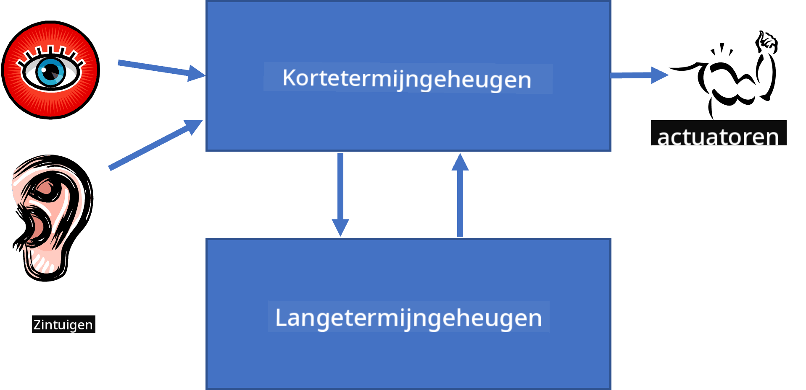

<!--
CO_OP_TRANSLATOR_METADATA:
{
  "original_hash": "7d097f7fda9166ead615e4c34552381b",
  "translation_date": "2025-09-23T10:10:01+00:00",
  "source_file": "lessons/2-Symbolic/README.md",
  "language_code": "nl"
}
-->
# Kennisrepresentatie en Expertsystemen


> Sketchnote door [Tomomi Imura](https://twitter.com/girlie_mac)

De zoektocht naar kunstmatige intelligentie is gebaseerd op het zoeken naar kennis, om de wereld te begrijpen zoals mensen dat doen. Maar hoe kun je dit aanpakken?

## [Quiz voorafgaand aan de les](https://ff-quizzes.netlify.app/en/ai/quiz/3)

In de vroege dagen van AI was de top-down benadering om intelligente systemen te creëren (besproken in de vorige les) populair. Het idee was om kennis van mensen te extraheren in een machineleesbare vorm en deze vervolgens te gebruiken om automatisch problemen op te lossen. Deze aanpak was gebaseerd op twee grote ideeën:

* Kennisrepresentatie
* Redeneren

## Kennisrepresentatie

Een van de belangrijke concepten in Symbolische AI is **kennis**. Het is belangrijk om kennis te onderscheiden van *informatie* of *data*. Bijvoorbeeld, men kan zeggen dat boeken kennis bevatten, omdat je boeken kunt bestuderen en een expert kunt worden. Wat boeken echter bevatten, wordt eigenlijk *data* genoemd, en door boeken te lezen en deze data te integreren in ons wereldmodel, zetten we deze data om in kennis.

> ✅ **Kennis** is iets dat in ons hoofd zit en onze begrip van de wereld vertegenwoordigt. Het wordt verkregen door een actief **leerproces**, waarbij stukjes informatie die we ontvangen worden geïntegreerd in ons actieve wereldmodel.

Meestal definiëren we kennis niet strikt, maar brengen we het in lijn met andere gerelateerde concepten via de [DIKW-piramide](https://en.wikipedia.org/wiki/DIKW_pyramid). Deze bevat de volgende concepten:

* **Data** is iets dat wordt weergegeven op fysieke media, zoals geschreven tekst of gesproken woorden. Data bestaat onafhankelijk van mensen en kan tussen mensen worden doorgegeven.
* **Informatie** is hoe we data interpreteren in ons hoofd. Bijvoorbeeld, wanneer we het woord *computer* horen, hebben we een bepaald begrip van wat het is.
* **Kennis** is informatie die wordt geïntegreerd in ons wereldmodel. Bijvoorbeeld, zodra we leren wat een computer is, beginnen we ideeën te krijgen over hoe het werkt, hoeveel het kost en waarvoor het kan worden gebruikt. Dit netwerk van onderling verbonden concepten vormt onze kennis.
* **Wijsheid** is nog een niveau van ons begrip van de wereld en vertegenwoordigt *meta-kennis*, bijvoorbeeld een idee over hoe en wanneer de kennis moet worden gebruikt.


*Afbeelding [van Wikipedia](https://commons.wikimedia.org/w/index.php?curid=37705247), Door Longlivetheux - Eigen werk, CC BY-SA 4.0*

Het probleem van **kennisrepresentatie** is dus om een effectieve manier te vinden om kennis binnen een computer in de vorm van data te representeren, zodat het automatisch bruikbaar is. Dit kan worden gezien als een spectrum:


> Afbeelding door [Dmitry Soshnikov](http://soshnikov.com)

* Aan de linkerkant zijn er zeer eenvoudige soorten kennisrepresentaties die effectief door computers kunnen worden gebruikt. De eenvoudigste is algoritmisch, waarbij kennis wordt weergegeven door een computerprogramma. Dit is echter niet de beste manier om kennis te representeren, omdat het niet flexibel is. Kennis in ons hoofd is vaak niet-algoritmisch.
* Aan de rechterkant zijn er representaties zoals natuurlijke tekst. Dit is het krachtigste, maar kan niet worden gebruikt voor automatisch redeneren.

> ✅ Denk een minuut na over hoe je kennis in je hoofd representeert en omzet in notities. Is er een specifiek formaat dat goed voor je werkt om het te onthouden?

## Classificatie van computerkennisrepresentaties

We kunnen verschillende methoden voor computerkennisrepresentatie classificeren in de volgende categorieën:

* **Netwerkrepresentaties** zijn gebaseerd op het feit dat we een netwerk van onderling verbonden concepten in ons hoofd hebben. We kunnen proberen dezelfde netwerken als een grafiek binnen een computer te reproduceren - een zogenaamde **semantisch netwerk**.

1. **Object-Attribuut-Waarde triplets** of **attribuut-waarde paren**. Omdat een grafiek binnen een computer kan worden weergegeven als een lijst van knooppunten en randen, kunnen we een semantisch netwerk representeren door een lijst van triplets, met objecten, attributen en waarden. Bijvoorbeeld, we bouwen de volgende triplets over programmeertalen:

Object | Attribuut | Waarde
-------|-----------|------
Python | is | Untyped-Language
Python | uitgevonden-door | Guido van Rossum
Python | blok-syntaxis | inspringing
Untyped-Language | heeft geen | type-definities

> ✅ Denk na over hoe triplets kunnen worden gebruikt om andere soorten kennis te representeren.

2. **Hiërarchische representaties** benadrukken het feit dat we vaak een hiërarchie van objecten in ons hoofd creëren. Bijvoorbeeld, we weten dat een kanarie een vogel is, en alle vogels hebben vleugels. We hebben ook een idee over welke kleur een kanarie meestal heeft en wat hun vliegsnelheid is.

   - **Frame-representatie** is gebaseerd op het representeren van elk object of klasse van objecten als een **frame** dat **slots** bevat. Slots hebben mogelijke standaardwaarden, waardebeperkingen of opgeslagen procedures die kunnen worden opgeroepen om de waarde van een slot te verkrijgen. Alle frames vormen een hiërarchie vergelijkbaar met een objecthiërarchie in objectgeoriënteerde programmeertalen.
   - **Scenario's** zijn een speciaal soort frames die complexe situaties representeren die zich in de tijd kunnen ontvouwen.

**Python**

Slot | Waarde | Standaardwaarde | Interval |
-----|-------|---------------|----------|
Naam | Python | | |
Is-A | Untyped-Language | | |
Variabele Notatie | | CamelCase | |
Programmalengte | | | 5-5000 regels |
Blok-syntaxis | Inspringing | | |

3. **Procedurele representaties** zijn gebaseerd op het representeren van kennis door een lijst van acties die kunnen worden uitgevoerd wanneer een bepaalde conditie optreedt.
   - Productieregels zijn if-then statements waarmee we conclusies kunnen trekken. Bijvoorbeeld, een arts kan een regel hebben die zegt dat **ALS** een patiënt hoge koorts heeft **OF** een hoog niveau van C-reactief proteïne in een bloedtest **DAN** hij een ontsteking heeft. Zodra we een van de condities tegenkomen, kunnen we een conclusie trekken over ontsteking en deze vervolgens gebruiken in verdere redenering.
   - Algoritmen kunnen worden beschouwd als een andere vorm van procedurele representatie, hoewel ze bijna nooit direct worden gebruikt in kennisgebaseerde systemen.

4. **Logica** werd oorspronkelijk voorgesteld door Aristoteles als een manier om universele menselijke kennis te representeren.
   - Predicatenlogica als een wiskundige theorie is te rijk om berekenbaar te zijn, daarom wordt normaal gesproken een subset ervan gebruikt, zoals Horn-clausules die worden gebruikt in Prolog.
   - Beschrijvende logica is een familie van logische systemen die worden gebruikt om hiërarchieën van objecten en gedistribueerde kennisrepresentaties zoals *semantisch web* te representeren en te redeneren.

## Expertsystemen

Een van de vroege successen van symbolische AI waren de zogenaamde **expertsystemen** - computersystemen die waren ontworpen om als expert te functioneren in een beperkt probleemgebied. Ze waren gebaseerd op een **kennisbasis** die was geëxtraheerd van een of meer menselijke experts, en ze bevatten een **inferentie-engine** die enige redenering uitvoerde bovenop deze basis.

 | 
---------------------------------------------|------------------------------------------------
Vereenvoudigde structuur van een menselijk neuraal systeem | Architectuur van een kennisgebaseerd systeem

Expertsystemen zijn gebouwd zoals het menselijke redeneersysteem, dat **kortetermijngeheugen** en **langetermijngeheugen** bevat. Evenzo onderscheiden we in kennisgebaseerde systemen de volgende componenten:

* **Probleemgeheugen**: bevat de kennis over het probleem dat momenteel wordt opgelost, bijvoorbeeld de temperatuur of bloeddruk van een patiënt, of hij een ontsteking heeft of niet, enz. Deze kennis wordt ook wel **statische kennis** genoemd, omdat het een momentopname bevat van wat we momenteel weten over het probleem - de zogenaamde *probleemstatus*.
* **Kennisbasis**: vertegenwoordigt langetermijnkennis over een probleemgebied. Het wordt handmatig geëxtraheerd van menselijke experts en verandert niet van consultatie tot consultatie. Omdat het ons in staat stelt te navigeren van de ene probleemstatus naar de andere, wordt het ook wel **dynamische kennis** genoemd.
* **Inferentie-engine**: orkestreert het hele proces van zoeken in de probleemstatusruimte, stelt vragen aan de gebruiker wanneer nodig. Het is ook verantwoordelijk voor het vinden van de juiste regels die op elke status moeten worden toegepast.

Als voorbeeld bekijken we het volgende expertsysteem om een dier te bepalen op basis van zijn fysieke kenmerken:


> Afbeelding door [Dmitry Soshnikov](http://soshnikov.com)

Dit diagram wordt een **AND-OR boom** genoemd en is een grafische representatie van een set productieregels. Het tekenen van een boom is nuttig aan het begin van het extraheren van kennis van de expert. Om de kennis binnen de computer te representeren, is het handiger om regels te gebruiken:

```
IF the animal eats meat
OR (animal has sharp teeth
    AND animal has claws
    AND animal has forward-looking eyes
) 
THEN the animal is a carnivore
```

Je kunt zien dat elke conditie aan de linkerkant van de regel en de actie in wezen object-attribuut-waarde (OAV) triplets zijn. **Werkgeheugen** bevat de set OAV-triplets die overeenkomen met het probleem dat momenteel wordt opgelost. Een **regels-engine** zoekt naar regels waarvan een conditie is voldaan en past deze toe, waarbij een nieuwe triplet aan het werkgeheugen wordt toegevoegd.

> ✅ Maak je eigen AND-OR boom over een onderwerp dat je leuk vindt!

### Voorwaartse vs. Achterwaartse Inferentie

Het hierboven beschreven proces wordt **voorwaartse inferentie** genoemd. Het begint met enkele initiële gegevens over het probleem die beschikbaar zijn in het werkgeheugen en voert vervolgens de volgende redeneercyclus uit:

1. Als het doelattribuut aanwezig is in het werkgeheugen - stop en geef het resultaat
2. Zoek naar alle regels waarvan de conditie momenteel is voldaan - verkrijg **conflictset** van regels.
3. Voer **conflictresolutie** uit - selecteer één regel die in deze stap zal worden uitgevoerd. Er kunnen verschillende conflictresolutiestrategieën zijn:
   - Selecteer de eerste toepasbare regel in de kennisbasis
   - Selecteer een willekeurige regel
   - Selecteer een *meer specifieke* regel, d.w.z. degene die aan de meeste condities aan de "linkerkant" (LHS) voldoet
4. Pas de geselecteerde regel toe en voeg een nieuw stukje kennis toe aan de probleemstatus
5. Herhaal vanaf stap 1.

In sommige gevallen willen we echter beginnen met een lege kennis over het probleem en vragen stellen die ons helpen tot een conclusie te komen. Bijvoorbeeld, bij het stellen van een medische diagnose voeren we meestal niet alle medische analyses vooraf uit voordat we beginnen met het diagnosticeren van de patiënt. We willen eerder analyses uitvoeren wanneer een beslissing moet worden genomen.

Dit proces kan worden gemodelleerd met **achterwaartse inferentie**. Het wordt gedreven door het **doel** - de attribuutwaarde die we proberen te vinden:

1. Selecteer alle regels die ons de waarde van een doel kunnen geven (d.w.z. met het doel aan de RHS ("rechterkant")) - een conflictset
1. Als er geen regels zijn voor dit attribuut, of er is een regel die zegt dat we de waarde van de gebruiker moeten vragen - vraag erom, anders:
1. Gebruik een conflictresolutiestrategie om één regel te selecteren die we als *hypothese* zullen gebruiken - we zullen proberen deze te bewijzen
1. Herhaal het proces recursief voor alle attributen in de LHS van de regel, waarbij we proberen ze als doelen te bewijzen
1. Als het proces op enig moment faalt - gebruik een andere regel bij stap 3.

> ✅ In welke situaties is voorwaartse inferentie meer geschikt? En achterwaartse inferentie?

### Implementatie van Expertsystemen

Expertsystemen kunnen worden geïmplementeerd met verschillende tools:

* Ze direct programmeren in een hoog niveau programmeertaal. Dit is niet de beste optie, omdat het belangrijkste voordeel van een kennisgebaseerd systeem is dat kennis gescheiden is van inferentie, en een probleemdomeinexpert mogelijk regels moet kunnen schrijven zonder de details van het inferentieproces te begrijpen.
* Gebruik maken van een **expertsystemen-shell**, d.w.z. een systeem dat specifiek is ontworpen om te worden gevuld met kennis met behulp van een kennisrepresentatietaal.

## ✍️ Oefening: Dierlijke Inferentie

Zie [Animals.ipynb](https://github.com/microsoft/AI-For-Beginners/blob/main/lessons/2-Symbolic/Animals.ipynb) voor een voorbeeld van het implementeren van een voorwaartse en achterwaartse inferentie-expertsysteem.

> **Opmerking**: Dit voorbeeld is vrij eenvoudig en geeft alleen een idee van hoe een expertsysteem eruitziet. Zodra je begint met het maken van zo'n systeem, zul je pas enige *intelligente* gedrag ervan opmerken zodra je een bepaald aantal regels bereikt, rond de 200+. Op een gegeven moment worden regels te complex om ze allemaal in gedachten te houden, en op dat moment kun je je gaan afvragen waarom een systeem bepaalde beslissingen neemt. Een belangrijk kenmerk van kennisgebaseerde systemen is echter dat je altijd precies kunt *uitleggen* hoe een van de beslissingen is genomen.

## Ontologieën en het Semantisch Web

Aan het einde van de 20e eeuw was er een initiatief om kennisrepresentatie te gebruiken om internetbronnen te annoteren, zodat het mogelijk zou zijn om bronnen te vinden die overeenkomen met zeer specifieke zoekopdrachten. Deze beweging werd **Semantisch Web** genoemd en was gebaseerd op verschillende concepten:

- Een speciale kennisrepresentatie gebaseerd op **[beschrijvende logica](https://en.wikipedia.org/wiki/Description_logic)** (DL). Het lijkt op frame-kennisrepresentatie, omdat het een hiërarchie van objecten met eigenschappen opbouwt, maar het heeft formele logische semantiek en inferentie. Er is een hele familie van DL's die een balans vinden tussen expressiviteit en algoritmische complexiteit van inferentie.
- Gedistribueerde kennisrepresentatie, waarbij alle concepten worden vertegenwoordigd door een globale URI-identificator, waardoor het mogelijk is om kennishiërarchieën te creëren die het internet overspannen.
- Een familie van XML-gebaseerde talen voor kennisbeschrijving: RDF (Resource Description Framework), RDFS (RDF Schema), OWL (Ontology Web Language).

Een kernconcept in het Semantisch Web is het concept van **Ontologie**. Dit verwijst naar een expliciete specificatie van een probleemdomein met behulp van een formele kennisrepresentatie. De eenvoudigste ontologie kan gewoon een hiërarchie van objecten in een probleemdomein zijn, maar complexere ontologieën bevatten regels die gebruikt kunnen worden voor inferentie.

In het semantisch web zijn alle representaties gebaseerd op triplets. Elk object en elke relatie wordt uniek geïdentificeerd door een URI. Bijvoorbeeld, als we willen aangeven dat dit AI Curriculum is ontwikkeld door Dmitry Soshnikov op 1 januari 2022, dan kunnen we de volgende triplets gebruiken:


```
http://github.com/microsoft/ai-for-beginners http://www.example.com/terms/creation-date “Jan 13, 2007”
http://github.com/microsoft/ai-for-beginners http://purl.org/dc/elements/1.1/creator http://soshnikov.com
```

> ✅ Hier zijn `http://www.example.com/terms/creation-date` en `http://purl.org/dc/elements/1.1/creator` enkele bekende en universeel geaccepteerde URI's om de concepten *maker* en *aanmaakdatum* uit te drukken.

In een complexer geval, als we een lijst van makers willen definiëren, kunnen we enkele datastructuren gebruiken die in RDF zijn gedefinieerd.


> Diagrammen hierboven door [Dmitry Soshnikov](http://soshnikov.com)

De voortgang van het bouwen van het Semantisch Web werd enigszins vertraagd door het succes van zoekmachines en technieken voor natuurlijke taalverwerking, die gestructureerde gegevens uit tekst kunnen halen. Toch zijn er in sommige gebieden nog steeds aanzienlijke inspanningen om ontologieën en kennisbanken te onderhouden. Enkele noemenswaardige projecten:

* [WikiData](https://wikidata.org/) is een verzameling machineleesbare kennisbanken die gekoppeld zijn aan Wikipedia. De meeste gegevens worden gehaald uit Wikipedia *InfoBoxes*, stukjes gestructureerde inhoud binnen Wikipedia-pagina's. Je kunt [WikiData bevragen](https://query.wikidata.org/) in SPARQL, een speciale querytaal voor het Semantisch Web. Hier is een voorbeeldquery die de meest populaire oogkleuren onder mensen weergeeft:

```sparql
#defaultView:BubbleChart
SELECT ?eyeColorLabel (COUNT(?human) AS ?count)
WHERE
{
  ?human wdt:P31 wd:Q5.       # human instance-of homo sapiens
  ?human wdt:P1340 ?eyeColor. # human eye-color ?eyeColor
  SERVICE wikibase:label { bd:serviceParam wikibase:language "en". }
}
GROUP BY ?eyeColorLabel
```

* [DBpedia](https://www.dbpedia.org/) is een andere inspanning vergelijkbaar met WikiData.

> ✅ Als je wilt experimenteren met het bouwen van je eigen ontologieën, of bestaande wilt openen, is er een geweldige visuele ontologie-editor genaamd [Protégé](https://protege.stanford.edu/). Download het, of gebruik het online.


*Web Protégé-editor geopend met de Romanov Familie-ontologie. Screenshot door Dmitry Soshnikov*

## ✍️ Oefening: Een Familie-Ontologie

Zie [FamilyOntology.ipynb](https://github.com/Ezana135/AI-For-Beginners/blob/main/lessons/2-Symbolic/FamilyOntology.ipynb) voor een voorbeeld van het gebruik van technieken uit het Semantisch Web om te redeneren over familiebanden. We nemen een stamboom in het gebruikelijke GEDCOM-formaat en een ontologie van familiebanden en bouwen een grafiek van alle familiebanden voor een gegeven set individuen.

## Microsoft Concept Graph

In de meeste gevallen worden ontologieën zorgvuldig met de hand gemaakt. Het is echter ook mogelijk om ontologieën te **ontginnen** uit ongestructureerde gegevens, bijvoorbeeld uit teksten in natuurlijke taal.

Een dergelijke poging werd gedaan door Microsoft Research en resulteerde in de [Microsoft Concept Graph](https://blogs.microsoft.com/ai/microsoft-researchers-release-graph-that-helps-machines-conceptualize/?WT.mc_id=academic-77998-cacaste).

Dit is een grote verzameling entiteiten die gegroepeerd zijn met behulp van de `is-a` overervingsrelatie. Het stelt ons in staat om vragen te beantwoorden zoals "Wat is Microsoft?" - het antwoord zou iets kunnen zijn als "een bedrijf met waarschijnlijkheid 0,87, en een merk met waarschijnlijkheid 0,75".

De grafiek is beschikbaar als REST API of als een groot downloadbaar tekstbestand dat alle entiteitparen opsomt.

## ✍️ Oefening: Een Conceptgrafiek

Probeer de [MSConceptGraph.ipynb](https://github.com/microsoft/AI-For-Beginners/blob/main/lessons/2-Symbolic/MSConceptGraph.ipynb) notebook om te zien hoe we Microsoft Concept Graph kunnen gebruiken om nieuwsartikelen in verschillende categorieën te groeperen.

## Conclusie

Tegenwoordig wordt AI vaak gezien als een synoniem voor *Machine Learning* of *Neurale Netwerken*. Een mens vertoont echter ook expliciet redeneren, iets wat momenteel niet wordt afgehandeld door neurale netwerken. In echte projecten wordt expliciet redeneren nog steeds gebruikt om taken uit te voeren die uitleg vereisen, of om het gedrag van het systeem op een gecontroleerde manier aan te passen.

## 🚀 Uitdaging

In de Family Ontology-notebook die bij deze les hoort, is er een mogelijkheid om te experimenteren met andere familiebanden. Probeer nieuwe verbindingen tussen mensen in de stamboom te ontdekken.

## [Post-lecture quiz](https://ff-quizzes.netlify.app/en/ai/quiz/4)

## Review & Zelfstudie

Doe wat onderzoek op internet om gebieden te ontdekken waar mensen hebben geprobeerd kennis te kwantificeren en te codificeren. Bekijk Bloom's Taxonomy en ga terug in de geschiedenis om te leren hoe mensen probeerden hun wereld te begrijpen. Verken het werk van Linnaeus om een taxonomie van organismen te creëren en observeer hoe Dmitri Mendelejev een manier ontwikkelde om chemische elementen te beschrijven en te groeperen. Welke andere interessante voorbeelden kun je vinden?

**Opdracht**: [Bouw een Ontologie](assignment.md)

---

